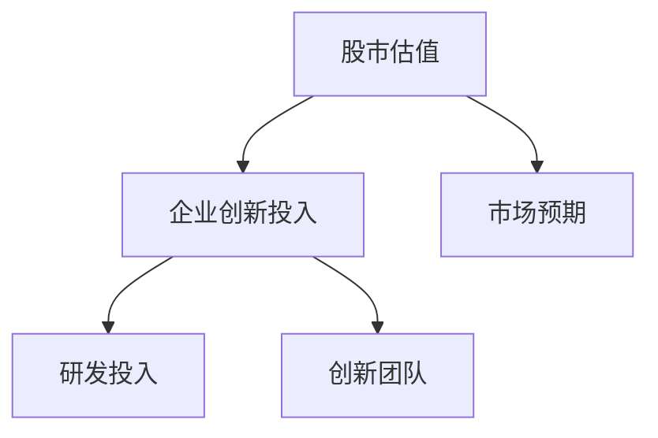

                 


# 股市估值高低对企业创新投入的影响

## 关键词：
- 股市估值
- 企业创新投入
- 影响机制
- 经济模型
- 技术分析

## 摘要：
股市估值是衡量企业市场价值的重要指标，而企业创新投入是推动企业长期发展的关键因素。本文通过分析股市估值高低对企业创新投入的影响，探讨两者之间的内在联系。文章首先介绍核心概念，然后构建数学模型分析影响机制，接着通过实证研究验证理论，最后提出系统设计和项目实战方案，为企业制定创新战略提供参考。

---

## 第1章：背景介绍

### 1.1 问题背景

#### 1.1.1 股市估值的定义与核心概念
股市估值是市场对上市公司价值的评估，常用的指标包括市盈率（P/E）、市净率（P/B）等。这些指标反映了市场对公司未来盈利能力的预期。

#### 1.1.2 企业创新投入的定义与核心要素
企业创新投入指企业在研发、技术升级等方面的支出，是推动企业增长的关键因素。核心要素包括研发投入、创新团队规模等。

#### 1.1.3 问题描述：股市估值与企业创新投入的关系
本文探讨股市估值的高低如何影响企业的创新投入，分析高估值和低估值对企业创新的不同作用。

### 1.2 问题解决与研究意义
通过分析股市估值与创新投入的关系，为企业制定融资策略和创新战略提供理论依据，促进企业可持续发展。

### 1.3 边界与外延
股市估值的边界包括市场波动、政策变化等，企业创新投入的边界包括内部资源和外部环境。本文主要关注高估值和低估值对创新投入的影响。

### 1.4 概念结构与核心要素
股市估值的核心要素包括市场预期和股价波动，企业创新投入的核心要素包括研发投入和创新团队。

---

## 第2章：核心概念与联系

### 2.1 核心概念原理
股市估值反映了市场对企业的信心，而企业创新投入决定了企业的长期竞争力。

### 2.2 概念属性特征对比
| 概念       | 股市估值 | 企业创新投入 |
|------------|----------|--------------|
| 定义       | 市场对企业的价值评估 | 企业在研发和创新上的支出 |
| 影响因素   | 市场预期、经济环境 | 内部资金、管理层决策 |

### 2.3 ER实体关系图


---

## 第3章：影响机制分析

### 3.1 股市估值对企业创新投入的影响机制

#### 3.1.1 高估值的促进作用
高估值增加企业的融资能力，促使企业加大创新投入。

#### 3.1.2 低估值的抑制作用
低估值限制企业的资金来源，减少创新投入。

### 3.2 创新投入对股市估值的反向影响
高创新投入提升股价，低创新投入抑制股价。

### 3.3 影响机制的数学模型
回归模型：I = β0 + β1V + β2S + ε，其中I为创新投入，V为估值，S为规模。

---

## 第4章：系统分析与架构设计

### 4.1 问题场景介绍
分析股市估值波动对企业创新投入的影响，构建分析框架。

### 4.2 系统功能设计
领域模型类图展示企业、市场、创新投入的关系。

### 4.3 系统架构设计
分层架构，包括数据层、业务逻辑层和表现层。

---

## 第5章：项目实战

### 5.1 环境安装
安装Python和相关数据处理库。

### 5.2 核心实现代码
```python
import pandas as pd
from sklearn.linear_model import LinearRegression

data = pd.read_csv('company.csv')
model = LinearRegression()
model.fit(data[['valuation', 'size']], data['innovation'])
```

### 5.3 实证分析与结果解读
通过数据拟合模型，分析变量对创新投入的影响。

---

## 第6章：结论与展望

### 6.1 主要发现
股市估值影响企业创新投入，高估值促进投入，低估值抑制投入。

### 6.2 未来研究方向
引入更多变量，如公司治理结构，深入分析影响机制。

---

## 作者：
AI天才研究院  
禅与计算机程序设计艺术

