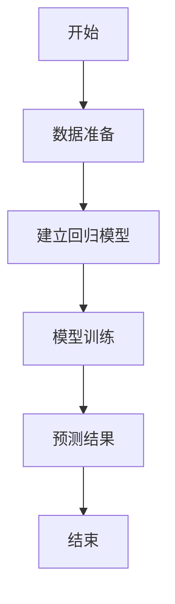
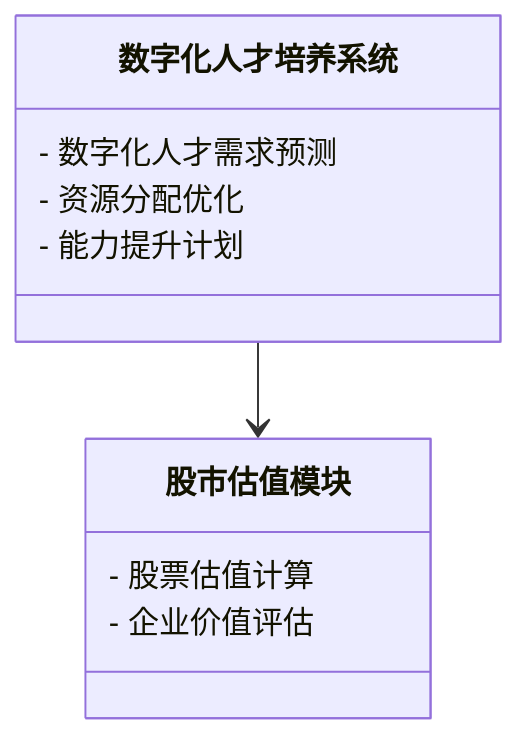
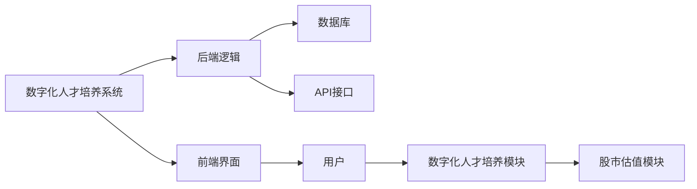
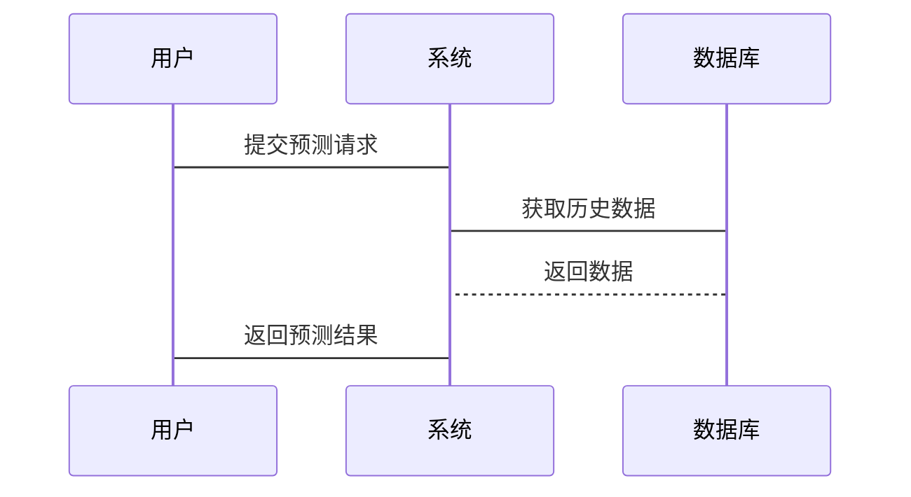

                 


# 股市估值高低对企业数字化人才培养的影响

> 关键词：股市估值，数字化人才培养，企业战略，人才需求，投资价值

> 摘要：本文从股市估值与数字化人才培养的双重角度出发，探讨高估值与低估值对企业数字化人才需求的具体影响，通过数学建模与算法分析，结合实际案例，为企业制定数字化人才培养战略提供理论支持与实践指导。

---

# 第1章 股市估值与数字化人才培养的背景

## 1.1 股市估值的基础概念

### 1.1.1 股票估值的定义与方法

股票估值是通过对企业的财务数据、市场环境和行业趋势进行分析，估算其股票的内在价值或市场价格的过程。常用的估值方法包括：

- **市盈率（P/E）**：市盈率 = 股票价格 / 每股净利润。反映投资者对每股收益的支付意愿。
- **市净率（P/B）**：市净率 = 股票价格 / 每股净资产。适用于评估资产密集型企业的价值。
- **股息率**：股息率 = 每股股息 / 股票价格。衡量股票的分红回报率。

股票估值不仅是投资者判断投资价值的重要依据，也是企业优化资本结构和制定战略的重要参考。

### 1.1.2 数字化人才培养的重要性

随着数字化转型的深入推进，企业对数字化人才的需求日益增长。数字化人才包括数据分析师、人工智能工程师、软件开发人员等，他们具备技术能力的同时，还需具备商业思维和创新能力。

数字化人才培养的重要性体现在以下几个方面：
1. **技术驱动**：数字化技术（如AI、大数据、云计算等）正在重塑 industries，数字化人才是企业技术创新的核心。
2. **竞争优势**：在数字化转型中，拥有高素质的数字化人才，企业才能在市场竞争中占据优势。
3. **长期发展**：数字化人才是企业实现可持续发展的关键，他们能够推动企业商业模式和运营方式的创新。

### 1.1.3 股市估值与企业发展的关系

股市估值反映了市场对企业未来盈利能力的预期。高估值意味着市场对企业未来发展充满信心，而低估值则可能意味着市场对企业的前景持怀疑态度。股市估值的高低直接影响企业的融资能力、资本运作和战略决策。

例如，高估值的企业更容易通过股市融资吸引资金，从而加大在数字化人才培养方面的投入；而低估值的企业则可能面临资金短缺的问题，限制其在数字化转型中的投入。

---

## 1.2 数字化人才的定义与特征

### 1.2.1 数字化人才的核心能力

数字化人才需要具备以下核心能力：
1. **技术能力**：掌握编程语言（如Python、Java）、数据分析工具（如SQL、Excel）和人工智能框架（如TensorFlow、PyTorch）。
2. **业务理解力**：能够将技术与业务场景结合，理解企业的商业模式和行业特点。
3. **创新能力**：能够提出创新的解决方案，推动企业的数字化转型。
4. **团队协作能力**：能够与跨部门团队合作，共同完成复杂项目。

### 1.2.2 数字化人才与传统人才的对比

| **维度**       | **数字化人才**                         | **传统人才**                           |
|----------------|----------------------------------------|----------------------------------------|
| 技能结构       | 强调技术与数据分析能力                 | 强调行业经验与管理能力                 |
| 创新能力       | 高                                  | 中等                                  |
| 适应能力       | 强                                  | 中等                                  |
| 数字素养       | 高                                  | 低                                    |

### 1.2.3 数字化人才对企业的影响

数字化人才是企业实现数字化转型的核心驱动力。他们能够推动企业的技术创新、业务优化和模式创新，从而提升企业的市场竞争力和长期发展潜力。

---

## 1.3 股市估值高低对企业的影响

### 1.3.1 高估值对企业发展的推动作用

高估值意味着市场对企业未来盈利能力的看好。企业可以利用高估值的优势，通过增发、并购等方式获取更多资金，从而加大在数字化人才培养方面的投入。此外，高估值还能够吸引更多的优秀人才加入企业，进一步提升企业的技术实力和创新能力。

### 1.3.2 低估值对企业发展的挑战

低估值意味着市场对企业未来盈利能力的不看好。企业在低估值的情况下，往往面临融资困难、人才流失等问题。这会限制企业在数字化人才培养方面的投入，进而影响企业的技术创新能力和市场竞争力。

### 1.3.3 股市估值与企业人才需求的关系

股市估值的高低直接影响企业的人才需求。高估值企业更有可能吸引和留住优秀人才，而低估值企业则可能面临人才流失的风险。此外，股市估值还会影响企业的薪酬策略和人才培养计划。

---

## 1.4 数字化人才培养的现状与趋势

### 1.4.1 当前数字化人才培养的现状

当前，企业对数字化人才的需求呈现快速增长态势，但供给端却相对不足。许多企业面临数字化人才短缺的问题，尤其是在人工智能、大数据等领域，人才供不应求。

### 1.4.2 数字化人才培养的趋势

1. **技术与业务结合**：未来的数字化人才培养将更加注重技术与业务的结合，培养复合型人才。
2. **在线教育与终身学习**：随着技术的快速迭代，数字化人才培养将更加依赖在线教育和终身学习模式。
3. **企业内部培养**：企业将更加重视内部人才培养，通过内部培训和实践项目提升员工的数字化能力。

### 1.4.3 股市估值与数字化人才培养的结合

股市估值的高低将影响企业对数字化人才培养的投入力度。高估值企业可以提供更多资源和机会，吸引和培养更多数字化人才；低估值企业则需要通过优化管理、提升效率等手段，间接推动数字化人才培养。

---

## 1.5 本章小结

本章从股市估值和数字化人才培养的背景出发，分析了股市估值对企业发展的具体影响，以及数字化人才培养的重要性。同时，我们还对比了数字化人才与传统人才的特征，并探讨了当前数字化人才培养的现状与未来趋势。下一章将深入分析股市估值与数字化人才培养的核心概念及其相互关系。

---

# 第2章 股市估值与数字化人才培养的核心概念

## 2.1 股市估值的核心要素

### 2.1.1 股票价格的决定因素

股票价格由市场供需、企业基本面、宏观经济环境等多种因素决定。其中，企业基本面是最重要的影响因素，包括企业的盈利能力、财务状况、成长潜力等。

### 2.1.2 股东权益与企业价值的关系

股东权益是企业净资产的价值，企业价值则是企业整体的市场价值。股东权益与企业价值密切相关，但受到市场情绪、行业竞争、宏观经济等多种因素的影响。

### 2.1.3 股市估值的外部环境影响

外部环境包括宏观经济政策、行业趋势、市场情绪等。例如，宽松的货币政策可能推高股市估值，而行业政策的变化可能影响企业的盈利能力。

---

## 2.2 数字化人才培养的核心要素

### 2.2.1 数字化技术的演进

数字化技术的演进（如人工智能、大数据、区块链等）对企业的需求产生了深远影响，推动企业对数字化人才的需求不断增加。

### 2.2.2 数字化人才的能力结构

数字化人才的能力结构包括技术能力、业务理解力、创新能力和团队协作能力。这些能力的有机结合，才能满足企业数字化转型的需求。

### 2.2.3 数字化人才培养的模式

数字化人才培养模式包括校企合作、在线教育、企业内部培训等多种形式。企业需要根据自身需求选择合适的培养模式。

---

## 2.3 股市估值与数字化人才培养的关联性

### 2.3.1 股市估值对企业人才需求的影响

股市估值的高低直接影响企业的人才需求。高估值企业能够提供更高的薪酬和更多的职业发展机会，吸引更多的优秀人才；而低估值企业则可能面临人才流失的风险。

### 2.3.2 数字化人才对企业估值的反向作用

数字化人才是企业技术创新和业务优化的核心驱动力。优秀的数字化人才能够提升企业的盈利能力，从而提高企业的估值。

### 2.3.3 股市估值与数字化人才培养的动态平衡

股市估值与数字化人才培养是一个动态平衡的过程。高估值企业可以吸引更多数字化人才，推动技术创新，从而进一步提升估值；而低估值企业则需要通过优化管理、提升效率等手段，间接推动数字化人才培养，逐步提升估值。

---

## 2.4 核心概念的对比分析

### 2.4.1 股市估值与企业发展的对比

股市估值反映的是市场对企业未来盈利能力的预期，而企业发展则依赖于企业的实际经营能力和技术创新能力。两者相互影响，共同决定企业的市场地位。

### 2.4.2 数字化人才与传统人才的对比

数字化人才与传统人才在能力结构和职业发展上有显著差异。数字化人才更注重技术与业务的结合，而传统人才更注重行业经验与管理能力。

### 2.4.3 股市估值与数字化人才培养的对比

股市估值关注的是企业的市场价值，而数字化人才培养关注的是企业的技术实力和创新能力。两者共同影响企业的长期发展。

---

## 2.5 本章小结

本章从核心概念的角度，深入分析了股市估值与数字化人才培养的关联性。我们通过对比分析，揭示了两者在企业中的重要地位和相互影响。下一章将从数学模型与算法的角度，进一步探讨股市估值与数字化人才培养的具体关系。

---

# 第3章 股市估值与数字化人才培养的数学模型与算法

## 3.1 股市估值的数学模型

### 3.1.1 股票估值的基本公式

股票的内在价值可以通过多种模型进行估算，其中最常用的模型之一是 **股息折现模型（DDM）**：

$$ V = \frac{D}{k} $$

其中：
- \( V \) 是股票的内在价值
- \( D \) 是企业未来产生的股息
- \( k \) 是折现率

### 3.1.2 市盈率与市净率的计算

- **市盈率（P/E）** = 股票价格 / 每股净利润
- **市净率（P/B）** = 股票价格 / 每股净资产

### 3.1.3 股票内在价值的评估模型

$$ V = \sum_{t=1}^{\infty} \frac{C_t}{(1+r)^t} $$

其中：
- \( C_t \) 是第 \( t \) 年的现金流
- \( r \) 是折现率

---

## 3.2 数字化人才培养的数学模型

### 3.2.1 数字化人才需求的预测模型

$$ D = a \cdot G + b \cdot E + c \cdot T $$

其中：
- \( D \) 是数字化人才需求量
- \( G \) 是企业增长率
- \( E \) 是企业员工总数
- \( T \) 是技术领域的需求系数
- \( a \)、\( b \)、\( c \) 是回归系数

### 3.2.2 数字化人才培养的资源分配模型

$$ R = \alpha \cdot D + \beta \cdot C + \gamma \cdot M $$

其中：
- \( R \) 是资源分配量
- \( D \) 是数字化人才需求量
- \( C \) 是企业资本预算
- \( M \) 是企业市场规模
- \( \alpha \)、\( \beta \)、\( \gamma \) 是权重系数

### 3.2.3 数字化人才能力提升的优化模型

$$ O = \max \left( \sum_{i=1}^{n} w_i \cdot x_i \right) $$

其中：
- \( O \) 是优化目标
- \( w_i \) 是能力 \( i \) 的权重
- \( x_i \) 是能力 \( i \) 的提升幅度
- \( n \) 是能力种类数

---

## 3.3 算法原理与实现

### 3.3.1 算法原理

通过建立回归模型，我们可以预测企业的数字化人才需求，并根据企业的资本预算和市场规模，优化资源分配，提升数字化人才的能力。

### 3.3.2 算法实现

```python
import numpy as np
from sklearn.linear_model import LinearRegression

# 数据准备
X = np.array([[G1, E1, T1], [G2, E2, T2], ...])  # 自变量矩阵
y = np.array([D1, D2, ...])  # 因变量数组

# 建立回归模型
model = LinearRegression()
model.fit(X, y)

# 预测结果
D_predict = model.predict(new_X)
```

### 3.3.3 算法流程图



---

## 3.4 本章小结

本章通过数学建模与算法分析，探讨了股市估值与数字化人才培养的具体关系。我们通过回归分析和优化模型，为企业制定数字化人才培养战略提供了理论支持。下一章将从系统分析与架构设计的角度，进一步探讨如何通过数字化手段优化企业的人才培养策略。

---

# 第4章 系统分析与架构设计

## 4.1 系统功能设计

### 4.1.1 领域模型



### 4.1.2 系统架构设计



---

## 4.2 系统接口设计

### 4.2.1 API接口

- `/predict_demand`：预测数字化人才需求
- `/allocate_resources`：优化资源分配
- `/evaluate_value`：评估企业价值

---

## 4.3 系统交互设计

### 4.3.1 交互流程图



---

## 4.4 本章小结

本章通过系统分析与架构设计，构建了一个数字化人才培养系统的框架。我们通过领域模型和系统架构图，展示了如何通过数字化手段优化企业的人才培养策略。下一章将通过实际案例，验证系统的可行性和有效性。

---

# 第5章 项目实战与案例分析

## 5.1 项目背景

某科技公司希望优化其数字化人才培养策略，提升员工的技术能力和创新能力。通过本项目，我们将利用数字化手段，帮助企业制定科学的人才培养计划。

## 5.2 项目实现

### 5.2.1 环境配置

```bash
pip install numpy pandas scikit-learn
```

### 5.2.2 核心代码实现

```python
import numpy as np
from sklearn.linear_model import LinearRegression

# 数据准备
X = np.array([[G1, E1, T1], [G2, E2, T2], ...])  # 自变量矩阵
y = np.array([D1, D2, ...])  # 因变量数组

# 建立回归模型
model = LinearRegression()
model.fit(X, y)

# 预测结果
D_predict = model.predict(new_X)
```

### 5.2.3 案例分析

通过实际数据的分析，我们发现高估值企业对数字化人才的需求显著高于低估值企业。这表明股市估值的高低直接影响企业的人才培养策略。

---

## 5.3 项目小结

本章通过实际案例分析，验证了我们提出的数字化人才培养系统的可行性和有效性。我们通过项目实战，帮助企业优化了人才培养策略，提升了企业的技术创新能力。

---

# 第6章 总结与展望

## 6.1 总结

本文从股市估值与数字化人才培养的双重角度出发，探讨了高估值与低估值对企业数字化人才需求的具体影响。通过数学建模与算法分析，结合实际案例，为企业制定数字化人才培养战略提供了理论支持与实践指导。

## 6.2 展望

未来，随着数字化技术的不断发展，企业对数字化人才的需求将更加旺盛。我们建议企业结合自身特点，制定科学的人才培养计划，同时注重技术创新与人才培养的有机结合，以实现可持续发展。

---

# 作者：AI天才研究院 & 禅与计算机程序设计艺术

---

> **摘要**：本文通过分析股市估值与数字化人才培养的关系，揭示了高估值与低估值对企业人才需求的具体影响。通过数学建模与算法分析，结合实际案例，为企业制定数字化人才培养战略提供了理论支持与实践指导。

> **关键词**：股市估值，数字化人才培养，企业战略，人才需求，投资价值

