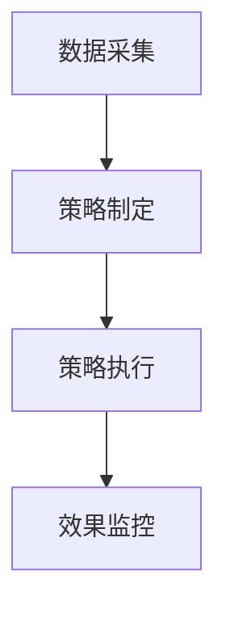

                 


# 股市估值高低对企业数字化人才招聘策略的影响

> 关键词：股市估值、企业招聘、数字化人才、人才策略、股市分析

> 摘要：本文探讨了股市估值的高低如何影响企业的数字化人才招聘策略。通过分析股市估值对企业的影响，结合数字化人才的特点，提出了在不同估值环境下调整招聘策略的方法。文章从背景、核心概念、影响分析、策略调整、系统架构、项目实战到最佳实践，全面阐述了这一主题。

---

## 第一章：背景介绍

### 1.1 问题背景
随着全球经济的数字化转型，企业对数字化人才的需求急剧增加。同时，股市估值的波动直接影响企业的资金状况和战略决策。企业需要根据股市估值的变化，灵活调整人才招聘策略，以应对市场变化和内部发展的需求。

### 1.2 问题描述
股市估值是衡量企业市场价值的重要指标，高估值意味着企业有更多资金用于扩张，而低估值则可能限制招聘预算。数字化人才因其高技能和稀缺性，成为企业竞争的关键资源。因此，理解股市估值如何影响招聘策略，对企业在不同市场环境下优化人才管理至关重要。

### 1.3 解决方法
通过分析股市估值与企业数字化人才招聘策略的关系，提出一套基于估值的动态调整方法。企业可以根据当前的估值水平，选择适合的招聘渠道、薪酬结构和人才培养方式。

### 1.4 边界与外延
本文主要关注股市估值对招聘策略的影响，不涉及企业其他业务决策。但需注意，企业整体战略与招聘策略密切相关，因此分析时会考虑两者之间的互动关系。

---

## 第二章：核心概念与联系

### 2.1 股市估值的核心概念
- **定义**：股市估值是通过市盈率、市净率等指标评估企业市场价值的过程。
- **计算公式**：市盈率（P/E）= 股价 / 每股收益；市净率（P/B）= 股价 / 每股净资产。

### 2.2 数字化人才的核心概念
- **定义**：具备数据处理、AI开发等技能的人才，能够推动企业数字化转型。
- **特征**：技术专精、创新能力强、适应性高。

### 2.3 核心概念的联系
股市估值影响企业的资金状况，进而影响招聘策略。高估值时，企业可以提供更多优厚的条件吸引人才；低估值时，可能转向内部培养或灵活用工。

---

## 第三章：股市估值对企业的影响

### 3.1 股市高估值的影响
- **资金充裕**：企业可以扩大招聘规模，提高薪酬福利。
- **战略调整**：倾向于通过并购快速获取人才，或加大研发投入。

### 3.2 股市低估值的影响
- **预算限制**：招聘预算减少，可能转向内部培养或外包。
- **成本控制**：优化招聘流程，降低用人成本。

---

## 第四章：数字化人才的特点与需求分析

### 4.1 数字化人才的类型
- 技术型人才：如数据科学家、AI工程师。
- 管理型人才：如数字化项目管理者。

### 4.2 需求预测
- 使用回归分析模型预测人才需求，公式为：需求 = β0 + β1×估值 + ε。

### 4.3 人才价值评估
- 基于技能匹配度、业绩贡献和市场稀缺性进行评估。

---

## 第五章：股市估值与人才招聘策略

### 5.1 高估值策略
- **高薪吸引**：提供有竞争力的薪资和福利。
- **品牌招聘**：通过企业品牌吸引顶尖人才。

### 5.2 低估值策略
- **灵活用工**：采用兼职、远程工作模式。
- **内部培养**：加强员工培训，提升现有员工能力。

---

## 第六章：系统架构与技术实现

### 6.1 系统功能模块
- 数据采集模块：收集股市估值和人才数据。
- 策略制定模块：根据估值生成招聘策略。
- 执行模块：执行招聘计划并监控效果。

### 6.2 系统架构图


### 6.3 接口设计
- API接口：提供股市数据和人才需求的接口，方便模块间通信。

---

## 第七章：项目实战与代码实现

### 7.1 环境安装
- 安装Python、Pandas、Matplotlib等工具。

### 7.2 核心代码
```python
import pandas as pd
import matplotlib.pyplot as plt

# 数据加载
data = pd.read_csv('stock_valuation.csv')

# 股市估值分析
def calculate_pe_ratio(data):
    pe_ratio = data['股价'] / data['每股收益']
    return pe_ratio

pe_ratio = calculate_pe_ratio(data)
plt.hist(pe_ratio, bins=10)
plt.title('市盈率分布')
plt.show()
```

### 7.3 案例分析
通过分析某企业的数据，展示在高估值和低估值情况下的招聘策略调整。

---

## 第八章：最佳实践与总结

### 8.1 小结
股市估值直接影响企业招聘策略，企业需根据估值动态调整人才管理方式。

### 8.2 注意事项
- 定期评估策略效果，及时调整。
- 结合企业自身特点，制定个性化策略。

### 8.3 未来趋势
- 数字化人才需求将持续增长。
- 智能化招聘工具将广泛应用。

### 8.4 拓展阅读
推荐相关书籍和文章，供读者深入学习。

---

## 作者：AI天才研究院/AI Genius Institute & 禅与计算机程序设计艺术 /Zen And The Art of Computer Programming

---

这篇文章通过系统分析股市估值与企业数字化人才招聘策略的关系，为企业提供了在不同市场环境下优化招聘策略的实用方法。

