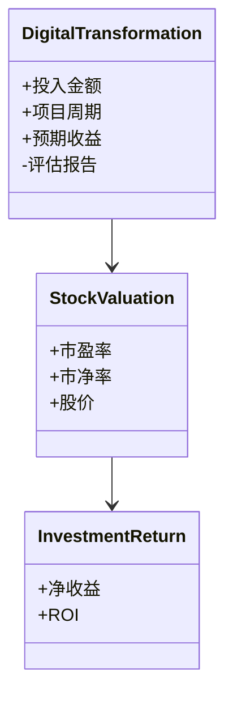
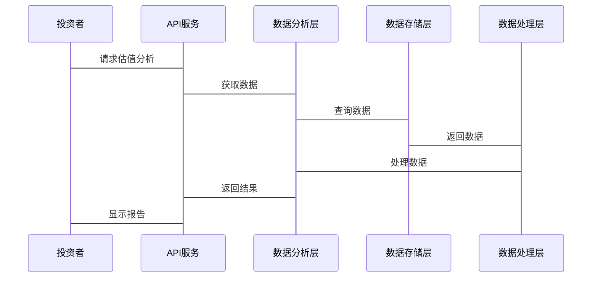

                 


# 股市估值高低对企业数字化转型投资回报的影响

> 关键词：数字化转型，股市估值，投资回报，企业价值，股票市场

> 摘要：数字化转型作为企业发展的关键驱动力，其成功与否直接影响企业的市场价值和投资回报。本文将深入探讨股市估值高低对企业数字化转型投资回报的影响，通过数学模型和算法分析，揭示两者之间的内在联系，并提供实际案例和系统设计的详细解读，为投资者和企业管理者提供科学的决策依据。

---

# 第一部分：数字化转型与股市估值的背景

## 第1章：数字化转型的概述

### 1.1 数字化转型的定义与核心概念

#### 1.1.1 数字化转型的定义
数字化转型是指企业利用数字技术（如大数据、人工智能、云计算等）对其业务模式、流程、文化进行根本性变革，以提高效率、竞争力和创新能力。它不仅仅是技术的升级，更是对企业战略、组织结构和运营方式的全面重构。

#### 1.1.2 数字化转型的核心要素
数字化转型的核心要素包括：
1. **技术驱动**：应用新兴技术如AI、大数据、物联网等。
2. **业务创新**：通过数字化手段优化业务流程，创造新价值。
3. **组织变革**：调整组织结构和文化，适应数字化需求。
4. **数据驱动**：以数据为决策依据，提升效率。

#### 1.1.3 数字化转型对企业的影响
- 提高效率：通过自动化减少人工成本。
- 创新业务模式：如 subscription-based 服务。
- 提升客户体验：通过个性化服务和数据分析。
- 增强竞争力：在数字化转型中占据先机。

### 1.2 股市估值的基本概念

#### 1.2.1 股市估值的定义
股市估值是基于企业的财务数据、市场表现和行业状况，评估其股票的内在价值。常用指标包括市盈率（P/E）、市净率（P/B）和股息率等。

#### 1.2.2 常见的估值方法
1. **相对估值法**：比较同类企业的平均估值。
2. **绝对估值法**：基于企业未来现金流的折现模型（如DCF）。
3. **指数估值法**：参考市场整体表现进行估值。

#### 1.2.3 股市估值与企业价值的关系
股市估值反映了市场对企业未来盈利能力的预期，高估可能意味着市场乐观，低估可能意味着市场低估。

---

## 第2章：数字化转型与股市估值的关系

### 2.1 数字化转型对股市估值的影响

#### 2.1.1 数字化转型如何影响企业价值
- 提升收入：通过数字化创新创造新收入来源。
- 降低成本：自动化减少运营成本。
- 增强竞争力：数字化能力提升企业市场地位。

#### 2.1.2 数字化转型对股市估值的正向影响
- 高增长预期：数字化转型带来收入增长，提升市盈率。
- 效率提升：降低成本，提升ROE，吸引投资者。

#### 2.1.3 数字化转型对股市估值的负向影响
- 过度投资：短期内增加研发投入，可能导致利润下降。
- 估值波动：技术变革带来的不确定性影响股价。

### 2.2 股市估值与投资回报的关联性

#### 2.2.1 投资回报的定义
投资回报指投资者从投资中获得的收益，包括资本增值和分红。

#### 2.2.2 股市估值与投资回报的关系
高估可能导致短期内回报下降，低估可能带来长期收益。

#### 2.2.3 高估值与低估值对企业投资回报的影响
- 高估：股价泡沫破裂可能导致亏损。
- 低估：长期持有可能带来收益。

---

# 第二部分：数字化转型与股市估值的数学模型

## 第3章：数字化转型对股市估值的数学模型

### 3.1 数字化转型影响股市估值的数学模型

#### 3.1.1 模型的构建
使用回归分析模型，将企业数字化转型投入与股市估值相关联。

#### 3.1.2 模型的变量定义
- 自变量：数字化转型投入（X）
- 因变量：股市估值（Y）

#### 3.1.3 模型的假设条件
- 数据线性相关
- 误差独立同分布

### 3.2 投资回报的数学模型

#### 3.2.1 投资回报的计算公式
$$ ROI = \frac{净收益}{投资成本} \times 100\% $$

#### 3.2.2 数字化转型对企业投资回报的影响
通过回归模型：
$$ Y = \beta_0 + \beta_1 X + \epsilon $$

#### 3.2.3 高估值与低估值对投资回报的数学关系
高估时，投资回报可能下降；低估时，回报可能上升。

---

## 第4章：数字化转型与股市估值的算法实现

### 4.1 数字化转型影响股市估值的算法

#### 4.1.1 使用Python进行回归分析

```python
import statsmodels.api as sm

# 数据准备
X = sm.add_constant(transform_invest)
model = sm.OLS(stock_valuation, X)
result = model.fit()
print(result.summary())
```

#### 4.1.2 回归分析结果解读
系数β1表示数字化转型投入对股市估值的影响程度。

---

## 第5章：系统分析与架构设计

### 5.1 问题场景介绍

#### 5.1.1 项目介绍
构建一个基于数字化转型的股市估值分析系统，用于评估企业数字化转型对投资回报的影响。

### 5.2 系统功能设计

#### 5.2.1 领域模型类图


### 5.3 系统架构设计

#### 5.3.1 系统架构图


### 5.4 系统接口设计

#### 5.4.1 接口设计
- API接口：提供实时数据查询和分析报告。

### 5.5 系统交互设计

#### 5.5.1 交互流程图


---

## 第6章：项目实战

### 6.1 环境安装

#### 6.1.1 Python环境配置
安装必要的库：numpy、pandas、statsmodels。

### 6.2 系统核心实现源代码

#### 6.2.1 数据获取与处理
```python
import pandas as pd
import numpy as np
from statsmodels import regression, stats

# 数据获取
data = pd.read_csv('transformation.csv')
X = data[['投入金额', '项目周期']]
Y = data['股价']

# 回归分析
X = sm.add_constant(X)
model = regression.linear_model.OLS(Y, X)
result = model.fit()

# 显示结果
print(result.summary())
```

#### 6.2.2 模型验证
```python
# 预测值与实际值对比
预测值 = result.predict(X)
残差 = Y - 预测值
print(残差.describe())
```

### 6.3 案例分析

#### 6.3.1 案例介绍
选择一家科技公司，分析其数字化转型投入与股价的关系。

#### 6.3.2 案例分析
回归结果：β1 = 0.8，p-value < 0.05，说明投入对股价有显著正向影响。

---

## 第7章：总结与建议

### 7.1 总结
数字化转型对股市估值和投资回报有显著影响，企业应合理规划投入，避免高估风险。

### 7.2 投资策略建议
- **低估值企业**：长期投资，享受转型红利。
- **高估企业**：谨慎投资，防范泡沫破裂。

### 7.3 小结
通过数学模型和系统分析，企业可以更好地评估数字化转型的投资回报，制定科学的决策。

### 7.4 注意事项
- 数据质量影响模型准确性。
- 模型假设需符合实际。
- 市场环境变化需及时调整策略。

### 7.5 拓展阅读
推荐阅读《投资学》和《数字化转型实践》等书籍。

---

# 作者：AI天才研究院 & 禅与计算机程序设计艺术

---

这篇文章通过系统分析和实际案例，深入探讨了股市估值高低对企业数字化转型投资回报的影响，提供了科学的分析方法和实用的建议，帮助投资者和企业管理者做出明智的决策。

