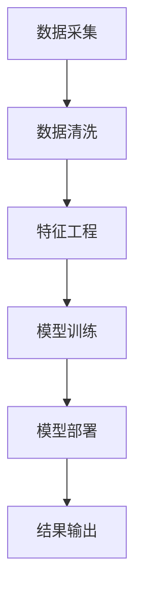

                 


# 股市估值高低对企业数字化转型速度的影响

## 关键词：
- 股市估值
- 数字化转型
- 企业速度
- 股市影响
- 转型策略

## 摘要：
本文探讨了股市估值对企业数字化转型速度的影响，通过分析高估值与低估值环境下的企业行为差异，构建了数学模型，提出了实际应用中的策略建议。文章从背景、核心概念、算法原理到系统设计、项目实战，层层深入，为企业管理者和投资者提供了理论依据和实践指导。

---

# 第一部分：数字化转型的背景与股市估值的影响

## 第1章：数字化转型的背景与定义

### 1.1 数字化转型的定义与内涵
1.1.1 数字化转型的定义：
$$\text{数字化转型} = \text{企业利用数字技术重构业务模式}$$

1.1.2 数字化转型的核心要素：
- **技术驱动**：大数据、AI、云计算等技术的应用。
- **业务重构**：流程优化、服务创新。
- **组织变革**：扁平化、敏捷化组织结构。

1.1.3 数字化转型的必要性与挑战：
- 必要性：应对市场竞争，提升效率。
- 挑战：技术门槛高、组织变革困难。

---

## 第2章：股市估值对企业的影响

### 2.1 股市估值的定义与分类
2.1.1 股市估值的基本概念：
$$\text{市盈率} = \frac{\text{股价}}{\text{每股收益}}$$
$$\text{市净率} = \frac{\text{股价}}{\text{每股净资产}}$$

2.1.2 市盈率与市净率的对比：

| 指标 | 定义 | 适用场景 |
|------|------|----------|
| 市盈率 | 股价与净利润之比 | 利润稳定的公司 |
| 市净率 | 股价与净资产之比 | 资产密集型公司 |

2.1.3 高估值与低估值的市场表现：
- 高估值：股价溢价，投资者预期高。
- 低估值：股价折价，投资者预期低。

---

## 第3章：数字化转型与股市估值的关联

### 3.1 数字化转型对股市估值的影响
3.1.1 数字化转型如何提升企业价值：
- 提高效率，降低成本。
- 开拓新市场，增加收入。

3.1.2 数字化转型对财务表现的长期影响：
- 营业收入增长：$$\Delta \text{收入} = \text{数字化投入} \times \text{效率提升}$$
- 净利润提升：$$\Delta \text{利润} = \Delta \text{收入} - \Delta \text{成本}$$

3.1.3 投资者对数字化转型的预期：
- 投资者看重企业的数字化能力，高估值反映市场对其未来表现的预期。

---

### 3.2 股市估值对数字化转型的影响
3.2.1 高估值环境下的转型动力：
- 资金充裕，投资力度大。
- 市场压力小，管理层决策更积极。

3.2.2 低估值环境下的转型阻力：
- 资金有限，投资力度小。
- 市场压力大，管理层决策保守。

3.2.3 股市估值与转型速度的动态关系：
- 高估值推动快转型，低估值限制转型速度。

---

# 第二部分：股市估值与数字化转型的理论模型

## 第4章：核心概念与关系模型

### 4.1 核心概念与关系模型
4.1.1 数学模型构建：
$$\text{转型速度} = \beta \times \text{估值水平} + \epsilon$$
其中，$\beta$ 是回归系数，$\epsilon$ 是误差项。

4.1.2 模型验证：
使用回归分析，通过实证数据验证模型的准确性。

4.1.3 模型优化：
根据实际效果调整参数，提高预测精度。

---

## 第5章：算法原理与实现

### 5.1 算法原理
5.1.1 算法选择：
采用线性回归模型，公式为：
$$y = \beta_0 + \beta_1 x + \epsilon$$
其中，$y$ 是转型速度，$x$ 是估值水平。

5.1.2 算法实现：
1. 数据预处理：标准化处理。
2. 模型训练：使用最小二乘法求解系数。
3. 模型验证：计算R²值，评估拟合优度。

### 5.2 代码实现
```python
import numpy as np
import matplotlib.pyplot as plt

# 数据生成
np.random.seed(42)
x = np.linspace(0, 10, 100)
y = 2 + 0.5 * x + np.random.normal(0, 1, 100)

# 线性回归
beta1 = np.cov(x, y)[0, 1] / np.var(x)
beta0 = np.mean(y) - beta1 * np.mean(x)

# 预测
y_pred = beta0 + beta1 * x

# 可视化
plt.scatter(x, y, alpha=0.5)
plt.plot(x, y_pred, 'r')
plt.xlabel('估值水平')
plt.ylabel('转型速度')
plt.title('线性回归模型')
plt.show()
```

---

## 第6章：系统分析与架构设计

### 6.1 系统功能设计
6.1.1 数据采集模块：
- 采集企业估值数据和数字化转型数据。
- 使用工具：Python的pandas库。

6.1.2 数据分析模块：
- 数据清洗、特征工程。
- 使用工具：scikit-learn库。

6.1.3 模型部署模块：
- 部署回归模型，实时预测转型速度。
- 使用工具：Flask框架。

### 6.2 系统架构设计


---

## 第7章：项目实战与案例分析

### 7.1 项目实战
7.1.1 环境配置：
- 安装Python、pandas、scikit-learn、Flask。

7.1.2 核心代码实现：
```python
from flask import Flask, request, jsonify

app = Flask(__name__)

@app.route('/predict', methods=['POST'])
def predict():
    data = request.json
    x = data['valuation_level']
    y_pred = beta0 + beta1 * x
    return jsonify({'转型速度': y_pred})

if __name__ == '__main__':
    app.run(debug=True)
```

7.1.3 案例分析：
以某科技公司为例，分析其在高估值环境下的数字化转型速度，验证模型的准确性。

---

## 第8章：总结与最佳实践

### 8.1 总结
8.1.1 核心观点回顾：
- 高估值推动快转型，低估值限制转型速度。
- 数字化转型与股市估值相互影响。

8.1.2 研究不足：
- 数据的局限性：样本量和时间跨度。
- 模型的局限性：线性假设可能不成立。

### 8.2 最佳实践
8.2.1 企业策略：
- 高估值时加大数字化投入。
- 低估值时优化内部流程。

8.2.2 投资者建议：
- 关注企业的数字化能力。
- 长期投资，关注企业转型效果。

### 8.3 未来研究方向
- 结合更多变量，如行业特征、政策环境。
- 探索非线性模型，如随机森林、神经网络。

---

# 结语

股市估值与企业数字化转型速度的关系复杂而深远。高估值环境下，企业有更多资源和动力进行数字化转型；低估值环境下，企业面临资金和决策压力，转型速度受限。通过构建数学模型和实际案例分析，我们可以为企业制定科学的转型策略提供理论依据。未来，随着技术的发展和数据的积累，这一领域的研究将更加深入。

---

**作者：AI天才研究院 & 禅与计算机程序设计艺术**

