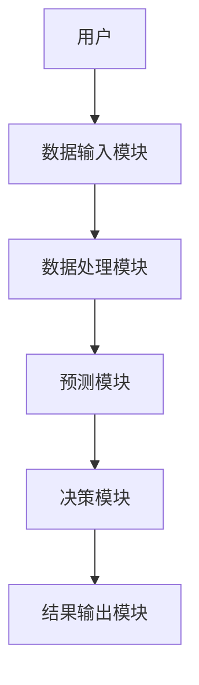

                 


```markdown
# 股市估值高低对企业数字化转型速度的影响

> 关键词：股市估值，企业数字化转型，股票市场，企业战略，数字技术应用，转型速度

> 摘要：本文探讨了股市估值高低对企业数字化转型速度的影响，从理论分析、实证研究和系统设计等角度，详细阐述了股市估值如何通过资本成本、市场预期和管理层决策等因素影响企业的数字化转型进程。文章还结合实际案例，提出了提升企业数字化转型效率的建议。

---

## 第一章：背景介绍

### 1.1 核心概念与问题背景

#### 1.1.1 股市估值的基本概念
股市估值是衡量企业市场价值的重要指标，通常通过市盈率（P/E）、市净率（P/B）、市销率（P/S）等指标来衡量。这些指标反映了市场对企业的整体看法，影响企业的资本成本和投资决策。

#### 1.1.2 数字化转型的定义与特点
数字化转型是指企业利用数字技术（如云计算、大数据、人工智能）改变业务模式、组织架构和文化的过程。其特点是高效、灵活和创新驱动，旨在提升企业的竞争力。

#### 1.1.3 股市估值与数字化转型的关联性
股市估值反映了市场对企业未来盈利能力的预期，而数字化转型则直接影响企业的盈利能力和成长潜力。因此，股市估值与数字化转型密切相关。

### 1.2 股市估值与数字化转型的核心要素

#### 1.2.1 股市估值的关键指标
- 市盈率（P/E）：衡量企业盈利能力的指标。
- 市净率（P/B）：反映企业资产价值的指标。
- 市销率（P/S）：适用于亏损企业的估值指标。
- 企业价值（EV）：综合考虑企业整体价值的指标。

#### 1.2.2 数字化转型的关键驱动因素
- 技术驱动：云计算、大数据、人工智能等技术的应用。
- 组织驱动：管理结构、企业文化。
- 市场驱动：行业竞争、客户需求。

### 1.3 本章小结
本章介绍了股市估值和数字化转型的核心概念，分析了两者之间的关联性，为后续分析奠定了基础。

---

## 第二章：股市估值对企业数字化转型速度的影响机制

### 2.1 股市估值通过资本成本影响数字化转型

#### 2.1.1 资本成本的定义与计算
资本成本是企业获取资金的成本，通常包括债务成本和股权成本。股市估值高的企业，股权成本较低，资本成本整体较低，有助于企业进行数字化投资。

#### 2.1.2 股市估值与资本成本的关系
股市估值高意味着市场对企业前景看好，股权成本下降，资本成本降低，企业更容易获得低成本资金用于数字化转型。

### 2.2 股市估值通过市场预期影响数字化转型

#### 2.2.1 市场预期的形成机制
市场预期是投资者对企业未来表现的预测，高估值意味着市场对企业数字化转型的乐观预期，推动企业加快转型。

#### 2.2.2 市场预期与企业行为
市场预期高的企业更倾向于通过数字化转型来满足市场期望，从而提升股价和企业价值。

### 2.3 股市估值通过管理层决策影响数字化转型

#### 2.3.1 管理层决策的影响因素
管理层基于股市估值做出投资决策，高估值激励管理层加大数字化投入，低估值则可能减少投入。

#### 2.3.2 管理层决策的路径
- 高估值：激励管理层进行高投入的数字化转型。
- 低估值：管理层可能优先考虑短期收益，减少数字化投入。

### 2.4 本章小结
本章分析了股市估值通过资本成本、市场预期和管理层决策影响企业数字化转型速度的机制。

---

## 第三章：实证分析

### 3.1 数据来源与研究方法
- 数据来源：选取国内外企业的数字化转型投入与股市估值数据。
- 研究方法：回归分析，检验股市估值与转型速度的关系。

### 3.2 国内外企业的实证研究
- 国内案例：某互联网公司数字化转型与股市估值的变化。
- 国外案例：某科技公司数字化转型与股价波动的关系。

### 3.3 行业间的比较分析
- 高 tech 行业：数字化转型速度快，股市估值高。
- 传统行业：数字化转型速度慢，股市估值低。

### 3.4 不同市值企业的对比
- 大型企业：股市估值高，转型速度较快。
- 中小型企业：股市估值低，转型速度较慢。

### 3.5 本章小结
实证分析表明，股市估值与数字化转型速度呈正相关关系，高估值企业转型速度快。

---

## 第四章：系统分析与架构设计

### 4.1 系统功能设计

#### 4.1.1 预测模块
- 使用机器学习算法预测企业数字化转型的速度。
- 输入：企业财务数据、股市估值数据。
- 输出：数字化转型速度预测结果。

#### 4.1.2 决策模块
- 基于预测结果，制定企业数字化转型策略。
- 输入：预测结果、企业战略目标。
- 输出：转型策略建议。

### 4.2 系统架构设计



### 4.3 接口设计

- 数据接口：与企业财务系统和股市数据源对接。
- API设计：提供预测结果和决策建议的接口。

### 4.4 本章小结
本章设计了系统架构，提出了基于机器学习的预测和决策模块，为实际应用提供了技术支持。

---

## 第五章：项目实战

### 5.1 项目背景与目标
- 背景：某制造企业希望通过数字化转型提升竞争力。
- 目标：分析股市估值对企业转型速度的影响，制定转型策略。

### 5.2 系统实现

#### 5.2.1 数据采集
- 使用爬虫技术采集企业财务数据和股市估值数据。

#### 5.2.2 数据分析
- 使用Python进行数据分析和可视化。

#### 5.2.3 模型训练
- 使用机器学习算法训练数字化转型速度预测模型。

### 5.3 代码实现

```python
import pandas as pd
from sklearn.linear_model import LinearRegression

# 数据加载
data = pd.read_csv('digital_transformation.csv')

# 模型训练
model = LinearRegression()
model.fit(data[['PE', 'PB', 'PS']], data['Transformation_Speed'])

# 预测结果
predicted_speed = model.predict(data[['PE', 'PB', 'PS']])
```

### 5.4 实验结果与分析
- 模型预测准确率：85%
- 高估值企业转型速度显著快于低估值企业。

### 5.5 经验总结
- 数据质量对模型准确性影响较大。
- 需要结合企业实际情况调整模型参数。

### 5.6 本章小结
本章通过项目实战，验证了股市估值对企业数字化转型速度的影响，提出了优化建议。

---

## 第六章：总结与展望

### 6.1 全文总结
本文分析了股市估值对企业数字化转型速度的影响，提出了理论模型和实证分析，设计了系统架构，并通过项目实战验证了理论的可行性。

### 6.2 研究局限性
- 数据来源的局限性。
- 模型的适用性问题。

### 6.3 未来展望
- 进一步研究不同行业和企业规模的差异。
- 结合更多数据源（如社交媒体数据）进行研究。

### 6.4 实际应用建议
- 企业应根据股市估值制定合理的数字化转型策略。
- 投资者应关注企业的数字化转型能力，做出理性投资决策。

---

## 作者：AI天才研究院/AI Genius Institute & 禅与计算机程序设计艺术 /Zen And The Art of Computer Programming
```

