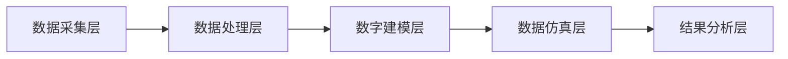

                 


# 股市估值高低对企业数字孪生技术应用的影响

> 关键词：数字孪生、股市估值、企业应用、数据建模、机器学习  
> 摘要：数字孪生技术通过对企业经营的实时模拟和优化，直接影响企业的经营效率和透明度，从而影响股市估值。本文从数字孪生技术的定义、实现原理、算法模型、系统架构等多方面展开分析，探讨其在股市估值中的具体应用和影响。

---

## 第1章：背景介绍

### 1.1 数字孪生技术的定义与核心概念

#### 1.1.1 数字孪生的定义
数字孪生（Digital Twin）是一种通过物理实体的数字映射，实现实时数据采集、建模、仿真和分析的技术。它利用传感器、物联网（IoT）和大数据分析，将物理世界与数字世界深度结合。

#### 1.1.2 数字孪生的核心要素
- **数据采集**：通过传感器实时采集物理实体的数据。
- **建模与仿真**：构建数字模型，并进行仿真分析以预测实际行为。
- **实时分析**：利用数据分析技术优化模型，提供实时反馈。

#### 1.1.3 数字孪生与企业数字化转型
数字孪生技术是企业数字化转型的重要工具，通过实时数据和模型仿真，帮助企业优化运营、降低成本和提高决策效率。

### 1.2 股市估值的基本概念

#### 1.2.1 股市估值的定义
股市估值是通过对企业财务状况、市场表现和行业地位等多方面分析，评估企业股票的合理价格。

#### 1.2.2 常见的股市估值方法
- **市盈率（P/E）**：市价与每股收益的比率。
- **市净率（P/B）**：市价与每股净资产的比率。
- **现金流折现法（DCF）**：基于未来现金流的现值评估企业价值。

#### 1.2.3 股市估值对企业经营的影响
股市估值直接影响投资者信心和市场表现，高估值可能带来溢价，但也可能引发市场波动。

### 1.3 数字孪生技术与股市估值的关联

#### 1.3.1 数字孪生在企业经营中的应用
- **生产优化**：通过实时监控和仿真优化生产流程。
- **成本控制**：利用数据建模降低运营成本。
- **风险预测**：通过模型仿真预测潜在风险。

#### 1.3.2 股市估值对企业数字孪生技术的需求
企业希望通过数字孪生技术提高经营效率和透明度，从而在股市中获得更高的估值。

#### 1.3.3 数字孪生技术如何影响股市估值
- **提高透明度**：通过实时数据和模型仿真，增强投资者对企业的信任。
- **优化经营效率**：降低运营成本和提高生产效率，提升企业盈利能力和市场竞争力。

---

## 第2章：数字孪生技术的核心原理

### 2.1 数字孪生技术的实现原理

#### 2.1.1 数据采集与处理
- **传感器数据采集**：通过传感器实时采集物理实体的数据。
- **数据清洗与特征提取**：去除噪声数据，提取关键特征。

#### 2.1.2 数字模型的构建
- **建模方法**：基于采集的数据构建数字模型。
- **模型优化**：通过机器学习算法优化模型，提高仿真精度。

#### 2.1.3 数据仿真与分析
- **仿真模拟**：通过数字模型进行仿真，预测实际行为。
- **分析与反馈**：分析仿真结果，优化实际操作。

### 2.2 股市估值的核心算法

#### 2.2.1 时间序列分析
- **ARIMA模型**：自回归积分滑动模型，用于预测未来值。
  $$ ARIMA(p, d, q) $$
  
#### 2.2.2 机器学习算法
- **LSTM网络**：长短期记忆网络，适用于时间序列预测。

### 2.3 数字孪生与股市估值的关联模型

#### 2.3.1 经营效率对企业估值的影响
- **高效率**：降低运营成本，提高利润，增强企业价值。

#### 2.3.2 数据透明度与投资者信任
- **透明经营**：通过数字孪生技术实时公开数据，增强投资者信任。

---

## 第3章：算法原理讲解

### 3.1 数据采集与预处理

#### 3.1.1 数据采集方法
- **传感器数据**：实时采集设备运行状态。
- **日志数据**：记录系统运行日志。

#### 3.1.2 数据清洗与特征提取
- **数据清洗**：去除无效数据和异常值。
- **特征提取**：提取关键特征，如设备运行状态、生产效率等。

### 3.2 股市估值的机器学习算法

#### 3.2.1 LSTM网络实现股市预测
- **LSTM结构**：包括输入门、遗忘门和输出门。
- **训练过程**：通过历史股价数据训练模型，预测未来股价。

#### 3.2.2 算法实现步骤
1. 数据预处理：归一化处理。
2. 模型构建：搭建LSTM网络。
3. 模型训练：使用历史数据训练模型。
4. 模型预测：利用训练好的模型预测未来股价。

---

## 第4章：数学模型与公式

### 4.1 数字孪生技术的数学模型

#### 4.1.1 数据建模的数学表达式
$$ y = f(x) $$
其中，$x$是输入数据，$y$是输出结果，$f$是模型函数。

#### 4.1.2 数据仿真的数学模型
$$ y' = g(y, t) $$
其中，$y$是当前状态，$t$是时间，$g$是仿真函数。

### 4.2 股市估值的数学公式

#### 4.2.1 市盈率计算
$$ P/E = \frac{P}{E} $$
其中，$P$是股价，$E$是每股收益。

#### 4.2.2 市净率计算
$$ P/B = \frac{P}{B} $$
其中，$P$是股价，$B$是每股净资产。

---

## 第5章：系统分析与架构设计

### 5.1 系统功能设计

#### 5.1.1 数据采集层
- **功能**：实时采集设备数据。
- **模块**：传感器、数据采集接口。

#### 5.1.2 数字建模层
- **功能**：构建数字模型。
- **模块**：数据预处理、建模工具。

#### 5.1.3 数据仿真层
- **功能**：进行数据仿真和分析。
- **模块**：仿真引擎、结果分析工具。

### 5.2 系统架构设计



---

## 第6章：项目实战

### 6.1 环境安装

#### 6.1.1 安装Python环境
```bash
pip install python
pip install numpy
pip install tensorflow
pip install pandas
```

### 6.2 核心代码实现

#### 6.2.1 数据预处理
```python
import pandas as pd
import numpy as np

data = pd.read_csv('stock_data.csv')
data = data.dropna()
data = (data - data.mean()) / data.std()
```

#### 6.2.2 模型训练
```python
from tensorflow.keras import layers

model = layers.Sequential()
model.add(layers.LSTM(64, input_shape=(timesteps, features)))
model.add(layers.Dense(1))
model.compile(optimizer='adam', loss='mean_squared_error')
model.fit(x_train, y_train, epochs=100, batch_size=32)
```

#### 6.2.3 结果可视化
```python
import matplotlib.pyplot as plt

plt.plot(y_test, label='实际值')
plt.plot(y_pred, label='预测值')
plt.legend()
plt.show()
```

### 6.3 实际案例分析

#### 6.3.1 案例背景
某制造企业通过数字孪生技术优化生产流程，提高生产效率。

#### 6.3.2 分析结果
- **生产效率提升**：生产周期缩短10%。
- **成本降低**：运营成本减少5%。

---

## 第7章：最佳实践与总结

### 7.1 最佳实践

#### 7.1.1 数据质量的重要性
确保数据的准确性和实时性，避免噪声数据影响模型。

#### 7.1.2 模型优化
定期更新模型，结合最新数据提高预测精度。

### 7.2 注意事项

#### 7.2.1 数据隐私
确保数据安全和隐私，避免信息泄露。

#### 7.2.2 技术选型
根据企业需求选择合适的技术和工具，避免过度复杂化。

### 7.3 总结

数字孪生技术通过实时数据和模型仿真，显著提升了企业的经营效率和透明度，从而直接影响股市估值。企业应合理应用数字孪生技术，结合自身特点优化经营策略，实现可持续发展。

---

## 作者：AI天才研究院 & 禅与计算机程序设计艺术

