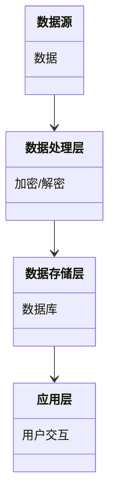
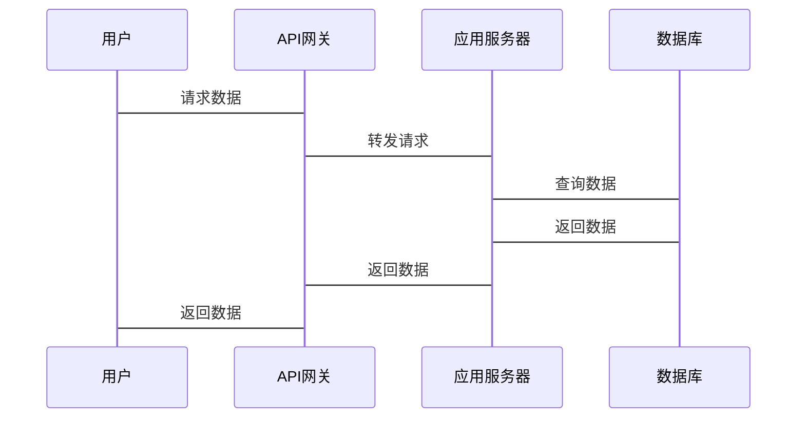

                 


# 股市估值高低对企业数据安全策略的影响

> **关键词**：数据安全、股市估值、企业策略、风险管理、信息安全

> **摘要**：随着数字化转型的深入，数据成为企业的核心资产，数据安全对企业估值的影响日益显著。本文从数据安全与股市估值的关系入手，分析数据安全对企业财务表现、市场表现和长期发展的具体影响，探讨数据安全策略的制定与实施，并结合实际案例，提出可行的安全解决方案，为企业在不同估值阶段优化数据安全策略提供指导。

---

## 第1章: 数据安全与股市估值的核心概念

### 1.1 数据安全的定义与核心要素

数据安全是指保护数据的机密性、完整性和可用性，防止未经授权的访问、泄露、篡改或破坏。其核心要素包括：

1. **机密性**：确保数据仅被授权方访问。
2. **完整性**：保证数据在存储和传输过程中不被篡改。
3. **可用性**：确保数据在需要时可被访问。

### 1.2 股市估值的定义与计算方法

股市估值是市场对企业的价值评估，常见的估值方法包括市盈率（P/E）、市净率（P/B）等。企业数据安全状况直接影响投资者对企业的信任和估值。

### 1.3 数据安全与股市估值的关系

数据泄露或安全事件可能导致股价下跌，影响企业的市场表现和投资者信心。因此，数据安全是企业估值的重要考量因素。

---

## 第2章: 数据安全对企业估值的具体影响

### 2.1 数据安全对企业财务表现的影响

#### 2.1.1 数据安全对企业收入的影响

数据泄露可能导致客户流失，影响收入。例如，某电商平台的数据泄露事件导致订单量下降，影响当季收入。

#### 2.1.2 数据安全对企业成本的影响

数据安全事件可能产生巨额的修复成本，包括技术修复、法律诉讼等，增加企业的运营成本。

#### 2.1.3 数据安全对企业利润的影响

数据安全事件可能导致企业利润下降，影响股东权益。

---

### 2.2 数据安全对企业市场表现的影响

#### 2.2.1 数据安全对股价波动的影响

数据安全事件可能导致股价短期暴跌，影响市场表现。例如，2013年Target的数据泄露事件导致股价下跌11%。

#### 2.2.2 数据安全对投资者信心的影响

数据安全状况良好的企业更容易获得投资者的信任，提升估值。

#### 2.2.3 数据安全对市场风险溢价的影响

数据安全事件增加市场风险，导致风险溢价上升，影响企业估值。

---

### 2.3 数据安全对企业长期发展的保障作用

#### 2.3.1 数据安全对企业品牌价值的影响

良好的数据安全记录增强企业品牌价值，提升市场地位。

#### 2.3.2 数据安全对企业客户忠诚度的影响

数据泄露可能导致客户流失，影响客户忠诚度。

#### 2.3.3 数据安全对企业创新发展的支持作用

数据安全是企业创新的基础，保护知识产权和客户数据，支持企业的技术研发和市场拓展。

---

## 第3章: 数据安全策略的制定与实施

### 3.1 数据安全策略的制定原则

#### 3.1.1 风险导向原则

基于风险评估制定策略，优先处理高风险区域。

#### 3.1.2 全面性原则

覆盖企业所有数据和系统，不留死角。

#### 3.1.3 可操作性原则

策略应具体可行，便于实施和监控。

---

### 3.2 数据安全策略的核心要素

#### 3.2.1 数据分类与分级

根据数据的重要性和敏感程度进行分类，制定相应的安全措施。

#### 3.2.2 权限管理

基于角色的访问控制（RBAC），确保最小权限原则。

#### 3.2.3 安全审计

定期审计安全措施的有效性，及时发现问题并改进。

---

## 第4章: 数据安全技术与工具

### 4.1 数据加密技术

#### 4.1.1 加密算法的选择

常用算法包括AES（高级加密标准）和RSA（公钥加密算法）。

#### 4.1.2 加密技术的实现

使用Python实现AES加密：

```python
from cryptography.fernet import Fernet

# 生成密钥
key = Fernet.generate_key()
cipher = Fernet(key)

# 加密数据
plaintext = "Sensitive Data"
cipher_text = cipher.encrypt(plaintext.encode())
print(cipher_text)
```

#### 4.1.3 加密技术的应用场景

用于保护敏感数据，如客户信息和财务数据。

---

### 4.2 数据访问控制技术

#### 4.2.1 基于角色的访问控制（RBAC）

通过角色定义权限，确保用户只能访问其角色允许的数据。

#### 4.2.2 基于属性的访问控制（ABAC）

根据用户属性和上下文动态调整访问权限。

#### 4.2.3 数据脱敏技术

对敏感数据进行匿名化处理，降低数据泄露风险。

---

## 第5章: 系统分析与架构设计

### 5.1 问题场景介绍

假设某企业面临数据泄露风险，需要构建数据安全系统。

### 5.2 系统功能设计

使用Mermaid类图展示领域模型：



### 5.3 系统架构设计

使用Mermaid架构图展示系统架构：


### 5.4 系统接口设计

使用Mermaid序列图展示系统交互：



---

## 第6章: 项目实战

### 6.1 环境安装

安装Python和相关库：

```bash
pip install cryptography
```

### 6.2 核心代码实现

实现数据加密功能：

```python
from cryptography.fernet import Fernet

def generate_key():
    key = Fernet.generate_key()
    return key

def encrypt_data(data, key):
    cipher = Fernet(key)
    encrypted_data = cipher.encrypt(data.encode())
    return encrypted_data

def decrypt_data(encrypted_data, key):
    cipher = Fernet(key)
    decrypted_data = cipher.decrypt(encrypted_data).decode()
    return decrypted_data

# 示例
key = generate_key()
data = "Secret Message"
encrypted = encrypt_data(data, key)
decrypted = decrypt_data(encrypted, key)

print("加密数据:", encrypted)
print("解密数据:", decrypted)
```

### 6.3 实际案例分析

以某电商平台的数据泄露事件为例，分析数据安全措施的不足，并提出改进方案。

### 6.4 项目小结

通过实战，验证了数据安全策略的有效性，提升了企业的数据保护能力。

---

## 第7章: 总结与展望

### 7.1 核心内容回顾

数据安全是影响企业估值的关键因素，科学的策略和先进的技术是保障数据安全的基础。

### 7.2 数据安全与企业可持续发展的关系

良好的数据安全记录是企业长期发展的基石，也是吸引投资者的关键因素。

### 7.3 未来展望

随着技术的发展，数据安全将更加智能化和自动化，企业需要不断创新以应对新的安全挑战。

---

## 第8章: 最佳实践与小结

### 8.1 数据安全策略实施的关键点

- 定期进行安全培训和演练
- 建立完善的安全管理体系
- 及时更新安全技术与策略

### 8.2 注意事项

- 数据安全是一个长期的过程，需要持续关注
- 安全措施应与企业实际需求相结合
- 选择合适的安全工具和解决方案

### 8.3 拓展阅读

推荐相关书籍和资源，帮助读者深入学习数据安全知识。

---

## 作者：AI天才研究院/AI Genius Institute & 禅与计算机程序设计艺术 /Zen And The Art of Computer Programming

---

以上是《股市估值高低对企业数据安全策略的影响》的完整目录和内容框架。

