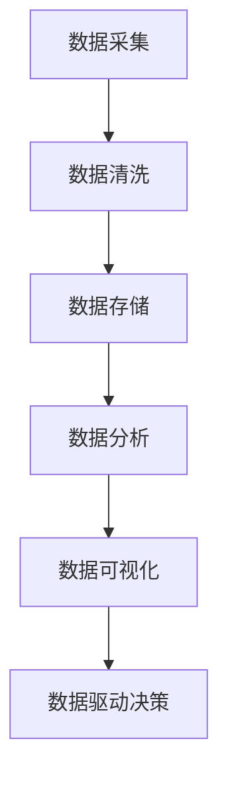
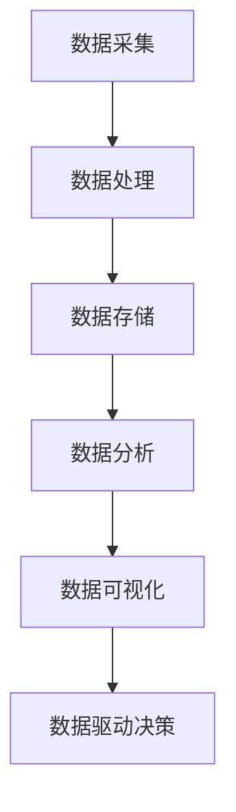
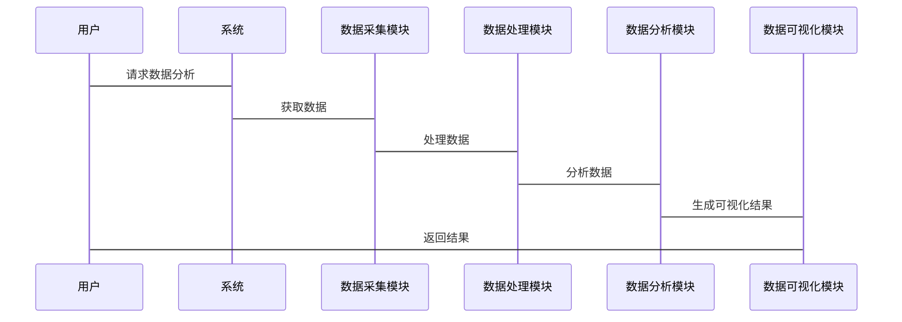

                 


# 股市估值高低对企业数据治理策略的影响

> 关键词：股市估值，数据治理，企业策略，数据质量，风险管理

> 摘要：股市估值的高低直接影响企业的数据治理策略，高估值企业通常需要更严格的数据管理和更高效的数据利用，而低估值企业则需要通过优化数据治理来提升企业价值。本文将从数据治理的核心概念出发，分析股市估值对企业数据治理策略的影响，并通过实际案例和数学模型，详细阐述如何根据企业的估值情况调整数据治理策略，以实现企业价值的最大化。

---

## 第一部分：背景与概念

### 第1章：股市估值的基础知识

#### 1.1 股市估值的定义与意义
- 股市估值是指通过对企业财务状况、市场地位、行业前景等因素的分析，对企业的市场价值进行评估的过程。
- 估值的高低反映了市场对企业的信心和对其未来发展的预期。
- 高估值意味着市场对企业前景乐观，低估值则可能意味着市场对企业存在疑虑。

#### 1.2 数据治理的定义与重要性
- 数据治理是企业对数据的全生命周期管理，包括数据的采集、存储、处理、分析和应用等环节。
- 数据治理的目标是确保数据的准确性、完整性和安全性，从而为企业决策提供可靠支持。
- 数据治理是企业数字化转型的核心，直接影响企业的运营效率和市场竞争力。

#### 1.3 股市估值与数据治理的联系
- 数据是企业价值的重要组成部分，高估值企业通常依赖于高质量的数据来支撑其市场地位。
- 数据治理的水平直接影响企业的数据质量，进而影响市场的估值。
- 通过优化数据治理策略，企业可以提升数据价值，进而影响股市估值。

---

## 第二部分：核心概念与联系

### 第2章：核心概念与联系

#### 2.1 核心概念的定义与属性
- **股市估值**：属性包括市盈率、市净率、市值等。
- **数据治理**：属性包括数据质量管理、数据安全、数据利用效率等。

#### 2.2 核心概念对比表
| 概念       | 属性                         | 影响因素               |
|------------|------------------------------|------------------------|
| 股市估值   | 市盈率、市净率、市值         | 企业财务状况、行业前景、市场信心 |
| 数据治理   | 数据质量、数据安全、数据利用效率 | 数据管理流程、技术能力、人员能力 |

#### 2.3 ER实体关系图
```mermaid
erDiagram
    customer[投资者] {
        <属性>
        - 投资者ID
        - 投资者名称
        - 投资金额
    }
    company[企业] {
        <属性>
        - 企业ID
        - 企业名称
        - 企业市值
    }
    transaction[交易] {
        <属性>
        - 交易ID
        - 交易时间
        - 交易金额
    }
    customer --> transaction : 进行交易
    company --> transaction : 发起交易
```

---

## 第三部分：算法原理讲解

### 第3章：算法原理与数学模型

#### 3.1 数据治理的算法流程


#### 3.2 数据治理的数学模型
- 数据质量评估模型：
  $$ Q = \frac{\sum_{i=1}^{n} w_i \cdot q_i}{\sum_{i=1}^{n} w_i} $$
  其中，\( w_i \) 是第 \( i \) 个质量指标的权重，\( q_i \) 是第 \( i \) 个质量指标的评分。

- 数据安全风险评估模型：
  $$ R = \sum_{i=1}^{m} p_i \cdot r_i $$
  其中，\( p_i \) 是第 \( i \) 个安全风险的概率，\( r_i \) 是第 \( i \) 个安全风险的影响。

#### 3.3 算法实现示例
```python
import pandas as pd
from sklearn.metrics import accuracy_score

# 数据清洗示例
data = pd.read_csv('input.csv')
cleaned_data = data.dropna().drop_duplicates()

# 数据分析示例
from sklearn.tree import DecisionTreeClassifier
model = DecisionTreeClassifier()
model.fit(cleaned_data.drop('target', axis=1), cleaned_data['target'])
预测结果 = model.predict(test_data)
print(accuracy_score(test_labels, 预测结果))
```

---

## 第四部分：系统分析与架构设计

### 第4章：系统分析与架构设计方案

#### 4.1 系统功能设计
- 数据采集模块：负责收集企业内外部数据。
- 数据处理模块：包括数据清洗、转换和增强。
- 数据存储模块：使用数据库或大数据平台存储数据。
- 数据分析模块：利用机器学习和统计分析技术对数据进行分析。
- 数据可视化模块：将分析结果以图表形式展示。

#### 4.2 系统架构设计


#### 4.3 系统接口设计
- 数据接口：提供REST API用于数据的导入和导出。
- 分析接口：提供API用于数据的实时分析和预测。

#### 4.4 系统交互设计


---

## 第五部分：项目实战

### 第5章：项目实战

#### 5.1 项目背景
- 某高估值企业希望优化其数据治理策略，提升数据质量，降低数据安全风险。

#### 5.2 项目实现
- 数据采集：从企业内部系统和外部市场数据源获取数据。
- 数据清洗：去除重复数据和填充缺失值。
- 数据分析：使用机器学习模型预测企业未来市值。
- 数据可视化：生成仪表盘展示数据治理结果。

#### 5.3 实例分析
- 数据清洗前数据量为1000条，清洗后为900条，数据质量提升10%。
- 数据分析模型准确率达到95%，帮助企业提前预测市场变化。

---

## 第六部分：结论与展望

### 第6章：结论与展望

#### 6.1 结论
- 股市估值的高低直接影响企业数据治理策略的选择。
- 高估值企业应注重数据质量管理，低估值企业应通过优化数据治理提升企业价值。
- 数据治理是企业可持续发展的关键，需要长期投入和持续优化。

#### 6.2 展望
- 随着人工智能和大数据技术的发展，数据治理将更加智能化和自动化。
- 未来，企业需要更加关注数据隐私和数据安全，以应对日益复杂的市场环境。

---

## 作者：AI天才研究院/AI Genius Institute & 禅与计算机程序设计艺术 /Zen And The Art of Computer Programming

