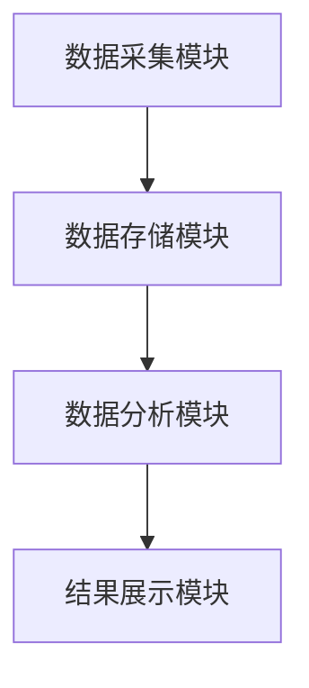
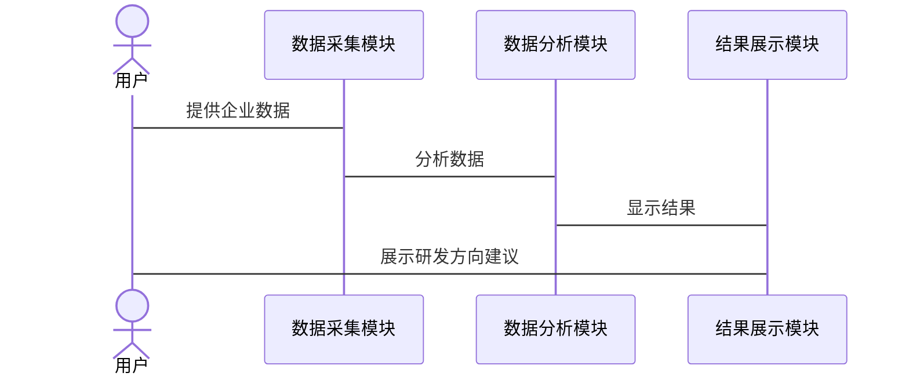

                 


# 股市估值高低对企业研发方向选择的影响

> 关键词：股市估值、企业研发、投资决策、财务分析、技术发展

> 摘要：本文探讨了股市估值的高低如何影响企业的研发方向选择，分析了估值指标与研发方向的内在联系，通过算法模型和系统架构设计，为企业在不同估值环境下制定研发策略提供了实践指导。

---

## 第一章：股市估值的基本概念

### 1.1 股市估值的定义与指标

股市估值是衡量企业市场价值的重要指标，常用的估值指标包括：

- **市盈率（P/E）**：市盈率=股票价格/每股收益，反映了市场对公司盈利能力的预期。
- **市净率（P/B）**：市净率=股票价格/每股净资产，适用于评估资产密集型企业的价值。
- **市销率（P/S）**：市销率=股票价格/每股营业收入，常用于评估成长型企业。

### 1.2 企业研发方向的选择与影响因素

企业研发方向的选择受到多种因素影响，包括市场需求、技术趋势、企业战略和财务状况等。其中，股市估值是影响研发方向的重要外部因素。

---

## 第二章：股市估值与企业研发方向的关系

### 2.1 高估值对企业研发方向的影响

高估值意味着市场对企业的未来增长预期较高，企业可能倾向于高风险、高回报的研发方向，例如开拓新兴市场或投资前沿技术。

### 2.2 低估值对企业研发方向的影响

低估值可能导致企业更注重短期收益，倾向于选择风险较低的研发方向，例如优化现有产品或降低成本。

---

## 第三章：核心概念与联系

### 3.1 股市估值的核心要素

- **市盈率（P/E）**：高P/E意味着市场对企业未来盈利的高预期，可能推动企业在高增长领域进行研发投资。
- **市净率（P/B）**：低P/B可能意味着企业资产被低估，适合进行资产优化型研发。
- **市销率（P/S）**：低P/S可能表明企业收入被低估，适合进行市场扩展型研发。

### 3.2 研发方向的核心要素

- **技术研发方向**：如人工智能、区块链等，通常与高估值企业相关。
- **产品开发方向**：如产品升级、创新，适用于不同估值环境。
- **市场拓展方向**：如开拓新市场，通常在高估值环境下更为活跃。

### 3.3 对比分析

通过对比不同估值指标对研发方向的影响，可以发现：

- **高P/E企业**：倾向于高风险、高回报的研发方向。
- **低P/B企业**：倾向于资产优化型研发。
- **低P/S企业**：倾向于市场扩展型研发。

---

## 第四章：算法原理讲解

### 4.1 基于股市估值的算法模型

#### 4.1.1 数据预处理
- 数据清洗：处理缺失值、异常值。
- 数据标准化：统一数据格式和单位。

#### 4.1.2 模型训练
- 使用回归分析预测不同研发方向的潜在回报。
- 通过机器学习模型（如随机森林）分类高估值与低估值企业。

#### 4.1.3 模型评估
- 采用准确率、召回率等指标评估模型性能。

#### 4.1.4 代码实现
```python
import pandas as pd
from sklearn.ensemble import RandomForestClassifier
from sklearn.metrics import accuracy_score

# 数据加载
data = pd.read_csv('data.csv')

# 特征与目标分离
X = data.drop('研发方向', axis=1)
y = data['研发方向']

# 模型训练
model = RandomForestClassifier()
model.fit(X, y)

# 模型预测
y_pred = model.predict(X)

# 模型评估
print('准确率:', accuracy_score(y, y_pred))
```

### 4.2 算法原理的数学模型

回归分析模型：
$$ y = \beta_0 + \beta_1x_1 + \beta_2x_2 + \ldots + \beta_nx_n + \epsilon $$

随机森林模型：
$$ y = \text{投票结果} $$

---

## 第五章：系统分析与架构设计

### 5.1 系统架构设计

#### 5.1.1 系统功能设计
- 数据采集模块：收集企业财务数据和市场数据。
- 数据分析模块：计算估值指标，预测研发方向。
- 结果展示模块：可视化分析结果。

#### 5.1.2 系统架构图


### 5.2 接口与交互设计

#### 5.2.1 数据接口设计
- 数据输入接口：接收企业数据。
- 数据输出接口：返回分析结果。

#### 5.2.2 交互流程图


---

## 第六章：项目实战

### 6.1 实战案例分析

#### 6.1.1 案例企业介绍
以一家高科技企业为例，分析其在高估值和低估值环境下的研发方向选择。

#### 6.1.2 数据收集与分析
- 收集过去5年的财务数据和股价数据。
- 计算P/E、P/B等估值指标。
- 分析不同估值阶段的研发投入方向。

#### 6.1.3 模型应用
- 使用随机森林模型预测未来研发方向。
- 对比实际研发方向与模型预测结果。

---

## 第七章：总结与展望

### 7.1 小结

股市估值是影响企业研发方向选择的重要因素。高估值环境下，企业倾向于高风险、高回报的研发方向；低估值环境下，企业更注重稳健发展。

### 7.2 注意事项

- 数据质量：确保数据的准确性和完整性。
- 模型选择：根据企业实际情况选择合适的分析模型。
- 风险管理：合理控制研发投资风险。

### 7.3 拓展阅读

- 《股市分析实战》
- 《企业战略管理》
- 《机器学习在金融中的应用》

---

作者：AI天才研究院 & 禅与计算机程序设计艺术

---

这篇文章通过系统的分析和实际案例，详细探讨了股市估值对企业研发方向选择的影响，为企业制定研发战略提供了理论依据和实践指导。

