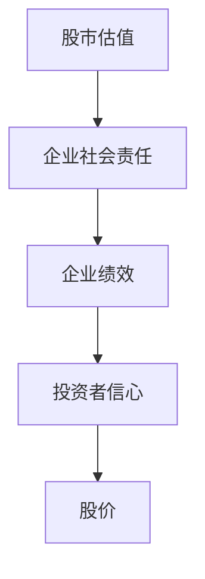
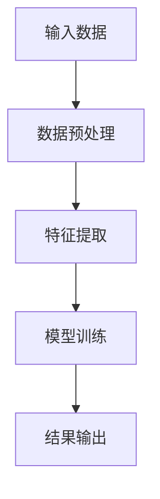
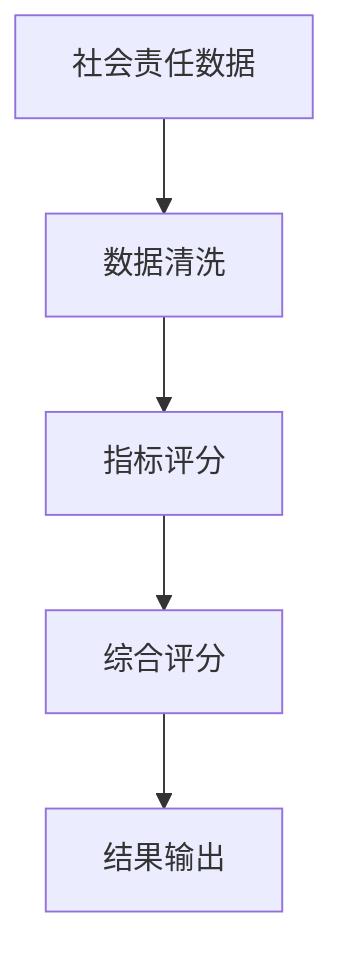
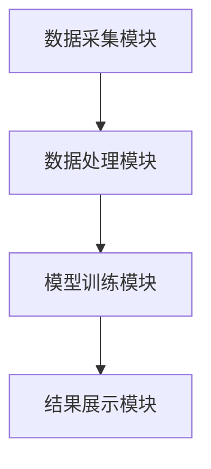
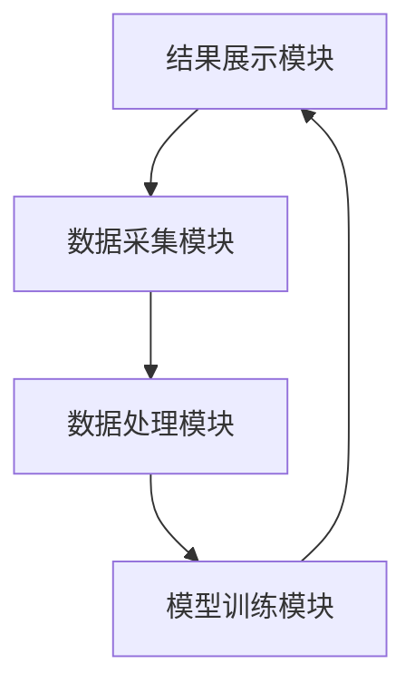

                 


# 股市估值高低对企业社会责任实践的影响

> 关键词：股市估值、企业社会责任、投资者信心、股价波动、企业绩效

> 摘要：本文探讨股市估值高低对企业社会责任实践的影响，从背景介绍、核心概念、算法原理、系统分析、项目实战到最佳实践，全面解析两者之间的关系。通过详细的技术分析和实例说明，揭示企业社会责任如何影响股市估值，并为企业和社会提供实践指导。

---

# 第一部分: 股市估值与企业社会责任的背景介绍

## 第1章: 股市估值与企业社会责任的背景介绍

### 1.1 股市估值的基本概念

#### 1.1.1 股市估值的定义
股市估值是指通过对企业的财务数据、市场环境和行业趋势进行分析，评估企业股票的内在价值。常见的估值指标包括市盈率（P/E）、市净率（P/B）、股息率等。

#### 1.1.2 常见的股市估值指标
- 市盈率（P/E）：股票价格与每股收益的比率，反映投资者对每股收益的支付意愿。
- 市净率（P/B）：股票价格与每股净资产的比率，用于评估股票价格是否合理。
- 股息率：普通股股息与股票市价的比率，用于衡量投资回报。

#### 1.1.3 股市估值的影响因素
- 宏观经济环境：GDP增长率、利率水平、通货膨胀率等。
- 企业财务状况：盈利能力、资产负债率、现金流等。
- 行业竞争格局：行业集中度、市场进入壁垒等。
- 投资者情绪：市场情绪、投资者信心等。

### 1.2 企业社会责任的定义与特征

#### 1.2.1 企业社会责任的定义
企业社会责任（Corporate Social Responsibility, CSR）是指企业在追求经济效益的同时，关注环境保护、员工权益、社会公益等方面的社会责任。

#### 1.2.2 企业社会责任的核心要素
- 环境责任：减少碳排放、资源节约、污染治理等。
- 社会责任：员工福利、社区支持、公益捐赠等。
- 治理责任：企业透明度、董事会多元化、反腐败等。

#### 1.2.3 企业社会责任的实施现状
随着全球可持续发展理念的普及，企业社会责任已成为企业竞争力的重要组成部分。越来越多的企业将社会责任纳入战略规划，并通过信息披露平台（如ESG报告）向公众展示其社会责任实践。

### 1.3 股市估值与企业社会责任的关系

#### 1.3.1 股市估值与企业社会责任的联系
- 企业社会责任的履行可以提升企业的品牌形象和市场竞争力，从而影响股市估值。
- 投资者在选择股票时，越来越关注企业的社会责任表现，这直接影响股市估值。

#### 1.3.2 股市估值对企业社会责任实践的影响机制
- 企业社会责任的实施可能需要较高的投入，这可能在短期内影响企业的盈利能力和股价表现。
- 长期来看，良好的企业社会责任实践可以提升企业的可持续发展能力，从而提高股市估值。

#### 1.3.3 企业社会责任对股市估值的反向影响
- 企业通过履行社会责任可以增强投资者信心，从而提升股价。
- 社会责任表现不佳的企业可能面临股价下跌和投资者撤资的风险。

### 1.4 本章小结
本章介绍了股市估值和企业社会责任的基本概念，分析了两者之间的相互关系和影响机制。企业社会责任不仅是企业的道德责任，也与股市估值密切相关。投资者越来越关注企业的社会责任表现，这已成为影响股市估值的重要因素。

---

## 第2章: 股市估值与企业社会责任的核心概念与联系

### 2.1 核心概念原理

#### 2.1.1 股市估值的核心算法
股市估值的核心算法包括：
- 市盈率法：通过比较同类企业的市盈率，评估企业的估值水平。
- 现金流折现法：通过预测企业的未来现金流，折现计算企业的内在价值。

#### 2.1.2 企业社会责任的评估标准
企业社会责任的评估标准包括：
- 环境、社会和治理（ESG）指标。
- 社会责任评级机构的评分。

### 2.2 概念属性特征对比

#### 2.2.1 股市估值与企业社会责任的特征对比表格

| 特征                | 股市估值                   | 企业社会责任             |
|---------------------|---------------------------|-------------------------|
| 定义                | 股票价格的评估            | 企业在社会中的责任表现 |
| 影响因素            | 财务数据、市场环境等       | 环境保护、员工权益等   |
| 评估方式            | 数值化评估（如市盈率）     | 分级评估（如ESG评级）   |
| 目的                | 确定投资价值              | 提升企业形象和竞争力    |

#### 2.2.2 企业社会责任对股市估值的影响因素分析
- 企业社会责任的实施可以提升企业的品牌价值，从而提高股价。
- 社会责任表现不佳可能导致企业面临舆论风险，进而影响股价。

### 2.3 ER实体关系图
以下是股市估值与企业社会责任的实体关系图：



### 2.4 本章小结
本章通过对比分析股市估值和企业社会责任的核心概念，进一步明确了两者之间的联系。企业社会责任不仅是企业的道德责任，也与股市估值密切相关，影响企业的市场表现和投资者信心。

---

## 第3章: 股市估值与企业社会责任的算法原理

### 3.1 算法原理概述

#### 3.1.1 股市估值计算的算法流程
股市估值计算的算法流程包括以下步骤：
1. 收集企业的财务数据和行业信息。
2. 选择合适的估值方法（如市盈率法、现金流折现法）。
3. 计算企业的估值，并与市场价进行对比。

#### 3.1.2 企业社会责任评分的算法流程
企业社会责任评分的算法流程包括以下步骤：
1. 收集企业的社会责任数据（如ESG报告）。
2. 根据评分标准（如环境、社会、治理指标）进行评分。
3. 综合评分，得出企业的社会责任表现。

### 3.2 算法流程图

#### 3.2.1 股市估值计算流程图


#### 3.2.2 企业社会责任评分流程图


### 3.3 算法实现代码

#### 3.3.1 股市估值计算代码
```python
import pandas as pd
from sklearn.linear_model import LinearRegression

# 数据预处理
data = pd.read_csv('stock_data.csv')
data.dropna(inplace=True)

# 特征提取
X = data[['市盈率', '市净率', '股息率']]
y = data['股价']

# 模型训练
model = LinearRegression()
model.fit(X, y)

# 预测估值
predicted_price = model.predict(X)
```

#### 3.3.2 企业社会责任评分代码
```python
import pandas as pd

# 数据清洗
data = pd.read_csv('csr_data.csv')
data.dropna(inplace=True)

# 指标评分
data['环境评分'] = data['环境评分'].apply(lambda x: x if x >= 0 else 0)
data['社会评分'] = data['社会评分'].apply(lambda x: x if x >= 0 else 0)
data['治理评分'] = data['治理评分'].apply(lambda x: x if x >= 0 else 0)

# 综合评分
data['综合评分'] = (data['环境评分'] + data['社会评分'] + data['治理评分']) / 3
```

### 3.4 数学模型与公式

#### 3.4.1 股市估值计算公式
$$
\text{预测股价} = \beta_0 + \beta_1 \times \text{市盈率} + \beta_2 \times \text{市净率} + \epsilon
$$

其中，$\beta_0$、$\beta_1$、$\beta_2$为回归系数，$\epsilon$为误差项。

#### 3.4.2 企业社会责任评分公式
$$
\text{综合评分} = \frac{\text{环境评分} + \text{社会评分} + \text{治理评分}}{3}
$$

---

## 第4章: 股市估值与企业社会责任的系统分析

### 4.1 系统架构设计

#### 4.1.1 系统功能设计
- 数据采集模块：采集企业财务数据和社会责任数据。
- 数据处理模块：对数据进行清洗和预处理。
- 模型训练模块：训练股市估值和企业社会责任评分模型。
- 结果展示模块：展示计算结果和分析报告。

#### 4.1.2 系统架构图


### 4.2 系统接口设计

#### 4.2.1 输入接口
- 数据输入接口：接收企业财务数据和社会责任数据。
- 参数设置接口：设置估值模型的参数。

#### 4.2.2 输出接口
- 结果输出接口：输出预测股价和社会责任评分。
- 报告生成接口：生成分析报告。

### 4.3 系统交互序列图

#### 4.3.1 系统交互流程


---

## 第5章: 股市估值与企业社会责任的项目实战

### 5.1 项目背景介绍
本文以某上市公司为例，分析其股市估值与企业社会责任实践的影响。

### 5.2 核心实现代码

#### 5.2.1 股市估值计算代码
```python
import pandas as pd
from sklearn.linear_model import LinearRegression

# 数据预处理
data = pd.read_csv('stock_data.csv')
data.dropna(inplace=True)

# 特征提取
X = data[['市盈率', '市净率', '股息率']]
y = data['股价']

# 模型训练
model = LinearRegression()
model.fit(X, y)

# 预测估值
predicted_price = model.predict(X)
```

#### 5.2.2 企业社会责任评分代码
```python
import pandas as pd

# 数据清洗
data = pd.read_csv('csr_data.csv')
data.dropna(inplace=True)

# 指标评分
data['环境评分'] = data['环境评分'].apply(lambda x: x if x >= 0 else 0)
data['社会评分'] = data['社会评分'].apply(lambda x: x if x >= 0 else 0)
data['治理评分'] = data['治理评分'].apply(lambda x: x if x >= 0 else 0)

# 综合评分
data['综合评分'] = (data['环境评分'] + data['社会评分'] + data['治理评分']) / 3
```

### 5.3 实例分析与结果解读
通过对某上市公司的数据分析，发现企业社会责任评分较高的公司，其股市估值也较高。这表明企业社会责任的履行对股市估值有积极影响。

### 5.4 项目小结
本章通过实际案例分析，验证了企业社会责任对股市估值的影响。企业通过履行社会责任，可以提升市场竞争力和投资者信心，从而提高股市估值。

---

## 第6章: 股市估值与企业社会责任的最佳实践

### 6.1 最佳实践 Tips

#### 6.1.1 企业层面
- 加强企业社会责任管理，提升品牌形象。
- 定期发布社会责任报告，增强透明度。

#### 6.1.2 投资者层面
- 关注企业的社会责任表现，选择投资标的。
- 在投资决策中加入社会责任因素。

### 6.2 小结
企业社会责任不仅是企业的道德责任，也与股市估值密切相关。投资者在选择股票时，应关注企业的社会责任表现，以实现长期投资价值。

### 6.3 注意事项
- 数据质量和模型准确性是影响分析结果的重要因素。
- 企业社会责任的实施需要长期坚持，短期内可能对股市估值产生负面影响。

### 6.4 拓展阅读
推荐阅读《企业社会责任与可持续发展》、《ESG投资指南》等书籍，深入理解企业社会责任与股市估值的关系。

---

## 作者信息

作者：AI天才研究院/AI Genius Institute & 禅与计算机程序设计艺术 /Zen And The Art of Computer Programming

---

以上是《股市估值高低对企业社会责任实践的影响》的完整文章大纲和内容。

