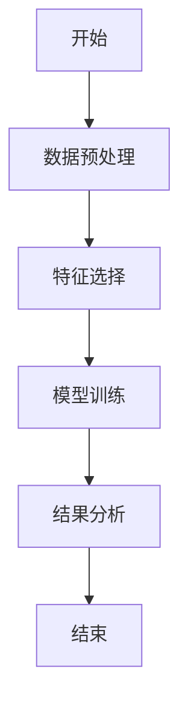
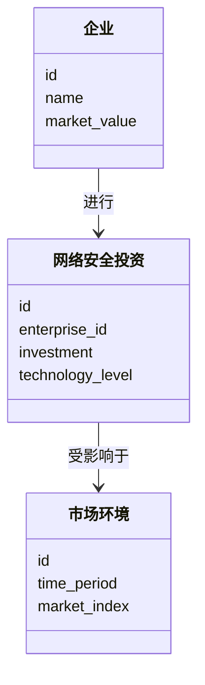

                 


# 股市估值高低对企业网络安全投资的影响

> 关键词：股市估值，网络安全投资，企业安全，市场波动，投资决策

> 摘要：本文探讨了股市估值高低对企业网络安全投资的影响，分析了高估值与低估值企业在安全投资上的差异，结合数学模型和实际案例，提出了一套系统的分析方法和投资策略。

---

## 第1章: 股市估值与网络安全投资的背景

### 1.1 股市估值的基本概念

#### 1.1.1 股市估值的定义
股市估值是指通过对企业的财务数据、市场表现和行业地位等多方面因素的分析，对其股票的内在价值进行评估。常见的估值方法包括市盈率（P/E）、市净率（P/B）和股息率等。

#### 1.1.2 股市估值的核心要素
- **企业盈利能力**：净利润、ROE（净资产收益率）等指标。
- **行业地位**：市场占有率、竞争格局。
- **财务健康状况**：资产负债率、现金流等。
- **市场预期**：投资者对企业的未来预期。

#### 1.1.3 股市估值与企业价值的关系
股市估值是市场对企业价值的反映，高估值意味着市场对企业前景的看好，低估值则可能意味着市场对其前景的不看好或低估。

### 1.2 企业网络安全投资的重要性

#### 1.2.1 网络安全的基本概念
网络安全是指保护企业信息系统、数据和网络免受未经授权的访问、破坏和泄露的活动。

#### 1.2.2 企业网络安全投资的必要性
- 随着数字化转型的推进，企业面临更多的网络安全威胁。
- 数据泄露事件对企业声誉和财务造成重大损失。

#### 1.2.3 网络安全对企业发展的影响
- 提升客户信任，增强品牌价值。
- 保障业务连续性，避免因网络安全事件导致的损失。

### 1.3 股市估值与网络安全投资的关系

#### 1.3.1 股市估值对企业安全投资的影响
高估值企业更倾向于在网络安全上投入，以维护其市场形象和股价稳定。

#### 1.3.2 网络安全对企业估值的反向影响
良好的网络安全策略和措施可以提升企业的估值，反之，网络安全事件可能导致估值下降。

#### 1.3.3 两者关系的复杂性与研究意义
股市估值和网络安全投资相互影响，企业在制定安全策略时需要综合考虑市场环境和自身情况。

---

## 第2章: 股市估值高低对企业网络安全投资的影响

### 2.1 股市估值对企业网络安全投资的影响机制

#### 2.1.1 高估值企业网络安全投资的特点
- 投资更积极，注重高端技术引进。
- 安全团队规模较大，管理更规范。

#### 2.1.2 低估值企业网络安全投资的特点
- 投资相对保守，可能忽视长期安全建设。
- 安全团队规模较小，管理较为松散。

#### 2.1.3 估值对企业安全投资决策的影响
高估值企业更倾向于防御性投资，低估值企业则可能在成本控制和风险之间寻求平衡。

### 2.2 不同市场环境下网络安全投资的差异

#### 2.2.1 牛市环境下的网络安全投资行为
- 高估值企业加大安全投入，推动股价上涨。
- 投资者对企业安全的关注度提高，推动企业安全投资。

#### 2.2.2 熊市环境下的网络安全投资行为
- 低估值企业可能减少安全投入，优先考虑成本控制。
- 投资者对安全的关注度下降，企业安全投资动力不足。

#### 2.2.3 市场波动对企业安全投资的影响
市场波动可能导致企业安全投资策略的调整，高波动环境下企业更倾向于保守投资。

### 2.3 股市估值对企业网络安全投资的长期与短期影响

#### 2.3.1 短期市场波动对安全投资的影响
短期市场波动可能导致企业调整安全投资策略，高估值企业可能增加投入，低估值企业可能减少投入。

#### 2.3.2 长期企业价值与安全投资的关系
长期来看，良好的安全投资可以提升企业价值，减少因安全事件导致的损失。

#### 2.3.3 估值波动对企业安全投资策略的调整
企业需要根据估值波动动态调整安全投资策略，平衡短期成本和长期价值。

---

## 第3章: 核心概念与联系的分析

### 3.1 股市估值与网络安全投资的核心概念

#### 3.1.1 股市估值的核心概念
- 股票价格与内在价值的关系。
- 影响股市估值的主要因素。

#### 3.1.2 网络安全投资的核心概念
- 安全技术投入与管理措施的关系。
- 安全投资对企业竞争力的影响。

#### 3.1.3 两者关系的核心要素
- 企业安全投资对股市估值的影响。
- 股市估值对企业安全投资的反向影响。

### 3.2 核心概念的属性特征对比

| 属性 | 股市估值 | 网络安全投资 |
|------|----------|--------------|
| 目标 | 评估企业价值 | 保障企业安全 |
| 主要因素 | 财务数据、市场预期 | 技术水平、管理能力 |
| 影响 | 股价波动 | 企业声誉、财务损失 |

### 3.3 ER实体关系图架构

```mermaid
erd
    章节关系
    企业
        - id
        - 名称
        - 估值
    网络安全投资
        - id
        - 企业id
        - 投资金额
        - 技术水平
    市场环境
        - id
        - 时间段
        - 市场指数
    关系
        企业 -> 网络安全投资: 进行
        网络安全投资 -> 市场环境: 受影响于
```

---

## 第4章: 算法原理讲解

### 4.1 算法概述
使用回归分析模型，量化股市估值对网络安全投资的影响。

### 4.2 算法流程图



### 4.3 算法实现代码

```python
import pandas as pd
from sklearn.linear_model import LinearRegression
from sklearn.metrics import r2_score

# 数据预处理
data = pd.read_csv('security_investment.csv')
X = data[['market_value', 'profit_margin']]
y = data['security_investment']

# 特征选择
features = X.columns

# 模型训练
model = LinearRegression()
model.fit(X, y)

# 结果分析
predictions = model.predict(X)
print('R-squared:', r2_score(y, predictions))
```

### 4.4 数学公式
回归分析的数学模型为：
$$ y = \beta_0 + \beta_1x_1 + \beta_2x_2 + \epsilon $$
其中，$y$ 是网络安全投资，$x_1$ 是企业估值，$x_2$ 是企业利润 margin。

---

## 第5章: 系统分析与架构设计方案

### 5.1 系统功能设计

#### 5.1.1 领域模型类图



### 5.2 系统架构设计

#### 5.2.1 系统架构图


---

## 第6章: 项目实战

### 6.1 环境安装
- 安装Python和相关库（Pandas、Scikit-learn）。

### 6.2 核心实现代码

```python
# 数据加载
import pandas as pd

data = pd.read_csv('security_investment.csv')

# 数据预处理
from sklearn.preprocessing import StandardScaler

scaler = StandardScaler()
X_scaled = scaler.fit_transform(data[['market_value', 'profit_margin']])

# 模型训练
from sklearn.linear_model import LinearRegression

model = LinearRegression()
model.fit(X_scaled, data['security_investment'])

# 模型预测
importances = pd.Series(model.coef_, index=data.columns)
print("特征重要性：", importances)
```

### 6.3 案例分析
分析高估值和低估值企业在网络安全投资上的差异，并提出针对性的投资策略。

---

## 第7章: 总结与展望

### 7.1 最佳实践

#### 7.1.1 投资策略
高估值企业应持续加大安全投入，低估值企业需平衡成本与风险。

#### 7.1.2 风险管理
建立风险管理机制，及时应对市场波动带来的安全投资变化。

### 7.2 未来研究方向
探索人工智能在网络安全投资中的应用，研究动态调整策略。

---

## 作者：AI天才研究院/AI Genius Institute & 禅与计算机程序设计艺术/Zen And The Art of Computer Programming

