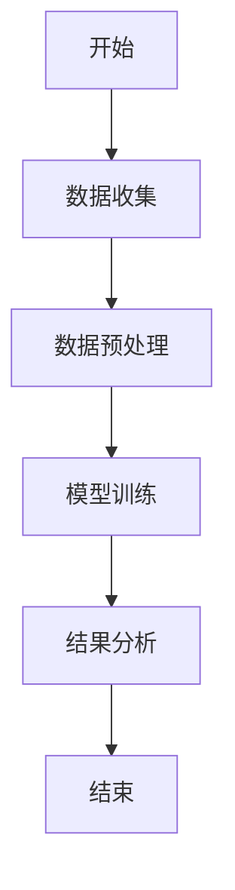
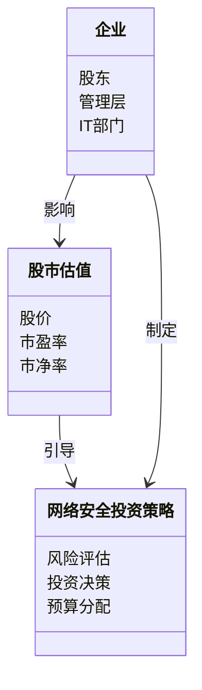
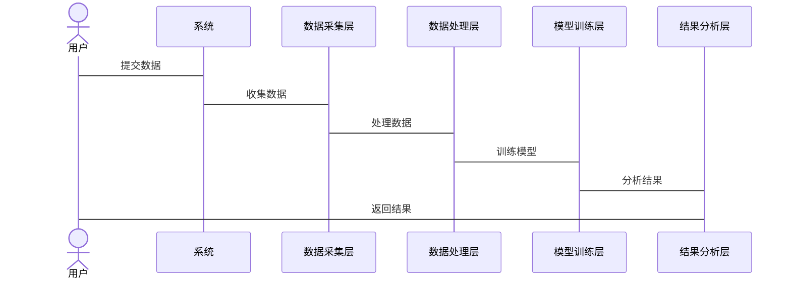

                 


```markdown
# 股市估值高低对企业网络安全投资策略的影响

## 关键词：股市估值、企业网络安全、投资策略、风险管理、贝叶斯定理、系统架构

## 摘要：本文探讨了股市估值对企业网络安全投资策略的影响，通过分析企业财务状况、市场环境和网络安全风险之间的关系，提出了基于股市估值的网络安全投资策略优化方法。文章结合算法原理、系统架构和项目实战，为企业在不同市场环境下制定合理的网络安全投资策略提供了理论支持和实践指导。

---

## 目录

### 第一部分: 股市估值与企业网络安全投资策略的背景介绍

#### 第1章: 问题背景与描述

##### 1.1 企业网络安全的重要性
###### 1.1.1 网络安全对企业运营的影响
###### 1.1.2 网络安全对企业财务状况的影响
###### 1.1.3 网络安全对企业市场竞争力的影响

##### 1.2 股市估值对企业投资策略的影响
###### 1.2.1 股市估值的定义与计算方法
###### 1.2.2 股市估值对企业投资决策的影响
###### 1.2.3 股市估值与企业网络安全投资的关联性

##### 1.3 问题解决与边界外延
###### 1.3.1 问题的解决思路
###### 1.3.2 问题的边界与外延
###### 1.3.3 核心概念的结构与组成

---

### 第二部分: 核心概念与联系

#### 第2章: 核心概念原理与特征对比

##### 2.1 核心概念的原理分析
###### 2.1.1 企业财务状况与网络安全投资的关系
###### 2.1.2 市场环境与网络安全投资的互动机制
###### 2.1.3 股市估值与企业网络安全投资策略的内在联系

##### 2.2 概念属性特征对比表格
###### 表2-1: 企业财务状况、市场环境与网络安全投资策略的特征对比

##### 2.3 ER实体关系图
```mermaid
erd
    title 实体关系图
    企业
    股市估值
    网络安全投资策略
    企业 --o> 股市估值: 影响
    股市估值 --o> 网络安全投资策略: 引导
    企业 --o> 网络安全投资策略: 制定
```

---

### 第三部分: 算法原理与数学模型

#### 第3章: 算法原理与流程图

##### 3.1 算法原理
###### 3.1.1 算法的输入与输出
###### 3.1.2 算法的步骤与流程
###### 3.1.3 算法的优化与改进

##### 3.2 算法流程图


##### 3.3 算法的数学模型与公式
###### 3.3.1 风险评估模型
$$ R = \frac{S}{V} $$
其中，R 表示网络安全风险，S 表示企业安全投入，V 表示股市估值。

###### 3.3.2 投资策略优化模型
$$

---

### 第四部分: 系统分析与架构设计方案

#### 第4章: 问题场景介绍

##### 4.1 问题场景描述
###### 4.1.1 网络安全风险评估
###### 4.1.2 股市估值对企业投资决策的影响
###### 4.1.3 系统功能需求分析

##### 4.2 系统功能设计
###### 4.2.1 领域模型mermaid类图


##### 4.3 系统架构设计
###### 4.3.1 系统架构mermaid架构图


##### 4.4 系统接口设计
###### 4.4.1 接口描述
###### 4.4.2 接口交互流程

##### 4.5 系统交互mermaid序列图


---

### 第五部分: 项目实战

#### 第5章: 环境安装与系统核心实现

##### 5.1 环境安装
###### 5.1.1 安装Python
###### 5.1.2 安装相关库（如numpy、pandas、scikit-learn）
###### 5.1.3 安装Mermaid工具

##### 5.2 系统核心实现源代码
###### 5.2.1 数据收集与预处理代码
```python
import pandas as pd
import numpy as np

# 数据收集
data = pd.read_csv('input.csv')
# 数据预处理
data = data.dropna()
```

###### 5.2.2 模型训练代码
```python
from sklearn.model_selection import train_test_split
from sklearn.linear_model import LinearRegression

X = data[['market_value', 'risk_factor']]
y = data['investment']
X_train, X_test, y_train, y_test = train_test_split(X, y, test_size=0.2, random_state=42)
model = LinearRegression()
model.fit(X_train, y_train)
```

###### 5.2.3 结果分析与可视化代码
```python
import matplotlib.pyplot as plt

y_pred = model.predict(X_test)
plt.scatter(y_test, y_pred)
plt.xlabel('Actual Investment')
plt.ylabel('Predicted Investment')
plt.title('Investment Prediction vs Actual')
plt.show()
```

##### 5.3 代码应用解读与分析
###### 5.3.1 代码的功能解读
###### 5.3.2 代码的实际应用分析
###### 5.3.3 模型优化建议

##### 5.4 实际案例分析
###### 5.4.1 案例背景介绍
###### 5.4.2 数据分析与结果解读
###### 5.4.3 案例小结

---

### 第六部分: 最佳实践

#### 第6章: 小结与注意事项

##### 6.1 小结
###### 6.1.1 核心内容总结
###### 6.1.2 重要结论回顾

##### 6.2 注意事项
###### 6.2.1 模型应用中的风险提示
###### 6.2.2 数据采集与处理中的注意事项
###### 6.2.3 系统维护与更新建议

##### 6.3 拓展阅读
###### 6.3.1 推荐书籍与论文
###### 6.3.2 相关技术领域的发展趋势
###### 6.3.3 学习资源与工具推荐

---

## 作者：AI天才研究院/AI Genius Institute & 禅与计算机程序设计艺术 /Zen And The Art of Computer Programming
```

