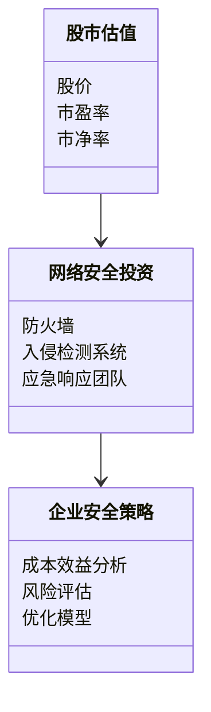
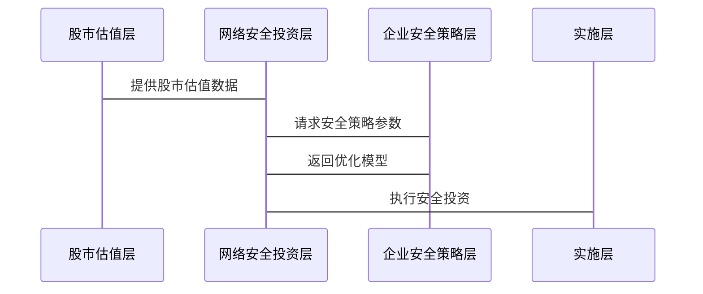

                 


# 股市估值高低对企业网络安全投资策略的影响

## 关键词：股市估值，企业网络安全，投资策略，风险评估，资产配置

## 摘要：  
股市估值的高低直接影响企业的财务状况和市场表现，而企业的网络安全投资策略则是保障企业资产安全的重要手段。本文从股市估值与企业网络安全投资策略的关联性出发，分析股市估值对企业安全投资决策的影响路径，探讨如何通过科学的投资策略优化企业网络安全投入，从而提升企业的整体竞争力和市场价值。通过数学模型和实际案例分析，本文为投资者和企业管理者提供了在不同股市估值环境下优化网络安全投资策略的有效方法。

---

# 第一部分: 股市估值与企业网络安全投资策略的背景介绍

## 第1章: 股市估值与企业网络安全投资策略的核心概念

### 1.1 股市估值的基本概念

#### 1.1.1 股市估值的定义与计算方法  
股市估值是指通过对企业的财务数据、市场环境和行业趋势进行分析，评估企业股票的内在价值和市场价值的过程。常用的估值方法包括市盈率（P/E）、市净率（P/B）、股息率等。  

#### 1.1.2 股市估值的核心要素  
- **企业盈利能力**：净利润、ROE（净资产收益率）等指标反映企业的盈利能力。  
- **财务状况**：资产负债表中的资产、负债和所有者权益状况。  
- **行业环境**：行业竞争格局、政策法规、技术发展趋势等。  
- **市场情绪**：投资者情绪和市场流动性影响股市估值的波动。  

#### 1.1.3 股市估值与企业财务状况的关系  
股市估值是企业财务状况的外在反映，高估值意味着市场对企业未来盈利能力的看好，而低估值可能意味着市场对企业的未来前景持谨慎态度。

### 1.2 企业网络安全投资策略的基本概念

#### 1.2.1 网络安全投资的定义与范围  
网络安全投资是指企业在保护其信息系统、数据和网络免受威胁和攻击方面的支出，包括技术设备采购、人员培训、安全服务采购等。  

#### 1.2.2 企业网络安全投资的主要形式  
- **预防性投资**：防火墙、入侵检测系统等技术设备的采购。  
- **检测性投资**：安全监控、日志分析等工具的部署。  
- **响应性投资**：应急响应团队建设、保险购买等。  

#### 1.2.3 网络安全投资与企业风险管理的关系  
网络安全投资是企业风险管理的重要组成部分，通过合理配置安全资源，企业可以降低因网络安全事件带来的财务损失和声誉损害。

### 1.3 股市估值与企业网络安全投资策略的关联性

#### 1.3.1 股市估值对企业安全投资的影响路径  
1. **高估值企业**：企业需要通过更高的安全投入来维护市场对其的信心。  
2. **低估值企业**：企业可能在安全投入上更为谨慎，优先考虑短期收益。  

#### 1.3.2 股市估值与企业安全投资的相互作用  
- 高估值企业更倾向于加大安全投入，以降低风险事件对企业市值的影响。  
- 低估值企业可能通过优化安全投入策略，逐步提升市场对其安全能力的认可，从而改善估值。  

#### 1.3.3 企业安全投资对股市估值的反向影响  
- 安全投入的增加可以降低企业的风险敞口，提升企业的长期价值。  
- 安全事件的爆发可能导致企业估值短期下降，进而影响企业的安全投入能力。  

### 1.4 本章小结  
本章通过分析股市估值和企业网络安全投资策略的核心概念，揭示了两者之间的相互影响关系。高估值企业需要更高的安全投入来维护市场信心，而低估值企业则需要通过优化安全策略逐步改善估值。下一章将深入探讨两者的具体联系与数学模型。

---

## 第2章: 股市估值与企业网络安全投资策略的核心概念原理

### 2.1 股市估值的原理

#### 2.1.1 股票估值的常用公式  
- 市盈率（P/E）：$P/E = \frac{\text{股价}}{\text{每股收益}}$  
- 市净率（P/B）：$P/B = \frac{\text{股价}}{\text{每股净资产}}$  
- 股息率：$\text{股息率} = \frac{\text{每股股息}}{\text{股价}} \times 100\%$  

#### 2.1.2 市场价值与内在价值的差异  
- **内在价值**：基于企业基本面的理论价值。  
- **市场价值**：实际交易中的股票价格，受市场情绪影响较大。  

#### 2.1.3 影响股市估值的主要因素  
- 企业的盈利能力与成长性。  
- 行业竞争格局与政策环境。  
- 宏观经济环境与市场流动性。  

### 2.2 企业网络安全投资策略的原理

#### 2.2.1 网络安全投资的决策模型  
企业通常采用成本效益分析法来确定安全投入的合理水平。  

$$\text{成本效益比} = \frac{\text{安全投入成本}}{\text{预期收益}}$$  

#### 2.2.2 网络安全投资的成本效益分析  
- 成本：包括设备采购、人员培训、服务采购等。  
- 效益：包括降低风险事件发生的概率、减少潜在的财务损失等。  

#### 2.2.3 企业网络安全投资的长期与短期目标  
- 短期目标：防范 immediate threats，确保业务连续性。  
- 长期目标：构建 robust security framework，提升企业的整体竞争力。  

### 2.3 股市估值与企业网络安全投资策略的联系

#### 2.3.1 股市估值对企业安全投资决策的影响  
- 高估值企业：倾向于增加安全投入，维护市场信心。  
- 低估值企业：可能减少非必要的安全投入，优先追求短期收益。  

#### 2.3.2 企业安全投资对股市估值的反馈机制  
- 安全投入的增加可以降低企业的风险敞口，提升企业的长期价值，从而推动股价上涨。  
- 安全事件的发生可能导致股价短期下跌，进而影响企业的安全投入能力。  

#### 2.3.3 两者关系的数学模型  
通过回归分析可以建立股市估值与安全投入之间的关系模型：  

$$\text{回归方程} = \beta_0 + \beta_1 \times \text{安全投入} + \epsilon$$  

其中，$\beta_1$ 表示安全投入对股市估值的影响程度，$\epsilon$ 为误差项。

---

## 第3章: 股市估值与企业网络安全投资策略的数学模型

### 3.1 股市估值的数学模型

#### 3.1.1 股票估值模型的比较与选择  
- 市盈率模型：适用于盈利稳定的企业。  
- 市净率模型：适用于资产密集型企业。  
- 股息率模型：适用于分红稳定的企业。  

#### 3.1.2 股票估值模型的优缺点分析  
- 市盈率模型：优点是简单易用，缺点是受行业周期影响较大。  
- 市净率模型：优点是适用于资产贬值较快的行业，缺点是难以反映盈利能力。  
- 股息率模型：优点是适用于成熟企业，缺点是无法反映成长性。  

### 3.2 企业网络安全投资策略的数学模型

#### 3.2.1 网络安全投资的成本-收益分析模型  
$$\text{成本-收益比} = \frac{\text{安全投入成本}}{\text{预期收益}}$$  

#### 3.2.2 网络安全投资的风险评估模型  
$$\text{风险敞口} = \text{资产暴露程度} \times \text{威胁概率} \times \text{损失幅度}$$  

#### 3.2.3 网络安全投资的优化模型  
通过线性规划可以优化安全投入的分配，最大化安全效益：  

$$\max \sum_{i=1}^{n} w_i x_i$$  
$$\text{subject to} \quad \sum_{i=1}^{n} c_i x_i \leq \text{预算}$$  

其中，$w_i$ 是安全投入的收益权重，$c_i$ 是成本，$x_i$ 是投入比例。  

### 3.3 股市估值与企业网络安全投资策略的联合模型

#### 3.3.1 联合模型的构建方法  
将股市估值与安全投入的关系纳入回归模型：  

$$\text{股价} = \beta_0 + \beta_1 \times \text{安全投入} + \beta_2 \times \text{企业盈利} + \epsilon$$  

#### 3.3.2 联合模型的数学表达式  
$$\text{股价} = \alpha + \beta \times \text{安全投入} + \gamma \times \text{企业估值因子} + \epsilon$$  

其中，$\alpha$ 是截距，$\beta$ 是安全投入的回归系数，$\gamma$ 是企业估值因子的回归系数。  

#### 3.3.3 联合模型的验证与应用  
通过实证分析验证模型的有效性，帮助企业根据股市估值调整安全投入策略。  

---

## 第4章: 股市估值与企业网络安全投资策略的系统分析与架构设计方案

### 4.1 系统功能设计

#### 4.1.1 领域模型（Mermaid 类图）  


#### 4.1.2 系统架构设计（Mermaid 架构图）  


#### 4.1.3 系统接口设计  
- 输入接口：股市估值数据、企业安全策略参数。  
- 输出接口：安全投入建议、风险评估报告。  

#### 4.1.4 系统交互流程（Mermaid 序列图）  


### 4.2 本章小结  
本章通过系统分析和架构设计，展示了如何将股市估值与网络安全投资策略结合起来，构建一个科学的决策系统。通过领域模型和架构图，明确了各部分之间的关系和功能。

---

## 第5章: 股市估值与企业网络安全投资策略的项目实战

### 5.1 环境安装  
- **工具安装**：安装Python、pandas、numpy、scipy等工具。  
- **数据准备**：收集企业的财务数据和网络安全投入数据。  

### 5.2 核心代码实现

#### 5.2.1 回归分析代码  
```python
import pandas as pd
import numpy as np
from sklearn.linear_model import LinearRegression

# 数据准备
data = pd.DataFrame({
    '股价': [100, 120, 90, 110],
    '安全投入': [10, 15, 8, 12]
})

# 回归分析
model = LinearRegression()
model.fit(data[['安全投入']], data['股价'])

# 输出回归系数
print('回归系数:', model.coef_[0])
```

#### 5.2.2 风险评估代码  
```python
import numpy as np

def 风险敞口(资产暴露程度, 威胁概率, 损失幅度):
    return 资产暴露程度 * 威胁概率 * 损失幅度

资产暴露程度 = 0.8
威胁概率 = 0.2
损失幅度 = 1000000

print('风险敞口:', 风险敞口(资产暴露程度, 威胁概率, 损失幅度))
```

### 5.3 代码应用解读与分析  
通过上述代码，企业可以量化安全投入对股价的影响，并评估网络安全风险敞口。这为企业制定科学的安全投资策略提供了数据支持。

### 5.4 实际案例分析  
以某高科技企业为例，假设其股价与安全投入的回归系数为0.5，说明每增加1单位安全投入，股价预计上涨0.5单位。企业可以根据此结果优化安全投入策略。

### 5.5 项目小结  
本章通过实战案例，展示了如何利用数学模型和编程工具量化股市估值与企业安全投入之间的关系，为企业制定科学的投资策略提供了实证依据。

---

## 第6章: 股市估值与企业网络安全投资策略的总结与展望

### 6.1 最佳实践 tips  
- 高估值企业应加大安全投入，维护市场信心。  
- 低估值企业应优化安全策略，逐步提升估值。  
- 企业应定期评估安全投入与股市估值的关系，动态调整投资策略。  

### 6.2 小结  
本文从背景介绍、核心概念、算法原理、系统设计到项目实战，全面探讨了股市估值与企业网络安全投资策略的关系。通过数学模型和实际案例分析，为企业提供了科学的决策参考。

### 6.3 注意事项  
- 数据的准确性和完整性是模型建立的关键。  
- 模型的应用需要结合企业的实际情况进行调整。  

### 6.4 拓展阅读  
- 《网络安全投资与企业风险管理》  
- 《股市估值分析与投资策略》  

---

## 作者：AI天才研究院/AI Genius Institute & 禅与计算机程序设计艺术 /Zen And The Art of Computer Programming

