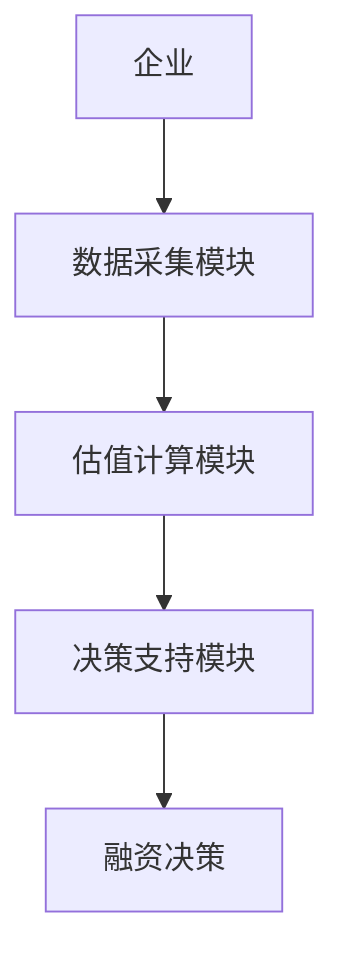

                 


```markdown
# 股市估值高低对企业融资决策的影响

> 关键词：股票估值，企业融资决策，市场波动，融资成本，投资分析

> 摘要：本文深入探讨股市估值高低对企业融资决策的影响，分析了股票估值的核心概念、相关理论模型、实际案例分析以及系统设计等内容，揭示了股市估值与企业融资决策之间的内在联系和相互作用。

---

## 第一部分: 股市估值与企业融资决策的背景介绍

### 第1章: 股票估值的基本概念

#### 1.1 什么是股票估值
股票估值是通过对企业的财务状况、市场地位、盈利能力等多方面因素的分析，确定其股票的合理市场价格。股票估值的核心在于预测企业的未来现金流，并通过贴现率计算其现值。

#### 1.2 股票估值的重要性
- 为企业提供合理的定价依据。
- 为投资者提供决策参考。
- 为企业的融资活动提供指导。

#### 1.3 股票估值的核心要素
- 盈利能力：企业未来的盈利潜力。
- 成长性：企业未来的增长潜力。
- 财务健康状况：企业的财务状况和风险。

---

### 第2章: 股市估值的影响因素

#### 2.1 宏观经济因素
- 经济周期：经济繁荣或衰退影响股市整体估值。
- 利率政策：低利率环境通常推高股市估值。
- 通货膨胀：高通胀可能导致股市估值下降。

#### 2.2 行业与企业因素
- 行业生命周期：处于成长期的行业通常估值较高。
- 企业盈利能力和成长性：高盈利和高成长性的企业估值较高。
- 企业的财务状况与风险：财务健康、风险较低的企业估值较高。

---

## 第二部分: 股票估值与企业融资决策的核心概念

### 第3章: 股票估值的核心概念与联系

#### 3.1 股票估值的核心要素
- 盈利能力：企业的净利润率、ROE等指标。
- 成长性：企业的收入增长率、净利润增长率。
- 财务健康状况：资产负债率、流动比率等指标。

#### 3.2 股票估值与融资决策的联系
- 高估值对融资决策的影响：高估值可能导致融资成本上升。
- 低估值对融资决策的影响：低估值可能限制企业的融资能力。
- 市场波动对融资策略的影响：市场波动可能迫使企业调整融资计划。

---

### 第4章: 股票估值模型与融资决策

#### 4.1 现金流贴现模型（DCF）
- 通过预测企业未来现金流，计算其现值。
- 公式：$$PV = \sum_{t=1}^{n} \frac{CF_t}{(1 + r)^t}$$
- 示例：假设企业未来三年现金流分别为100、120、150万元，贴现率为10%。计算现值：
$$PV = \frac{100}{1.1} + \frac{120}{1.1^2} + \frac{150}{1.1^3} \approx 100 + 100 + 115.76 \approx 315.76 \text{万元}$$

#### 4.2 市盈率倍数法
- 公式：$$P/E = \frac{股票价格}{每股收益}$$
- 示例：某企业每股收益为2元，行业平均市盈率为15倍。则股票合理价格为$$15 \times 2 = 30 \text{元}$$。

#### 4.3 市净率倍数法
- 公式：$$P/B = \frac{股票价格}{每股净资产}$$
- 示例：某企业每股净资产为5元，行业平均市净率为2倍。则股票合理价格为$$2 \times 5 = 10 \text{元}$$。

---

## 第三部分: 系统分析与架构设计

### 第5章: 企业融资决策支持系统

#### 5.1 问题场景介绍
- 企业需要根据股市估值制定融资决策。
- 需要实时监控市场波动，调整融资策略。

#### 5.2 系统功能设计
- 数据采集模块：获取企业财务数据和市场数据。
- 估值计算模块：使用多种模型计算股票估值。
- 决策支持模块：根据估值结果提供融资建议。

#### 5.3 系统架构设计


---

## 第四部分: 项目实战

### 第6章: 股票估值与融资决策的案例分析

#### 6.1 环境安装
- Python 3.8+
- Pandas、NumPy、Matplotlib

#### 6.2 核心代码实现
```python
import pandas as pd
import numpy as np

def calculate_dcf(cf, r):
    return np.npv(r, cf)

# 示例数据
cf = [100, 120, 150]
r = 0.1

dcf_value = calculate_dcf(cf, r)
print(f"DCF 估值：{dcf_value:.2f} 万元")
```

#### 6.3 案例分析
以某科技公司为例，分析其融资决策。通过DCF模型计算企业估值，并结合市场波动调整融资策略。

---

## 第五部分: 最佳实践与总结

### 第7章: 小结与关键点

- 高估值可能增加融资成本，但也能提高融资能力。
- 低估值可能限制融资规模，但风险较低。
- 市场波动要求企业灵活调整融资策略。

### 第8章: 注意事项与拓展阅读

- 注意市场波动对企业估值的影响。
- 拓展阅读：《股票估值的高级模型》、《企业融资策略优化》。

---

## 作者信息

作者：AI天才研究院/AI Genius Institute & 禅与计算机程序设计艺术 /Zen And The Art of Computer Programming
```

