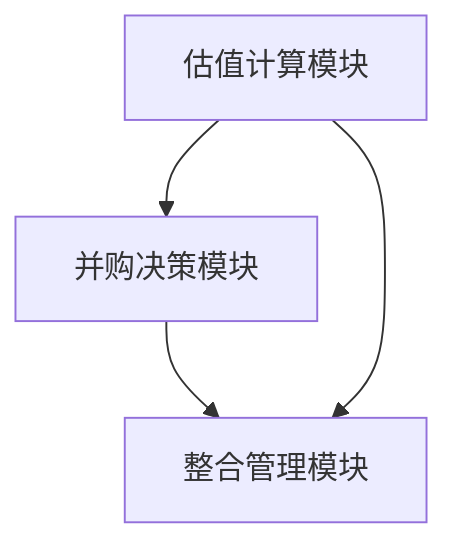

                 


# 股市估值高低对企业跨境并购策略的影响

> **关键词**：股市估值、企业并购、跨境并购、估值影响、并购策略

> **摘要**：本文系统地探讨了股市估值的高低对企业跨境并购策略的影响，从理论分析到实际应用，结合案例分析和系统设计，全面揭示了如何在不同市场环境下优化并购策略。文章首先介绍了股市估值的核心概念和影响因素，然后分析了高估值和低估值市场对企业并购策略的具体影响，提出了动态调整并购策略的方法，并通过实际案例和系统架构设计，给出了优化企业跨境并购策略的最佳实践。

---

# 第1章: 股市估值的基础概念与影响因素

## 1.1 股市估值的定义与核心要素
### 1.1.1 股市估值的定义
股市估值是指通过对上市公司财务数据和市场信息的分析，评估公司股票的合理价格区间。它反映了市场对企业的整体价值和未来发展的预期。

### 1.1.2 影响股市估值的主要因素
- **财务数据**：如净利润、营业收入、资产负债率等。
- **市场环境**：如宏观经济状况、行业趋势、政策变化等。
- **投资者情绪**：如市场波动、投资者信心等。
- **流动性**：市场资金的充裕程度。

### 1.1.3 股市估值的核心计算方法
- **市盈率（P/E）**：股价与每股净利润的比率。
- **市净率（P/B）**：股价与每股净资产的比率。
- **EV/EBITDA**：企业价值与息税折旧及摊销前利润的比率。

## 1.2 企业跨境并购的基本概念
### 1.2.1 企业并购的定义与类型
- **横向并购**：同一行业内的并购。
- **纵向并购**：上下游产业链的并购。
- **混合并购**：多元化业务的并购。

### 1.2.2 跨境并购的特殊性与挑战
- **法律与监管**：不同国家的法律法规差异。
- **文化与管理**：跨国经营的文化冲突与管理协调。
- **汇率风险**：汇率波动对并购成本的影响。

### 1.2.3 股市估值与并购策略的关系
股市估值为企业并购提供了价值评估的基础，影响企业并购的动机和支付方式。

---

# 第2章: 股市估值与企业并购策略的理论框架

## 2.1 股市估值对企业并购战略的影响
### 2.1.1 高估值市场中的并购策略
在高估值市场中，企业可能倾向于出售资产或收缩业务，而非大规模并购。

### 2.1.2 低估值市场中的并购策略
在低估值市场中，企业可以利用廉价的估值优势，积极寻找并购目标。

### 2.1.3 股市估值与并购支付方式的选择
- **现金支付**：在低估值市场中更常见，风险较低。
- **股票支付**：在高估值市场中可能更受欢迎，但风险较高。

## 2.2 股市估值对企业并购风险的评估
### 2.2.1 股市估值与企业价值评估
- **内在价值**：基于公司基本面的估值。
- **市场价值**：基于市场情绪的估值。

### 2.2.2 股市估值对企业并购决策的影响
- 高估值市场中，企业可能高估目标公司的价值，导致并购后整合困难。
- 低估值市场中，企业可能低估目标公司的价值，导致并购后绩效不佳。

### 2.2.3 股市估值波动对并购风险的传导路径
- 市场波动影响目标公司估值，进而影响并购决策。
- 并购后的整合风险与市场波动密切相关。

---

# 第3章: 股市估值对企业跨境并购策略的具体影响

## 3.1 高估值市场中企业并购策略的调整
### 3.1.1 高估值市场中的并购动因
- **资产出售**：企业可能出售高估值资产以优化资本结构。
- **内部发展**：优先选择内部投资而非并购。

### 3.1.2 高估值市场中的并购支付方式选择
- 现金支付比例较高，避免股票支付带来的风险。

### 3.1.3 高估值市场中的并购风险控制
- 严格评估目标公司的真实价值，避免高估值陷阱。

## 3.2 低估值市场中企业并购策略的优化
### 3.2.1 低估值市场中的并购机会识别
- 寻找被低估的目标公司，利用低估值优势进行收购。

### 3.2.2 低估值市场中的并购定价策略
- 确保并购价格合理，避免过高的溢价支付。

### 3.2.3 低估值市场中的并购整合优化
- 强化整合管理，提升并购后的协同效应。

## 3.3 不同市场环境下企业并购策略的动态调整
### 3.3.1 市场环境对企业并购策略的影响
- 根据市场估值水平动态调整并购策略。

### 3.3.2 不同估值环境下的并购策略对比
- 高估值市场与低估值市场的策略差异。

### 3.3.3 并购策略的动态调整与优化
- 建立灵活的并购策略调整机制，及时应对市场变化。

---

# 第4章: 股市估值与企业跨境并购的案例分析

## 4.1 高估值市场中的并购案例
### 4.1.1 案例背景与市场环境分析
- 美国钢铁并购案：高估值市场中的资产出售。

### 4.1.2 并购策略的选择与实施
- 优先选择资产出售，优化资本结构。

### 4.1.3 并购结果与经验总结
- 高估值市场中，资产出售策略帮助企业降低了风险。

## 4.2 低估值市场中的并购案例
### 4.2.1 案例背景与市场环境分析
- 华为收购法国企业：低估值市场中的廉价收购。

### 4.2.2 并购策略的选择与实施
- 利用低估值优势，寻找廉价收购目标。

### 4.2.3 并购结果与经验总结
- 低估值市场中，积极并购可以提升企业竞争力。

---

# 第5章: 股市估值与企业跨境并购的系统分析

## 5.1 问题场景介绍
- 股市估值波动对企业并购的影响。
- 跨境并购中的法律与文化挑战。

## 5.2 系统功能设计
- **领域模型**：企业价值评估、并购策略选择、风险评估。
- **系统架构设计**：模块化设计，包括估值计算、并购决策、整合管理。

## 5.3 系统架构设计
### 5.3.1 系统功能模块
- 估值计算模块：基于财务数据和市场信息，计算目标公司估值。
- 并购决策模块：根据估值结果，推荐并购策略。
- 整合管理模块：优化并购后的整合过程，提升协同效应。

### 5.3.2 系统架构图


---

# 第6章: 股市估值与企业跨境并购的最佳实践

## 6.1 项目实战
### 6.1.1 环境安装
- 数据收集工具：Excel、Python（Pandas库）。
- 数据分析工具：Python（NumPy、Scipy）。
- 可视化工具：Matplotlib、Seaborn。

### 6.1.2 核心实现源代码
```python
import pandas as pd
import numpy as np

# 数据收集与清洗
df = pd.read_csv('market_data.csv')
df = df.dropna()

# 估值计算
def calculate_valuation(df):
    pe_ratio = df['股价'] / df['每股净利润']
    pb_ratio = df['股价'] / df['每股净资产']
    return pe_ratio, pb_ratio

pe_ratio, pb_ratio = calculate_valuation(df)

# 并购策略推荐
def recommend并购策略(pe_ratio, pb_ratio):
    if pe_ratio < 15 and pb_ratio < 2:
        return "低估值市场，建议积极并购"
    else:
        return "高估值市场，建议收缩业务"

strategy = recommend并购策略(pe_ratio, pb_ratio)
print(strategy)
```

## 6.2 案例分析与解读
### 6.2.1 美国钢铁并购案
- 高估值市场中的资产出售策略。
- 数据分析与策略选择。

### 6.2.2 华为收购法国企业
- 低估值市场中的并购机会识别。
- 并购后的整合管理。

## 6.3 项目小结
- 系统化的方法论：从数据收集到策略推荐。
- 实践中的注意事项：动态调整策略，避免市场波动带来的风险。

---

# 第7章: 股市估值与企业跨境并购的未来展望

## 7.1 未来趋势分析
### 7.1.1 ESG因素对估值的影响
- 环境、社会和治理因素逐渐成为估值的重要考量。

### 7.1.2 数字化转型对企业并购的影响
- 数字化转型推动企业并购模式的创新。

## 7.2 拓展阅读
- 推荐书籍：《并购估值：理论与实践》。
- 推荐文章：《数字化时代的企业并购策略》。

## 7.3 总结与展望
- 未来，股市估值与企业并购策略的研究将更加注重动态调整和数字化技术的应用。

---

# 作者：AI天才研究院/AI Genius Institute & 禅与计算机程序设计艺术 /Zen And The Art of Computer Programming

---

以上是《股市估值高低对企业跨境并购策略的影响》的目录大纲，涵盖了从理论到实践的全过程，结合案例分析和系统设计，为企业优化跨境并购策略提供了全面的指导。

