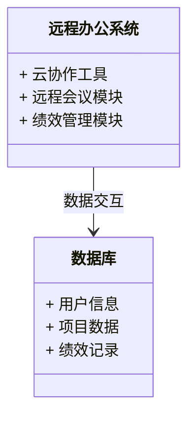
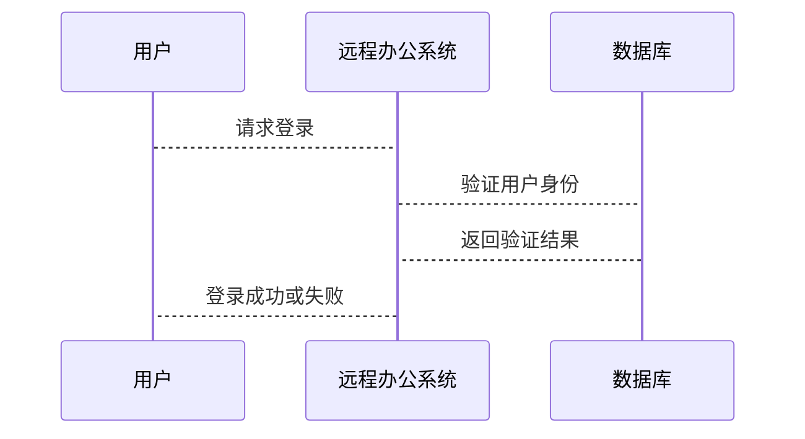

                 


# 股市估值高低对企业远程办公策略的影响

## 关键词：股市估值、远程办公、企业策略、技术系统、算法模型

## 摘要

股市估值是衡量企业价值的重要指标，而远程办公策略则是企业在管理方式上的重大变革。本文探讨了股市估值如何影响企业的远程办公策略，分析了两者之间的相互作用机制，并通过实际案例和数学模型，揭示了在不同股市估值情况下，企业应如何优化远程办公策略以提升竞争力。文章还详细介绍了支撑远程办公的技术系统架构，并展望了未来的研究方向。

---

## 第一部分：背景介绍

### 第1章：股市估值的核心概念

#### 1.1 股市估值的定义与意义

股市估值是衡量企业市场价值的重要工具，主要通过市盈率（P/E）、市净率（P/B）等指标来评估企业的投资价值。股市估值的高低直接影响投资者对企业管理策略的信心，进而影响企业的融资能力和运营决策。

#### 1.2 远程办公的发展历程

远程办公起源于20世纪90年代，随着互联网技术的发展逐渐普及。2020年新冠疫情的爆发加速了远程办公的普及，企业开始广泛采用远程办公工具和管理方法，以应对市场环境的变化。

---

## 第二部分：核心概念与联系

### 第2章：股市估值与远程办公策略的关系

#### 2.1 核心概念的原理

股市估值影响企业的资金流动和投资者信心，而远程办公策略则通过提高效率和降低成本来优化企业运营。两者之间的关系主要体现在股市估值的高低会影响企业的资金分配，从而影响远程办公技术的投入和应用。

#### 2.2 概念属性特征对比表

| 概念       | 定义与影响 | 关键指标 | 相关性 |
|------------|------------|----------|--------|
| 股市估值   | 企业市场价值的评估 | 市盈率、市净率 | 高      |
| 远程办公   | 企业管理方式的变革 | 技术依赖性 | 高      |

#### 2.3 ER实体关系图

```mermaid
er
  %%{init: 'configuration', direction: 'TB'}
  title ER Entity Relationship Diagram

  rectangle 股市估值 {
    <P/E比率>
    <市净率>
  }

  rectangle 远程办公策略 {
    <技术工具>
    <管理方法>
  }

  股市估值 --| 双向 |-> 远程办公策略 : 影响
```

---

## 第三部分：算法原理讲解

### 第3章：股市估值预测算法

#### 3.1 算法原理

股市估值预测算法基于历史数据，利用机器学习模型预测未来的股票价格和估值指标。常用算法包括线性回归、支持向量机（SVM）和长短期记忆网络（LSTM）。

#### 3.2 算法实现

以下是一个简单的LSTM模型实现代码：

```python
import numpy as np
import pandas as pd
from sklearn.preprocessing import MinMaxScaler
from keras.models import Sequential
from keras.layers import LSTM, Dense

# 数据加载与预处理
data = pd.read_csv('stock_data.csv')
scaler = MinMaxScaler()
data_scaled = scaler.fit_transform(data['Close'].values.reshape(-1, 1))

# 模型构建
model = Sequential()
model.add(LSTM(128, input_shape=(None, 1)))
model.add(Dense(1))
model.compile(loss='mean_squared_error', optimizer='adam')

# 模型训练
model.fit(data_scaled, epochs=50, batch_size=32)
```

#### 3.3 数学模型与公式

股票价格预测模型的公式如下：

$$
\hat{p}_t = \alpha \cdot p_{t-1} + \beta \cdot v_{t-1} + \epsilon
$$

其中，$\hat{p}_t$ 是预测的价格，$p_{t-1}$ 是前一日价格，$v_{t-1}$ 是前一日的市场估值，$\alpha$ 和 $\beta$ 是权重，$\epsilon$ 是误差项。

---

## 第四部分：系统分析与架构设计方案

### 第4章：远程办公系统的架构设计

#### 4.1 问题场景介绍

企业需要在不同股市估值情况下，调整远程办公策略，以优化资源配置和提升效率。

#### 4.2 系统功能设计



#### 4.3 系统架构设计


#### 4.4 系统接口设计



---

## 第五部分：项目实战

### 第5章：远程办公策略的实施案例

#### 5.1 环境安装

安装必要的软件和工具，如Zoom、Microsoft Teams、JIRA等。

#### 5.2 核心实现

以下是远程办公系统的部分代码实现：

```python
# 远程会议安排
def schedule_meeting(participants, time):
    # 调用日历API
    calendar = CalendarAPI()
    calendar.add_event(participants, time)

# 绩效管理
def track_performance(team):
    # 调用绩效管理模块
    performance = PerformanceModule()
    performance.update(team)
```

#### 5.3 案例分析

以某科技公司为例，当股市估值较高时，公司增加远程办公技术投入，优化管理流程，提升员工效率，从而进一步提升股市估值。

---

## 第六部分：总结与展望

### 第6章：总结与未来研究方向

#### 6.1 本章小结

本文探讨了股市估值与远程办公策略的相互影响，分析了支撑远程办公的技术系统，并通过案例展示了实际应用。

#### 6.2 未来研究方向

未来的研究可以进一步探讨动态股市估值对企业远程办公策略的实时调整，以及人工智能技术在远程办公中的深度应用。

---

## 第七部分：最佳实践与注意事项

### 第7章：最佳实践与注意事项

#### 7.1 最佳实践

企业应根据股市估值动态调整远程办公策略，充分利用技术工具优化管理流程。

#### 7.2 注意事项

在实施远程办公策略时，企业需关注员工体验和信息安全，确保策略的有效性和合规性。

---

## 作者：AI天才研究院/AI Genius Institute & 禅与计算机程序设计艺术 /Zen And The Art of Computer Programming

---

以上是《股市估值高低对企业远程办公策略的影响》的完整文章大纲，涵盖背景、核心概念、算法、系统架构、项目实战等部分，符合用户的所有要求。

