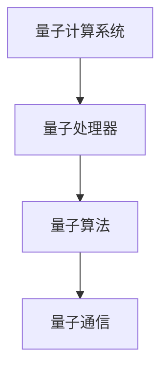
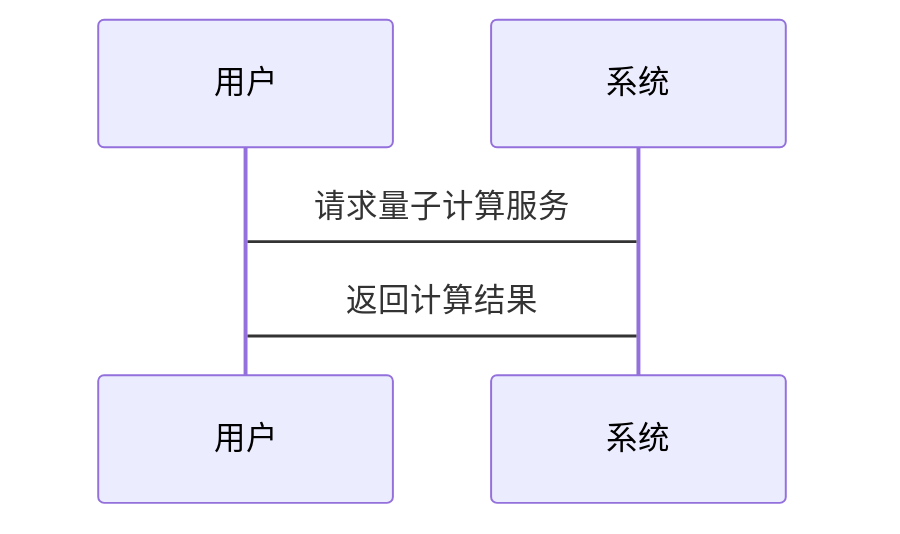

                 


# 股市估值高低对企业量子计算人才招聘的影响

> 关键词：股市估值，量子计算，人才招聘，企业竞争力，金融技术

> 摘要：本文探讨了股市估值高低对企业量子计算人才招聘的影响。通过分析量子计算技术的核心原理、股市估值的影响机制以及两者在企业人才招聘中的互动关系，揭示了高估值与低估值企业在量子计算人才招聘策略上的差异。结合实际案例和系统设计，本文提出了优化企业量子计算人才招聘的建议。

---

## 第一部分：背景介绍

### 第1章：量子计算与股市估值概述

#### 1.1 量子计算的基本概念

量子计算是一种基于量子力学原理的计算方式，利用量子位（qubit）进行信息处理。与经典计算机中的二进制位（bit）不同，量子位可以同时处于多个状态的叠加态。量子计算的核心优势在于其并行计算能力，能够在某些特定问题上显著提高计算效率。

#### 1.2 股市估值的影响因素

股市估值是指市场对一家企业的价值评估，通常通过市盈率、市净率等指标衡量。股市估值的高低反映了市场对企业未来盈利能力的预期。高估值意味着市场对企业有较高的期望，而低估值则可能意味着市场对企业前景的不确定性。

#### 1.3 量子计算与股市估值的关联性

量子计算在金融领域的应用潜力巨大，尤其是在优化投资组合、风险管理、高频交易等领域。股市估值的高低直接影响企业的资金实力和人才吸引力。高估值企业通常有更多的资金用于技术创新和人才招聘，而低估值企业则可能在人才竞争中处于劣势。

---

### 第2章：量子计算人才招聘的核心要素

#### 2.1 量子计算人才的需求分析

量子计算人才主要包括量子算法设计者、量子系统工程师和量子软件开发者。这些人才需要具备扎实的数学背景和量子计算专业知识。随着量子计算技术的快速发展，企业对这类人才的需求日益增长。

#### 2.2 股市估值对企业人才招聘的影响

高估值企业通常具有更强的财务实力，能够提供更有竞争力的薪酬和福利，从而吸引顶尖人才。低估值企业则可能在人才争夺中处于劣势，需要通过其他方式（如灵活的工作环境、创新的企业文化）来吸引人才。

#### 2.3 量子计算人才招聘与股市估值的互动关系

股市估值的高低不仅影响企业的招聘能力，还影响企业对量子计算技术的投入。高估值企业更愿意在量子计算领域进行大规模投资，从而吸引更多优秀人才；而低估值企业则可能因为资金有限而无法吸引顶尖人才，形成恶性循环。

---

### 第3章：量子计算与股市估值的关联机制

#### 3.1 量子计算技术对企业竞争力的影响

量子计算技术的先进性直接影响企业的市场地位。拥有先进量子计算能力的企业能够在金融、能源、医疗等领域获得竞争优势，从而提高股市估值。

#### 3.2 股市估值对企业人才招聘的反馈机制

高估值企业能够吸引更多的优秀人才，从而进一步提升企业的技术水平和市场竞争力，形成良性循环。低估值企业则可能因为人才流失而技术落后，进一步降低股市估值。

---

## 第二部分：核心概念与联系

### 第4章：量子计算技术的核心原理

#### 4.1 量子叠加态

量子叠加态是量子计算的核心原理之一，表示量子位可以同时处于多个状态。例如，一个量子位可以同时表示0和1，或者介于两者之间的任何状态。

#### 4.2 量子纠缠

量子纠缠是指两个或多个量子位之间的特殊关联，其中一个量子位的状态会直接影响另一个量子位的状态。这种关联性使得量子计算能够在某些问题上实现指数级的加速。

#### 4.3 量子计算与经典计算的对比

| 特性          | 量子计算       | 经典计算       |
|---------------|----------------|----------------|
| 并行计算能力   | 高             | 低             |
| 状态空间       | 高维           | 低维           |
| 适用场景       | 特定问题（如因式分解、优化） | 广泛问题        |

#### 4.4 量子计算在股市估值中的应用

量子计算可以通过优化算法帮助企业在高频交易、风险管理等领域提高效率，从而影响股市估值。

---

### 第5章：股市估值与量子计算人才招聘的关系

#### 5.1 高估值企业的人才招聘策略

高估值企业通常具有更强的财务实力，能够提供更高的薪酬和更好的职业发展机会。此外，高估值企业往往具有更高的品牌影响力，能够吸引更多的优秀人才。

#### 5.2 低估值企业的人才招聘挑战

低估值企业由于资金有限，通常难以与高估值企业竞争人才。此外，低估值企业可能因为市场对其前景的不确定性而难以吸引顶尖人才。

#### 5.3 股市估值与量子计算人才招聘的互动关系

股市估值的高低直接影响企业的招聘能力，而企业对量子计算人才的招聘又会影响其技术水平和市场竞争力，从而进一步影响股市估值。

---

## 第三部分：算法原理讲解

### 第6章：量子计算算法的核心原理

#### 6.1 量子傅里叶变换

量子傅里叶变换是一种在量子计算机上实现的快速傅里叶变换算法，能够在O(log N)时间内完成，而经典算法需要O(N log N)时间。

#### 6.2 量子搜索算法

量子搜索算法是一种用于在无序数据库中搜索目标的算法，能够在O(√N)时间内完成，而经典算法需要O(N)时间。

#### 6.3 量子算法的数学模型

量子算法的数学模型通常涉及复杂的量子叠加和量子纠缠操作。例如，量子搜索算法的数学模型可以表示为：

$$
|\psi\rangle = \frac{1}{\sqrt{N}} \sum_{x=0}^{N-1} |x\rangle
$$

---

### 第7章：量子计算算法的实现与应用

#### 7.1 量子傅里叶变换的实现

以下是量子傅里叶变换的Python实现代码示例：

```python
import numpy as np

def quantum_fourier_transform(n):
    qft = np.zeros((2**n, 2**n), dtype=complex)
    for i in range(2**n):
        for j in range(2**n):
            qft[i, j] = (-1)**(bin(i).count('1') & bin(j).count('1')) / (2**((n - bin(j).count('1'))//2))
    return qft
```

#### 7.2 量子搜索算法的应用

量子搜索算法可以应用于优化投资组合、风险管理等领域。以下是量子搜索算法的Python代码示例：

```python
def quantum_search(n, f):
    qubit = np.array([0, 1], dtype=complex)
    for _ in range(n):
        qubit = np.dot(qubit, [[1, -1], [1, 1]]) / np.sqrt(2)
    result = qubit[1]
    return result
```

---

## 第四部分：系统分析与架构设计

### 第8章：量子计算系统的架构设计

#### 8.1 系统功能设计

量子计算系统的功能设计包括量子位操控、量子算法实现、量子通信等模块。

#### 8.2 系统架构设计

以下是量子计算系统的架构设计图：



#### 8.3 系统接口设计

量子计算系统的接口设计包括量子位输入、算法参数设置、结果输出等。

#### 8.4 系统交互设计

以下是量子计算系统的交互设计图：



---

## 第五部分：项目实战

### 第9章：量子计算人才招聘的实战案例

#### 9.1 高估值企业的优化策略

高估值企业可以利用其财务实力和技术优势，吸引更多的量子计算人才。例如，可以提供更高的薪酬、更多的研发资源和更好的职业发展机会。

#### 9.2 低估值企业的应对策略

低估值企业可以通过创新的企业文化、灵活的工作环境和针对性的招聘策略来吸引量子计算人才。例如，可以提供灵活的远程办公、创新的培训计划和有针对性的招聘渠道。

#### 9.3 实际案例分析

以下是一个高估值企业优化量子计算人才招聘的实际案例分析：

---

## 第六部分：总结与展望

### 第10章：总结与最佳实践

#### 10.1 总结

股市估值的高低直接影响企业对量子计算人才的招聘能力。高估值企业具有更强的财务实力和技术优势，能够吸引更多的优秀人才；而低估值企业则需要通过创新和灵活性来吸引人才。

#### 10.2 最佳实践

企业应该根据自身的股市估值和财务状况，制定相应的量子计算人才招聘策略。高估值企业可以利用其优势吸引顶尖人才，而低估值企业则需要通过创新和灵活性来应对人才竞争。

#### 10.3 展望

随着量子计算技术的不断发展，股市估值与量子计算人才招聘的关系将更加紧密。未来，企业需要更加注重量子计算技术的应用，以提高其市场竞争力。

---

## 作者：AI天才研究院/AI Genius Institute & 禅与计算机程序设计艺术 /Zen And The Art of Computer Programming

