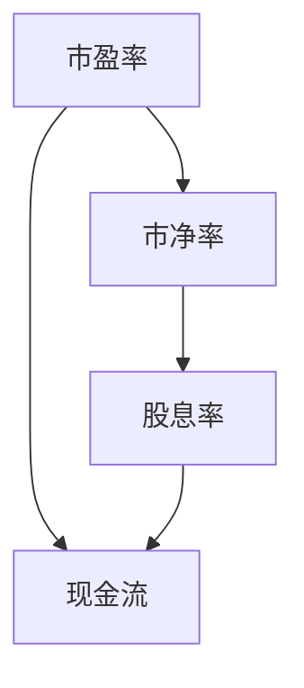
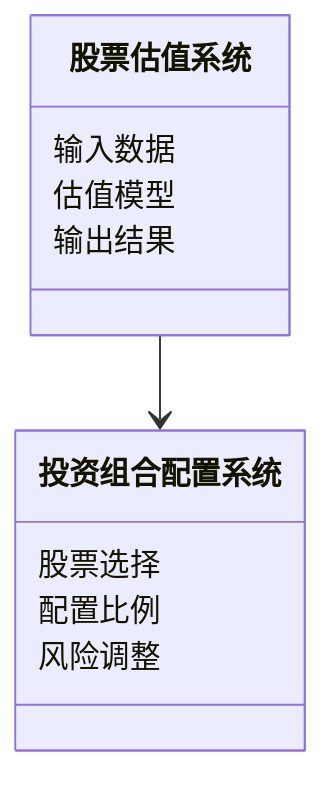
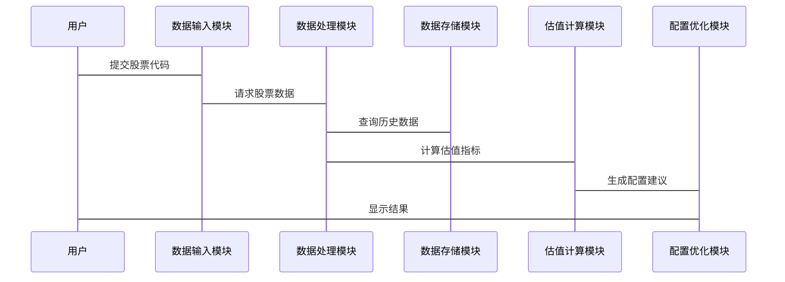

                 


# 股市估值高低对国际投资组合配置的影响

> 关键词：股市估值，投资组合配置，市盈率，市净率，现金流贴现模型，投资策略

> 摘要：本文系统地探讨了股市估值高低对国际投资组合配置的影响，从核心概念、数学模型、系统分析到实际案例，全面解析如何根据股市估值调整投资策略，实现优化配置。

---

## 第一章: 股市估值与投资组合配置的背景

### 1.1 股市估值的基本概念

#### 1.1.1 股票估值的定义与意义

股票估值是确定股票内在价值的过程，帮助投资者判断其市场价格是否合理。通过分析财务数据和市场环境，评估公司未来盈利能力，从而决定是否投资。

#### 1.1.2 投资组合配置的基本原理

投资组合配置是根据风险承受能力、投资目标和市场预期，将资金分配到不同资产或股票，以分散风险并最大化收益。

#### 1.1.3 股市估值对投资组合配置的影响

股市估值高低直接影响投资决策，高估时可能减少配置，低估时增加配置，以优化组合的收益与风险。

### 1.2 股市估值的核心指标

#### 1.2.1 市盈率（P/E）

市盈率=股价/每股收益，衡量股票价格相对于盈利水平的高低，反映市场对公司的预期。

#### 1.2.2 市净率（P/B）

市净率=股价/每股净资产，适用于净资产驱动的行业，如银行和地产。

#### 1.2.3 股息率

股息率=每股股息/股价，衡量分红回报，常用于价值投资。

### 1.3 股市估值的影响因素

#### 1.3.1 宏观经济因素

利率、通胀、GDP增长等影响市场整体估值。

#### 1.3.2 行业特性

行业周期和竞争结构影响估值方法的选择。

#### 1.3.3 公司基本面

收入、利润、负债等财务指标影响股票的内在价值。

### 1.4 本章小结

本章介绍了股市估值的基本概念和核心指标，并分析了影响估值的主要因素，为后续分析奠定了基础。

---

## 第二章: 股市估值的核心理论与模型

### 2.1 股票估值的理论基础

#### 2.1.1 股票的内在价值

内在价值是基于公司未来现金流的现值，需考虑时间价值和风险。

#### 2.1.2 股票的市场价值

市场价值受供求关系和投资者情绪影响，可能偏离内在价值。

### 2.2 股票估值的主要模型

#### 2.2.1 现金流贴现模型（DCF）

DCF模型通过预测未来现金流并贴现计算现值，分为股利折现模型和企业价值模型。

#### 2.2.2 市盈率模型

基于合理的市盈率倍数，评估股票的公允价值。

#### 2.2.3 市净率模型

适用于净资产驱动的行业，考虑账面价值的合理性。

### 2.3 股票估值指标的对比分析

#### 2.3.1 不同估值指标的适用场景

| 指标 | 适用场景 | 优点 | 缺点 |
|------|----------|------|------|
| P/E  | 盈利稳定的公司 | 简单直观 | 易受利润 manipulation影响 |
| P/B  | 净资产高的行业 | 稳定性好 | 忽略收益能力 |
| 股息率 | 现金充裕的公司 | 稳定回报 | 未考虑成长性 |

#### 2.3.2 估值指标的优缺点对比

使用Mermaid图展示指标之间的关系：



### 2.4 本章小结

本章详细讲解了股票估值的核心理论和主要模型，分析了不同指标的优缺点及应用场景。

---

## 第三章: 股票估值的数学模型与算法原理

### 3.1 现金流贴现模型（DCF）

#### 3.1.1 DCF模型概述

DCF通过预测未来现金流，计算其现值，评估股票的内在价值。公式为：

$$ V = \sum_{t=1}^{n} \frac{CF_t}{(1+r)^t} + \frac{TV}{(1+r)^n} $$

其中，CF_t是第t年的现金流，r是折现率，TV是终值。

#### 3.1.2 DCF模型的实现步骤

1. 预测未来现金流。
2. 估计合适的折现率。
3. 计算未来现金流的现值。
4. 计算终值的现值。
5. 总和即为股票的内在价值。

#### 3.1.3 Python代码实现DCF模型

```python
def calculate_intrinsic_value(free_cash_flows, discount_rate, terminal_value):
    present_value = 0
    for year in range(1, len(free_cash_flows)+1):
        present_value += free_cash_flows[year-1]/(1+discount_rate)**year
    present_value += terminal_value/(1+discount_rate)**len(free_cash_flows)
    return present_value

# 示例数据
free_cash_flows = [100, 120, 150]
discount_rate = 0.08
terminal_value = 2000

intrinsic_value = calculate_intrinsic_value(free_cash_flows, discount_rate, terminal_value)
print(f"股票的内在价值为：{intrinsic_value}")
```

### 3.2 市盈率模型

#### 3.2.1 市盈率模型公式

$$ \text{目标股价} = \text{合理市盈率} \times \text{每股收益} $$

#### 3.2.2 市盈率模型的优缺点

优点：简单易懂，适用于盈利稳定的公司。缺点：受会计政策影响，可能高估或低估。

### 3.3 本章小结

本章详细讲解了DCF和市盈率模型的数学原理，并通过代码示例展示了如何应用这些模型进行股票估值。

---

## 第四章: 股票估值与投资组合配置的系统分析

### 4.1 系统功能设计

使用Mermaid绘制领域模型类图：



### 4.2 系统架构设计

使用Mermaid绘制系统架构图：


### 4.3 系统交互设计

使用Mermaid绘制交互序列图：



### 4.4 本章小结

本章通过系统架构和交互设计，展示了如何将股票估值与投资组合配置结合起来，实现自动化和优化配置。

---

## 第五章: 股票估值与投资组合配置的项目实战

### 5.1 环境配置

安装Python和相关库，如Pandas、NumPy、Matplotlib。

### 5.2 核心代码实现

#### 5.2.1 股票估值代码

```python
import pandas as pd

def calculate_pe_ratio(df):
    df['PE'] = df['股价'] / df['每股收益']
    return df

# 示例数据
data = {'股价': [100, 120, 150], '每股收益': [10, 12, 15}
df = pd.DataFrame(data)
pe_df = calculate_pe_ratio(df)
print(pe_df)
```

#### 5.2.2 投资组合配置代码

```python
def portfolio_allocation(assets, weights):
    total = sum(weights)
    return {asset: weight/total for asset, weight in zip(assets, weights)}

assets = ['股票', '债券', '现金']
weights = [0.6, 0.3, 0.1]
allocation = portfolio_allocation(assets, weights)
print(allocation)
```

### 5.3 案例分析

以苹果公司为例，分析其市盈率和市净率，计算DCF模型的内在价值，指导投资组合配置。

### 5.4 本章小结

本章通过实际案例展示了如何应用股票估值模型进行投资组合配置，并提供代码实现和结果分析。

---

## 第六章: 最佳实践与小结

### 6.1 最佳实践

1. 定期监控市场估值变化，及时调整配置。
2. 结合宏观经济和行业趋势，优化投资策略。
3. 采用多元化配置，分散风险。

### 6.2 小结

本文全面分析了股市估值对投资组合配置的影响，通过理论、模型和实际案例，展示了如何根据估值高低优化配置，实现长期收益目标。

---

## 附录: 数学公式汇总

1. DCF模型公式：
$$ V = \sum_{t=1}^{n} \frac{CF_t}{(1+r)^t} + \frac{TV}{(1+r)^n} $$

2. 市盈率公式：
$$ \text{目标股价} = \text{合理市盈率} \times \text{每股收益} $$

3. 现金流贴现公式：
$$ FV = PV \times (1 + r)^n $$

作者：AI天才研究院 & 禅与计算机程序设计艺术

