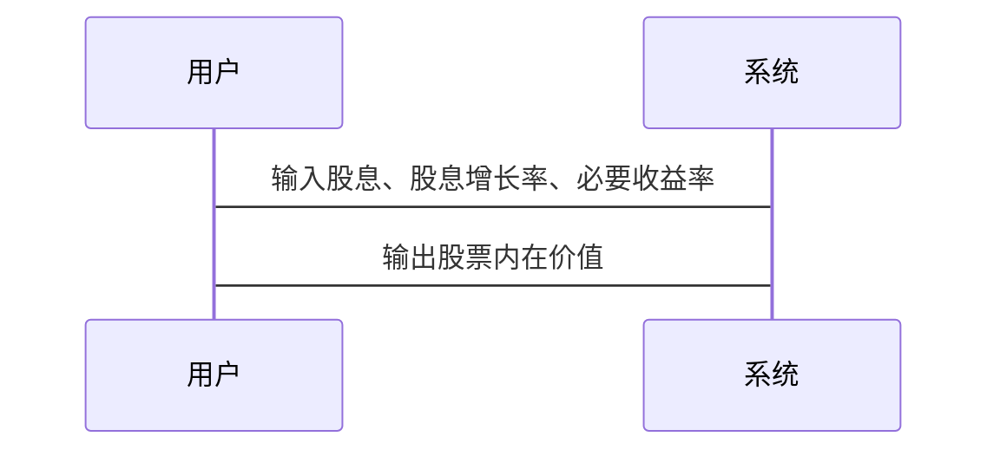

                 


---

# 股息贴现模型：基于未来现金流的股票估值

**关键词**：股息贴现模型、股票估值、未来现金流、股息增长模型、内在价值

**摘要**：  
股息贴现模型（Dividend Discount Model, DDM）是一种经典的股票估值方法，通过将未来股息的现值加总来计算股票的内在价值。本文将从股息贴现模型的基本概念出发，逐步分析其理论基础、应用场景、计算步骤，并结合实际案例进行深入探讨。同时，我们将讨论股息贴现模型的局限性，并提出改进建议。通过本文的学习，读者将能够掌握股息贴现模型的核心原理，并能够在实际投资中灵活运用。

---

## 第一部分：股息贴现模型概述

### 第1章：股息贴现模型的基本概念

#### 1.1 股息贴现模型的定义与背景

股息贴现模型（Dividend Discount Model, DDM）是一种用于估计股票内在价值的方法，其核心思想是将公司未来派发的股息折现，以确定股票的合理价格。DDM基于现金流贴现的原理，假设股票的价值等于未来股息的现值之和。

#### 1.2 股息贴现模型的核心假设

1. 股票的价值仅取决于未来股息的现值。
2. 股息增长率是恒定的或可预测的。
3. 投资者要求的必要收益率是已知且稳定的。

#### 1.3 股息贴现模型与其他股票估值方法的对比

| 估值方法 | 理论基础 | 数据需求 | 适用场景 |
|----------|----------|----------|----------|
| 市盈率法 | 利润与市价的关系 | 净利润 | 盈利稳定的公司 |
| 市净率法 | 资产与市价的关系 | 净资产 | 资产密集型行业 |
| 现金流贴现模型 | 未来现金流的现值 | 自由现金流 | 高成长性公司 |
| 股息贴现模型 | 未来股息的现值 | 股息 | 稳定分红的公司 |

---

## 第二部分：股息贴现模型的理论基础

### 第2章：股息增长模型

#### 2.1 零增长模型

零增长模型假设股息永远以固定的速度增长，适用于股息增长率恒定的公司。其公式为：
$$ V = \frac{D}{r - g} $$
其中，\( D \) 为股息，\( r \) 为必要收益率，\( g \) 为股息增长率。

#### 2.2 恒定增长模型

恒定增长模型（Gordon Growth Model）是零增长模型的扩展，假设股息以恒定速率增长。其公式为：
$$ P = \frac{D_1}{r - g} $$
其中，\( D_1 \) 是第一期的股息，\( r \) 是必要收益率，\( g \) 是股息增长率。

#### 2.3 多元增长模型

多元增长模型适用于股息增长率变化的公司。其公式为：
$$ P = \sum_{t=1}^{n} \frac{D_t}{(1+r)^t} + \frac{P_n}{(1+r)^n} $$
其中，\( D_t \) 是第 \( t \) 期的股息，\( P_n \) 是第 \( n \) 期的股票价值。

---

### 第3章：股息贴现模型的应用实践

#### 3.1 股息贴现模型的参数估计

股息贴现模型的准确性依赖于参数的合理估计，包括股息增长率、必要收益率和股息增长率。

##### 3.1.1 股息增长率的估计方法

1. **历史增长率法**：基于公司过去几年的股息增长率。
2. **股息增长模型法**：通过股息增长模型推导出合理的增长率。
3. **行业平均增长率法**：参考同行业公司的股息增长率。

##### 3.1.2 必要收益率的确定

必要收益率通常由无风险收益率和市场风险溢价之和确定：
$$ r = r_f + \beta \cdot (r_m - r_f) $$
其中，\( r_f \) 是无风险收益率，\( \beta \) 是贝塔系数，\( r_m \) 是市场收益率。

#### 3.2 股息贴现模型的计算步骤

1. **确定股息增长率**：根据公司历史数据或行业平均水平。
2. **估计必要收益率**：考虑无风险收益率和市场风险溢价。
3. **计算内在价值**：使用股息贴现模型公式计算股票的内在价值。
4. **比较市场价与内在价值**：如果市场价低于内在价值，可能被低估。

#### 3.3 实际案例分析

以某公司为例，假设股息为 $2，必要收益率为10%，股息增长率恒定为5%。根据恒定增长模型，股票的内在价值为：
$$ P = \frac{2}{0.10 - 0.05} = 40 $$

---

## 第三部分：系统分析与架构设计

### 第4章：系统分析与架构设计方案

#### 4.1 问题场景介绍

投资者需要快速、准确地计算股票的内在价值，以辅助投资决策。

#### 4.2 系统功能设计

- 输入股息、股息增长率、必要收益率。
- 计算股票的内在价值。
- 输出结果并进行市场价与内在价值的对比。

#### 4.3 系统架构设计


#### 4.4 系统接口设计

- 输入接口：股息、股息增长率、必要收益率。
- 输出接口：内在价值、市场价对比结果。

#### 4.5 系统交互设计



---

## 第四部分：项目实战

### 第5章：项目实战

#### 5.1 环境安装

安装Python和必要的库（如numpy、pandas）。

#### 5.2 核心代码实现

```python
def dividend_discount_model(dividend, growth_rate, required_return):
    return dividend / (required_return - growth_rate)

# 示例
dividend = 2
growth_rate = 0.05
required_return = 0.10
intrinsic_value = dividend_discount_model(dividend, growth_rate, required_return)
print(f"股票的内在价值为：{intrinsic_value}")
```

#### 5.3 案例分析

假设某股票市场价为35元，计算其内在价值是否被低估：
$$ P = \frac{2}{0.10 - 0.05} = 40 $$

由于市场价35 < 内在价值40，该股票可能被低估。

---

## 第五部分：最佳实践与总结

### 第6章：最佳实践与总结

#### 6.1 最佳实践

- 确保参数估计的准确性。
- 考虑股息增长的非恒定性。
- 结合其他估值方法进行综合判断。

#### 6.2 小结

股息贴现模型是一种简单而有效的股票估值方法，尤其适用于股息稳定的公司。然而，其假设条件的严格性可能导致估值误差，因此在实际应用中需要结合其他方法进行验证。

---

## 附录

### 附录A：股息贴现模型的数学推导

详细推导股息贴现模型的公式，包括零增长模型、恒定增长模型和多元增长模型的数学推导。

### 附录B：常用股息增长率估计方法

列出并详细说明几种常用的股息增长率估计方法，如历史增长率法、行业平均增长率法等。

### 附录C：股息贴现模型的优缺点

总结股息贴现模型的优点和局限性，帮助读者更好地理解和应用该模型。

---

**作者**：AI天才研究院/AI Genius Institute & 禅与计算机程序设计艺术 /Zen And The Art of Computer Programming

