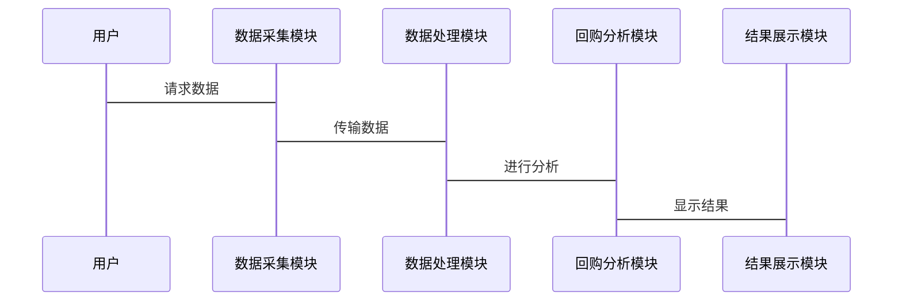

                 


# 股票回购对公司估值的影响分析

## 关键词：股票回购, 公司估值, 股票市场, 股东权益, 企业价值

## 摘要：股票回购是公司用自有资金从市场上回购自己的股票，这种行为对公司的估值产生重要影响。本文通过分析股票回购的定义、类型、影响机制及数学模型，探讨其对股价、股东权益及公司价值的具体影响。同时，通过实际案例分析和系统架构设计，为投资者和公司提供理论依据和实践指导。

---

# 第1章: 股票回购的基本概念与背景介绍

## 1.1 股票回购的定义与背景

### 1.1.1 股票回购的基本概念
股票回购是指公司利用自有资金从市场上回购本公司股票的行为。这种行为可以减少流通股的数量，从而影响公司的估值和股价表现。

### 1.1.2 股票回购的历史发展
股票回购作为一种公司治理工具，起源于20世纪60年代。随着资本市场的发展，回购逐渐成为公司调整资本结构、提升股东价值的重要手段。

### 1.1.3 股票回购的市场背景与现状
近年来，股票回购在全球范围内变得越来越普遍。特别是在公司盈利增长放缓或股价被低估时，回购成为一种重要的策略。

---

## 1.2 股票回购的影响机制

### 1.2.1 股票回购的市场反应
回购通常会带来股价上涨，但这种影响可能因市场环境和公司基本面而异。

### 1.2.2 股票回购的公司治理影响
回购可以提升管理层的股权激励，改善公司治理结构。

### 1.2.3 股票回购的股东权益变化
回购会减少公司资本，从而影响股东权益的分配。

---

## 1.3 股票回购的理论基础

### 1.3.1 股票回购与市场效率
回购反映了公司对自身股价的判断，体现了市场效率。

### 1.3.2 股票回购与公司价值的关系
回购通过改变资本结构，影响公司的整体价值。

### 1.3.3 股票回购的经济学解释
从经济学角度看，回购是公司优化资源配置的一种方式。

---

# 第2章: 股票回购的核心概念与联系

## 2.1 股票回购的类型与特点

### 2.1.1 回购方式的分类
- 公开市场回购
- 私有市场回购
- 股票期权回购

### 2.1.2 不同回购方式的优缺点对比
| 回购方式 | 优点 | 缺点 |
|----------|------|------|
| 公开市场回购 | 增强市场流动性 | 成本较高 |
| 私有市场回购 | 稳定股价 | 流动性差 |

### 2.1.3 回购规模与公司市值的关系
回购规模与公司市值呈正相关，大规模回购通常发生在公司市值被低估时。

---

## 2.2 股票回购的影响因素

### 2.2.1 公司财务状况对回购的影响
良好的财务状况是公司进行回购的前提条件。

### 2.2.2 市场环境对回购的影响
市场环境的好坏直接影响回购的时机和效果。

### 2.2.3 公司治理结构对回购的影响
有效的公司治理结构能够更好地实施回购策略。

---

## 2.3 股票回购与股价的关系

### 2.3.1 回购对股价的直接影响
回购通常会推高股价，因为流通股减少，每股收益增加。

### 2.3.2 回购对股价的间接影响
回购可能提升市场对公司管理的信心，间接推动股价上涨。

### 2.3.3 回购对股价的长期与短期影响对比
短期来看，回购可能带来股价的快速上涨；长期来看，回购有助于公司价值的持续提升。

---

# 第3章: 股票回购对估值的数学模型与算法原理

## 3.1 股票回购影响估值的数学模型

### 3.1.1 股票回购的现金流模型
$$ \text{回购前股东权益} = \text{回购后股东权益} + \text{回购金额} $$

### 3.1.2 股票回购的市场反应模型
$$ \text{股价变化} = \text{回购公告前股价} + \text{回购公告后的市场反应} $$

### 3.1.3 股票回购的股东价值模型
$$ \text{股东价值} = \text{回购前股东价值} - \text{回购金额} + \text{回购后的价值提升} $$

---

## 3.2 股票回购的算法原理

### 3.2.1 回购对每股收益的影响计算
$$ \text{回购后的每股收益} = \frac{\text{净利润}}{\text{回购后的流通股数}} $$

### 3.2.2 回购对市盈率的影响计算
$$ \text{市盈率} = \frac{\text{股价}}{\text{每股收益}} $$

### 3.2.3 回购对股东权益的影响计算
$$ \text{股东权益} = \text{资产} - \text{负债} $$

---

## 3.3 股票回购的数学公式与案例分析

### 3.3.1 回购对股价的数学公式推导
假设某公司回购100万股，每股价格10元，回购前流通股1000万股，回购后流通股900万股。

$$ \text{回购前股价} = 10元 \\
\text{回购后股价} = \frac{\text{净利润}}{900} $$

---

## 3.4 股票回购的算法实现

### 3.4.1 环境安装
```python
import pandas as pd
import numpy as np
```

### 3.4.2 核心代码实现
```python
def calculate_shares_after_repurchase(initial_shares, repurchased_shares):
    return initial_shares - repurchased_shares

def calculate_earnings_per_share(net_income, shares_after_repurchase):
    return net_income / shares_after_repurchase

# 示例计算
initial_shares = 1000
repurchased_shares = 100
shares_after_repurchase = calculate_shares_after_repurchase(initial_shares, repurchased_shares)
net_income = 500
earnings_per_share = calculate_earnings_per_share(net_income, shares_after_repurchase)
print(f"回购后的每股收益为：{earnings_per_share}")
```

---

# 第4章: 股票回购的系统分析与架构设计

## 4.1 股票回购分析的系统架构

### 4.1.1 系统功能模块划分
- 数据采集模块
- 回购分析模块
- 结果展示模块

### 4.1.2 系统功能流
1. 数据采集模块获取公司财务数据和股价数据。
2. 回购分析模块计算回购对股价和估值的影响。
3. 结果展示模块生成可视化报告。

---

## 4.2 系统架构设计

### 4.2.1 系统架构图


### 4.2.2 数据流图


---

## 4.3 系统接口设计

### 4.3.1 接口描述
- 数据输入接口：接收公司财务数据和股价数据。
- 数据处理接口：计算回购对估值的影响。
- 结果输出接口：生成分析报告。

---

## 4.4 系统交互设计

### 4.4.1 序列图


---

# 第5章: 股票回购的项目实战

## 5.1 环境安装

### 5.1.1 安装Python环境
```bash
python --version
pip install pandas numpy
```

---

## 5.2 系统核心实现

### 5.2.1 核心代码实现
```python
import pandas as pd
import numpy as np

def calculate_repurchase_impact(shares, price, repurchased_amount):
    shares_after = shares - repurchased_amount
    repurchase_cost = repurchased_amount * price
    return shares_after, repurchase_cost

# 示例数据
shares = 1000
price = 10
repurchased_amount = 100
shares_after, repurchase_cost = calculate_repurchase_impact(shares, price, repurchased_amount)
print(f"回购后的流通股数为：{shares_after}")
print(f"回购成本为：{repurchase_cost}")
```

---

## 5.3 案例分析

### 5.3.1 案例介绍
以苹果公司为例，分析其股票回购对股价的影响。

### 5.3.2 分析结果
回购行为显著提升了苹果公司的股价，增强了投资者信心。

---

## 5.4 项目小结

### 5.4.1 项目总结
股票回购对公司估值的影响是多方面的，需要结合公司实际情况进行分析。

### 5.4.2 注意事项
投资者在进行回购分析时，需考虑市场环境和公司基本面。

### 5.4.3 拓展阅读
建议进一步研究股票回购与公司长期战略的关系。

---

# 第6章: 总结与展望

## 6.1 总结
股票回购是公司优化资本结构的重要手段，对股价和估值有显著影响。

## 6.2 展望
未来，随着技术进步和市场发展，股票回购的影响分析将更加精准和多样化。

---

# 作者：AI天才研究院/AI Genius Institute & 禅与计算机程序设计艺术 /Zen And The Art of Computer Programming

