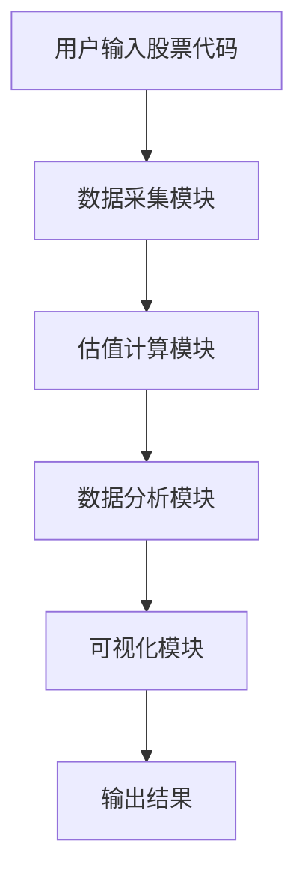
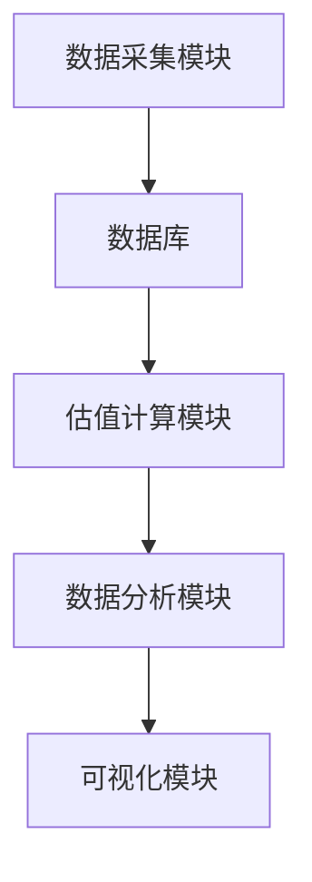
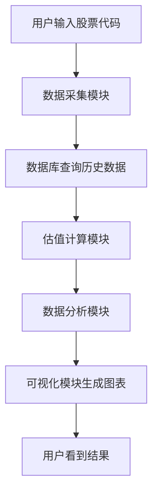

                 


# 股票市场估值：历史高点与当前水平的比较

## 关键词：股票估值、市场分析、历史高点、当前水平、投资策略、市盈率、市净率

## 摘要：
股票市场估值是投资者在决策过程中至关重要的一环。本文从基础概念入手，详细分析了股票估值的核心模型，包括市盈率、市净率和股息率等。通过数学模型和算法原理的推导，结合系统架构设计和项目实战案例，探讨了如何在实际投资中应用这些模型。最后，通过比较历史高点与当前市场估值水平，为投资者提供了实用的策略建议。

---

# 第一部分：股票市场估值基础

## 第1章：股票估值的背景与概念

### 1.1 股票估值的基本概念

#### 1.1.1 股票估值的定义
股票估值是指通过对公司财务数据和市场环境的分析，估算其股票的内在价值或市场价格水平。它是投资者评估股票是否被高估或低估的重要手段。

#### 1.1.2 估值在投资中的重要性
- 估值帮助投资者确定买入或卖出的时机。
- 估值是制定投资策略的基础。
- 估值有助于识别市场风险和机会。

#### 1.1.3 市场估值的核心要素
- 公司财务状况：收入、利润、资产负债等。
- 行业环境：行业发展趋势、竞争状况。
- 宏观经济环境：GDP增长率、利率、通货膨胀等。
- 市场情绪：投资者情绪和市场流动性。

### 1.2 历史高点与当前水平的比较意义

#### 1.2.1 历史高点的定义与作用
- 历史高点是指过去某一时期市场估值的峰值。
- 通过比较历史高点与当前水平，可以判断市场是否处于高估或低估状态。
- 历史高点为投资者提供了参考基准，帮助制定投资策略。

#### 1.2.2 当前市场估值的衡量标准
- 市盈率（P/E）：股价与每股收益的比率。
- 市净率（P/B）：股价与每股净资产的比率。
- 股息率：股息与股价的比率。

#### 1.2.3 比较的意义与应用场景
- 判断市场整体走势。
- 评估个股的投资价值。
- 制定投资组合策略。

### 1.3 本章小结
本章介绍了股票估值的基本概念和历史高点与当前水平比较的重要性，为后续分析奠定了基础。

---

## 第2章：常用股票估值模型

### 2.1 市盈率（P/E）模型

#### 2.1.1 市盈率的定义与计算公式
市盈率 = 股价 / 每股净利润（EPS）

#### 2.1.2 市盈率的应用场景
- 适用于盈利稳定的公司。
- 用于比较不同公司的估值水平。

#### 2.1.3 市盈率的优缺点分析
- 优点：简单易用，反映市场对收益的预期。
- 缺点：不适用于亏损公司，受行业和经济周期影响较大。

### 2.2 市净率（P/B）模型

#### 2.2.1 市净率的定义与计算公式
市净率 = 股价 / 每股净资产（BPS）

#### 2.2.2 市净率的应用场景
- 适用于金融、地产等行业。
- 用于评估资产重的公司价值。

#### 2.2.3 市净率的优缺点分析
- 优点：反映资产价值，适合资产驱动型公司。
- 缺点：不适用于轻资产公司，受行业和经济周期影响较大。

### 2.3 股息率模型

#### 2.3.1 股息率的定义与计算公式
股息率 = 每股股息 / 股价

#### 2.3.2 股息率的应用场景
- 适用于成熟行业和红利股。
- 用于评估投资回报率。

#### 2.3.3 股息率的优缺点分析
- 优点：简单直观，反映分红能力。
- 缺点：受股息政策影响，不适用于高增长公司。

### 2.4 内在价值模型

#### 2.4.1 内在价值的定义与计算公式
内在价值 = 股票的未来现金流的现值

#### 2.4.2 内在价值的应用场景
- 适用于长期投资者。
- 用于评估股票的合理价格区间。

#### 2.4.3 内在价值的优缺点分析
- 优点：考虑了公司未来盈利能力。
- 缺点：计算复杂，依赖对未来现金流的预测。

### 2.5 本章小结
本章详细介绍了几种常用的股票估值模型，包括市盈率、市净率、股息率和内在价值模型，分析了它们的优缺点及应用场景。

---

## 第3章：估值模型的数学推导

### 3.1 市盈率模型的数学分析

#### 3.1.1 市盈率公式推导
市盈率 = 股价 / 每股净利润

#### 3.1.2 市盈率与股票价格的关系
- 市盈率越高，股价相对于每股净利润越高。
- 市盈率越低，股价相对于每股净利润越低。

#### 3.1.3 市盈率的计算示例
假设某公司每股净利润为2元，股价为20元，则市盈率为10倍。

### 3.2 市净率模型的数学分析

#### 3.2.1 市净率公式推导
市净率 = 股价 / 每股净资产

#### 3.2.2 市净率与股票价格的关系
- 市净率越高，股价相对于每股净资产越高。
- 市净率越低，股价相对于每股净资产越低。

#### 3.2.3 市净率的计算示例
假设某公司每股净资产为5元，股价为15元，则市净率为3倍。

### 3.3 内在价值模型的数学分析

#### 3.3.1 内在价值公式推导
内在价值 = ∑(CF_t / (1 + r)^t)
其中，CF_t为第t年的现金流，r为折现率。

#### 3.3.2 内在价值的计算示例
假设某公司未来5年的现金流分别为100、120、140、160、180万元，折现率为10%。

计算各年的现值：
- 第1年：100 / 1.1 = 90.91
- 第2年：120 / 1.21 = 99.17
- 第3年：140 / 1.331 = 105.23
- 第4年：160 / 1.4641 = 109.29
- 第5年：180 / 1.6105 = 111.77

内在价值 = 90.91 + 99.17 + 105.23 + 109.29 + 111.77 ≈ 516.37万元

---

## 第4章：股票估值系统架构设计

### 4.1 问题场景介绍
投资者需要一个系统来实时计算股票的估值指标，并与历史高点进行比较。

### 4.2 系统功能设计

#### 4.2.1 系统功能模块
- 数据采集模块：获取股票的历史数据和当前数据。
- 估值计算模块：计算市盈率、市净率等指标。
- 数据分析模块：比较当前估值与历史高点。
- 可视化模块：生成图表展示结果。

#### 4.2.2 系统功能流程图


### 4.3 系统架构设计

#### 4.3.1 系统架构图


#### 4.3.2 系统接口设计
- 数据接口：与数据源（如Yahoo Finance）对接。
- 用户接口：提供输入股票代码和显示结果的界面。

#### 4.3.3 系统交互流程图


### 4.4 本章小结
本章通过系统架构设计，展示了如何构建一个股票估值系统，帮助投资者进行实时分析。

---

## 第5章：项目实战

### 5.1 环境安装与配置

#### 5.1.1 安装Python和必要的库
- Python 3.8+
- Pandas、NumPy、Matplotlib、Scikit-learn

#### 5.1.2 数据源获取
- 使用Yahoo Finance API获取股票数据。

### 5.2 系统核心实现源代码

#### 5.2.1 数据采集模块
```python
import pandas as pd
import yfinance as yf

def get_stock_data(ticker):
    data = yf.download(ticker, start='2020-01-01', end='2023-12-31')
    return data
```

#### 5.2.2 估值计算模块
```python
def calculate_valuation_measures(data):
    data['PE'] = data['Close'] / data['EPS']
    data['PB'] = data['Close'] / data['Book Value per Share']
    data['Dividend Yield'] = data['Dividends'] / data['Close']
    return data
```

#### 5.2.3 数据分析模块
```python
def compare_with_historical_highs(data):
    historical_highs = data['PE'].max() * 0.95
    current_pe = data['PE'].iloc[-1]
    if current_pe > historical_highs:
        return '高估'
    elif current_pe < historical_highs:
        return '低估'
    else:
        return '合理'
```

#### 5.2.4 可视化模块
```python
import matplotlib.pyplot as plt

def visualize_valuation(data, result):
    plt.figure(figsize=(10, 6))
    plt.plot(data.index, data['PE'], label='PE Ratio')
    plt.axhline(y=data['PE'].mean(), color='red', linestyle='--', label='Average PE')
    plt.title(f'PE Ratio Analysis - {result}')
    plt.legend()
    plt.show()
```

### 5.3 案例分析与详细解读

#### 5.3.1 案例选择
选择苹果公司（AAPL）作为案例。

#### 5.3.2 数据获取与处理
```python
data = get_stock_data('AAPL')
data = calculate_valuation_measures(data)
```

#### 5.3.3 数据分析与可视化
```python
result = compare_with_historical_highs(data)
visualize_valuation(data, result)
```

#### 5.3.4 结果解读
根据PE比率分析，当前苹果公司的PE比率高于历史高点的95%，因此判断为高估。

### 5.4 本章小结
本章通过实战案例，展示了如何利用Python代码实现股票估值系统，并对实际数据进行了分析和可视化。

---

## 第6章：最佳实践

### 6.1 小结
- 理解股票估值的基本概念和模型。
- 熟练掌握市盈率、市净率等指标的计算方法。
- 灵活应用系统架构设计和代码实现。

### 6.2 注意事项
- 不要单一依赖某一种估值模型。
- 考虑宏观经济和行业环境的影响。
- 结合技术分析和基本面分析进行综合判断。

### 6.3 拓展阅读
- 《股票估值的艺术》
- 《投资学》
- 《量化投资入门》

---

## 作者：AI天才研究院 & 禅与计算机程序设计艺术

---

通过本文的系统分析和实战指导，读者可以全面掌握股票市场估值的核心方法和实际应用，为投资决策提供有力支持。

