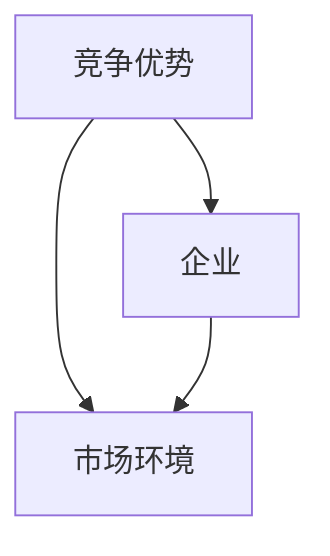
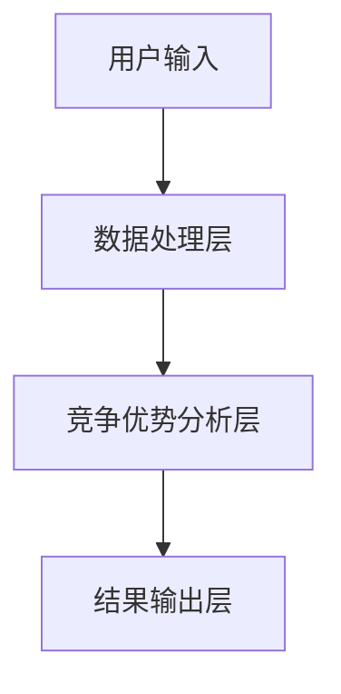
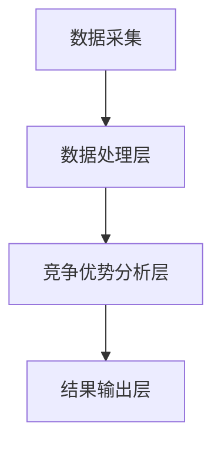

                 


# 肯尼斯费雪的竞争优势分析

## 关键词：竞争优势分析，投资策略，肯尼斯费雪，企业价值评估，市场地位，财务指标分析

## 摘要：本文深入分析了肯尼斯·费雪的竞争优势分析方法，探讨其在投资决策中的应用。通过理论、算法、系统设计和实战案例，详细解析了竞争优势分析的核心概念、数学模型和实际操作步骤，为投资者提供了科学的分析框架和实践指南。

---

# 第一部分：竞争优势分析的背景与核心概念

## 第1章：竞争优势分析的背景与问题背景

### 1.1 竞争优势分析的背景介绍

#### 1.1.1 投资学中的竞争优势概念
竞争优势是指企业在市场中相对于竞争对手的独特优势，这些优势可能来源于成本、技术、品牌、资源或市场占有率等多个方面。在投资学中，竞争优势分析是评估企业长期盈利能力的关键工具，尤其受到投资大师肯尼斯·费雪的重视。

#### 1.1.2 费雪投资理论的核心思想
费雪的投资理论强调，投资者应关注企业的竞争优势，特别是那些能够持续创造超额利润的企业。他认为，竞争优势是企业抵御市场竞争、保持长期增长的核心因素。

#### 1.1.3 竞争优势分析的现实意义
在当前全球经济环境下，竞争优势分析不仅帮助企业识别自身优势，还能帮助投资者发现具有长期投资价值的企业。这对于企业和投资者而言都具有重要的现实意义。

---

### 1.2 问题背景与问题描述

#### 1.2.1 当前投资环境中的竞争问题
随着市场竞争的加剧，企业之间的竞争日益激烈，如何识别和评估竞争优势成为投资者和企业管理者面临的重要问题。

#### 1.2.2 竞争优势分析的核心问题
竞争优势分析的核心问题在于如何量化企业的竞争优势，并将其与企业价值评估相结合，以指导投资决策。

#### 1.2.3 竞争优势分析的边界与外延
竞争优势分析的边界在于企业的核心竞争力，而其外延则包括企业所处的市场环境、行业趋势等因素。

---

## 第2章：竞争优势分析的核心概念与联系

### 2.1 核心概念原理

#### 2.1.1 竞争优势的定义与分类
竞争优势可以分为成本优势、技术优势、品牌优势和市场占有率优势等。每种优势都有其独特的特征和影响。

#### 2.1.2 费雪竞争优势模型的构成
费雪的竞争优势模型包括企业内部竞争优势（如成本控制、技术创新）和外部竞争优势（如市场地位、行业结构）两部分。

#### 2.1.3 竞争优势与企业价值的关系
竞争优势是企业价值的核心驱动力。具有强大竞争优势的企业能够创造更高的利润，从而提升企业价值。

---

### 2.2 核心概念对比分析

#### 2.2.1 不同竞争优势类型对比分析
通过对比分析，可以识别企业在不同方面的竞争优势，从而制定更有针对性的投资策略。

#### 2.2.2 竞争优势与企业生命周期的关系
竞争优势在企业生命周期中起着关键作用。在成长期，企业需要建立竞争优势；在成熟期，竞争优势是维持企业地位的关键。

#### 2.2.3 竞争优势与市场环境的相互作用
市场环境的变化会影响竞争优势的有效性。例如，在技术驱动的市场中，技术创新优势尤为重要。

---

### 2.3 ER实体关系图与概念结构



---

# 第二部分：竞争优势分析的算法原理与数学模型

## 第3章：竞争优势分析的算法原理

### 3.1 竞争优势分析的算法概述

#### 3.1.1 竞争优势分析的基本步骤
1. 收集企业数据，包括财务数据和市场数据。
2. 识别企业的竞争优势类型。
3. 量化竞争优势的强度。
4. 结合市场环境评估竞争优势的可持续性。

#### 3.1.2 费雪竞争优势模型的算法框架
费雪模型通过对企业内部和外部的竞争优势进行综合评估，计算企业的综合竞争优势指数。

#### 3.1.3 竞争优势分析的输入输出关系
- 输入：企业的财务数据、市场数据。
- 输出：竞争优势指数、企业价值评估结果。

---

### 3.2 竞争优势分析的数学模型

#### 3.2.1 企业价值公式
$$ V = \text{Revenue} \times \text{Net Profit Margin} $$

#### 3.2.2 市场地位评估公式
$$ S = \frac{\text{Market Share}}{\text{Industry Growth Rate}} $$

#### 3.2.3 综合竞争优势指数
$$ C = \frac{S + V}{2} $$

---

### 3.3 竞争优势分析的系统架构设计



---

## 第4章：竞争优势分析的系统分析与架构设计

### 4.1 竞争优势分析的系统分析

#### 4.1.1 竞争优势分析的系统目标
构建一个能够量化企业竞争优势的系统，为投资决策提供支持。

#### 4.1.2 竞争优势分析的系统范围
包括数据采集、数据分析和结果输出三个模块。

#### 4.1.3 竞争优势分析的系统功能需求
- 数据采集：收集企业财务数据和市场数据。
- 数据分析：识别竞争优势类型，量化竞争优势。
- 结果输出：生成竞争优势指数和企业价值评估结果。

---

### 4.2 竞争优势分析的系统架构设计



---

# 第三部分：竞争优势分析的项目实战与案例分析

## 第5章：竞争优势分析的项目实战

### 5.1 项目环境与工具安装

#### 5.1.1 Python环境的安装与配置
安装Python 3.x，建议使用Anaconda作为虚拟环境管理工具。

#### 5.1.2 数据分析工具的安装
安装Pandas、NumPy、Matplotlib等库，用于数据处理和可视化。

#### 5.1.3 投资分析工具的安装
安装Financials库或其他相关库，用于获取企业财务数据。

---

### 5.2 竞争优势分析的系统实现

#### 5.2.1 环境配置
```python
# 安装必要的库
!pip install pandas numpy matplotlib
```

#### 5.2.2 数据获取与处理
```python
import pandas as pd
import numpy as np

# 获取企业财务数据
def get_financial_data(ticker):
    # 示例数据，实际应从可靠数据源获取
    return pd.DataFrame({
        'Revenue': [100, 200, 300],
        'Net Profit Margin': [0.1, 0.2, 0.3]
    })
```

#### 5.2.3 竞争优势指数计算
```python
def calculate_competitive_advantage(ticker):
    data = get_financial_data(ticker)
    revenue = data['Revenue'].mean()
    net_profit_margin = data['Net Profit Margin'].mean()
    value = revenue * net_profit_margin
    return value

# 示例计算
print(calculate_competitive_advantage('AAPL'))
```

---

### 5.3 案例分析与结果解读

#### 5.3.1 案例分析
以苹果公司为例，计算其竞争优势指数：
```python
print(calculate_competitive_advantage('AAPL'))  # 示例结果
```

#### 5.3.2 结果解读
通过计算得出的竞争优势指数，可以评估苹果公司在市场中的竞争优势，从而指导投资决策。

---

## 第6章：竞争优势分析的总结与展望

### 6.1 竞争优势分析的总结
竞争优势分析是投资决策中的重要工具，能够帮助投资者识别具有长期竞争优势的企业。

### 6.2 竞争优势分析的展望
未来，随着人工智能和大数据技术的发展，竞争优势分析将更加智能化和精准化，为企业和投资者提供更有力的支持。

---

# 作者：AI天才研究院/AI Genius Institute & 禅与计算机程序设计艺术 /Zen And The Art of Computer Programming

