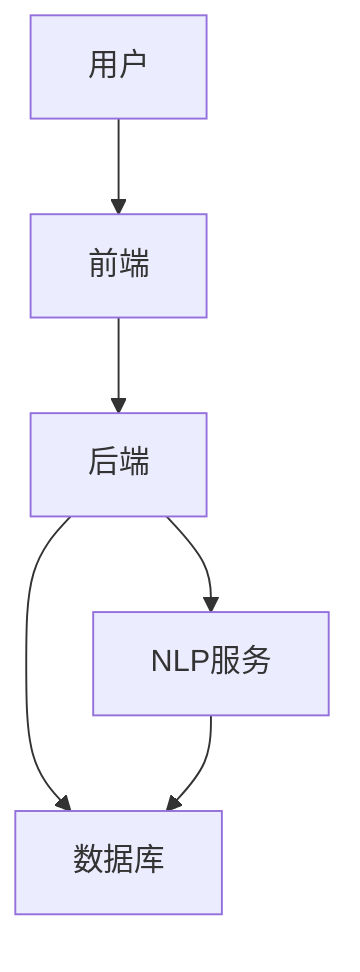

                 


# 自然语言处理在合同文件分析中的应用

> **关键词**：自然语言处理、合同分析、信息抽取、文本相似度、深度学习、NLP工具  
> 
> **摘要**：  
> 本文详细探讨了自然语言处理（NLP）在合同文件分析中的应用，从技术背景、核心概念到具体实现，系统性地分析了合同文件分析的关键技术与实践。文章首先介绍了合同文件分析的背景与挑战，随后深入讲解了自然语言处理的基础概念和关键技术，包括信息抽取、文本相似度计算等。接着，详细分析了合同文件分析的核心技术，如基于规则和深度学习的NLP技术，以及常用的NLP工具与库。通过系统设计与项目实战，展示了如何将NLP技术应用于合同分析的系统架构设计与实现。最后，总结了合同文件分析的未来发展方向与实践建议。

---

## 第1章: 合同文件分析的背景与挑战

### 1.1 合同文件分析的背景

合同文件分析是法律和商业领域中的重要任务，传统方法依赖人工审查，耗时且容易出错。自然语言处理技术的引入，极大地提高了合同分析的效率和准确性。

#### 1.1.1 传统合同分析方法的局限性  
传统合同分析依赖人工阅读和手动记录关键信息，存在以下问题：  
1. **效率低**：人工审查耗时长，尤其在处理大量合同文件时。  
2. **一致性差**：不同审查人员可能对合同条款的理解存在差异。  
3. **易出错**：人为疏忽可能导致关键条款被遗漏。  

#### 1.1.2 自然语言处理技术的优势  
NLP技术能够通过自动化手段提取合同中的关键信息，显著提升效率和准确性。具体优势包括：  
1. **高效性**：快速处理大量合同文件。  
2. **一致性**：确保所有合同分析结果的统一性。  
3. **准确性**：通过算法优化，减少人为错误。  

#### 1.1.3 合同文件分析的业务价值  
合同文件分析在企业中的价值体现在以下几个方面：  
1. **合规性检查**：确保合同符合法律法规要求。  
2. **风险控制**：识别潜在的法律风险。  
3. **效率提升**：加快合同审查和审批流程。  
4. **数据积累**：通过自动化提取，建立企业合同知识库。  

### 1.2 合同文件分析的核心问题

#### 1.2.1 问题背景与问题描述  
合同文件分析的核心问题包括：  
1. **信息抽取**：从合同文本中提取关键信息（如合同条款、金额、时间等）。  
2. **合同分类**：根据合同内容进行分类（如商业合同、服务合同等）。  
3. **条款匹配**：识别合同中的相似或相关条款。  

#### 1.2.2 问题解决的必要性  
解决这些问题对于企业高效管理和合规运营至关重要。例如，通过自动提取关键条款，企业可以快速判断合同的法律风险。  

#### 1.2.3 边界与外延  
合同文件分析的边界主要集中在文本层面，不涉及合同的格式验证或电子签名的处理。外延则包括合同生成和智能问答系统。  

#### 1.2.4 核心概念与组成要素  
合同文件分析的核心概念包括：  
1. **文本预处理**：如分词、去停用词等。  
2. **信息抽取**：提取合同中的实体信息（如人名、组织名、金额等）。  
3. **文本相似度计算**：用于合同条款的匹配与分类。  

---

## 第2章: 自然语言处理基础

### 2.1 自然语言处理的核心概念

#### 2.1.1 词性标注  
词性标注是NLP中的基础任务，用于识别文本中的词性（如名词、动词等）。在合同分析中，词性标注有助于识别合同中的关键实体。

#### 2.1.2 实体识别  
实体识别（NER，Named Entity Recognition）用于从文本中提取特定实体（如人名、组织名、日期等）。在合同分析中，实体识别可用于提取合同中的关键信息（如合同双方、金额、时间等）。

#### 2.1.3 信息抽取  
信息抽取是从文本中提取特定信息的过程。在合同分析中，信息抽取用于提取合同条款、金额、时间等关键信息。

#### 2.1.4 文本相似度计算  
文本相似度计算用于衡量两段文本的相似性。在合同分析中，文本相似度计算可用于合同条款的匹配与分类。

### 2.2 自然语言处理的关键技术

#### 2.2.1 词袋模型  
词袋模型是一种简单有效的文本表示方法，用于将文本转换为向量表示。在合同分析中，词袋模型可用于合同分类和信息提取。

#### 2.2.2 词嵌入模型  
词嵌入模型（如Word2Vec、GloVe）通过将词语表示为低维向量，捕捉词语的语义信息。在合同分析中，词嵌入模型可用于文本相似度计算和信息抽取。

#### 2.2.3 基于规则的NLP技术  
基于规则的NLP技术通过预定义规则进行文本处理。在合同分析中，规则可以用于识别特定格式的条款（如日期格式、金额格式等）。

#### 2.2.4 统计学习方法  
统计学习方法通过训练数据学习模型参数，用于分类、回归等任务。在合同分析中，统计学习方法可用于合同分类和信息抽取。

---

## 第3章: 合同文件分析的关键技术

### 3.1 信息抽取技术

#### 3.1.1 基于规则的信息抽取  
基于规则的信息抽取通过预定义规则从文本中提取信息。例如，可以通过正则表达式提取合同中的日期和金额。

#### 3.1.2 基于统计学习的信息抽取  
基于统计学习的信息抽取通过训练模型从文本中提取信息。例如，可以使用CRF（条件随机场）模型进行命名实体识别。

#### 3.1.3 基于深度学习的信息抽取  
基于深度学习的信息抽取使用神经网络模型（如LSTM、BERT）进行信息抽取。这些模型能够捕捉文本的上下文信息，提高抽取的准确性。

### 3.2 文本相似度计算

#### 3.2.1 基于余弦相似度的文本相似度计算  
余弦相似度是衡量两段文本相似性的一种常用方法，基于向量的点积计算。公式如下：  
$$ \text{余弦相似度} = \frac{\vec{A} \cdot \vec{B}}{|\vec{A}| \cdot |\vec{B}|} $$  

#### 3.2.2 基于Word2Vec的文本相似度计算  
Word2Vec通过训练词嵌入模型，将词语表示为低维向量。文本相似度计算可以通过对文本向量进行计算。

#### 3.2.3 基于BERT的文本相似度计算  
BERT是一种基于预训练模型的NLP技术，能够捕捉文本的语义信息。文本相似度计算可以通过对BERT模型进行微调实现。

### 3.3 合同分类技术

#### 3.3.1 基于TF-IDF的合同分类  
TF-IDF（Term Frequency-Inverse Document Frequency）是一种常用的文本表示方法，用于衡量词语在文本中的重要性。在合同分类中，TF-IDF可用于提取关键词并进行分类。

#### 3.3.2 基于深度学习的合同分类  
基于深度学习的合同分类使用神经网络模型（如CNN、RNN）进行分类。这些模型能够捕捉文本的语义信息，提高分类的准确性。

#### 3.3.3 基于预训练模型的合同分类  
基于预训练模型（如BERT、RoBERTa）的合同分类通过微调模型实现。这些模型能够捕捉复杂的语义信息，显著提高分类效果。

---

## 第4章: 自然语言处理工具与库

### 4.1 常见自然语言处理工具

#### 4.1.1 spaCy  
spaCy是一个高效的NLP工具，支持多种语言的分词、实体识别等功能。在合同分析中，spaCy可用于提取合同中的实体信息。

#### 4.1.2 NLTK  
NLTK是一个广泛使用的NLP工具包，提供多种NLP任务的实现。在合同分析中，NLTK可用于分词、情感分析等任务。

#### 4.1.3 HanLP  
HanLP是一个中文NLP工具，支持中文分词、实体识别等功能。在合同分析中，HanLP可用于处理中文合同文本。

#### 4.1.4 Gensim  
Gensim是一个用于文本表示和主题建模的NLP工具。在合同分析中，Gensim可用于文本聚类和主题分析。

### 4.2 基于预训练模型的NLP工具

#### 4.2.1 BERT  
BERT是一种基于预训练模型的NLP技术，能够捕捉文本的语义信息。在合同分析中，BERT可用于文本相似度计算和信息抽取。

#### 4.2.2 GPT  
GPT是一种基于预训练模型的生成式NLP技术。在合同分析中，GPT可用于生成合同摘要和智能问答。

#### 4.2.3 RoBERTa  
RoBERTa是BERT的优化版本，性能更优。在合同分析中，RoBERTa可用于文本分类和信息抽取。

#### 4.2.4 ALBERT  
ALBERT是一种轻量级的预训练模型，适用于资源受限的场景。在合同分析中，ALBERT可用于文本分类和信息抽取。

### 4.3 工具的选择与使用

#### 4.3.1 工具的优缺点对比  
| 工具名称 | 优点 | 缺点 |  
|----------|------|------|  
| spaCy    | 高效，支持多种语言 | 对中文支持有限 |  
| NLTK     | 功能全面，支持多种语言 | 性能较低 |  
| HanLP    | 高效，支持中文 | 对其他语言支持有限 |  
| Gensim    | 支持主题建模 | 不支持实体识别 |  
| BERT     | 高精度 | 需要大量计算资源 |  

#### 4.3.2 工具的安装与配置  
以Python为例，安装spaCy的命令如下：  
```bash
pip install spacy
python -m spacy download en
```

#### 4.3.3 工具的使用  
以下是一个使用spaCy进行实体识别的示例代码：  
```python
import spacy

nlp = spacy.load("en")
doc = nlp("The contract was signed on 2023-10-01 by John Doe.")
for ent in doc.ents:
    print(ent.text, ent.label_)
```

---

## 第5章: 系统设计与实现

### 5.1 系统需求分析

#### 5.1.1 项目背景  
合同文件分析系统旨在通过NLP技术自动提取合同中的关键信息，提高合同审查的效率和准确性。

#### 5.1.2 功能需求  
1. **信息抽取**：提取合同中的实体信息（如合同双方、金额、时间等）。  
2. **合同分类**：根据合同内容进行分类（如商业合同、服务合同等）。  
3. **条款匹配**：识别合同中的相似或相关条款。  

### 5.2 系统架构设计

#### 5.2.1 系统架构图  


#### 5.2.2 模块划分  
1. **前端**：负责用户交互，接收用户输入并展示结果。  
2. **后端**：负责处理用户请求，调用NLP服务进行合同分析。  
3. **数据库**：存储合同文本和分析结果。  
4. **NLP服务**：负责合同文本的预处理、信息抽取和分类。  

### 5.3 系统实现

#### 5.3.1 环境安装  
安装Python和相关库：  
```bash
pip install spacy
pip install flask
pip install pymongo
```

#### 5.3.2 核心实现代码  
以下是一个基于Flask的合同分析系统实现示例：  
```python
from flask import Flask, request, jsonify
import spacy

nlp = spacy.load("en")

app = Flask(__name__)

@app.route('/analyze', methods=['POST'])
def analyze():
    text = request.json['text']
    doc = nlp(text)
    result = []
    for ent in doc.ents:
        result.append({'text': ent.text, 'label': ent.label_})
    return jsonify({'entities': result})

if __name__ == '__main__':
    app.run(debug=True)
```

#### 5.3.3 系统测试  
可以通过Postman或curl命令进行测试：  
```bash
curl -X POST http://localhost:5000/analyze -H "Content-Type: application/json" -d '{"text": "The contract was signed on 2023-10-01 by John Doe."}'
```

---

## 第6章: 项目实战与案例分析

### 6.1 环境安装

```bash
pip install spacy
pip install flask
pip install pymongo
```

### 6.2 核心实现代码

```python
from flask import Flask, request, jsonify
import spacy

nlp = spacy.load("en")

app = Flask(__name__)

@app.route('/analyze', methods=['POST'])
def analyze():
    text = request.json['text']
    doc = nlp(text)
    result = []
    for ent in doc.ents:
        result.append({'text': ent.text, 'label': ent.label_})
    return jsonify({'entities': result})

if __name__ == '__main__':
    app.run(debug=True)
```

### 6.3 案例分析

#### 6.3.1 案例背景  
某企业需要分析大量商业合同，提取合同中的关键信息（如合同双方、金额、时间等）。

#### 6.3.2 实施步骤  
1. **数据预处理**：将合同文本转换为可处理的格式。  
2. **信息抽取**：使用NLP工具提取合同中的实体信息。  
3. **结果展示**：将提取的信息展示给用户。

#### 6.3.3 分析结果  
提取的实体信息包括：  
- 合同双方：John Doe和Jane Smith。  
- 合同金额：$10,000。  
- 合同时间：2023-10-01。  

---

## 第7章: 总结与展望

### 7.1 总结  
本文详细探讨了自然语言处理在合同文件分析中的应用，从技术背景、核心概念到具体实现，系统性地分析了合同文件分析的关键技术与实践。

### 7.2 未来展望  
未来，随着NLP技术的不断发展，合同文件分析将更加智能化和自动化。以下是一些可能的发展方向：  
1. **合同生成**：通过NLP技术自动生成合同文本。  
2. **智能问答系统**：为用户提供合同相关的智能问答服务。  
3. **模型优化**：进一步优化NLP模型，提高合同分析的准确性和效率。  

---

## 参考文献  
（此处列出相关文献和资源）

---

## 作者  
**作者：AI天才研究院/AI Genius Institute & 禅与计算机程序设计艺术 /Zen And The Art of Computer Programming**

---

以上是关于《自然语言处理在合同文件分析中的应用》的技术博客文章的详细目录大纲和内容概述。希望对您有所帮助！

