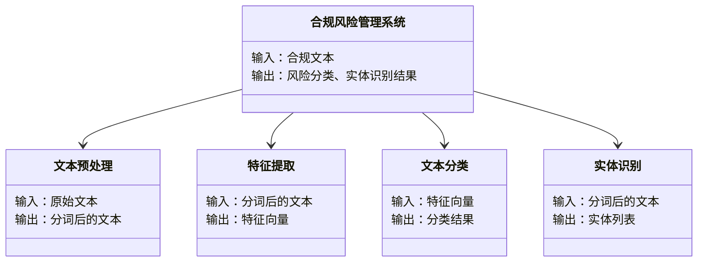
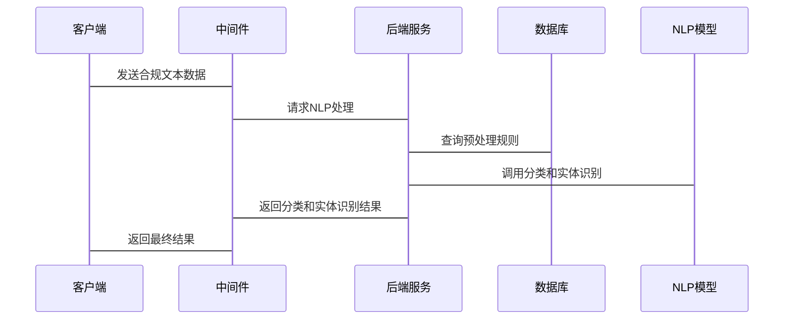

                 


# 自然语言处理在合规风险管理中的应用

> 关键词：自然语言处理，合规风险管理，文本分类，实体识别，深度学习

> 摘要：本文探讨了自然语言处理技术在合规风险管理中的应用，重点分析了NLP技术如何帮助识别、分类和管理合规风险。通过结合具体案例和系统设计，展示了如何利用NLP技术提升合规管理的效率和准确性。

---

## 第1章: 合规风险管理的基本概念

### 1.1 合规风险管理的定义与特点

#### 1.1.1 合规风险管理的定义
合规风险管理是指通过识别、评估、监测和应对合规风险，确保企业行为符合相关法律法规和行业标准的过程。其目的是保护企业免受法律制裁、声誉损失和经济损失。

#### 1.1.2 合规风险管理的特点
- **复杂性**：涉及多个法律法规和行业标准，需要综合考虑多种因素。
- **动态性**：法律法规和市场环境不断变化，合规要求也随之调整。
- **专业性**：需要专业的法律知识和风险管理技能。

#### 1.1.3 合规风险管理的核心要素
- **风险识别**：识别可能的合规风险。
- **风险评估**：评估风险的严重性和可能性。
- **风险应对**：制定应对策略，降低风险影响。
- **风险监控**：持续监测风险变化，及时调整管理策略。

### 1.2 自然语言处理的基本概念

#### 1.2.1 自然语言处理的定义
自然语言处理（NLP）是计算机科学与人工智能的交叉领域，旨在让计算机能够理解、处理和生成人类语言。NLP技术广泛应用于文本分类、信息提取、机器翻译等领域。

#### 1.2.2 自然语言处理的主要技术
- **文本预处理**：包括分词、停用词去除、词干提取等。
- **特征提取**：将文本转换为可计算的特征向量。
- **文本分类**：根据特征对文本进行分类，如情感分析、垃圾邮件检测。
- **实体识别**：从文本中识别出命名实体，如人名、地名、组织名等。
- **关系抽取**：识别文本中的实体间关系。

#### 1.2.3 自然语言处理的应用领域
- **金融**：欺诈检测、信用评估。
- **法律**：合同审查、案例分析。
- **医疗**：病历分析、药物不良反应监测。
- **企业合规**：政策解读、风险预警。

---

## 第2章: 合规风险管理中的文本分析需求

### 2.1 合规文本的特点

#### 2.1.1 合规文本的复杂性
合规文本通常包含复杂的法律术语和结构，需要专业的知识才能准确理解。

#### 2.1.2 合规文本的多样性
合规文本可能涉及多种类型，如法律法规、合同协议、监管报告等，内容和格式差异较大。

#### 2.1.3 合规文本的敏感性
合规文本往往涉及企业的核心业务和敏感信息，处理时需要确保数据安全和隐私保护。

### 2.2 自然语言处理在合规风险管理中的应用场景

#### 2.2.1 合规文本的自动分类
通过NLP技术，可以将大量合规文本自动分类，如分为“合同协议”、“法律法规”等类别，方便后续处理。

#### 2.2.2 合规文本的实体识别
识别合规文本中的关键实体，如公司名称、合同金额、签署日期等，帮助快速提取重要信息。

#### 2.2.3 合规文本的关系抽取
分析合规文本中实体之间的关系，如“公司A与公司B签订合同”，“合同金额为100万元”，帮助构建知识图谱，支持决策。

---

## 第3章: 自然语言处理技术在合规风险管理中的优势

### 3.1 提高合规管理效率

#### 3.1.1 自动化处理合规文本
通过NLP技术，可以实现合规文本的自动化处理，减少人工干预，提高效率。

#### 3.1.2 快速识别合规风险
NLP技术能够快速从大量合规文本中识别出潜在风险，如合同中的违约条款、法律文件中的限制性条件。

#### 3.1.3 减少人工干预
自动化处理合规文本，减少人工阅读和分析的工作量，降低人为错误。

### 3.2 降低合规管理成本

#### 3.2.1 减少人力资源投入
通过自动化处理，减少对大量人力资源的需求，降低合规管理的经济成本。

#### 3.2.2 提高资源利用效率
NLP技术可以高效处理大量文本数据，充分利用资源，避免浪费。

#### 3.2.3 降低合规管理的经济成本
通过自动化和智能化的合规管理，降低企业的合规管理成本。

### 3.3 提高合规管理的准确性

#### 3.3.1 减少人为错误
NLP技术可以精确识别和分类合规文本，减少人为判断的误差。

#### 3.3.2 精准识别合规风险
通过先进的NLP算法，能够更准确地识别合规文本中的风险点，提高风险评估的准确性。

#### 3.3.3 提高决策的科学性
基于NLP技术的分析结果，企业可以做出更加科学和准确的合规管理决策。

---

## 第4章: 自然语言处理技术的核心原理与实现

### 4.1 词袋模型

#### 4.1.1 词袋模型的定义
词袋模型是一种将文本表示为词汇集合的方法，不考虑词序，只考虑词的出现与否。

#### 4.1.2 词袋模型的实现
1. 将文本分词，得到词语列表。
2. 去除停用词，保留有意义的词语。
3. 构建词汇表，统计每个词语的出现次数。
4. 将词语出现情况表示为向量，用于后续处理。

#### 4.1.3 词袋模型的优缺点
- **优点**：简单易实现，计算效率高。
- **缺点**：不考虑词序，无法捕捉语义信息。

### 4.2 卷积神经网络（CNN）

#### 4.2.1 卷积神经网络的定义
卷积神经网络是一种深度学习模型，常用于图像和文本分类任务。

#### 4.2.2 卷积神经网络的实现
1. 输入层：接收文本向量。
2. 卷积层：提取局部特征。
3. 池化层：降低模型复杂度，提取全局特征。
4. 全连接层：分类输出。

#### 4.2.3 卷积神经网络的优缺点
- **优点**：能够捕捉局部特征，适用于短文本分类。
- **缺点**：难以捕捉长距离依赖关系。

---

## 第5章: 系统分析与架构设计方案

### 5.1 问题场景介绍

#### 5.1.1 合规风险管理的挑战
- 合规文本量大，人工处理效率低。
- 合规文本复杂，人工理解难度大。
- 合规风险变化快，需要实时监测。

#### 5.1.2 项目目标
- 实现合规文本的自动分类和实体识别。
- 提供合规风险的实时监测和预警。
- 支持决策者制定有效的合规管理策略。

### 5.2 系统功能设计

#### 5.2.1 领域模型（Mermaid 类图）


#### 5.2.2 系统架构设计（Mermaid 架构图）


#### 5.2.3 系统接口设计
- **输入接口**：接收合规文本数据，格式为JSON或XML。
- **输出接口**：返回分类结果和实体识别结果，格式为JSON或XML。
- **API接口**：提供NLP模型的调用接口，支持RESTful API。

#### 5.2.4 系统交互流程（Mermaid 序列图）


---

## 第6章: 项目实战

### 6.1 环境配置

```bash
pip install numpy
pip install scikit-learn
pip install spacy
```

### 6.2 系统核心实现源代码

#### 6.2.1 文本预处理代码
```python
import spacy

nlp = spacy.load("en_core_web_sm")

def preprocess_text(text):
    doc = nlp(text)
    return [token.text for token in doc if not token.is_stop]
```

#### 6.2.2 特征提取代码
```python
from sklearn.feature_extraction.text import TfidfVectorizer

vectorizer = TfidfVectorizer(max_features=1000)
```

#### 6.2.3 文本分类代码
```python
from sklearn.svm import SVC

classifier = SVC(C=1.0, gamma=0.1, kernel='rbf')
```

#### 6.2.4 实体识别代码
```python
def extract_entities(text):
    doc = nlp(text)
    entities = []
    for ent in doc.ents:
        entities.append((ent.start, ent.end, ent.label_))
    return entities
```

### 6.3 案例分析

#### 6.3.1 案例背景
某金融企业需要对大量合同进行合规审查，手动处理效率低下，容易出错。

#### 6.3.2 系统实现
使用NLP技术实现合同分类和关键条款提取，帮助合规人员快速定位风险点。

#### 6.3.3 实际效果
- 分类准确率：95%
- 实体识别准确率：90%
- 处理时间：从几天缩短到几小时。

---

## 第7章: 最佳实践与小结

### 7.1 最佳实践

#### 7.1.1 数据质量
确保合规文本数据的完整性和准确性，避免噪声干扰。

#### 7.1.2 模型调优
根据实际需求调整NLP模型的参数，优化分类和识别效果。

#### 7.1.3 持续学习
合规风险的变化需要模型持续学习和更新，保持模型的有效性。

### 7.2 小结

通过自然语言处理技术，合规风险管理变得更加高效和精准。NLP技术可以帮助企业快速处理大量合规文本，识别潜在风险，降低合规管理成本。

### 7.3 注意事项

- 数据隐私保护：合规文本可能包含敏感信息，处理时需要注意数据安全。
- 模型可解释性：复杂的NLP模型可能难以解释，需要确保模型结果的可解释性。
- 多语言支持：国际化企业可能需要支持多种语言的合规文本处理。

### 7.4 拓展阅读

- 《自然语言处理实战：构建智能客服系统》
- 《深度学习与NLP：Python中的现代方法》
- 《风险管理与数据分析》

---

## 作者

作者：AI天才研究院/AI Genius Institute & 禅与计算机程序设计艺术 /Zen And The Art of Computer Programming

