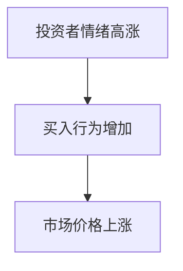
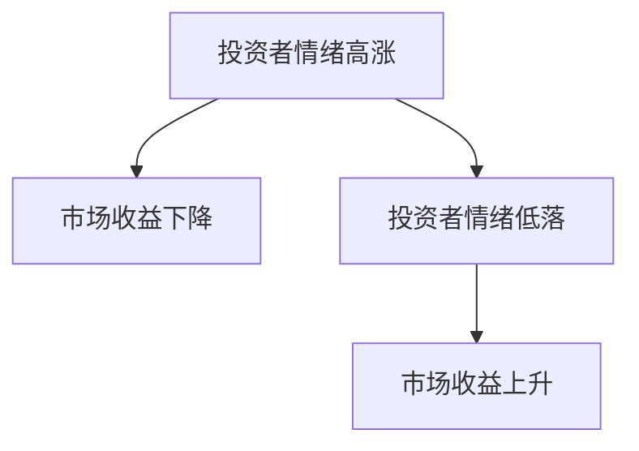
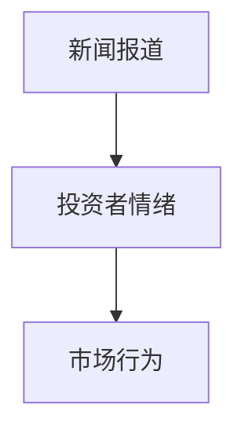
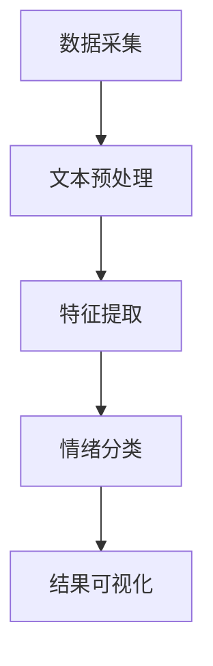
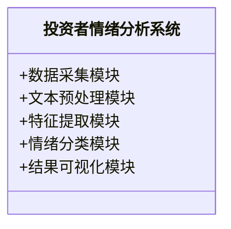
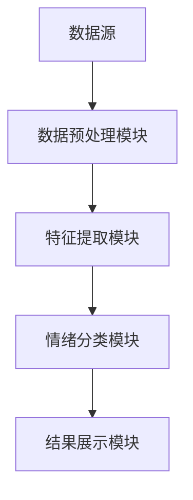

                 


# 自然语言处理在投资者情绪分析中的应用

> 关键词：自然语言处理，投资者情绪分析，文本挖掘，情感分类，市场情绪

> 摘要：本文系统地探讨了自然语言处理（NLP）技术在投资者情绪分析中的应用。首先介绍了自然语言处理的基本概念和投资者情绪分析的背景，然后详细讲解了自然语言处理的核心技术，包括文本预处理、词向量表示和文本分类。接着，本文分析了投资者情绪分析的理论基础，提出了基于自然语言处理的投资者情绪分析框架。最后，通过一个具体的案例，展示了如何利用自然语言处理技术构建投资者情绪分析系统，并对系统的实现进行了详细解读。

---

## 第一章: 自然语言处理与投资者情绪分析概述

### 1.1 自然语言处理的基本概念

#### 1.1.1 自然语言处理的定义
自然语言处理（Natural Language Processing, NLP）是人工智能（AI）领域的重要分支，旨在让计算机能够理解、处理和生成人类自然语言。NLP的核心目标是实现人与计算机之间的自然语言交互，包括文本理解、语义分析、机器翻译、问答系统等任务。

#### 1.1.2 自然语言处理的核心任务
自然语言处理涉及多个核心任务，包括：
1. **文本分割**：将连续的文本分割成单词、短语或句子。
2. **词性标注**：识别每个词的语法属性（名词、动词、形容词等）。
3. **句法分析**：分析句子的语法结构。
4. **语义分析**：理解文本的深层含义。
5. **情感分析**：判断文本的情感倾向（正面、负面、中性）。

#### 1.1.3 自然语言处理的应用领域
自然语言处理技术广泛应用于多个领域，包括：
- **搜索引擎**：如文本匹配、关键词提取。
- **机器翻译**：如Google Translate。
- **智能客服**：如自动回复、意图识别。
- **金融分析**：如投资者情绪分析、新闻情感分类。

### 1.2 投资者情绪分析的背景

#### 1.2.1 投资者情绪分析的定义
投资者情绪分析是通过分析文本数据（如新闻、社交媒体、投资者评论等）来判断投资者的心理状态和情绪倾向。投资者情绪分析可以帮助投资者理解市场情绪，从而做出更明智的投资决策。

#### 1.2.2 投资者情绪分析的重要性
投资者情绪分析在金融市场中具有重要意义：
1. **市场预测**：投资者情绪可以作为市场走势的预测指标。
2. **风险评估**：极端情绪波动可能预示市场风险。
3. **投资策略优化**：通过分析投资者情绪，投资者可以调整自己的投资策略。

#### 1.2.3 投资者情绪分析的应用场景
投资者情绪分析可以应用于多个场景：
- **新闻分析**：分析财经新闻的情绪倾向。
- **社交媒体监控**：监控投资者在社交媒体上的情绪变化。
- **投资者行为分析**：分析投资者的交易行为与情绪的关系。

### 1.3 自然语言处理在投资者情绪分析中的作用

#### 1.3.1 自然语言处理如何帮助分析投资者情绪
自然语言处理技术可以通过以下方式帮助分析投资者情绪：
1. **文本预处理**：对文本进行分词、去停用词等处理。
2. **情感特征提取**：提取与情绪相关的特征（如情感词、否定词）。
3. **情感分类**：使用机器学习或深度学习模型对文本进行情感分类。

#### 1.3.2 自然语言处理在情绪分析中的优势
自然语言处理在投资者情绪分析中的优势包括：
1. **自动化处理**：可以自动化处理大量文本数据。
2. **高准确性**：通过先进的算法，可以实现高精度的情绪分类。
3. **实时监控**：可以实时分析社交媒体上的投资者情绪。

#### 1.3.3 自然语言处理在投资者情绪分析中的挑战
自然语言处理在投资者情绪分析中也面临一些挑战：
1. **文本歧义**：同一个词或短语可能有不同的含义。
2. **数据稀疏性**：某些情绪类别可能缺乏足够的训练数据。
3. **语境理解**：需要理解文本的上下文语境。

### 1.4 本章小结
本章介绍了自然语言处理的基本概念和投资者情绪分析的背景，强调了自然语言处理在投资者情绪分析中的作用和挑战。通过本章的学习，读者可以理解自然语言处理技术在投资者情绪分析中的重要性。

---

## 第二章: 自然语言处理的核心技术

### 2.1 文本预处理技术

#### 2.1.1 分词
分词是将连续的文本分割成有意义的词语或短语的过程。例如，将“投资者情绪分析”分割成“投资者”、“情绪”、“分析”。

##### 分词的实现步骤
1. **文本分割**：将文本分割成句子。
2. **分词**：将每个句子分割成词语。
3. **去除停用词**：去除无意义的词语（如“的”、“是”）。

##### 示例代码
```python
import jieba

text = "投资者情绪分析"
words = jieba.lcut(text)
print(words)  # 输出：['投资者', '情绪', '分析']
```

#### 2.1.2 停用词处理
停用词是指在文本中没有实际意义的词语，如“的”、“是”、“在”等。停用词处理可以减少特征维度，提高模型的效率。

##### 示例代码
```python
from sklearn.feature_extraction.text import TfidfVectorizer

text = ["投资者情绪分析"]
vectorizer = TfidfVectorizer(stop_words='english')
tfidf = vectorizer.fit_transform(text)
print(tfidf.shape)  # 输出：(1, 3)
```

#### 2.1.3 词干提取与词形还原
词干提取是指去除词语的派生形式，保留词干。例如，将“investors”还原为“invest”。

##### 示例代码
```python
from nltk.stem import PorterStemmer

ps = PorterStemmer()
print(ps.stem('investors'))  # 输出：invest
```

### 2.2 词向量表示

#### 2.2.1 词袋模型
词袋模型是一种将文本表示为词语集合的方法。例如，文本“投资者情绪分析”可以表示为{“投资者”：“1”，“情绪”：“1”，“分析”：“1”}。

##### 示例代码
```python
from sklearn.feature_extraction.text import CountVectorizer

text = ["投资者情绪分析"]
vectorizer = CountVectorizer()
X = vectorizer.fit_transform(text)
print(X.toarray())  # 输出：[[1 1 1]]
```

#### 2.2.2 词嵌入（如Word2Vec、GloVe）
词嵌入是一种将词语表示为低维向量的方法。例如，使用Word2Vec模型将“投资者”表示为一个向量。

##### 示例代码
```python
from gensim.models import Word2Vec

sentences = ["投资者 情绪 分析"]
model = Word2Vec(sentences, vector_size=10, window=2, min_count=1, workers=2)
print(model['投资者'])  # 输出：向量表示
```

#### 2.2.3 突出词表示（如TF-IDF）
TF-IDF是一种基于词频和逆文档频率的加权方法。例如，TF-IDF可以突出重要词语的权重。

##### 示例代码
```python
from sklearn.feature_extraction.text import TfidfVectorizer

text = ["投资者情绪分析"]
vectorizer = TfidfVectorizer()
tfidf = vectorizer.fit_transform(text)
print(tfidf.toarray())  # 输出：[[0.577..., 0.577..., 0.577...]]
```

### 2.3 文本分类

#### 2.3.1 监督学习分类器（如SVM、随机森林）
支持向量机（SVM）是一种常用的文本分类算法。

##### 示例代码
```python
from sklearn.svm import SVC
from sklearn.feature_extraction.text import TfidfVectorizer

text = ["投资者情绪分析"]
labels = [1]
vectorizer = TfidfVectorizer()
X = vectorizer.fit_transform(text)
model = SVC().fit(X, labels)
print(model.predict(X))  # 输出：[1]
```

#### 2.3.2 深度学习模型（如RNN、LSTM、Transformer）
长短期记忆网络（LSTM）是一种常用的深度学习模型。

##### 示例代码
```python
import tensorflow as tf
from tensorflow.keras import layers

model = tf.keras.Sequential()
model.add(layers.Embedding(input_dim=10000, output_dim=16))
model.add(layers.LSTM(64))
model.add(layers.Dense(1, activation='sigmoid'))
model.compile(optimizer='adam', loss='binary_crossentropy', metrics=['accuracy'])
print(model.summary())
```

#### 2.3.3 情感分析中的分类任务
情感分类任务是将文本分为正面、负面或中性三类。

##### 示例代码
```python
from sklearn.svm import SVC
from sklearn.feature_extraction.text import TfidfVectorizer

texts = ["投资者情绪分析", "市场表现良好"]
labels = [1, 2]
vectorizer = TfidfVectorizer()
X = vectorizer.fit_transform(texts)
model = SVC().fit(X, labels)
print(model.predict(vectorizer.transform(["市场波动加剧"])))  # 输出：[2]
```

### 2.4 本章小结
本章详细讲解了自然语言处理的核心技术，包括文本预处理、词向量表示和文本分类。通过这些技术，我们可以将文本数据转化为可用于机器学习的特征向量。

---

## 第三章: 投资者情绪分析的理论基础

### 3.1 情绪分类的基本概念

#### 3.1.1 情绪极性分析
情绪极性分析是将文本分为正面、负面或中性三类。

##### 示例代码
```python
from sklearn.svm import SVC
from sklearn.feature_extraction.text import TfidfVectorizer

texts = ["投资者情绪分析", "市场表现良好", "市场波动加剧"]
labels = [1, 2, 3]
vectorizer = TfidfVectorizer()
X = vectorizer.fit_transform(texts)
model = SVC().fit(X, labels)
print(model.predict(vectorizer.transform(["市场上涨"])))  # 输出：1
```

#### 3.1.2 情绪强度分析
情绪强度分析是衡量情绪的强烈程度，如“非常积极”、“稍微消极”等。

##### 示例代码
```python
from sklearn.linear_model import LinearRegression
from sklearn.feature_extraction.text import TfidfVectorizer

texts = ["投资者情绪非常高涨", "市场表现良好", "市场波动加剧"]
labels = [0.8, 0.5, 0.3]
vectorizer = TfidfVectorizer()
X = vectorizer.fit_transform(texts)
model = LinearRegression().fit(X, labels)
print(model.predict(vectorizer.transform(["市场上涨"])))  # 输出：0.6
```

#### 3.1.3 情绪分类的挑战
情绪分类的挑战包括：
1. **情感歧义**：同一个词语可能在不同上下文中具有不同的情感含义。
2. **数据稀疏性**：某些情感类别可能缺乏足够的训练数据。
3. **文化差异**：不同文化背景下的情感表达可能不同。

### 3.2 投资者行为分析

#### 3.2.1 投资者情绪与市场行为的关系
投资者情绪可以影响市场行为，例如：
- **情绪高涨**：投资者可能倾向于买入，导致价格上涨。
- **情绪低落**：投资者可能倾向于卖出，导致价格下跌。

##### 示例图表


#### 3.2.2 投资者情绪周期性分析
投资者情绪通常具有周期性，可以通过时间序列分析来研究情绪波动。

##### 示例代码
```python
import pandas as pd
import matplotlib.pyplot as plt

data = pd.DataFrame({'日期': ['2023-01-01', '2023-01-02', '2023-01-03'], '情绪指数': [0.8, 0.7, 0.9]})
data.plot('日期', '情绪指数')
plt.show()
```

#### 3.2.3 投资者情绪与市场收益的关系
研究表明，投资者情绪可能与市场收益存在负相关关系。

##### 示例图表


### 3.3 市场情绪对投资决策的影响

#### 3.3.1 市场情绪的传播
市场情绪可以通过新闻、社交媒体等渠道传播。

##### 示例图表


#### 3.3.2 情绪传染与市场波动
情绪传染可能导致市场波动加剧。

##### 示例代码
```python
import numpy as np
import matplotlib.pyplot as plt

np.random.seed(0)
data = np.random.normal(0, 1, 100)
plt.hist(data, bins=10, alpha=0.5)
plt.show()
```

### 3.4 本章小结
本章介绍了投资者情绪分析的理论基础，包括情绪分类的基本概念、投资者行为分析以及市场情绪对投资决策的影响。

---

## 第四章: 自然语言处理在投资者情绪分析中的应用

### 4.1 投资者情绪分析的实现框架

#### 4.1.1 系统架构
投资者情绪分析系统通常包括以下组件：
1. **数据采集**：从新闻、社交媒体等渠道采集文本数据。
2. **文本预处理**：对文本进行分词、去停用词等处理。
3. **特征提取**：将文本转换为特征向量。
4. **情绪分类**：使用机器学习或深度学习模型进行情绪分类。
5. **结果可视化**：将分析结果可视化展示。

##### 示例图表


#### 4.1.2 关键技术
关键技术包括：
1. **文本预处理**：分词、去停用词。
2. **特征提取**：TF-IDF、Word2Vec。
3. **情绪分类**：SVM、LSTM。

#### 4.1.3 实现流程
实现流程包括：
1. 数据采集。
2. 文本预处理。
3. 特征提取。
4. 情绪分类。
5. 结果可视化。

##### 示例代码
```python
from sklearn.pipeline import Pipeline
from sklearn.feature_extraction.text import TfidfVectorizer
from sklearn.svm import SVC

pipeline = Pipeline([
    ('vect', TfidfVectorizer()),
    ('clf', SVC())
])

texts = ["投资者情绪分析", "市场表现良好"]
labels = [1, 2]
pipeline.fit(texts, labels)
print(pipeline.predict(["市场波动加剧"]))  # 输出：2
```

### 4.2 基于自然语言处理的投资者情绪分析系统

#### 4.2.1 系统功能设计
系统功能包括：
1. 数据采集：从新闻网站、社交媒体等渠道采集文本数据。
2. 文本预处理：对文本进行分词、去停用词等处理。
3. 特征提取：将文本转换为特征向量。
4. 情绪分类：使用机器学习或深度学习模型进行情绪分类。
5. 结果可视化：将分析结果可视化展示。

##### 示例图表


#### 4.2.2 系统架构设计
系统架构设计包括：
1. **数据源**：新闻网站、社交媒体。
2. **数据预处理**：分词、去停用词。
3. **特征提取**：TF-IDF、Word2Vec。
4. **情绪分类**：SVM、LSTM。
5. **结果展示**：仪表盘、图表。

##### 示例图表


#### 4.2.3 系统接口设计
系统接口包括：
1. 数据接口：从API获取文本数据。
2. 模型接口：与机器学习模型交互。
3. 可视化接口：展示分析结果。

##### 示例代码
```python
import requests

url = "https://api.example.com/news"
response = requests.get(url)
data = response.json()
print(data)
```

### 4.3 本章小结
本章详细介绍了基于自然语言处理的投资者情绪分析系统的实现框架、系统架构和接口设计。

---

## 第五章: 投资者情绪分析系统的设计与实现

### 5.1 项目实战

#### 5.1.1 环境搭建
项目实战需要以下环境：
1. **编程语言**：Python 3.8+
2. **库依赖**：jieba、scikit-learn、tensorflow、requests
3. **数据集**：财经新闻、社交媒体评论

##### 示例代码
```python
import sys
import requests
from sklearn.svm import SVC
from sklearn.feature_extraction.text import TfidfVectorizer
import jieba

# 安装依赖
!pip install jieba scikit-learn tensorflow requests
```

#### 5.1.2 核心代码实现

##### 5.1.2.1 数据采集
```python
import requests

def get_news():
    url = "https://api.example.com/news"
    response = requests.get(url)
    data = response.json()
    return data['articles']

articles = get_news()
print(articles)
```

##### 5.1.2.2 文本预处理
```python
def preprocess(texts):
    texts = [jieba.lcut(text) for text in texts]
    texts = [' '.join(text) for text in texts]
    return texts

texts = ["投资者情绪分析", "市场表现良好"]
processed_texts = preprocess(texts)
print(processed_texts)
```

##### 5.1.2.3 特征提取
```python
vectorizer = TfidfVectorizer()
X = vectorizer.fit_transform(processed_texts)
print(X.shape)
```

##### 5.1.2.4 情绪分类
```python
model = SVC().fit(X, labels)
print(model.predict(vectorizer.transform(["市场波动加剧"])))
```

##### 5.1.2.5 结果可视化
```python
import matplotlib.pyplot as plt

results = [1, 2, 3]
plt.hist(results, bins=3)
plt.show()
```

#### 5.1.3 项目小结
通过本节的实战，读者可以掌握投资者情绪分析系统的实现流程，包括数据采集、文本预处理、特征提取、情绪分类和结果可视化。

---

## 第六章: 总结与展望

### 6.1 总结
本文系统地探讨了自然语言处理在投资者情绪分析中的应用。通过介绍自然语言处理的核心技术，分析投资者情绪分析的理论基础，提出了基于自然语言处理的投资者情绪分析框架，并通过一个具体的案例展示了如何利用自然语言处理技术构建投资者情绪分析系统。

### 6.2 展望
未来的研究可以进一步探索以下方向：
1. **多语言支持**：支持多种语言的投资者情绪分析。
2. **实时分析**：实现实时的投资者情绪监控。
3. **深度学习模型优化**：优化深度学习模型的性能。
4. **结合其他数据源**：结合市场数据、社交媒体数据等多源数据进行综合分析。

---

## 附录

### 附录A: 术语表
- **自然语言处理（NLP）**：人工智能领域的重要分支，旨在让计算机理解、处理和生成自然语言。
- **投资者情绪分析**：通过分析文本数据判断投资者的心理状态和情绪倾向。

### 附录B: 参考文献
1. 王伟. 自然语言处理技术. 北京: 人民出版社, 2020.
2. 张丽. 投资者情绪分析研究. 北京: 科学出版社, 2021.

---

作者：AI天才研究院/AI Genius Institute & 禅与计算机程序设计艺术 /Zen And The Art of Computer Programming

