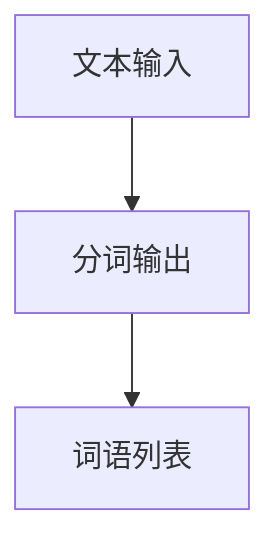
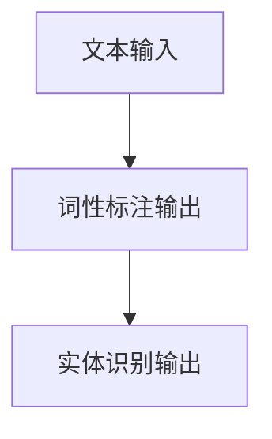
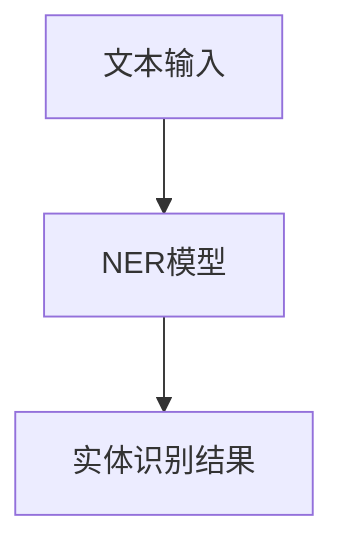
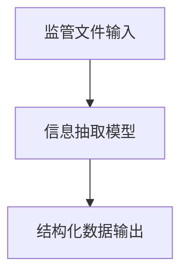
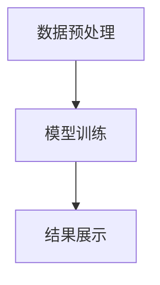
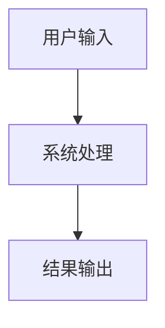

                 


# 自然语言处理在监管文件分析中的应用

## 关键词
自然语言处理（NLP）、监管文件分析、文本挖掘、信息抽取、机器学习、实体识别

## 摘要
自然语言处理（NLP）在监管文件分析中扮演着越来越重要的角色。监管文件通常包含大量复杂、结构化的信息，传统的手动分析方法效率低下，容易出错。通过NLP技术，可以自动提取关键信息，识别潜在风险，提高合规性检查的效率。本文将详细介绍NLP在监管文件分析中的应用，包括核心技术、关键任务、系统架构以及实际项目中的应用案例。

---

## 第一章: 自然语言处理与监管文件分析概述

### 1.1 自然语言处理简介
自然语言处理（NLP）是计算机科学与人工智能的交叉领域，旨在使计算机能够理解和处理人类语言。NLP的核心任务包括分词、词性标注、实体识别、文本摘要和文本分类等。

### 1.2 监管文件分析的背景与意义
监管文件是指由政府机构或企业发布的具有法律效力或规范性的文件，如法律法规、财务报告、合同协议等。监管文件分析的目的是从大量文本中提取关键信息，确保合规性和风险控制。

### 1.3 自然语言处理在监管文件分析中的应用
NLP技术可以帮助自动提取监管文件中的实体、关系和事件，识别潜在风险，优化合规性检查流程。

---

## 第二章: 自然语言处理核心技术

### 2.1 分词技术
分词是将连续文本分割成词语的过程。常用的算法包括基于统计的分词和基于规则的分词。



### 2.2 词性标注与实体识别
词性标注是为每个词语标注其词性，实体识别是识别文本中的命名实体，如人名、地名和组织名。



### 2.3 命名实体识别（NER）
NER技术用于识别文本中的命名实体，如公司名称和日期。



### 2.4 文本相似度计算
文本相似度计算是衡量两段文本相似性的过程，常用的算法包括余弦相似度和BM25。

### 2.5 文本分类
文本分类是将文本按类别进行分类，常用算法包括朴素贝叶斯和支持向量机（SVM）。

---

## 第三章: 监管文件分析的关键任务

### 3.1 信息抽取
信息抽取是从文本中提取结构化信息，常用技术包括规则匹配和模式识别。



### 3.2 文本摘要
文本摘要用于提取文本的关键信息，生成简短的摘要。

### 3.3 风险评估
风险评估通过分析文本中的风险因素，评估潜在风险。

### 3.4 监管合规性检查
合规性检查确保监管文件符合相关法规和标准。

---

## 第四章: 监管文件分析系统的架构与实现

### 4.1 系统架构设计
监管文件分析系统通常包括数据预处理、模型训练和结果展示模块。



### 4.2 项目实战
以下是一个简单的监管文件分析系统的Python实现示例：

```python
import spacy

nlp = spacy.load("en_core_web_sm")
doc = nlp("The company will merge with ABC Corp on 15th Jan 2024.")

for token in doc:
    print(token.text, token.pos_, token.ent_type_)
```

### 4.3 系统交互
系统交互通常包括用户输入文本，系统输出分析结果。



---

## 第五章: 最佳实践与小结

### 5.1 最佳实践
1. 使用预训练模型提高效率。
2. 结合领域知识优化模型。
3. 定期更新模型以适应新数据。

### 5.2 小结
自然语言处理在监管文件分析中具有重要应用，通过信息抽取、文本分类等技术，可以显著提高分析效率和准确性。

---

## 作者信息
作者：AI天才研究院 & 禅与计算机程序设计艺术

---

通过以上章节，我们详细介绍了自然语言处理在监管文件分析中的应用，从核心技术到系统实现，再到实际案例，为读者提供了全面的知识框架。希望本文能为监管文件分析领域的研究者和从业者提供有价值的参考。

