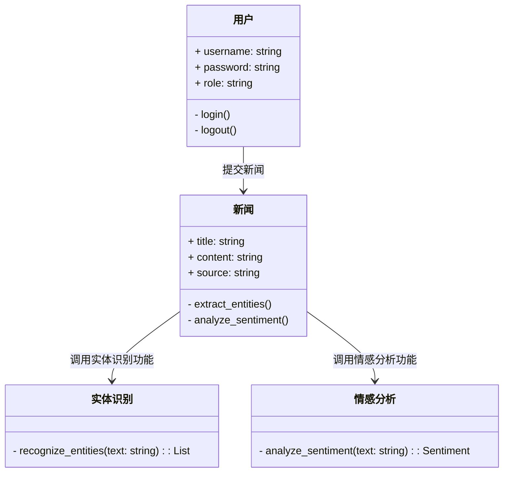
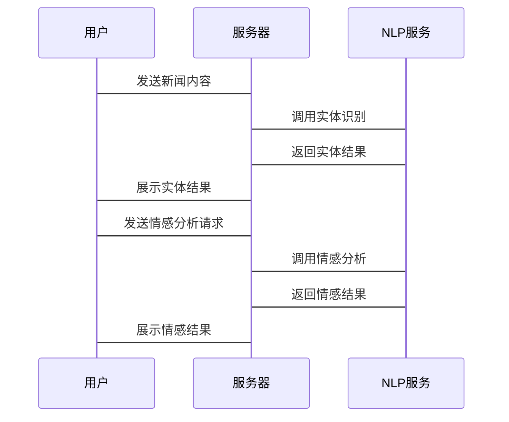

                 


# 自然语言处理技术在金融新闻分析中的应用

## 关键词：
- 自然语言处理
- 金融新闻分析
- 情感分析
- 文本挖掘
- 金融大数据

## 摘要：
自然语言处理（NLP）技术在金融新闻分析中发挥着越来越重要的作用。随着金融市场的日益复杂化和信息爆炸，如何高效地从海量金融新闻中提取有价值的信息，已经成为金融机构面临的重要挑战。本文将深入探讨自然语言处理技术在金融新闻分析中的核心应用，包括信息抽取、情绪分析、事件检测等，并结合具体案例分析，展示如何利用NLP技术提升金融决策的效率和准确性。通过本文，读者可以全面了解NLP在金融领域的潜力和实现方法。

---

# 第1章: 自然语言处理与金融新闻分析概述

## 1.1 自然语言处理的基本概念
### 1.1.1 自然语言处理的定义
自然语言处理（NLP）是人工智能领域的重要分支，旨在让计算机能够理解、分析和生成人类语言。NLP的核心任务包括分词、句法分析、实体识别、情感分析、文本分类等。

### 1.1.2 自然语言处理的核心任务
- **分词**：将连续的文本分割成有意义的词汇或短语。
- **句法分析**：分析文本的语法结构，识别句子中的主语、谓语等成分。
- **实体识别**：识别文本中的命名实体（如人名、地名、组织名）和概念实体（如时间、数量）。
- **情感分析**：判断文本中表达的情感倾向（如正面、负面、中性）。
- **文本分类**：将文本按照预定义的类别进行分类（如新闻分类、主题分类）。

### 1.1.3 自然语言处理在金融领域的应用潜力
在金融领域，NLP技术可以帮助金融机构从新闻、财报、社交媒体等非结构化数据中提取关键信息，辅助投资决策、风险管理、市场情绪分析等工作。

---

## 1.2 金融新闻分析的重要性
### 1.2.1 金融新闻的定义与特点
金融新闻是指与金融市场、公司、经济指标等相关的信息，具有时效性强、专业性高、信息量大的特点。

### 1.2.2 金融新闻分析的意义
- **辅助投资决策**：通过分析新闻内容，投资者可以快速获取市场动态，制定投资策略。
- **风险管理**：及时发现潜在风险，帮助机构规避损失。
- **市场情绪分析**：通过分析新闻情绪，了解市场参与者的心态，预测市场走势。

### 1.2.3 传统金融新闻分析的局限性
- **人工分析效率低**：传统方法依赖人工阅读和分析，效率低下，且容易出错。
- **信息量大难以处理**：金融新闻数量庞大，人工难以全面覆盖。
- **情绪解读主观性强**：人工分析情绪时，主观性较强，结果不够客观。

---

## 1.3 自然语言处理在金融新闻分析中的优势
### 1.3.1 提高分析效率
NLP技术可以快速处理海量金融新闻，显著提高分析效率。

### 1.3.2 增强数据处理能力
NLP技术能够从非结构化数据中提取结构化信息，帮助金融机构更好地利用数据。

### 1.3.3 实现自动化决策支持
通过NLP技术，金融机构可以实现自动化新闻分析，为投资决策提供实时支持。

---

## 1.4 本章小结
通过本章的介绍，我们了解了自然语言处理的基本概念、核心任务，以及其在金融新闻分析中的潜力和优势。接下来，我们将深入探讨NLP技术在金融新闻分析中的具体应用。

---

# 第2章: 自然语言处理核心技术

## 2.1 分词技术
### 2.1.1 分词的定义与作用
分词是将连续的文本分割成有意义的词汇或短语的过程。例如，将“中国银行”分割为“中国”和“银行”。

### 2.1.2 常见的分词算法
- **基于规则的分词**：利用词典和语法规则进行分词。
- **统计学分词**：基于概率模型，通过训练语料库来分词。
- **深度学习分词**：利用神经网络模型（如LSTM、Transformer）进行分词。

### 2.1.3 分词在金融新闻分析中的应用
在金融新闻中，分词技术可以用于提取公司名称、行业术语等关键词。

---

## 2.2 实体识别与命名实体识别
### 2.2.1 实体识别的基本概念
实体识别是指从文本中识别出人名、地名、组织名、时间、数量等实体的过程。

### 2.2.2 命名实体识别的算法与应用
- **NER（Named Entity Recognition）模型**：利用CRF（条件随机场）、LSTM等深度学习模型进行命名实体识别。
- **金融领域的NER应用**：识别金融新闻中的公司名称、股票代码、行业术语等。

### 2.2.3 实体识别在金融新闻中的具体应用
例如，从新闻“中国银行发布2023年中期报告”中识别出“中国银行”（公司名称）、“2023年中期报告”（时间）。

---

## 2.3 情感分析与文本分类
### 2.3.1 情感分析的定义与分类
情感分析是指从文本中识别出情感倾向的过程，通常分为正面、负面和中性三类。

### 2.3.2 常见的情感分析算法
- **基于词袋模型的分类**：利用TF-IDF特征提取，使用SVM、NB等传统机器学习算法进行分类。
- **深度学习模型**：利用LSTM、BERT等模型进行情感分析。

### 2.3.3 情感分析在金融新闻中的应用
例如，分析新闻“某公司发布重大利好消息”为正面情绪，帮助投资者判断市场趋势。

---

## 2.4 文本相似度计算与摘要生成
### 2.4.1 文本相似度的定义与计算方法
文本相似度是指两段文本在内容上的相似程度，常用的计算方法包括余弦相似度、Jaccard相似度等。

### 2.4.2 文本摘要的生成方法
- **基于抽取的摘要**：从文本中提取关键句子生成摘要。
- **基于生成的摘要**：利用神经网络生成新的摘要文本。

### 2.4.3 这些技术在金融新闻中的应用
例如，通过文本相似度计算，可以识别出与某公司相关的新闻；通过文本摘要，可以快速获取新闻的核心信息。

---

## 2.5 本章小结
通过本章的介绍，我们了解了自然语言处理中的分词、实体识别、情感分析和文本摘要等核心技术，及其在金融新闻分析中的具体应用。接下来，我们将探讨金融新闻分析的核心应用场景。

---

# 第3章: 金融新闻分析的核心应用场景

## 3.1 金融新闻信息抽取
### 3.1.1 信息抽取的定义与目标
信息抽取是指从文本中提取特定类型的信息，例如公司名称、时间、金额等。

### 3.1.2 信息抽取的关键技术
- **基于规则的抽取**：利用正则表达式提取特定模式的信息。
- **基于深度学习的抽取**：利用NER模型、BERT模型等进行信息抽取。

### 3.1.3 信息抽取在金融新闻中的具体应用
例如，从新闻“某公司2023年销售额增长10%”中提取“公司名称”、“销售额”、“增长幅度”等信息。

---

## 3.2 金融新闻情绪分析
### 3.2.1 情绪分析的定义与目标
情绪分析旨在判断文本中的情感倾向，帮助机构了解市场情绪。

### 3.2.2 情绪分析的关键技术
- **基于词袋模型的分类**：利用情感词典和机器学习算法进行分类。
- **深度学习模型**：利用LSTM、BERT等模型进行情感分析。

### 3.2.3 情绪分析在金融新闻中的应用案例
例如，分析多条新闻的情绪，生成市场情绪指数，辅助投资决策。

---

## 3.3 金融新闻事件检测
### 3.3.1 事件检测的定义与目标
事件检测是指从文本中识别出重要的事件，例如公司并购、重大诉讼等。

### 3.3.2 事件检测的关键技术
- **基于关键词匹配的事件检测**：通过匹配特定关键词识别事件。
- **基于深度学习的事件检测**：利用NER模型和事件抽取模型识别事件。

### 3.3.3 事件检测在金融新闻中的应用案例
例如，从新闻中识别出“某公司并购某企业”事件，并生成事件摘要。

---

## 3.4 金融新闻主题分类
### 3.4.1 主题分类的定义与目标
主题分类是指将金融新闻按照主题进行分类，例如市场动态、公司财报、行业新闻等。

### 3.4.2 主题分类的关键技术
- **基于机器学习的分类**：利用TF-IDF特征提取，使用SVM、NB等算法进行分类。
- **深度学习模型**：利用CNN、BERT等模型进行主题分类。

### 3.4.3 主题分类在金融新闻中的应用案例
例如，将新闻分类为“科技行业”、“金融行业”等，帮助投资者快速获取感兴趣领域的新闻。

---

## 3.5 本章小结
通过本章的介绍，我们了解了金融新闻分析的核心应用场景，包括信息抽取、情绪分析、事件检测和主题分类。接下来，我们将深入探讨实现这些应用的算法原理。

---

# 第4章: 金融新闻分析的算法原理

## 4.1 文本预处理
### 4.1.1 去停用词
去除文本中的常见词汇（如“的”、“了”等），减少对模型的干扰。

### 4.1.2 分词与词干提取
将文本进行分词，并对词汇进行词干提取（如“computers”变为“computer”）。

### 4.1.3 文本向量化
将文本转换为向量表示，例如使用词袋模型、TF-IDF、Word2Vec等方法。

---

## 4.2 情感分析算法
### 4.2.1 基于词袋模型的SVM分类
- **步骤1**：提取文本特征（如TF-IDF）。
- **步骤2**：使用SVM模型进行分类。

### 4.2.2 基于深度学习的LSTM模型
- **步骤1**：将文本转换为序列数据。
- **步骤2**：输入LSTM网络，输出情感标签。

---

## 4.3 事件检测算法
### 4.3.1 基于关键词匹配的事件检测
- **步骤1**：定义事件关键词（如“并购”、“诉讼”）。
- **步骤2**：通过关键词匹配识别事件。

### 4.3.2 基于深度学习的事件检测
- **步骤1**：使用NER模型提取实体。
- **步骤2**：利用事件抽取模型识别事件。

---

## 4.4 本章小结
通过本章的介绍，我们了解了金融新闻分析中常用的文本预处理、情感分析和事件检测算法。接下来，我们将探讨金融新闻分析的系统架构设计。

---

# 第5章: 金融新闻分析的系统架构设计

## 5.1 项目介绍
### 5.1.1 项目目标
构建一个基于NLP的金融新闻分析系统，实现信息抽取、情绪分析、事件检测等功能。

### 5.1.2 项目范围
涵盖金融新闻的采集、处理、分析和可视化展示。

---

## 5.2 系统功能设计
### 5.2.1 领域模型


### 5.2.2 系统架构


### 5.2.3 系统交互


---

## 5.3 本章小结
通过本章的介绍，我们了解了金融新闻分析系统的功能设计和架构设计。接下来，我们将通过一个具体的项目实战，展示如何实现这些功能。

---

# 第6章: 金融新闻分析的项目实战

## 6.1 环境安装
### 6.1.1 安装Python
```bash
python --version
```

### 6.1.2 安装NLP库
```bash
pip install numpy
pip install scikit-learn
pip install spacy
pip install transformers
```

---

## 6.2 核心代码实现
### 6.2.1 实体识别实现
```python
import spacy

nlp = spacy.load("en_core_web_sm")

def extract_entities(text):
    doc = nlp(text)
    entities = []
    for ent in doc.ents:
        entities.append((ent.text, ent.label_))
    return entities
```

### 6.2.2 情感分析实现
```python
from transformers import pipeline

sentiment_analyzer = pipeline("sentiment-analysis")

def analyze_sentiment(text):
    result = sentiment_analyzer(text)
    return result[0]["label"]
```

---

## 6.3 案例分析
### 6.3.1 案例背景
假设我们有一条新闻：“中国银行今天宣布了一项重大资产重组计划，市场反应热烈。”

### 6.3.2 实体识别
```python
text = "中国银行今天宣布了一项重大资产重组计划，市场反应热烈。"
print(extract_entities(text))
# 输出：[('中国银行', 'ORG'), ('今天', 'DATE')]
```

### 6.3.3 情感分析
```python
text = "市场反应热烈"
print(analyze_sentiment(text))
# 输出：'POSITIVE'
```

---

## 6.4 本章小结
通过本章的项目实战，我们了解了如何在实际中实现金融新闻分析的实体识别和情感分析功能。接下来，我们将总结全文，并展望未来的发展方向。

---

# 第7章: 金融新闻分析的总结与展望

## 7.1 技术总结
### 7.1.1 NLP技术在金融新闻分析中的应用
- 信息抽取：提取公司名称、时间等实体。
- 情感分析：判断市场情绪。
- 事件检测：识别重要事件。

### 7.1.2 系统架构设计的关键点
- 数据采集与预处理：确保数据质量和完整性。
- 模型选择与优化：选择适合任务的模型，并进行调优。

---

## 7.2 应用展望
### 7.2.1 未来发展方向
- **多模态分析**：结合图像、语音等多模态数据，提升分析能力。
- **实时分析**：实现对实时新闻的即时分析，提供实时市场支持。
- **自适应学习**：利用在线学习技术，模型能够自适应市场变化。

### 7.2.2 技术挑战
- **数据质量问题**：金融新闻可能存在噪声和歧义。
- **模型解释性**：需要提高模型的可解释性，以便更好地理解分析结果。

---

## 7.3 最佳实践 Tips
- 在实际应用中，建议结合业务需求选择合适的NLP技术。
- 定期更新模型，以应对市场变化和数据 drift。

---

## 7.4 本章小结
通过本文的总结与展望，我们了解了自然语言处理技术在金融新闻分析中的潜力和未来发展方向。希望本文能够为读者提供有价值的参考和启发。

---

# 作者：AI天才研究院/AI Genius Institute & 禅与计算机程序设计艺术 /Zen And The Art of Computer Programming

---

以上是《自然语言处理技术在金融新闻分析中的应用》的完整目录和内容框架，涵盖了从基础概念到实际应用的各个方面，结合了理论分析和实践案例，适合技术从业者和研究人员阅读。

