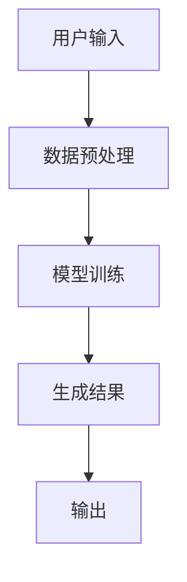

                 


# 自然语言生成在自动化财报分析中的应用

## 关键词
自然语言生成, 自动化财报分析, 财务报告, 人工智能, 深度学习, 自然语言处理

## 摘要
自然语言生成（NLP）在自动化财报分析中的应用正变得越来越重要。随着企业对高效、准确的财务分析需求不断增加，自然语言生成技术通过自动化处理财务报告中的文本信息，帮助企业在财务决策中节省时间和成本。本文将深入探讨自然语言生成在自动化财报分析中的核心概念、算法原理、系统架构及项目实战，同时结合实际案例分析，为读者提供全面的视角。

---

## 第一部分： 自然语言生成与自动化财报分析的背景

### 第1章： 自然语言生成的基本概念

#### 1.1 自然语言生成的定义
自然语言生成（Natural Language Generation, NLP）是人工智能领域的一个重要分支，旨在通过计算机生成与人类语言相似的文本。它通过分析数据和上下文，生成符合语法和语义的自然语言句子。

#### 1.2 自然语言生成的核心技术
自然语言生成涉及多项核心技术，包括：
- **文本生成模型**：如基于规则的生成、统计模型和神经网络模型。
- **语言模型**：用于预测下一个词的概率分布，帮助生成连贯的文本。
- **文本摘要**：将长文本压缩成简短的摘要，保留关键信息。
- **对话生成**：基于上下文生成对话式回复。

#### 1.3 自然语言生成的应用领域
自然语言生成广泛应用于多个领域，包括：
- **新闻报道**：自动生成新闻摘要。
- **客服系统**：通过生成回复来处理客户查询。
- **教育领域**：自动生成学习材料。

---

### 第2章： 自动化财报分析的背景与意义

#### 2.1 财务报告分析的重要性
财务报告是企业经济活动的重要记录，通常包含大量文本信息，如收入、支出、利润等。传统的人工分析方式效率低下，容易出错，因此自动化分析需求迫切。

#### 2.2 自动化财报分析的必要性
- **提高效率**：自动化处理大量财务文本，节省时间。
- **降低成本**：减少人工分析的人力成本。
- **提高准确性**：通过算法减少人为错误。

#### 2.3 自然语言生成在自动化财报分析中的作用
自然语言生成技术可以将结构化的财务数据转化为自然语言文本，生成财务摘要、报告或预测分析，帮助决策者快速获取关键信息。

---

## 第二部分： 自然语言生成的核心技术与原理

### 第3章： 自然语言生成的算法原理

#### 3.1 自然语言生成的主流模型
- **基于规则的模型**：通过预定义的规则生成文本，适用于简单场景。
- **统计模型**：基于概率分布生成文本，如n-gram模型。
- **神经网络模型**：如循环神经网络（RNN）、变换器（Transformer）等。

#### 3.2 自然语言生成的数学模型
- **循环神经网络（RNN）**：
  $$ P(y|x) = \prod_{i=1}^{n} P(y_i | y_{i-1}, x) $$
  RNN通过递归处理序列数据，生成连贯的文本。
- **变换器（Transformer）**：
  $$ \text{Encoder}(\mathbf{X}) \rightarrow \mathbf{Z} $$
  $$ \text{Decoder}(\mathbf{Z}, \mathbf{y}_{<i}) \rightarrow y_i $$
  变换器通过自注意力机制捕捉文本中的长距离依赖关系。

#### 3.3 自然语言生成的实现流程
1. **数据预处理**：清洗、分词、去停用词。
2. **模型训练**：使用训练数据优化模型参数。
3. **结果生成**：通过生成模型输出自然语言文本。

---

## 第三部分： 自然语言生成在财报分析中的具体应用

### 第4章： 自然语言生成在财务数据抽取中的应用

#### 4.1 财务数据抽取的挑战
- **数据格式多样**：财务报告可能包含表格、段落等多种形式。
- **信息复杂**：需要从非结构化文本中提取关键财务指标。

#### 4.2 基于自然语言生成的抽取模型
- **序列标注模型**：如CRF（条件随机场）用于命名实体识别。
- **生成模型**：如GPT用于生成结构化数据。

#### 4.3 实际案例分析
通过一个实际的财务报告，展示如何使用自然语言生成技术提取关键指标，如收入、利润等。

---

## 第四部分： 自然语言生成在财报分析中的系统架构

### 第5章： 系统架构设计

#### 5.1 系统功能设计
- **数据输入**：接收财务报告文本。
- **数据处理**：清洗和结构化处理。
- **模型推理**：生成财务摘要或分析报告。
- **结果输出**：输出生成的自然语言文本。

#### 5.2 系统架构图


#### 5.3 系统接口设计
- **API接口**：提供RESTful API，供其他系统调用。
- **数据格式**：JSON格式输入和输出。

---

## 第五部分： 自然语言生成在财报分析中的项目实战

### 第6章： 项目实战

#### 6.1 环境配置
- **Python**：3.8+
- **深度学习框架**：TensorFlow或Keras
- **自然语言处理库**：spaCy或NLTK

#### 6.2 核心实现代码
```python
import tensorflow as tf
from tensorflow.keras.layers import Input, Dense, LSTM
from tensorflow.keras.models import Model

# 输入层
inputs = Input(shape=(max_length,))
x = LSTM(128, return_sequences=True)(inputs)
x = Dense(64, activation='relu')(x)
outputs = Dense(vocab_size, activation='softmax')(x)

model = Model(inputs=inputs, outputs=outputs)
model.compile(loss='sparse_categorical_crossentropy', optimizer='adam', metrics=['accuracy'])
```

#### 6.3 实际案例分析
构建一个简单的财务报告摘要生成系统，展示如何从财务文本中提取关键信息并生成摘要。

---

## 第六部分： 总结与展望

### 第7章： 总结与展望

#### 7.1 本章小结
总结自然语言生成在自动化财报分析中的应用，强调其在提高效率和准确性方面的重要作用。

#### 7.2 未来展望
- **模型优化**：进一步提升生成模型的准确性和流畅性。
- **多语言支持**：扩展到多种语言的财务报告分析。
- **结合其他技术**：如图像识别技术，处理非文本形式的财务数据。

---

## 作者信息
作者：AI天才研究院 & 禅与计算机程序设计艺术

---

通过以上目录结构，您可以逐步撰写详细的正文内容，确保每一部分都深入浅出，结合理论与实践，为读者提供一个全面的视角。

