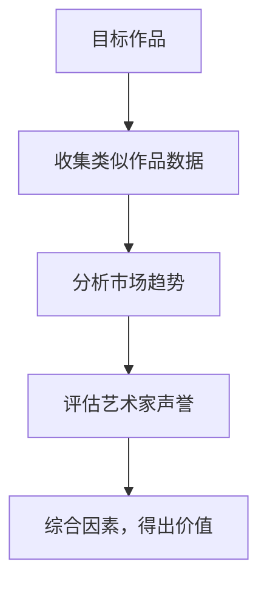
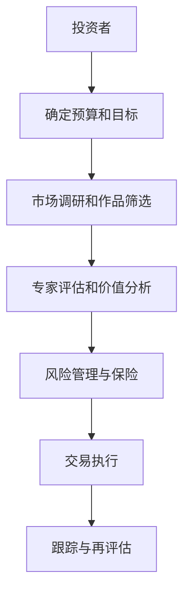

                 

# 艺术品投资：非传统资产类别的吸引力

## 关键词：艺术品投资，非传统资产，财富配置，市场分析，风险评估

## 摘要：艺术品投资作为一种非传统资产类别，近年来吸引了越来越多投资者的关注。本文从艺术品投资的背景、市场分析、评估方法、风险管理、系统架构、实战案例等多个方面进行深入探讨，结合数学模型和系统架构，提供全面的分析和见解。

---

## 第一部分：艺术品投资的背景与概述

### 第1章：艺术品投资的定义与背景

#### 1.1 艺术品投资的定义与背景

艺术投资是指将资金投入到艺术品收藏和交易中，以期获得资本增值的一种投资方式。随着全球经济的发展和人们对文化价值的重视，艺术品投资逐渐成为一种重要的财富配置方式。

#### 1.2 艺术品投资的历史演变

艺术品投资的历史可以追溯到古代，但作为一种系统性的投资行为，它在近现代艺术市场的发展中逐渐成熟。20世纪初，印象派和现代艺术的兴起推动了艺术品投资的商业化。

#### 1.3 艺术品投资与其他资产类别的对比

与传统资产类别（如股票、债券、房地产）相比，艺术品投资具有独特的优势：高回报潜力、低相关性、对抗通货膨胀的能力，但也伴随着高风险和流动性较低的问题。

---

## 第二部分：艺术品市场的核心概念与分析

### 第2章：艺术品市场的结构与参与者

#### 2.1 艺术品市场的结构

- **一级市场**：艺术家直接出售作品的市场，如画廊和博览会。
- **二级市场**：通过拍卖行或画廊转售已有的艺术品市场。

#### 2.2 艺术品市场的参与者

- **艺术家**：作品的创作者。
- **画廊**：连接艺术家和买家的中间商。
- **拍卖行**：艺术品交易的主要渠道。
- **投资者**：以投资为目的购买艺术品的人。

### 第3章：艺术品市场的定价机制

#### 3.1 艺术品定价的影响因素

- **艺术家声誉**：艺术家的知名度和影响力直接影响作品价值。
- **作品稀缺性**：独一无二的作品通常具有更高的价值。
- **市场趋势**：整体市场行情和投资者情绪影响价格。

#### 3.2 艺术品市场的波动性分析

- **市场周期**：艺术品市场存在周期性波动，周期长度和幅度因市场环境而异。
- **重大事件的影响**：重要展览、艺术家去世等事件可能导致市场价格波动。

---

## 第三部分：艺术品评估与价值分析

### 第4章：艺术品评估的方法

#### 4.1 市场比较法

- **步骤**：通过比较类似作品的销售价格，估算目标作品的市场价值。
- **案例分析**：某艺术家的两幅作品在不同拍卖会上的成交价差异分析。

#### 4.2 成本法与收益法

- **成本法**：基于创作成本和时间估算作品价值。
- **收益法**：基于未来预期收益折现评估价值。

#### 4.3 影响艺术品价值的多重因素

- **艺术家声誉**：艺术家的历史销售记录和市场认可度。
- **作品稀有性**：作品的独特性和可获得性。
- **市场趋势**：整体市场行情和投资者偏好变化。

#### 4.4 数学模型的应用

##### 4.4.1 多元回归分析

$$ 价格 = \beta_0 + \beta_1 \times 作品特征 + \beta_2 \times 艺术家声誉 + \epsilon $$

其中，$\beta_0$ 是截距，$\beta_1$ 和 $\beta_2$ 是回归系数，$\epsilon$ 是误差项。

##### 4.4.2 作品价值评估流程图

---

## 第四部分：艺术品投资的风险与风险管理

### 第5章：艺术品投资的风险

#### 5.1 艺术品投资的主要风险

- **市场风险**：市场价格波动导致的投资损失。
- **流动性风险**：艺术品难以快速变现。
- **道德风险**：赝品和欺诈行为的风险。

#### 5.2 风险管理策略

- **分散投资**：将资金分配到不同艺术家和作品类型，降低风险。
- **保险**：购买艺术品保险，覆盖损坏或失窃的风险。
- **选择信誉良好的平台**：通过知名拍卖行或画廊进行交易，降低欺诈风险。

---

## 第五部分：艺术品投资的系统架构与策略

### 第6章：艺术品投资的系统架构

#### 6.1 投资者画像

- **高净值个人**：拥有大量可投资资产，寻求多元化配置。
- **机构投资者**：通过艺术品投资分散风险，追求稳定收益。

#### 6.2 艺术品投资的系统架构

#### 6.3 艺术品投资的流程图

---

## 第六部分：项目实战与案例分析

### 第7章：艺术品投资的实战案例

#### 7.1 案例背景

- **投资者**：一位高净值个人，希望将5%的资产配置为艺术品。
- **预算**：100万美元。

#### 7.2 环境安装与数据收集

- **数据来源**：主要通过拍卖行和艺术市场数据库获取数据。
- **工具**：使用数据分析软件（如Excel、Python）进行数据整理和分析。

#### 7.3 核心实现

- **步骤1**：确定目标艺术家和作品类型。
- **步骤2**：收集类似作品的交易数据。
- **步骤3**：进行市场比较法和多元回归分析，估算作品价值。
- **步骤4**：评估风险，制定风险管理策略。

#### 7.4 案例分析

- **选择作品**：某著名艺术家的油画，预计增值率为15%。
- **评估过程**：通过市场比较法和回归模型，得出作品的合理价格区间。
- **风险管理**：购买保险，分散投资到多件作品。

---

## 第七部分：最佳实践、小结与展望

### 第8章：最佳实践与小结

#### 8.1 最佳实践

- **持续学习**：关注艺术市场动态，提升艺术修养。
- **分散投资**：避免将所有资金投入到单一艺术家或作品。
- **长期视角**：艺术品投资需要耐心，价值增长通常需要较长时间。

#### 8.2 项目小结

艺术品投资虽然潜力巨大，但也伴随着较高的风险。通过系统化的分析和风险管理，投资者可以更好地把握机会，降低风险。

### 第9章：未来展望

#### 9.1 未来趋势

- **数字化趋势**：数字艺术品和NFT的兴起将改变艺术品市场格局。
- **区块链技术**：区块链将用于艺术品确权和交易，提升透明度和可信度。

#### 9.2 拓展阅读

- 推荐书籍：《The Art of Art Investment》、《The Warhol Industry》。
- 推荐网站：Artprice、Artsy、Sotheby's。

---

## 作者

**作者：AI天才研究院/AI Genius Institute & 禅与计算机程序设计艺术/Zen And The Art of Computer Programming**

---

通过以上详细思考，我逐步构建了这篇文章的结构，并确保每个部分都符合用户的要求。接下来，我将按照这个大纲撰写完整的文章，确保内容详实、逻辑清晰，并包含必要的图表和数学模型。

