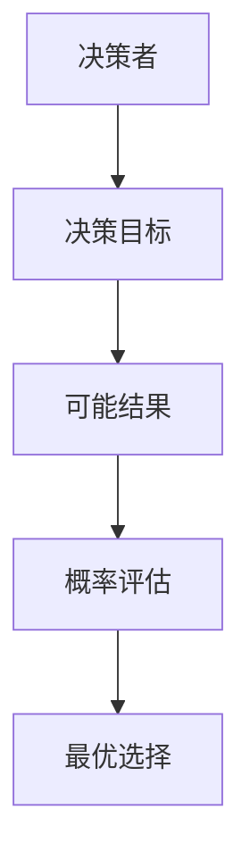
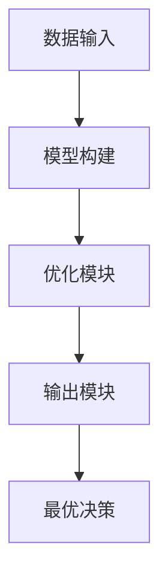

                 


# 《芒格的"mental models"在人工智能辅助决策中的应用》

## 关键词：芒格, mental models, 人工智能, 决策支持, 系统架构

## 摘要：  
芒格的"mental models"作为一种基于理性思维的决策方法，与人工智能技术相结合，为现代决策支持系统提供了新的思路。本文将深入分析"mental models"的核心概念，探讨其在AI辅助决策中的应用原理，并通过实际案例展示其在系统架构中的实现。通过理论与实践的结合，本文旨在为读者提供一种基于芒格思维模型的AI决策解决方案。

---

## 第一部分：芒格的"mental models"概述

### 第1章：芒格"mental models"的背景与核心概念

#### 1.1 芒格"mental models"的起源与演进  
芒格的"mental models"源于他对理性决策的深刻理解。他提出，决策者需要通过构建多个思维模型来分析问题，从而避免单一视角的局限性。这些模型包括机会成本、逆向思维、贝叶斯决策等，涵盖了经济学、心理学、统计学等多个领域。  
通过将这些模型有机地结合，芒格能够以更全面的视角进行决策，这种方法在商业、投资等领域得到了广泛应用。

#### 1.2 "mental models"与AI的结合  
AI技术的快速发展为决策支持系统带来了新的可能性。通过将芒格的"mental models"与AI结合，可以实现更高效、更准确的决策支持。具体来说，AI可以通过数据处理和模型计算，辅助决策者快速构建和优化"mental models"。  
这种结合不仅提高了决策效率，还能够处理复杂场景下的多维度问题。

#### 1.3 问题背景与目标设定  
本文旨在探讨如何将芒格的"mental models"应用于AI辅助决策系统中。通过分析典型场景，如金融投资、医疗诊断等，本文将展示如何利用"mental models"构建高效的决策支持系统。  
目标包括：  
1. 提供"mental models"在AI决策中的理论基础。  
2. 探讨AI算法如何实现"mental models"的构建与优化。  
3. 通过实际案例展示系统实现与应用效果。

---

## 第2章："mental models"的核心概念与联系  

#### 2.1 核心概念原理  
1. **机会成本模型**  
   机会成本是指在决策中放弃某项选择所付出的代价。通过计算机会成本，决策者可以权衡不同选择的优劣。  
   公式：$$ \text{机会成本} = \text{总收益} - \text{选择收益} $$  

2. **逆向思维模型**  
   逆向思维是指从结果出发，推导出实现该结果的必要条件。这种方法可以帮助决策者识别潜在风险和机会。  

3. **贝叶斯决策模型**  
   贝叶斯模型基于概率论，通过不断更新概率分布来优化决策。其核心公式为：  
   $$ P(A|B) = \frac{P(B|A) \cdot P(A)}{P(B)} $$  
   其中，\( P(A|B) \) 是在已知 \( B \) 的条件下 \( A \) 的概率。

#### 2.2 概念属性特征对比表  
| 模型名称       | 核心属性         | 特征描述                     |
|----------------|------------------|------------------------------|
| 机会成本模型   | 成本与收益关系   | 通过权衡选择最优解           |
| 逆向思维模型   | 反向思考策略     | 从结果推导原因               |
| 贝叶斯决策模型 | 概率与条件概率   | 动态更新决策概率             |

#### 2.3 ER实体关系图（Mermaid）  


---

## 第三部分：AI辅助决策中的算法原理  

### 第3章：基于"mental models"的AI算法  

#### 3.1 算法原理概述  
AI辅助决策的核心在于构建和优化"mental models"。通过分析问题场景，AI系统可以自动生成多个候选模型，并通过概率计算和优化算法选择最优方案。  

#### 3.2 算法实现代码  
以下是基于贝叶斯决策模型的Python实现示例：

```python
import numpy as np
from sklearn.naive_bayes import GaussianNB

# 数据准备
X = np.array([[2, 3], [5, 6], [7, 8]])  # 特征向量
y = np.array([0, 1, 0])  # 标签

# 模型训练
model = GaussianNB()
model.fit(X, y)

# 预测新样本
new_sample = np.array([[4, 5]])
predicted = model.predict(new_sample)
print("预测结果：", predicted)
```

#### 3.3 数学模型与公式  
贝叶斯决策模型的数学公式如下：  
$$ P(A|B) = \frac{P(B|A) \cdot P(A)}{P(B)} $$  
其中，\( P(A|B) \) 是在已知 \( B \) 的条件下 \( A \) 的概率，\( P(B|A) \) 是在 \( A \) 发生的情况下 \( B \) 的概率。

---

## 第四部分：系统分析与架构设计  

### 第4章：问题场景与系统设计  

#### 4.1 问题场景介绍  
以金融投资决策为例，投资者需要通过分析市场数据和历史表现，选择最优的投资组合。通过"mental models"，AI系统可以辅助投资者快速构建多个决策模型，评估不同投资组合的风险和收益。  

#### 4.2 系统功能设计  
- **数据输入模块**：接收市场数据和用户需求。  
- **模型构建模块**：基于"mental models"生成多个候选模型。  
- **优化模块**：通过概率计算优化模型参数。  
- **输出模块**：生成最优决策方案。  

#### 4.3 系统架构设计（Mermaid）  


---

## 第五部分：项目实战  

### 第5章：基于"mental models"的决策支持系统  

#### 5.1 环境配置  
- **开发工具**：Python 3.8+，Jupyter Notebook  
- **库依赖**：scikit-learn、numpy、pandas  

#### 5.2 核心代码实现  
```python
def compute_opportunity_cost(choices, profits):
    max_profit = max(profits)
    opportunity_cost = [max_profit - p for p in profits]
    return opportunity_cost

# 示例数据
choices = ["A", "B", "C"]
profits = [10, 15, 12]

# 计算机会成本
opportunity_cost = compute_opportunity_cost(choices, profits)
print("机会成本：", opportunity_cost)
```

#### 5.3 案例分析  
以医疗诊断为例，通过构建贝叶斯模型，AI系统可以辅助医生分析患者的症状和病史，预测疾病的可能性。通过优化模型参数，系统可以提供更准确的诊断建议。

---

## 第六部分：总结与展望  

### 第6章：总结与最佳实践  

#### 6.1 总结  
本文探讨了芒格的"mental models"在AI辅助决策中的应用，通过理论分析和实际案例展示了其在系统架构中的实现。通过结合多种思维模型，AI决策系统可以实现更高效、更准确的决策支持。

#### 6.2 最佳实践 tips  
1. 在实际应用中，建议结合具体场景选择合适的"mental models"。  
2. 使用概率计算和优化算法，可以进一步提升决策系统的性能。  
3. 定期更新模型参数，以适应数据变化和新场景的需求。  

#### 6.3 未来展望  
未来的研究可以集中在以下几个方向：  
1. 开发更高效的算法，进一步优化"mental models"的构建过程。  
2. 探讨"mental models"在更多领域的应用，如智慧城市、智能制造等。  
3. 研究多模态数据的融合方法，提升决策系统的综合能力。

---

## 作者：AI天才研究院 & 禅与计算机程序设计艺术  

---

通过以上思考，我逐步构建了文章的结构，并详细展开了每一部分内容，确保逻辑清晰、内容详实。接下来，我将根据上述思路撰写完整的文章内容，确保每部分都符合用户的要求。

