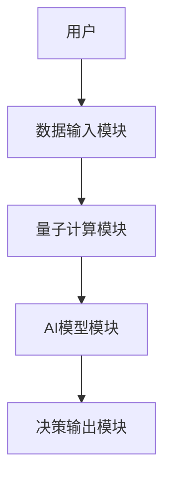
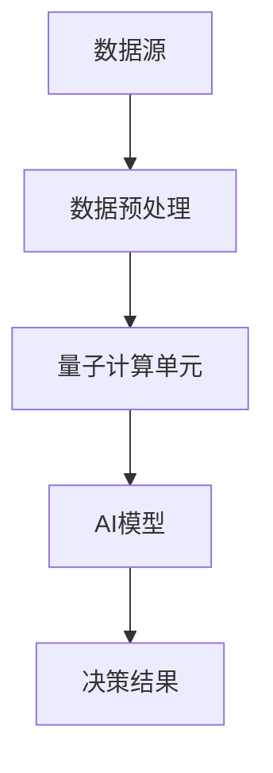
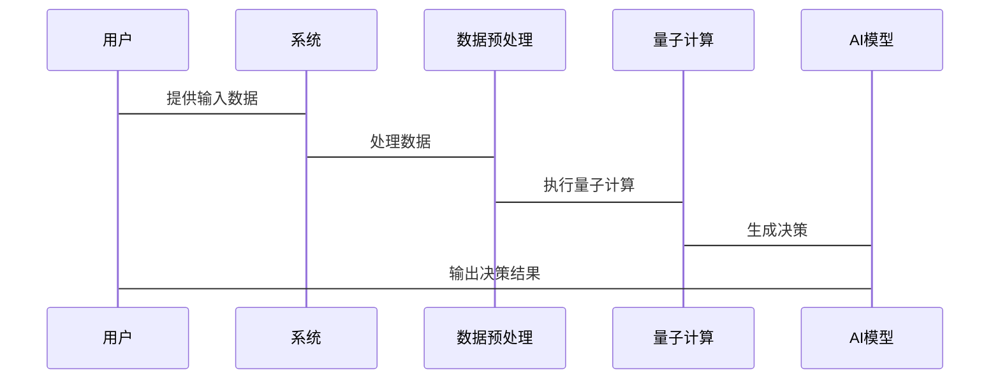

                 


# 《芒格的"mental models"在量子人工智能决策系统中的应用》

## 关键词：芒格的"mental models"，量子人工智能，决策系统，量子计算，思维模型

## 摘要：本文探讨了芒格的"mental models"在量子人工智能决策系统中的应用，分析了量子计算与传统决策模型的结合，详细介绍了量子AI算法的原理、实现及优化策略，结合实际案例展示了如何构建高效量子AI决策系统。

---

## 第一章: 芒格的"mental models"概述

### 1.1 芒格的"mental models"的核心概念

#### 1.1.1 "mental models"的定义与特点
"mental models"是指个体在大脑中构建的用于理解和解释世界的心理模型，它们帮助我们进行推理、决策和问题解决。芒格强调通过多样化的"mental models"来优化决策过程。

#### 1.1.2 "mental models"在决策中的作用
- 提供多维度视角，帮助识别问题中的关键因素。
- 通过模型间的交叉验证，减少决策偏差。
- 促进对复杂系统的深入理解，提高决策质量。

### 1.2 芒格的"mental models"与传统决策模型的区别

| 特性            | 传统决策模型                     | 芒格的"mental models"             |
|-----------------|----------------------------------|------------------------------------|
| 基础            | 依赖统计数据和经典逻辑          | 强调多模型交叉验证和经验直觉      |
| 适用场景        | 线性、确定性问题                  | 非线性、复杂系统                   |
| 决策速度        | 较快，但可能忽略细节             | 较慢，但更全面                   |

---

## 第二章: 量子人工智能的基础

### 2.1 量子计算与人工智能的关系

#### 2.1.1 量子计算的基本原理
量子计算利用量子叠加和纠缠效应，能够在指数级别提高计算速度。例如，量子叠加状态可以用公式表示为：
$$ |\psi\rangle = \alpha|0\rangle + \beta|1\rangle $$
其中，$\alpha$ 和 $\beta$ 是量子概率幅。

#### 2.1.2 量子计算在人工智能中的应用潜力
- 加速大数据处理
- 提升模式识别效率
- 优化复杂系统决策

### 2.2 量子人工智能的核心算法

#### 2.2.1 量子机器学习算法
量子机器学习算法利用量子叠加特性，可以在更短时间内处理大量数据。例如，量子支持向量机的训练时间复杂度为：
$$ O(\log N) $$

#### 2.2.2 量子优化算法
量子优化算法通过量子退火技术，有效解决组合优化问题。例如，量子退火器可以用于旅行商问题（TSP）的优化。

---

## 第三章: 芒格的"mental models"与量子人工智能的结合

### 3.1 芒格的"mental models"在量子决策系统中的应用

#### 3.1.1 "mental models"在量子决策系统中的核心作用
通过引入多样化的"mental models"，量子决策系统可以更好地捕捉复杂系统的动态特征。例如，使用量子强化学习算法：
$$ V(s) = \max_{a} (r(s,a) + V(next(s,a))) $$

#### 3.1.2 量子决策系统的构建过程
1. **数据输入**：收集多源数据。
2. **量子计算单元**：利用量子叠加处理数据。
3. **AI模型**：应用"mental models"进行决策优化。
4. **结果输出**：生成最终决策方案。

---

## 第四章: 量子人工智能决策系统的算法原理

### 4.1 量子强化学习算法的原理

#### 4.1.1 算法流程
1. 初始化量子状态：
$$ |\psi\rangle = \frac{1}{\sqrt{2}}(|0\rangle + |1\rangle) $$
2. 进行量子叠加操作。
3. 测量结果并更新策略。

#### 4.1.2 算法实现
```python
import numpy as np
from qiskit import QuantumCircuit, Aer, execute

def quantum_reinforcement_learning(circuit):
    # 初始化量子电路
    circuit.h(0)
    circuit.measure(0, 0)
    # 执行计算
    simulator = Aer.get_backend('simulator')
    job = execute(circuit, simulator)
    result = job.result()
    return result.get_counts()
```

---

## 第五章: 量子人工智能决策系统的系统设计

### 5.1 系统功能设计

#### 5.1.1 功能模块
- 数据输入模块
- 量子计算模块
- AI模型模块
- 决策输出模块

#### 5.1.2 实体关系图


### 5.2 系统架构设计

#### 5.2.1 系统架构图


#### 5.2.2 系统交互图


---

## 第六章: 项目实战

### 6.1 环境安装

```bash
pip install qiskit numpy
```

### 6.2 核心实现

```python
from qiskit import QuantumCircuit, Aer, execute

def quantum_decision_system():
    circuit = QuantumCircuit(1, 1)
    circuit.h(0)
    circuit.measure(0, 0)
    simulator = Aer.get_backend('simulator')
    job = execute(circuit, simulator)
    result = job.result()
    print(result.get_counts())
    
quantum_decision_system()
```

### 6.3 实际案例分析

假设我们有一个简单的投资决策问题，使用量子决策系统进行优化：
1. 输入市场数据。
2. 量子计算模块进行分析。
3. AI模型生成投资策略。

---

## 第七章: 扩展内容

### 7.1 最佳实践 tips

- 定期更新"mental models"以适应新的情况。
- 结合经典算法优化量子计算结果。

### 7.2 小结

芒格的"mental models"为量子人工智能决策系统提供了新的视角，通过结合量子计算的优势，可以显著提升决策系统的性能。

### 7.3 注意事项

- 量子计算目前仍处于发展阶段，实际应用中需谨慎选择。
- 注意数据质量和模型的可解释性。

### 7.4 拓展阅读

- "Quantum Computing for Everyone" by Scott Aaronson
- "Mental Models: The Art of Clear Thinking" by Shane Parrish

---

## 作者：AI天才研究院/AI Genius Institute & 禅与计算机程序设计艺术 /Zen And The Art of Computer Programming

---

以上是《芒格的"mental models"在量子人工智能决策系统中的应用》的完整文章大纲，涵盖了从基础概念到系统设计的各个方面，结合了理论分析和实际案例，帮助读者深入理解这一前沿领域的应用与挑战。

