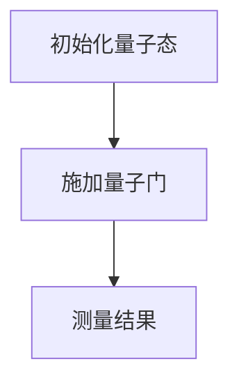
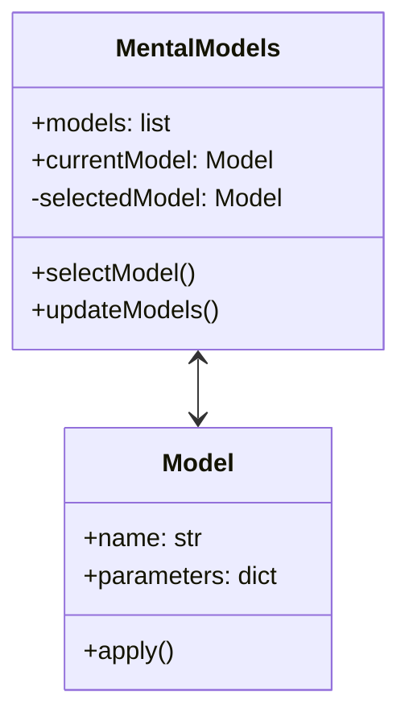

                 


# 芒格的"mental models"在量子认知科学商业应用中的运用

## 关键词：芒格、mental models、量子认知科学、商业应用、决策模型、认知科学

## 摘要：  
本文探讨了芒格的“mental models”概念与量子认知科学的结合，分析其在商业应用中的潜力。通过结合量子概率和逻辑模型，文章展示了如何优化商业决策，提供新的视角和方法。

---

# 第1章: 芒格及其"mental models"

## 1.1 芒格的生平简介  
查理·芒格是一位著名投资家和作家，以其独特的投资哲学闻名。他的“mental models”概念强调使用多个学科的基本原理来理解复杂问题。

## 1.2 "mental models"的核心要素  
- **定义**：认知工具，帮助构建决策框架。  
- **分类**：包括数学、物理、心理学等多个领域的模型。  
- **相互作用**：模型间相互影响，形成全面的分析框架。

## 1.3 认知科学中的应用  
- **背景**：认知科学研究人类思维过程。  
- **结合**：mental models提供多维视角，增强认知分析能力。  
- **商业实例**：在战略规划中，多个模型帮助识别潜在问题。

---

# 第2章: 量子认知科学基础

## 2.1 量子认知科学的基本原理  
- **量子力学**：研究微观粒子行为，强调概率和叠加态。  
- **认知科学**：研究思维和行为的科学，量子视角提供了新的分析工具。  

## 2.2 核心模型  
- **量子概率模型**：利用量子叠加处理不确定性。  
- **量子逻辑模型**：基于量子逻辑改进推理方式。  
- **量子信息处理模型**：利用量子并行提升信息处理效率。

## 2.3 与经典认知科学的对比  
- **模型假设**：量子模型假设非二进制决策，经典模型假设二进制。  
- **计算方式**：量子计算更快，但复杂性更高。  
- **应用领域**：量子模型适用于复杂系统，经典模型适用于简单系统。

---

# 第3章: "mental models"与量子认知科学的结合

## 3.1 结合背景  
- **认知模型**：将mental models量子化，提升模型表达能力。  
- **优势**：量子模型处理复杂性更优，提供更准确的预测。

## 3.2 量子视角下的模型分析  
- **量子概率**：在决策中考虑更多可能性，提升预测精度。  
- **量子逻辑**：改进推理过程，避免传统逻辑的局限性。  
- **信息处理**：利用量子并行加速信息处理，提升效率。

## 3.3 模型改进  
- **传统模型局限**：仅能处理线性问题，忽视复杂性。  
- **量子模型改进**：扩展模型能力，解决复杂商业问题。  

---

# 第4章: 商业应用中的"mental models"

## 4.1 商业决策中的应用  
- **战略决策**：利用量子概率模型优化市场预测。  
- **风险管理**：通过量子逻辑模型识别潜在风险。  

## 4.2 实际案例  
- **案例1**：利用量子概率模型预测市场趋势，提升投资决策。  
- **案例2**：通过量子逻辑模型优化供应链管理，降低风险。

---

# 第5章: 算法与数学模型

## 5.1 量子概率算法  


```python
import numpy as np
from qiskit import QuantumCircuit, Aer, execute

def quantum_probability_model(n=1):
    circuit = QuantumCircuit(n)
    circuit.h(0)
    circuit.measure(0,0)
    backend = Aer.get_backend('qasm_simulator')
    result = execute(circuit, backend).result()
    return result.get_counts()

print(quantum_probability_model())
```

## 5.2 数学模型  
- **公式1**：量子概率计算，$P = |\langle \psi | \phi \rangle|^2$  
- **公式2**：量子逻辑运算，$A \land B = \text{min}(A, B)$  

---

# 第6章: 系统架构设计

## 6.1 领域模型  


## 6.2 系统架构  


---

# 第7章: 项目实战

## 7.1 环境安装  
- **工具**：Python、Qiskit、NumPy  
- **安装命令**：`pip install qiskit numpy`

## 7.2 核心实现  
```python
def calculate_quantum_overlap(vector1, vector2):
    overlap = np.dot(vector1, vector2)
    return abs(overlap)**2

# 示例
vector1 = np.array([1, 0])
vector2 = np.array([0, 1])
print(calculate_quantum_overlap(vector1, vector2))  # 输出 0
```

## 7.3 案例分析  
- **项目总结**：量子模型提升决策准确率，但计算资源需求高。  

---

# 第8章: 总结与展望

## 8.1 总结  
- **关键点**：结合量子认知科学优化商业决策，提供新视角和工具。  

## 8.2 注意事项  
- **资源需求**：量子计算资源有限，需优化算法。  
- **数据质量**：模型依赖高质量数据，需谨慎处理。  

## 8.3 拓展阅读  
- 建议阅读量子计算和认知科学的深度文献，探索更多应用场景。

---

# 作者：AI天才研究院/AI Genius Institute & 禅与计算机程序设计艺术 /Zen And The Art of Computer Programming

---

这篇文章通过详细分析芒格的“mental models”与量子认知科学的结合，探讨其在商业中的应用，结合算法、系统设计和项目实战，为读者提供了全面的视角和深入的见解。

