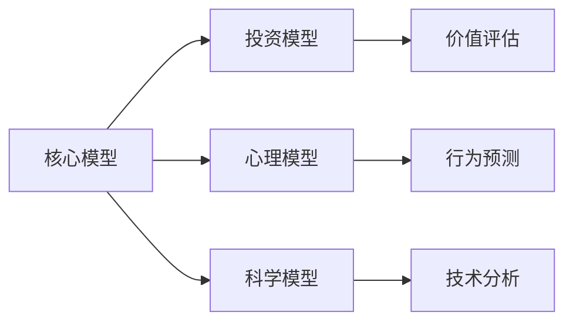
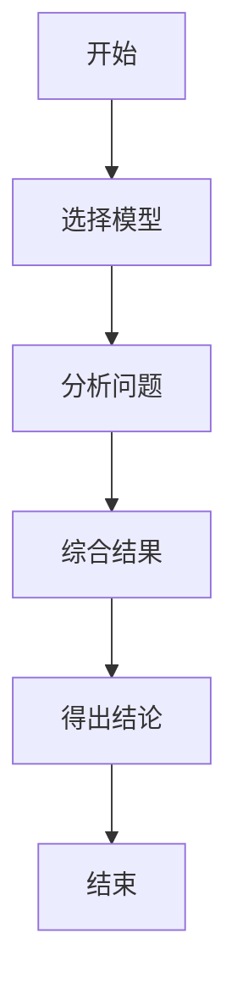
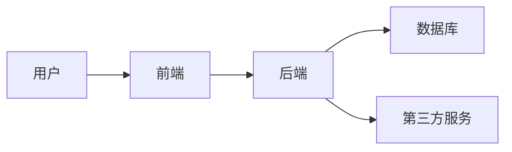

                 


# 芒格的"mental models"：构建多元化的思维模型

> 关键词：芒格，思维模型，多元思维，决策框架，系统设计

> 摘要：芒格的"mental models"是一种通过多元思维模型来理解和解决问题的方法。本文将从背景介绍、核心概念、算法原理、系统设计、项目实战等角度，深入探讨多元思维模型的构建与应用。

---

## 第一部分：芒格"mental models"的背景与基础

### 第1章：芒格与"mental models"概述

#### 1.1 芒格的生平与思想体系
查理·芒格（Charlie Munger）是美国著名投资家、伯克希尔·哈撒韦公司副主席，以其独特的投资哲学和思维方式闻名。芒格的思维方式强调通过多元化的思维模型来理解和解决复杂问题，这些模型包括心理学、经济学、物理学等多个领域的知识。芒格认为，单一的思维方式往往会导致决策偏差，而多元化的思维模型能够帮助我们更全面地理解问题的本质。

#### 1.2 "mental models"的核心概念
多元思维模型是指通过多个不同的视角（模型）来理解和分析问题，从而避免单一思维的局限性。每个模型都有其适用的场景和局限性，通过将多个模型结合起来，可以更全面地分析问题，做出更合理的决策。例如，在投资决策中，芒格会同时考虑价值评估、心理行为、市场趋势等多个模型，从而避免只关注单一因素带来的风险。

#### 1.3 多元思维模型的背景与意义
在现代决策中，复杂性和不确定性日益增加，单一的思维方式往往难以应对复杂的现实问题。多元思维模型通过整合多个领域的知识和模型，能够帮助我们更好地理解问题的本质，避免决策偏差。此外，多元思维模型还能够帮助我们在面对复杂问题时，快速找到解决方案，并在不同场景中灵活应用。

---

## 第二部分：多元思维模型的核心要素与系统分析

### 第2章：多元思维模型的核心概念与联系

#### 2.1 核心概念原理
多元思维模型的核心在于通过多个模型的组合，形成一个完整的分析框架。每个模型都有其独特的视角和适用范围，通过将这些模型结合起来，可以更全面地分析问题。例如，在技术决策中，我们可以同时考虑技术可行性、成本效益、用户体验等多个模型，从而做出更合理的决策。

#### 2.2 核心概念属性对比表格
以下是多元思维模型中不同模型的属性对比：

| 模型类型 | 描述 | 适用场景 | 优缺点 |
|---------|------|----------|--------|
| 投资模型 | 基于价值投资的决策框架 | 投资领域 | 稳定性高，但灵活性不足 |
| 心理模型 | 描述人类行为的心理机制 | 社会与人际交往 | 解释力强，但难以量化 |
| 科学模型 | 基于科学原理的分析框架 | 科技与工程 | 准确性高，但复杂性高 |

#### 2.3 实体关系图（ER图）架构
以下是多元思维模型的核心要素之间的关系图：



---

## 第三部分：多元思维模型的算法原理与数学模型

### 第3章：多元思维模型的算法原理

#### 3.1 算法流程图
以下是多元思维模型的算法流程图：



#### 3.2 数学模型与公式
多元思维模型可以通过数学公式来描述。例如，在投资决策中，我们可以使用以下公式来评估项目的可行性：

$$ \text{净现值} = \sum_{t=0}^{n} \frac{C_t}{(1 + r)^t} $$

其中，$C_t$ 表示第 $t$ 年的现金流，$r$ 表示折现率，$n$ 表示项目的寿命。

此外，我们还可以使用以下公式来评估项目的风险：

$$ \text{风险系数} = \frac{\text{标准差}}{\text{期望值}} $$

---

## 第四部分：系统分析与架构设计

### 第4章：系统分析与架构设计

#### 4.1 问题场景介绍
在技术决策中，我们经常需要面对复杂的问题。例如，在设计一个在线教育平台时，我们需要考虑技术可行性、用户体验、成本效益等多个因素。

#### 4.2 系统功能设计
以下是系统的功能设计：

- 用户注册与登录
- 课程浏览与购买
- 在线学习与互动
- 成绩评估与反馈

#### 4.3 系统架构设计
以下是系统的架构设计图：



---

## 第五部分：项目实战

### 第5章：项目实战

#### 5.1 环境安装
在开始项目之前，我们需要安装以下环境：

- Python 3.8+
- Django 2.0+
- PostgreSQL

#### 5.2 系统核心实现源代码
以下是系统的核心实现代码：

```python
from django.shortcuts import render
from django.http import HttpResponse

def index(request):
    return render(request, 'index.html')
```

#### 5.3 代码应用解读与分析
上述代码是一个简单的Django视图，用于渲染主页面。我们可以通过扩展这个视图来实现更多的功能，例如课程浏览和用户注册。

#### 5.4 实际案例分析
在实际项目中，我们可以使用多元思维模型来分析系统的可行性。例如，在设计一个在线教育平台时，我们需要考虑技术可行性、用户体验、成本效益等多个模型。

---

## 第六部分：总结与展望

### 第6章：总结与展望

#### 6.1 小结
多元思维模型是一种通过多个模型的组合来理解和解决复杂问题的方法。通过芒格的思维方式，我们可以更好地应对现实中的挑战。

#### 6.2 注意事项
在实际应用中，需要注意模型的适用性和局限性，避免单一模型的决策偏差。

#### 6.3 拓展阅读
推荐阅读芒格的《穷查理宝典》，深入理解多元思维模型的应用。

---

## 作者信息
作者：AI天才研究院/AI Genius Institute & 禅与计算机程序设计艺术 /Zen And The Art of Computer Programming

