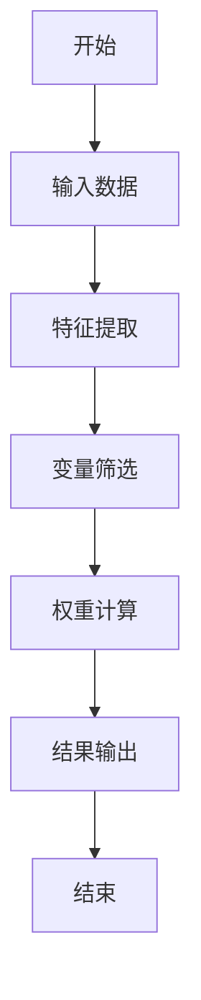
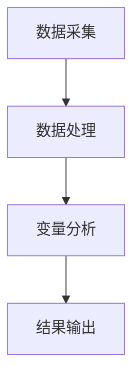

                 


# 芒格的"关键变量"理论：找出决定投资成败的核心因素

**关键词：**芒格、关键变量、投资决策、系统分析、数学模型、项目实战

**摘要：** 本文深入探讨了芒格的“关键变量”理论，分析了该理论在投资决策中的核心作用。通过系统的理论背景介绍、关键变量的识别方法、数学模型与算法的详细讲解，以及实际案例分析，本文为读者提供了从理论到实践的全面指导。通过构建基于关键变量理论的系统架构，并结合项目实战，帮助读者掌握如何在投资中识别和利用关键变量，从而做出更明智的决策。

---

# 第一部分: 芒格"关键变量"理论的背景与核心概念

## 第1章: 芒格"关键变量"理论概述

### 1.1 芒格的生平与投资哲学

#### 1.1.1 芒格的生平简介

查理·芒格（Charlie Munger）是美国著名投资家、作家和慈善家，巴菲特的长期合作伙伴。他不仅是伯克希尔哈撒韦公司的副主席，更是价值投资理论的重要推动者。芒格的思想深刻影响了现代投资理论的发展，他提出的“关键变量”理论是其思想体系中的核心概念之一。

#### 1.1.2 芒格的投资哲学与思想体系

芒格的投资哲学强调“逆向思维”和“多学科思维模型”。他认为，投资成功的关键在于识别影响投资结果的核心变量，并通过这些变量的分析来预测市场的变化。芒格的思想不仅仅是关于投资，更是一种思维方式，强调通过系统性分析来找到问题的关键。

#### 1.1.3 芒格"关键变量"理论的提出背景

在复杂的市场环境中，投资者往往面临海量的信息和数据。芒格意识到，关键变量的识别能够帮助投资者聚焦于真正影响投资结果的因素，从而简化决策过程并提高准确性。关键变量理论的核心在于，通过分析影响投资结果的几个关键因素，来制定投资策略。

---

### 1.2 关键变量理论的核心概念

#### 1.2.1 关键变量的定义与特征

关键变量是指那些对投资结果具有决定性影响的因素。这些变量通常是少数的，但它们能够解释大部分的投资结果。关键变量具有以下特征：

1. **影响力强**：关键变量对投资结果的影响显著。
2. **可测量性**：关键变量可以通过数据量化。
3. **稳定性**：关键变量在一定时间内相对稳定。

#### 1.2.2 关键变量在投资中的作用

在投资决策中，关键变量的作用主要体现在以下几个方面：

1. **简化决策过程**：通过识别关键变量，投资者可以减少需要考虑的因素，从而简化决策过程。
2. **提高准确性**：关键变量能够更准确地预测投资结果。
3. **增强策略的可操作性**：基于关键变量的策略更容易实施和调整。

#### 1.2.3 关键变量与其他投资理论的对比

与传统投资理论相比，关键变量理论更注重对核心因素的分析。例如，与技术分析相比，关键变量理论更关注影响市场趋势的根本因素；与基本面分析相比，关键变量理论更强调对关键因素的聚焦。

---

## 第2章: 关键变量理论的核心要素

### 2.1 关键变量的分类与特征

#### 2.1.1 内在变量与外在变量

内在变量是指与公司内部运营相关的因素，如管理团队、财务状况等。外在变量是指与市场环境相关的因素，如宏观经济指标、行业趋势等。

#### 2.1.2 宏观变量与微观变量

宏观变量是指影响整个市场的因素，如GDP增长率、利率等。微观变量是指影响具体公司的因素，如公司的盈利能力、市场占有率等。

#### 2.1.3 确定性变量与不确定性变量

确定性变量是指能够被准确预测的因素，如公司的历史财务数据。不确定性变量是指难以预测的因素，如政策变化。

---

### 2.2 关键变量的识别方法

#### 2.2.1 定性分析法

定性分析法通过分析变量的性质和影响程度来识别关键变量。例如，可以通过分析市场的竞争格局来确定行业集中度是否是一个关键变量。

#### 2.2.2 定量分析法

定量分析法通过统计方法来识别关键变量。例如，可以通过回归分析来确定哪些变量对投资回报的影响最大。

#### 2.2.3 综合分析法

综合分析法结合定性分析和定量分析，综合考虑变量的性质和影响程度来识别关键变量。

---

### 2.3 关键变量的权重与影响

#### 2.3.1 变量权重的计算方法

变量权重可以通过其对投资结果的影响程度来计算。例如，可以使用熵权法来计算变量权重。

$$ w_i = \frac{f_i}{\sum_{j=1}^{n} f_j} $$

其中，$w_i$ 表示第 $i$ 个变量的权重，$f_i$ 表示第 $i$ 个变量的影响程度。

#### 2.3.2 变量影响的评估标准

变量影响的评估标准可以通过其对投资结果的预测能力来衡量。例如，可以通过 ROC 曲线来评估变量的分类能力。

#### 2.3.3 变量权重的动态调整

变量权重需要根据市场环境的变化进行动态调整。例如，当市场环境发生变化时，某些变量的权重可能会增加或减少。

---

## 第3章: 关键变量理论的数学模型与算法

### 3.1 关键变量分析的数学模型

关键变量分析的数学模型可以通过回归分析来实现。例如，可以使用多元线性回归模型来确定哪些变量对投资回报的影响最大。

$$ y = \beta_0 + \beta_1x_1 + \beta_2x_2 + \dots + \beta_nx_n + \epsilon $$

其中，$y$ 表示投资回报，$x_i$ 表示第 $i$ 个变量，$\beta_i$ 表示变量的系数，$\epsilon$ 表示误差项。

### 3.2 关键变量分析的算法流程

关键变量分析的算法流程如下：



---

### 3.3 算法实现与代码示例

#### 3.3.1 数据预处理

```python
import pandas as pd

# 读取数据
data = pd.read_csv('investment_data.csv')

# 删除缺失值
data = data.dropna()

# 标准化数据
from sklearn.preprocessing import StandardScaler
scaler = StandardScaler()
data_scaled = scaler.fit_transform(data)
```

#### 3.3.2 特征提取与变量筛选

```python
from sklearn.feature_selection import SelectKBest, f_regression

# 特征选择
selector = SelectKBest(score_func=f_regression, k=5)
selected_features = selector.fit_transform(data_scaled, target)
```

---

# 第二部分: 系统分析与架构设计

## 第4章: 投资分析系统的架构设计

### 4.1 系统功能设计

投资分析系统的功能模块包括：

1. 数据采集模块
2. 数据处理模块
3. 变量分析模块
4. 结果输出模块

---

### 4.2 系统架构设计

投资分析系统的架构如下：



---

## 第5章: 项目实战与案例分析

### 5.1 环境安装与配置

#### 5.1.1 安装Python环境

```bash
python --version
pip install numpy pandas scikit-learn
```

---

### 5.2 系统核心实现源代码

#### 5.2.1 数据预处理代码

```python
import pandas as pd
from sklearn.preprocessing import StandardScaler

# 读取数据
data = pd.read_csv('investment_data.csv')

# 删除缺失值
data = data.dropna()

# 标准化数据
scaler = StandardScaler()
data_scaled = scaler.fit_transform(data)
```

---

### 5.3 案例分析与结果解读

#### 5.3.1 投资策略的制定

通过关键变量分析，我们可以识别出影响投资回报的关键因素，并制定相应的投资策略。例如，如果管理团队的稳定性是一个关键变量，我们可以优先选择管理团队稳定的公司进行投资。

---

## 第6章: 最佳实践与总结

### 6.1 小结

芒格的“关键变量”理论为我们提供了一种简化投资决策的方法。通过识别关键变量，我们可以更有效地分析市场趋势并制定投资策略。

### 6.2 注意事项

在实际应用中，需要注意以下几点：

1. 关键变量的选择需要结合具体的投资环境。
2. 需要定期更新关键变量的权重。
3. 需要注意变量之间的相互影响。

### 6.3 拓展阅读

推荐阅读芒格的《穷查理宝典》以及巴菲特的《聪明的投资者》，以更深入地理解关键变量理论。

---

# 作者：AI天才研究院/AI Genius Institute & 禅与计算机程序设计艺术/Zen And The Art of Computer Programming

---

希望这篇文章能帮助读者更好地理解芒格的“关键变量”理论，并将其应用于实际投资决策中。通过系统的理论分析和实际案例的剖析，我们相信读者能够掌握关键变量的识别方法，并在投资中取得更好的成果。

