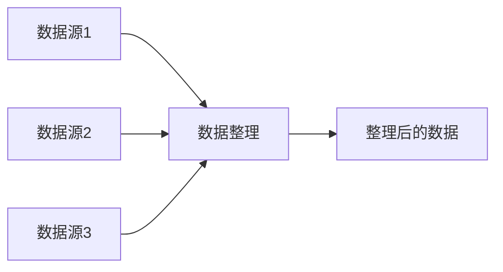
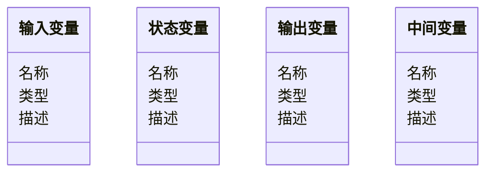
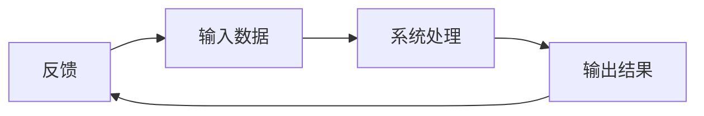

                 


# 第二章: 关键变量识别的核心概念与原理

## 2.1 关键变量识别的核心概念

### 2.1.1 变量的分类与层次
在复杂系统中，变量可以分为多个层次。我们可以将变量分为以下几类：

- **输入变量**：这些是系统外部的因素，直接影响系统的行为。
- **状态变量**：描述系统在某一时刻的状态。
- **输出变量**：系统在处理输入后产生的结果。
- **中间变量**：连接输入和输出的桥梁，影响系统行为的变量。

以下是一个简单的分类表格：

| 类型          | 描述                                      |
|---------------|-----------------------------------------|
| 输入变量      | 系统外部的因素，直接影响系统             |
| 状态变量      | 描述系统当前的状态                       |
| 输出变量      | 系统处理后的结果                       |
| 中间变量      | 连接输入和输出，影响系统行为的变量       |

### 2.1.2 关键变量的特征
关键变量具有以下几个主要特征：

1. **影响力**：关键变量对系统的行为或结果有显著影响。
2. **敏感性**：关键变量的变化容易被感知和测量。
3. **可控性**：关键变量是可以被投资者影响或控制的因素。
4. **稳定性**：关键变量在一定时间内相对稳定，不易频繁变化。

### 2.1.3 变量之间的关系
变量之间的关系可以用多种方式表示，包括因果关系、相关关系和依赖关系。以下是一个简单的变量关系图：


在这个图中，收入影响利润，利润影响股东权益，股东权益进一步影响股价。这个图展示了变量之间的因果关系链。

## 2.2 关键变量识别的逻辑框架

### 2.2.1 系统思维与整体性分析
系统思维在关键变量识别中起着关键作用。我们需要从整体的角度来看待系统，而不是单独分析每个部分。以下是一个简单的系统架构图：


这个图展示了公司、行业、经济环境、政策和市场之间的相互关系。通过整体分析，我们可以更好地识别关键变量。

### 2.2.2 变量的因果关系分析
因果关系分析是关键变量识别的重要步骤。我们需要确定哪些变量是结果，哪些是原因。以下是一个因果关系链：


在这个例子中，原因A导致结果B，结果B进一步导致另一个结果C。

### 2.2.3 变量的权重与影响程度
在关键变量识别中，我们需要对变量进行加权，以确定其影响程度。权重可以通过多种方法计算，如熵权法、因子分析法等。以下是一个熵权法的示例：


在这个例子中，变量1和变量2分别被赋予权重1和权重2，然后计算总权重以确定每个变量的重要性。

## 2.3 关键变量识别的步骤与方法

### 2.3.1 确定研究目标与范围
在开始识别关键变量之前，我们需要明确研究的目标和范围。例如，我们可能希望分析影响股票价格的关键变量，范围可能包括财务指标、市场因素、政策因素等。

### 2.3.2 收集与整理数据
收集数据是关键变量识别的基础。我们需要从多个来源收集数据，包括历史数据、市场数据、财务报表等。以下是一个数据收集流程图：



在这个流程中，数据从多个源收集并整理成结构化的数据。

### 2.3.3 分析变量之间的关系
分析变量之间的关系是关键变量识别的核心步骤。我们可以使用统计方法、数据分析工具和可视化方法来识别变量之间的关系。以下是一个相关性分析的例子：


在这个例子中，变量1与变量2高度相关，而变量1与变量3的相关性较低。

### 2.3.4 确定关键变量并验证
在分析变量之间的关系后，我们可以确定关键变量。然后，我们需要对这些关键变量进行验证，以确保它们确实对系统的行为有显著影响。验证可以通过回测、模拟和实际数据测试来进行。

# 第三章: 关键变量识别的数学模型与算法

## 3.1 关键变量识别的数学模型

### 3.1.1 变量筛选的数学方法
变量筛选是关键变量识别的重要步骤。我们可以通过多种数学方法来筛选变量，如线性回归、逻辑回归、决策树等。以下是一个线性回归模型的示例：

$$ y = \beta_0 + \beta_1 x_1 + \beta_2 x_2 + \ldots + \beta_n x_n + \epsilon $$

在这个模型中，$y$ 是因变量，$x_1, x_2, \ldots, x_n$ 是自变量，$\beta_0, \beta_1, \ldots, \beta_n$ 是回归系数，$\epsilon$ 是误差项。

### 3.1.2 变量权重的计算公式
变量权重的计算是关键变量识别的重要部分。我们可以使用熵权法来计算变量权重。熵权法的公式如下：

$$ w_i = \frac{e_i}{\sum_{j=1}^n e_j} $$

其中，$w_i$ 是第$i$个变量的权重，$e_i$ 是第$i$个变量的熵值，$\sum_{j=1}^n e_j$ 是所有变量熵值的总和。

### 3.1.3 变量之间的相关性分析
变量之间的相关性可以用相关系数来衡量。皮尔逊相关系数的公式如下：

$$ r = \frac{\sum (x_i - \bar{x})(y_i - \bar{y})}{\sqrt{\sum (x_i - \bar{x})^2} \sqrt{\sum (y_i - \bar{y})^2}} $$

在这个公式中，$\bar{x}$ 和 $\bar{y}$ 分别是变量$x$和$y$的平均值。

## 3.2 关键变量识别的算法原理

### 3.2.1 熵权法
熵权法是一种常用的变量权重计算方法。以下是熵权法的步骤：

1. 计算每个变量的标准化值。
2. 计算每个变量的熵值。
3. 计算每个变量的权重。

以下是一个熵权法的流程图：


### 3.2.2 因子分析法
因子分析法是一种统计方法，用于识别潜在的因子。以下是因子分析法的步骤：

1. 收集数据。
2. 计算相关矩阵。
3. 进行因子分析。
4. 确定因子。

以下是一个因子分析的流程图：


### 3.2.3 随机森林特征重要性
随机森林是一种机器学习算法，可以用于特征重要性分析。以下是随机森林特征重要性的步骤：

1. 构建随机森林模型。
2. 计算特征重要性。
3. 确定关键变量。

以下是一个随机森林特征重要性的流程图：


## 3.3 算法实现与案例

### 3.3.1 熵权法的实现
以下是熵权法的Python代码示例：

```python
import numpy as np

def calculate_entropy(data):
    # 计算标准化数据
    normalized_data = (data - data.min(axis=0)) / (data.max(axis=0) - data.min(axis=0))
    # 计算概率分布
    prob = normalized_data / normalized_data.sum(axis=0)
    # 计算熵
    entropy = -np.sum(prob * np.log(prob + 1e-8), axis=0)
    return entropy

# 示例数据
data = np.array([[1, 2, 3], [4, 5, 6], [7, 8, 9]])
entropy = calculate_entropy(data)
weights = entropy / entropy.sum()

print("熵值:", entropy)
print("权重:", weights)
```

### 3.3.2 因子分析法的实现
以下是因子分析法的Python代码示例：

```python
import numpy as np
from sklearn.decomposition import FactorAnalysis

def factor_analysis(data, n_factors):
    # 构建因子分析模型
    fa = FactorAnalysis(n_components=n_factors)
    factors = fa.fit_transform(data)
    return factors

# 示例数据
data = np.array([[1, 2, 3], [4, 5, 6], [7, 8, 9]])
n_factors = 2
factors = factor_analysis(data, n_factors)

print("因子分析结果:", factors)
```

### 3.3.3 随机森林特征重要性的实现
以下是随机森林特征重要性的Python代码示例：

```python
import numpy as np
from sklearn.ensemble import RandomForestClassifier

def feature_importance(data, labels):
    # 构建随机森林模型
    clf = RandomForestClassifier()
    clf.fit(data, labels)
    # 计算特征重要性
    importances = clf.feature_importances_
    return importances

# 示例数据
data = np.array([[1, 2, 3], [4, 5, 6], [7, 8, 9]])
labels = np.array([0, 1, 2])
importances = feature_importance(data, labels)

print("特征重要性:", importances)
```

通过这些数学模型和算法，我们可以有效地识别关键变量，并在复杂系统投资中应用这些方法。

# 第四章: 系统分析与架构设计

## 4.1 系统分析

### 4.1.1 复杂系统的建模
在复杂系统中，建模是关键变量识别的重要步骤。我们可以使用系统动力学方法来建模。以下是一个简单的系统动力学模型：


在这个模型中，输入变量影响状态变量，状态变量影响输出变量，输出变量通过反馈影响输入变量。

### 4.1.2 关键变量的识别流程
关键变量的识别流程包括以下几个步骤：

1. 收集数据。
2. 建立系统模型。
3. 分析变量之间的关系。
4. 确定关键变量。

以下是一个关键变量识别流程的流程图：


## 4.2 系统架构设计

### 4.2.1 系统架构图
以下是复杂系统的系统架构图：


在这个架构中，投资者影响市场，市场影响公司，公司影响产品，产品影响用户，用户通过反馈影响投资者。

### 4.2.2 关键变量的分析框架
关键变量的分析框架包括以下几个部分：

1. 输入变量。
2. 状态变量。
3. 输出变量。
4. 中间变量。

以下是一个关键变量分析框架的类图：



## 4.3 系统接口设计

### 4.3.1 输入接口
输入接口用于接收外部输入的数据。例如，投资者输入市场数据、公司数据等。

### 4.3.2 输出接口
输出接口用于输出系统的分析结果。例如，输出关键变量的权重、影响程度等。

## 4.4 系统交互设计

### 4.4.1 交互流程
以下是系统的交互流程图：



在这个流程中，投资者输入数据，系统处理数据，输出结果，并通过反馈与投资者交互。

# 第五章: 项目实战

## 5.1 项目背景与目标

### 5.1.1 项目背景
我们选择一个具体的金融投资项目作为案例，分析其中的关键变量。例如，我们可以选择分析某个行业的股票投资。

### 5.1.2 项目目标
通过分析关键变量，帮助投资者做出更明智的投资决策。

## 5.2 项目实施

### 5.2.1 数据收集与整理
收集相关的金融数据，包括财务指标、市场数据、政策数据等。

### 5.2.2 关键变量识别
使用熵权法、因子分析法等方法识别关键变量。

### 5.2.3 投资策略制定
基于关键变量分析结果，制定投资策略。

## 5.3 实际案例分析

### 5.3.1 案例背景
我们选择某公司作为案例，分析其股票投资的关键变量。

### 5.3.2 关键变量识别过程
通过熵权法识别关键变量，包括收入、利润、负债等。

### 5.3.3 投资策略制定
基于关键变量分析结果，制定相应的投资策略，如买入、卖出或持有。

## 5.4 项目小结

### 5.4.1 项目总结
总结项目实施过程中的关键点和成果。

### 5.4.2 经验与教训
总结在项目实施过程中获得的经验和教训。

### 5.4.3 展望
展望未来的研究方向和应用前景。

# 第六章: 总结与展望

## 6.1 总结

### 6.1.1 关键变量识别的核心要点
总结关键变量识别的核心要点，包括系统思维、变量筛选、权重计算等。

### 6.1.2 关键变量识别的优势
总结关键变量识别的优势，如提高投资决策的准确性、降低投资风险等。

### 6.1.3 研究的局限性
分析研究的局限性，如数据获取难度、模型的准确性等。

## 6.2 未来研究方向

### 6.2.1 当前研究的不足
分析当前研究的不足，如数据不足、模型复杂度高等。

### 6.2.2 未来研究方向
提出未来研究的方向，如结合更多数学模型、引入机器学习算法等。

### 6.2.3 关键变量识别的发展前景
展望关键变量识别的发展前景，如在金融、经济等领域的广泛应用。

## 6.3 展望

### 6.3.1 关键变量识别的未来趋势
分析关键变量识别的未来趋势，如智能化、自动化等。

### 6.3.2 投资领域的未来发展方向
展望投资领域的未来发展方向，如智能化投资、个性化投资等。

## 6.4 结语

### 6.4.1 再次强调关键变量识别的重要性
再次强调关键变量识别在投资中的重要性。

### 6.4.2 结束语
结束语，感谢读者的阅读。

# 作者

**作者：AI天才研究院/AI Genius Institute & 禅与计算机程序设计艺术 /Zen And The Art of Computer Programming**

---

以上是《芒格的"关键变量"识别在复杂系统投资中的运用》的技术博客文章的完整目录和内容。文章详细介绍了芒格的“关键变量”识别方法，结合系统思维和数学模型，通过实际案例分析，展示了如何在复杂系统投资中应用这些方法。文章还探讨了未来的研究方向和应用前景，为读者提供了全面的理论和实践指导。

