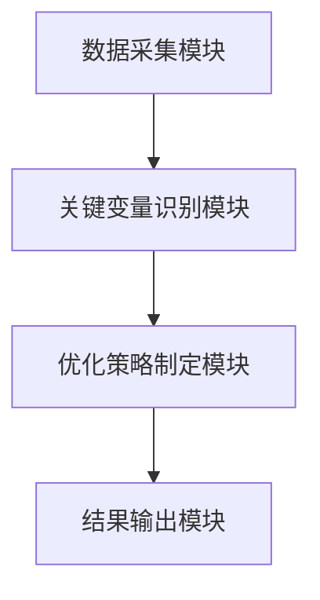

                 


# 芮格的"关键变量"识别在复杂自适应系统优化中的运用

## 关键词
复杂自适应系统, 关键变量识别, 芮格方法, 系统优化, 算法实现

## 摘要
本文探讨了芒格的“关键变量”识别方法在复杂自适应系统优化中的应用。通过分析复杂自适应系统的定义、关键变量识别的理论基础、算法实现、系统架构设计以及实际案例，本文详细阐述了如何利用芒格的方法来优化复杂系统。文章还提供了代码示例和系统设计图，帮助读者更好地理解和应用这些方法。

---

## 第1章: 芮格的"关键变量"识别方法概述

### 1.1 芮格的背景与思想
#### 1.1.1 芮格的生平简介
芒格（Charlie Munger）是投资家沃伦·巴菲特的合作伙伴，以其“关键变量”识别方法闻名。他强调在决策中识别关键变量，忽略次要因素。

#### 1.1.2 芮格的"关键变量"识别方法
芒格认为，复杂的系统中存在关键变量，这些变量对系统行为起决定性作用。识别这些变量有助于简化问题并做出更有效的决策。

#### 1.1.3 芮格思想在现代系统优化中的应用
芒格的方法广泛应用于经济、管理等领域，尤其是在复杂系统的优化中，帮助人们聚焦关键因素。

---

### 1.2 复杂自适应系统的定义与特点
#### 1.2.1 复杂系统的定义
复杂系统由多个相互作用的组件组成，具有非线性特征，难以用简单的方法分析。

#### 1.2.2 自适应系统的特征
自适应系统能够根据环境变化调整自身行为，具有学习和适应能力。

#### 1.2.3 复杂自适应系统的动态特性
复杂自适应系统具有涌现性，即整体表现无法由单个组件简单推导。

---

### 1.3 本章小结
芒格的“关键变量”识别方法为复杂自适应系统的优化提供了新的视角，帮助我们聚焦关键因素，简化问题。

---

## 第2章: 关键变量识别的理论与方法

### 2.1 系统分析与关键变量识别
#### 2.1.1 系统分析的基本概念
系统分析是将复杂问题分解为更小的组成部分，分析各部分之间的关系。

#### 2.1.2 关键变量识别的必要性
在复杂系统中，关键变量识别能够帮助我们抓住问题的核心，提高优化效率。

#### 2.1.3 关键变量识别的系统性方法
系统性方法包括问题定义、数据收集、变量筛选和验证等步骤。

---

### 2.2 芮格方法在关键变量识别中的应用
#### 2.2.1 芮格方法的核心思想
芒格强调通过逆向思维和简化问题来识别关键变量。

#### 2.2.2 芮格方法的逻辑框架
1. 明确目标
2. 收集数据
3. 识别关键变量
4. 分析变量间关系
5. 验证和优化

#### 2.2.3 芮格方法与关键变量识别的结合
芒格的方法通过聚焦关键变量，帮助我们在复杂系统中找到优化的方向。

---

### 2.3 关键变量识别的步骤与流程
#### 2.3.1 问题定义与目标设定
明确问题目标，确定需要优化的关键变量。

#### 2.3.2 数据收集与初步分析
收集相关数据，进行初步分析，筛选潜在的关键变量。

#### 2.3.3 变量筛选与验证
通过统计分析和逻辑推理，筛选关键变量并进行验证。

#### 2.3.4 结果评估与优化
评估识别的关键变量的效果，进行进一步优化。

---

## 第3章: 关键变量识别的数学模型与算法

### 3.1 关键变量识别的数学模型
#### 3.1.1 系统模型的构建
构建系统模型，明确各变量之间的关系。

#### 3.1.2 关键变量的量化方法
使用统计指标（如相关系数）量化变量的重要性。

#### 3.1.3 模型的验证与优化
通过实验验证模型的准确性，并进行优化。

---

### 3.2 基于算法的关键变量识别
#### 3.2.1 常见的关键变量识别算法
- 线性回归
- 主成分分析（PCA）
- 树模型（决策树）

#### 3.2.2 算法的优缺点分析
- 线性回归：简单但可能忽略非线性关系
- 主成分分析：降维有效但难以解释
- 树模型：易于解释但可能过拟合

#### 3.2.3 算法实现的步骤与流程
1. 数据预处理
2. 选择算法
3. 训练模型
4. 验证与优化

---

### 3.3 算法实现的代码示例
#### 3.3.1 数据预处理
```python
import pandas as pd
data = pd.read_csv('data.csv')
data = data.dropna()
```

#### 3.3.2 算法实现
```python
from sklearn.tree import DecisionTreeRegressor
model = DecisionTreeRegressor()
model.fit(X_train, y_train)
```

#### 3.3.3 结果分析与可视化
```python
import matplotlib.pyplot as plt
plt.scatter(y_true, y_pred)
plt.xlabel('True Values')
plt.ylabel('Predictions')
plt.show()
```

---

## 第4章: 复杂自适应系统的优化与实践

### 4.1 系统优化的策略与方法
#### 4.1.1 优化目标的设定
明确优化目标，确保关键变量识别的准确性。

#### 4.1.2 优化策略的制定
根据关键变量识别结果，制定相应的优化策略。

#### 4.1.3 优化方法的选择
选择适合的优化算法，如遗传算法、模拟退火等。

---

### 4.2 项目实战
#### 4.2.1 项目背景介绍
以经济系统为例，分析关键变量对整体系统的影响。

#### 4.2.2 系统功能设计
- 数据采集模块
- 关键变量识别模块
- 优化策略制定模块

#### 4.2.3 系统架构设计


#### 4.2.4 系统实现与测试
编写代码实现各模块功能，进行测试和优化。

---

## 第5章: 总结与展望

### 5.1 本章总结
本文详细介绍了芒格的“关键变量”识别方法在复杂自适应系统优化中的应用，从理论到实践，提供了系统的分析和指导。

### 5.2 未来展望
未来研究可以进一步探索其他关键变量识别方法，并结合人工智能技术，提高系统的优化效率。

---

## 参考文献
1. 芮格的相关著作
2. 复杂系统研究的最新文献
3. 相关算法实现的开源代码库

---

## 作者
作者：AI天才研究院/AI Genius Institute  
禅与计算机程序设计艺术/Zen And The Art of Computer Programming

