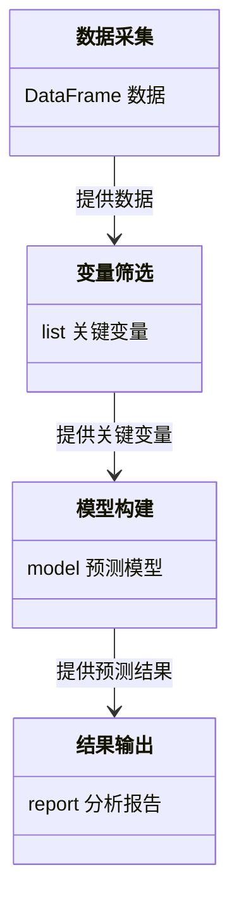
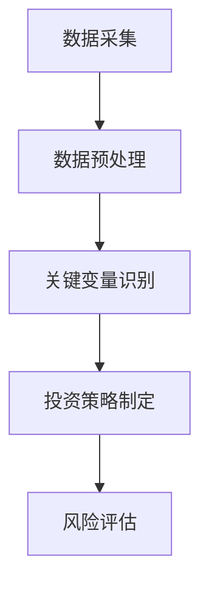

                 


# 芒格的"关键变量"识别在复杂自适应系统投资中的运用

> 关键词：芒格、关键变量识别、复杂自适应系统、投资分析、系统建模、算法实现

> 摘要：本篇文章深入探讨了芒格的“关键变量”识别方法在复杂自适应系统投资中的应用。通过分析复杂自适应系统的特性，结合芒格的关键变量识别方法，构建了一套系统化、结构化的投资分析框架。文章详细介绍了关键变量识别的原理、算法实现、系统架构设计以及实际项目中的应用案例，为投资者提供了一种全新的视角和工具。

---

## 第一部分：芒格的"关键变量"识别方法概述

### 第1章：芒格的"关键变量"识别方法概述

#### 1.1 芒格的"关键变量"识别方法

- **1.1.1 芒格的"关键变量"概念**  
  芒格的“关键变量”是指在复杂系统中对系统行为产生决定性影响的少数因素。这些变量通常是系统的核心驱动因素，能够帮助投资者抓住问题的本质。

- **1.1.2 关键变量识别的核心思想**  
  识别关键变量的核心思想是通过简化复杂系统，找到对系统行为影响最大的少数变量，从而降低分析的复杂性，提高投资决策的效率。

- **1.1.3 该方法在投资中的应用价值**  
  在投资中，关键变量识别方法可以帮助投资者快速定位影响资产价格的主要因素，例如宏观经济指标、行业趋势、公司基本面等，从而制定更有效的投资策略。

#### 1.2 复杂自适应系统的基本概念

- **1.2.1 复杂系统的定义与特征**  
  复杂系统是由多个相互作用的组件组成的系统，这些组件之间存在非线性关系，系统行为具有涌现性、不确定性和不可预测性。

- **1.2.2 自适应系统的特性**  
  自适应系统能够根据外部环境的变化调整自身的行为，具有学习和适应能力。这种特性使得复杂自适应系统在投资中表现出高度的动态性和不确定性。

- **1.2.3 复杂自适应系统在投资中的表现**  
  在投资领域，复杂自适应系统的特性表现为市场的波动性、参与者的行为异化以及资产价格的非理性波动。

#### 1.3 芒格方法与复杂自适应系统的结合

- **1.3.1 芒格方法的核心要素**  
  芒格方法的核心要素包括：(1) 识别关键变量；(2) 理解变量之间的关系；(3) 构建基于关键变量的决策模型。

- **1.3.2 复杂自适应系统中的变量关系**  
  在复杂自适应系统中，关键变量通常通过非线性关系相互作用，形成复杂的网络结构。这种关系网络是系统行为的基础。

- **1.3.3 方法在投资中的具体应用场景**  
  在投资中，芒格方法可以用于识别影响市场的主要驱动因素，例如宏观经济政策、行业周期、公司基本面等，从而制定更具前瞻性的投资策略。

#### 1.4 本章小结

本章通过介绍芒格的“关键变量”识别方法和复杂自适应系统的基本概念，揭示了两者结合在投资分析中的潜力。通过识别关键变量，投资者可以更好地理解复杂系统的动态行为，并制定更有效的投资策略。

---

## 第二部分：关键变量识别的核心概念与联系

### 第2章：关键变量识别的核心概念

#### 2.1 关键变量识别的原理

- **2.1.1 变量识别的基本原理**  
  关键变量识别的基本原理是通过分析系统的输入输出关系，找出对输出影响最大的少数变量。

- **2.1.2 变量之间的关系分析**  
  变量之间的关系可以通过相关性分析、回归分析等方法进行量化。关键变量通常与其他变量存在高度的相关性或非线性关系。

- **2.1.3 关键变量的筛选标准**  
  关键变量的筛选标准包括：变量的重要性、变量的可测量性、变量的稳定性等。

#### 2.2 变量属性特征对比表格

| 变量属性 | 关键变量 | 次要变量 | 非关键变量 |
|----------|----------|----------|------------|
| 重要性   | 高       | 中       | 低         |
| 相关性   | 高       | 中       | 低         |
| 稳定性   | 高       | 中       | 低         |

#### 2.3 ER实体关系图架构

```mermaid
erDiagram
    actor 投资者 {
        string 资金
        string 风险偏好
    }
    actor 市场 {
        string 宏观经济指标
        string 行业趋势
    }
    actor 公司 {
        string 财务指标
        string 管理团队
    }
    投资者 --> 市场 : 投资决策
    投资者 --> 公司 : 股票投资
    市场 --> 公司 : 市场环境影响
```

#### 2.4 本章小结

本章通过分析关键变量识别的原理和变量之间的关系，构建了关键变量的筛选标准，并通过表格和实体关系图展示了变量的属性特征。

---

## 第三部分：关键变量识别的算法原理讲解

### 第3章：关键变量识别的算法原理

#### 3.1 算法原理概述

- **3.1.1 算法的基本思路**  
  算法的基本思路是通过统计分析和机器学习方法，从大量变量中筛选出对系统行为影响最大的少数变量。

- **3.1.2 算法的核心步骤**  
  1. 数据预处理：去除噪声，标准化数据。  
  2. 变量筛选：通过相关性分析、回归分析等方法筛选关键变量。  
  3. 模型构建：基于关键变量构建预测模型。  

- **3.1.3 算法的优缺点分析**  
  优点：能够快速识别关键变量，降低分析复杂性。  
  缺点：可能忽略次要变量对系统行为的间接影响。

#### 3.2 算法的数学模型与公式

##### 3.2.1 数学模型的建立

$$ y = \beta_1 x_1 + \beta_2 x_2 + \cdots + \beta_n x_n + \epsilon $$

其中，$y$ 是输出变量，$x_i$ 是输入变量，$\beta_i$ 是回归系数，$\epsilon$ 是误差项。

##### 3.2.2 关键变量的数学表达

$$ \text{关键变量} = \argmax_{x_i} | \beta_i | $$

##### 3.2.3 算法的收敛性分析

通过逐步迭代优化，算法能够收敛到最优解。收敛速度取决于数据的规模和变量的相关性。

#### 3.3 算法的实现与代码

##### 3.3.1 算法的Python实现

```python
import pandas as pd
from sklearn.linear_model import LinearRegression

def identify_key_variables(X, y):
    model = LinearRegression()
    model.fit(X, y)
    coefficients = pd.DataFrame({'variable': X.columns, 'coefficient': model.coef_})
    coefficients = coefficients.sort_values(by='coefficient', key=lambda x: abs(x), ascending=False)
    key_vars = coefficients.head(5)['variable'].tolist()
    return key_vars

# 示例数据
X = pd.DataFrame({
    'x1': [1, 2, 3, 4, 5],
    'x2': [2, 3, 4, 5, 6],
    'x3': [3, 4, 5, 6, 7],
    'x4': [4, 5, 6, 7, 8],
    'x5': [5, 6, 7, 8, 9]
})
y = pd.Series([1, 2, 3, 4, 5])

key_vars = identify_key_variables(X, y)
print("关键变量为:", key_vars)
```

##### 3.3.2 代码的详细解读

1. 导入所需的库：`pandas` 和 `sklearn.linear_model`。  
2. 定义关键变量识别函数：`identify_key_variables`。  
3. 建立线性回归模型：`LinearRegression()`。  
4. 模型拟合：`model.fit(X, y)`。  
5. 提取系数：`model.coef_`。  
6. 筛选关键变量：排序并取前5个变量。

#### 3.4 本章小结

本章通过数学模型和Python代码详细讲解了关键变量识别的算法原理，展示了如何通过统计分析和机器学习方法快速筛选关键变量。

---

## 第四部分：系统分析与架构设计方案

### 第4章：投资系统分析与架构设计

#### 4.1 问题场景介绍

- **4.1.1 投资决策中的问题分析**  
  投资者在面对复杂市场环境时，需要快速识别影响资产价格的关键变量，制定有效的投资策略。

- **4.1.2 系统的目标与范围**  
  系统的目标是帮助投资者识别关键变量，构建投资模型，优化投资组合。

- **4.1.3 系统的约束条件**  
  数据获取的及时性、模型的准确性和计算的效率。

#### 4.2 系统功能设计

- **4.2.1 领域模型设计**  
  领域模型包括数据采集、变量筛选、模型构建和结果输出四个模块。



- **4.2.2 功能模块划分**  
  功能模块包括数据预处理、关键变量识别、投资策略制定和风险评估。

#### 4.3 系统架构设计

- **4.3.1 系统架构图**  
  系统架构采用模块化设计，包括数据层、算法层和应用层。



- **4.3.2 模块之间的关系**  
  数据采集模块提供原始数据，数据预处理模块进行数据清洗，关键变量识别模块筛选关键变量，投资策略制定模块基于关键变量构建预测模型，风险评估模块评估投资组合的风险。

#### 4.4 系统接口设计

- **4.4.1 接口的定义与描述**  
  接口定义：`identify_key_variables(X, y)`。  
  接口描述：接受输入数据和目标变量，返回关键变量列表。

- **4.4.2 接口的实现方式**  
  接口通过Python函数实现，返回关键变量列表。

- **4.4.3 接口的测试与验证**  
  使用示例数据进行测试，验证接口的正确性和稳定性。

#### 4.5 本章小结

本章通过系统分析和架构设计，构建了一个基于关键变量识别的投资分析系统，展示了系统各模块之间的关系和接口设计。

---

## 第五部分：项目实战与案例分析

### 第5章：项目实战：关键变量识别在股票投资中的应用

#### 5.1 项目背景介绍

- **5.1.1 项目目标**  
  通过关键变量识别方法，构建股票投资模型，实现对股票价格的预测。

- **5.1.2 数据来源**  
  数据来源包括股票的历史价格、宏观经济指标、行业趋势等。

- **5.1.3 工具与技术**  
  使用Python编程语言，结合Pandas、NumPy和Scikit-learn等库。

#### 5.2 项目实现过程

- **5.2.1 数据预处理**  
  清洗数据，处理缺失值和异常值。

- **5.2.2 关键变量识别**  
  使用线性回归模型筛选关键变量。

- **5.2.3 投资策略制定**  
  基于关键变量构建预测模型，制定买入和卖出策略。

#### 5.3 实际案例分析

- **5.3.1 数据分析与处理**  
  使用历史数据进行分析，筛选出关键变量。

- **5.3.2 投资策略验证**  
  通过回测验证策略的有效性。

- **5.3.3 模型优化与调整**  
  根据回测结果优化模型参数，提高预测精度。

#### 5.4 本章小结

本章通过一个实际案例展示了关键变量识别方法在股票投资中的应用，验证了该方法的有效性和实用性。

---

## 作者

作者：AI天才研究院/AI Genius Institute & 禅与计算机程序设计艺术 /Zen And The Art of Computer Programming

---

以上是文章的完整大纲和内容。如需进一步扩展或调整，请随时告知！

