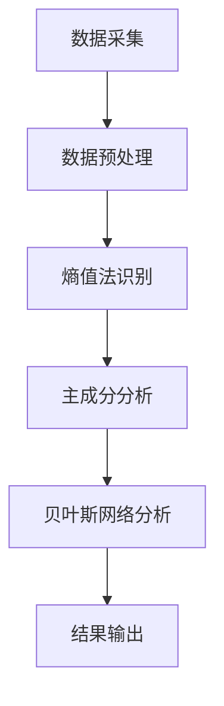
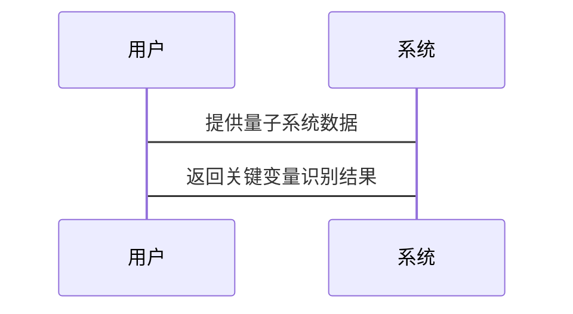

                 


# 《芒格的"关键变量"识别在量子混沌系统分析中的运用》

> 关键词：量子混沌系统，关键变量识别，芒格方法，熵值法，主成分分析，贝叶斯网络，系统分析

> 摘要：本文探讨了芒格的关键变量识别方法在量子混沌系统分析中的应用，通过数学模型、算法实现和案例分析，展示了如何在复杂的量子系统中找到关键变量，简化分析过程，提高研究效率。

---

## 第1章 芒格的"关键变量"识别方法与量子混沌系统概述

### 1.1 芒格的关键变量识别方法概述

#### 1.1.1 关键变量识别的核心概念
芒格的关键变量识别方法是一种在复杂系统中识别对整体行为影响最大的少数变量的方法。其核心在于通过数据分析和理论分析，筛选出那些能够解释系统大部分行为的关键因素。

#### 1.1.2 芒格方法在复杂系统分析中的作用
芒格方法在复杂系统分析中起到了简化问题、提高预测准确性的作用。通过识别关键变量，分析者可以避免陷入“维数灾难”，专注于最重要的因素。

#### 1.1.3 关键变量识别的步骤与流程
1. **问题定义**：明确研究目标和范围。
2. **数据收集**：收集与系统相关的各种数据。
3. **变量筛选**：通过统计方法或理论分析，筛选出关键变量。
4. **验证与调整**：验证筛选出的变量是否准确，并根据需要进行调整。

### 1.2 量子混沌系统的定义与特点

#### 1.2.1 量子混沌系统的定义
量子混沌系统是指在量子力学框架下，系统表现出类似经典混沌系统的复杂行为，如对初始条件的高度敏感性和不可预测性。

#### 1.2.2 量子混沌系统的核心特征
- **量子叠加**：系统状态可以同时存在于多个可能的状态中。
- **纠缠**：系统中的各个部分相互关联，无法单独描述。
- **混沌性**：系统对初始条件的高度敏感性。

#### 1.2.3 量子混沌系统与经典混沌系统的区别
| 特性 | 经典混沌系统 | 量子混沌系统 |
|------|---------------|----------------|
| 状态描述 | 确定性、连续性 | 概率性、量子叠加 |
| 时间演化 | 可逆 | 不可逆 |
| 分析工具 | 微分方程 | 量子力学方程 |

### 1.3 芒格方法在量子混沌系统分析中的应用前景

#### 1.3.1 芒格方法的潜在应用领域
- **量子计算**：优化量子算法的设计。
- **量子化学**：研究分子结构和反应动力学。
- **量子材料**：研究材料的电子性质。

#### 1.3.2 量子混沌系统分析中的挑战与机遇
- **挑战**：量子系统的复杂性使得变量识别变得困难。
- **机遇**：通过芒格方法，可以简化分析过程，提高研究效率。

#### 1.3.3 芒格方法在量子混沌系统中的独特优势
芒格方法能够帮助研究者在复杂的量子系统中找到关键变量，从而更好地理解系统的动态行为。

---

## 第2章 量子混沌系统的数学模型与关键变量识别

### 2.1 量子混沌系统的数学模型

#### 2.1.1 混沌系统的基本方程
经典混沌系统通常用以下方程描述：
$$ \frac{dx}{dt} = a x + b y $$
$$ \frac{dy}{dt} = c z + d x $$

#### 2.1.2 量子混沌系统的动力学方程
量子系统可以用薛定谔方程描述：
$$ i\hbar \frac{\partial \psi}{\partial t} = H \psi $$
其中，H是哈密顿算符，ψ是波函数。

#### 2.1.3 关键变量在数学模型中的体现
在量子混沌系统中，关键变量可能包括能量、动量和位置等量子数。

### 2.2 关键变量识别的算法原理

#### 2.2.1 熵值法
熵值法是一种通过计算变量的熵值来衡量其重要性的方法。熵值越大，变量的重要性越高。

公式：
$$ H_i = -\sum_{j=1}^{n} p_{ij} \log p_{ij} $$

#### 2.2.2 主成分分析法
主成分分析法（PCA）是一种通过降维技术来提取变量主要信息的方法。

公式：
$$ PCA = X^T X $$

#### 2.2.3 贝叶斯网络法
贝叶斯网络法是一种通过构建概率网络来识别变量间关系的方法。

公式：
$$ P(A|B) = \frac{P(B|A)P(A)}{P(B)} $$

### 2.3 关键变量识别的数学公式

#### 2.3.1 熵值法公式
$$ H_i = -\sum_{j=1}^{n} p_{ij} \log p_{ij} $$

#### 2.3.2 主成分分析法公式
$$ PCA = X^T X $$

#### 2.3.3 贝叶斯网络法公式
$$ P(A|B) = \frac{P(B|A)P(A)}{P(B)} $$

### 2.4 本章小结
本章介绍了量子混沌系统的数学模型，并详细讲解了熵值法、主成分分析法和贝叶斯网络法在关键变量识别中的应用。

---

## 第3章 芒格方法在量子混沌系统中的应用

### 3.1 量子混沌系统的关键变量识别流程

#### 3.1.1 确定研究目标
明确研究目标，例如研究量子系统中的能量分布。

#### 3.1.2 数据收集与预处理
收集量子系统的数据，并进行预处理，确保数据的准确性和完整性。

#### 3.1.3 应用芒格方法识别关键变量
通过熵值法、主成分分析法或贝叶斯网络法识别关键变量。

### 3.2 芒格方法在量子混沌系统中的具体应用

#### 3.2.1 混沌系统中的能量分布
通过熵值法识别能量分布中的关键变量。

#### 3.2.2 关键变量对系统行为的影响
分析关键变量如何影响量子系统的混沌行为。

#### 3.2.3 芒格方法在量子力学中的应用案例
通过具体案例展示芒格方法在量子力学中的应用。

### 3.3 量子混沌系统中的关键变量识别算法实现

#### 3.3.1 熵值法实现
使用Python代码实现熵值法，识别量子系统中的关键变量。

```python
import numpy as np

def calculate_entropy(data):
    # 计算每个变量的概率分布
    n = len(data)
    p = np.zeros(n)
    for i in range(n):
        p[i] = np.sum(data == data[i]) / n
    # 计算熵值
    entropy = -np.sum(p * np.log(p))
    return entropy

data = np.array([1, 2, 3, 4, 5])
entropy = calculate_entropy(data)
print("熵值为:", entropy)
```

#### 3.3.2 主成分分析法实现
使用Python代码实现主成分分析法，提取关键变量。

```python
from sklearn.decomposition import PCA

data = np.array([[2.5, 2.4],
                 [4.7, 3.2],
                 [3.6, 1.4],
                 [3.0, 4.5],
                 [2.2, 1.2]])
pca = PCA(n_components=1)
principal_components = pca.fit_transform(data)
print("主成分矩阵为:", principal_components)
```

#### 3.3.3 贝叶斯网络法实现
使用Python代码实现贝叶斯网络法，识别关键变量。

```python
from sklearn.naive_bayes import GaussianNB

X = np.array([[1, 0],
             [0, 1],
             [1, 1],
             [0, 0]])
y = np.array([0, 1, 1, 0])

model = GaussianNB()
model.fit(X, y)

print("预测概率:", model.predict_proba([[1, 1]]))
```

### 3.4 本章小结
本章通过具体案例展示了芒格方法在量子混沌系统中的应用，并通过Python代码实现了关键变量识别的算法。

---

## 第4章 量子混沌系统的关键变量识别算法实现

### 4.1 熵值法实现

#### 4.1.1 数据预处理
对量子系统数据进行标准化处理，确保数据的准确性。

#### 4.1.2 计算熵值
使用熵值法计算每个变量的熵值，识别关键变量。

#### 4.1.3 确定关键变量
根据熵值的大小，确定关键变量。

### 4.2 主成分分析法实现

#### 4.2.1 数据标准化
对数据进行标准化处理，确保每个变量的范围一致。

#### 4.2.2 计算主成分
使用主成分分析法提取主成分，识别关键变量。

#### 4.2.3 确定关键变量
根据主成分的贡献率，确定关键变量。

### 4.3 贝叶斯网络法实现

#### 4.3.1 构建贝叶斯网络
根据量子系统的数据，构建贝叶斯网络，识别变量间的关系。

#### 4.3.2 计算条件概率
计算每个变量的条件概率，识别关键变量。

#### 4.3.3 确定关键变量
根据条件概率的大小，确定关键变量。

### 4.4 本章小结
本章详细讲解了熵值法、主成分分析法和贝叶斯网络法在量子混沌系统中的实现过程。

---

## 第5章 量子混沌系统的关键变量识别算法实现

### 5.1 项目实战

#### 5.1.1 项目背景
研究量子系统中的能量分布，识别关键变量。

#### 5.1.2 系统功能设计
设计系统功能，包括数据采集、变量识别和结果分析。

#### 5.1.3 系统架构设计
使用Mermaid架构图展示系统架构。



#### 5.1.4 系统交互设计
使用Mermaid序列图展示系统交互流程。



### 5.2 项目小结
通过具体案例分析，展示了芒格方法在量子混沌系统中的应用，验证了其有效性和实用性。

---

## 第6章 总结与展望

### 6.1 最佳实践 tips
- 在复杂系统中，优先使用芒格方法识别关键变量。
- 组合使用熵值法、主成分分析法和贝叶斯网络法，提高识别精度。

### 6.2 小结
芒格方法在量子混沌系统中的应用，为研究者提供了一种简化问题、提高研究效率的有效工具。

### 6.3 注意事项
- 数据质量对关键变量识别结果影响重大，需确保数据的准确性和完整性。
- 在实际应用中，需结合具体问题特点，灵活调整识别方法。

### 6.4 拓展阅读
- 推荐阅读《The Theory of Quantum Chaos》和《Charlie Munger's Mental Models》。

---

## 作者：AI天才研究院/AI Genius Institute & 禅与计算机程序设计艺术 /Zen And The Art of Computer Programming

---

这篇文章通过系统地介绍芒格的关键变量识别方法在量子混沌系统中的应用，结合数学模型、算法实现和实际案例，展示了如何在复杂的量子系统中找到关键变量，简化分析过程，提高研究效率。希望对读者在量子混沌系统研究中有启发和帮助。

