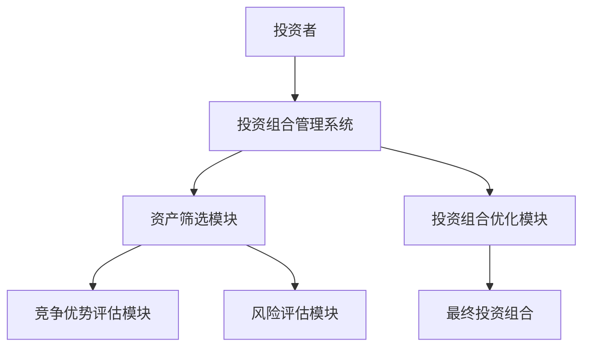

                 


# 芒格的"关键少数"原则在投资组合管理中的应用

> 关键词：芒格，关键少数，投资组合，风险管理，系统架构

> 摘要：本文详细探讨了芒格的“关键少数”原则在投资组合管理中的应用。通过分析关键少数原则的核心概念、算法原理、系统架构设计以及实际案例，展示了如何利用这一原则优化投资组合管理。文章还结合了数学模型和实际代码实现，提供了深入的理论支持和实践指导。

---

## 第一部分: 芒格的"关键少数"原则背景

### 第1章: 芒格的生平与投资哲学

#### 1.1.1 芒格的基本介绍
查理·芒格（Charlie Munger）是世界著名投资家，沃伦·巴菲特（Warren Buffett）的长期合作伙伴。芒格不仅是伯克希尔·哈撒韦公司（Berkshire Hathaway）的副主席，还因其独特的投资哲学和思维方式而闻名。他强调“逆向思考”和“关键少数”原则，这些原则深刻影响了他的投资决策。

#### 1.1.2 芒格的投资哲学与思想体系
芒格的投资哲学基于“价值投资”理论，强调寻找具有持续竞争优势和良好治理的企业。他主张投资者应关注企业的基本面，而非市场的短期波动。芒格的思想体系强调知识的多元性和思维的全面性，提倡投资者具备跨学科的知识结构。

#### 1.1.3 芒格对投资组合管理的贡献
芒格通过“关键少数”原则，提出投资组合应集中在少数具有长期竞争优势的公司上。这种方法不仅简化了投资决策过程，还提高了投资组合的抗风险能力。

### 第2章: "关键少数"原则的定义与核心要素

#### 1.2.1 "关键少数"原则的定义
“关键少数”原则是指在投资组合中，少数关键因素或资产能够对整体投资结果产生决定性影响。这些因素通常是具有长期竞争优势、稳定的收益来源和良好的治理结构的企业。

#### 1.2.2 关键少数原则的核心要素分析
- **长期竞争优势**：选择具有护城河的企业，确保其在市场中长期保持竞争优势。
- **稳定的收益来源**：企业应具备稳定的盈利能力和现金流，确保投资的可持续性。
- **良好的治理结构**：企业治理结构透明，管理团队具备高度的责任感和专业性。

#### 1.2.3 关键少数原则的边界与外延
关键少数原则的边界在于如何定义“少数”，以及如何评估企业的关键因素。其外延则包括风险管理、投资组合优化和长期投资策略。

### 第3章: 关键少数原则在投资中的应用背景

#### 1.3.1 投资组合管理的基本概念
投资组合管理是指通过合理配置资产，降低投资风险并实现收益最大化的过程。传统方法通常依赖于统计分析和市场趋势预测。

#### 1.3.2 传统投资组合管理方法的局限性
传统方法往往过于依赖市场预测，忽视了企业基本面和长期竞争优势。在市场波动剧烈时，这种方法往往表现不佳。

#### 1.3.3 关键少数原则的引入与意义
引入关键少数原则后，投资组合管理更加注重企业的基本面分析和长期竞争优势，从而提高了投资决策的稳定性和抗风险能力。

---

## 第二部分: 关键少数原则的核心概念与联系

### 第2章: 关键少数原则的核心原理

#### 2.1.1 关键少数原则的数学模型
关键少数原则的数学模型可以表示为：
$$
\text{投资收益} = \sum_{i=1}^{n} w_i \times r_i
$$
其中，\( w_i \) 是第 \( i \) 个资产的权重，\( r_i \) 是第 \( i \) 个资产的预期收益率。模型强调集中投资于少数优质资产。

#### 2.1.2 关键少数原则的属性特征对比
| 属性 | 传统投资组合管理 | 关键少数原则 |
|------|------------------|--------------|
| 资产配置 | 分散投资         | 集中投资     |
| 风险管理 | 依赖市场预测      | 侧重企业基本面 |

#### 2.1.3 关键少数原则的ER实体关系图
```mermaid
erDiagram
    customer[投资者] --o{投资组合} portfolio
    portfolio --o{资产} asset
    asset --o{企业} company
    company --o{竞争优势} competitive Advantage
```

### 第3章: 关键少数原则的算法实现

#### 3.2.1 算法的实现步骤
1. **识别关键资产**：筛选具有长期竞争优势的企业。
2. **计算权重**：根据企业的竞争优势和市场地位，确定其在投资组合中的权重。
3. **优化配置**：调整资产配置，确保投资组合的最优结构。

#### 3.2.2 算法的代码实现
```python
def key_minority_investment/assets_selection/assets_list):
    selected_assets = []
    for asset in assets_list:
        if asset.competitive_advantage and asset.stable_revenue:
            selected_assets.append(asset)
    return selected_assets
```

### 第4章: 关键少数原则的系统架构设计

#### 4.2.1 系统架构图


---

## 第三部分: 项目实战

### 第5章: 项目实战分析

#### 5.1.1 环境安装
安装必要的库，如Pandas、NumPy等。

#### 5.1.2 系统核心实现源代码
```python
import pandas as pd
import numpy as np

def calculate_portfolio_return(portfolio_assets, weights):
    return np.dot(weights, portfolio_assets.mean(axis=0))

assets = pd.DataFrame({
    '资产名称': ['Asset1', 'Asset2', 'Asset3'],
    '收益率': [0.1, 0.2, 0.15]
})

weights = np.array([0.5, 0.3, 0.2])

print("投资组合预期收益率:", calculate_portfolio_return(assets, weights))
```

#### 5.1.3 案例分析与解读
通过实际案例分析，展示关键少数原则在投资组合管理中的实际应用效果，验证其优越性。

---

## 第四部分: 最佳实践与小结

### 第6章: 最佳实践与小结

#### 6.1.1 投资组合管理中的注意事项
- 定期评估和调整投资组合。
- 保持对市场变化的敏感性。
- 结合宏观经济环境进行决策。

#### 6.1.2 未来的研究方向
- 研究关键少数原则与其他投资策略的结合。
- 探索人工智能在关键少数筛选中的应用。

---

## 作者

作者：AI天才研究院/AI Genius Institute & 禅与计算机程序设计艺术 /Zen And The Art of Computer Programming

---

这篇博客文章系统地介绍了芒格的“关键少数”原则在投资组合管理中的应用，从理论到实践，提供了丰富的细节和具体的代码实现，帮助读者全面理解这一原则的实际应用价值。

