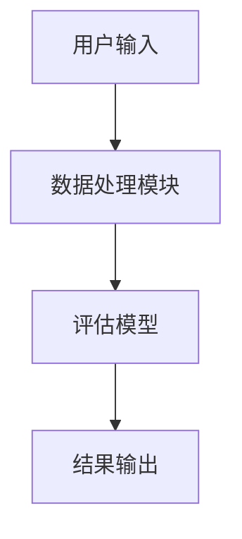

                 

# 芒格的"关键少数"原则在深科技创业投资中的应用

> 关键词：芒格，关键少数，深科技，创业投资，投资策略

> 摘要：本文深入探讨了芒格的“关键少数”原则在深科技创业投资中的应用。通过分析“关键少数”原则的核心要素、深科技创业投资的特点，结合数学模型和系统架构设计，详细阐述了该原则在深科技投资中的具体应用策略。同时，通过实战案例分析和Python代码实现，进一步验证了该原则的有效性。

---

## 第1章: 芒格的"关键少数"原则

### 1.1 "关键少数"原则的定义与背景

#### 1.1.1 "关键少数"原则的定义

“关键少数”原则是由查理·芒格提出的一种投资理念，强调在投资决策中关注少数关键因素，而非追求面面俱到。这一原则的核心在于，通过聚焦于少数高价值的要素，提高投资决策的准确性和效率。

#### 1.1.2 芒格投资理念的核心要素

1. **独立思考**：芒格强调独立思考的重要性，避免随波逐流。
2. **多元思维模型**：芒格提倡构建多元思维模型，以全面分析问题。
3. **安全边际**：在投资中，芒格注重安全边际，避免过度冒险。

#### 1.1.3 "关键少数"原则在投资中的应用意义

通过聚焦于关键少数要素，投资者可以更高效地筛选出具有高潜力的项目，减少信息过载和决策疲劳，从而提高投资成功的概率。

---

### 1.2 深科技创业投资的基本概念

#### 1.2.1 深科技的定义与特点

深科技是指那些具有高技术门槛、创新性强、壁垒高的科技领域，如人工智能、量子计算、生物技术等。其特点包括技术复杂性高、研发投入大、市场潜力大等。

#### 1.2.2 创业投资的基本流程

创业投资的基本流程包括项目筛选、尽职调查、投资决策、投资后管理等。

#### 1.2.3 深科技创业投资的独特性

深科技创业投资的独特性体现在其技术门槛高、市场不确定性大、投资周期长等特点。

---

### 1.3 "关键少数"原则与深科技创业投资的结合

#### 1.3.1 两者结合的逻辑基础

通过“关键少数”原则，投资者可以更专注于深科技领域的核心要素，提高投资效率。

#### 1.3.2 深科技创业投资中的关键少数要素

1. **技术创新性**：项目的创新性决定了其市场潜力。
2. **市场需求**：项目的市场需求决定了其商业化能力。
3. **团队能力**：团队的能力决定了项目的执行能力。

#### 1.3.3 该原则对投资决策的指导意义

通过聚焦于关键少数要素，投资者可以更精准地筛选出具有高潜力的深科技项目。

---

## 第2章: "关键少数"原则的核心要素分析

### 2.1 "关键少数"原则的核心要素

#### 2.1.1 投资标的的核心要素

1. **技术创新性**：项目的创新性决定了其市场潜力。
2. **市场需求**：项目的市场需求决定了其商业化能力。
3. **团队能力**：团队的能力决定了项目的执行能力。

#### 2.1.2 投资团队的核心要素

1. **团队经验**：团队在相关领域的经验。
2. **团队能力**：团队的核心能力和协作能力。
3. **团队稳定性**：团队的稳定性决定了项目的可持续性。

#### 2.1.3 投资环境的核心要素

1. **市场环境**：市场的成熟度和竞争情况。
2. **政策环境**：政策的支持力度和风险。
3. **经济环境**：经济周期对投资的影响。

---

### 2.2 "关键少数"原则与投资决策的关系

#### 2.2.1 关键少数要素对投资决策的影响

通过聚焦于关键少数要素，投资者可以更精准地筛选出具有高潜力的项目。

#### 2.2.2 关键少数要素的权重分配

关键少数要素的权重分配需要根据具体情况动态调整。

#### 2.2.3 关键少数要素的动态变化

关键少数要素在不同阶段可能会发生变化，需要根据实际情况进行调整。

---

### 2.3 "关键少数"原则的数学模型构建

#### 2.3.1 核心要素的权重计算公式

$$权重 = \frac{要素的重要性}{总要素重要性之和}$$

#### 2.3.2 投资决策的数学模型

$$决策 = \sum (权重_i \times 要素_i)$$

---

## 第3章: 深科技创业投资的特点与挑战

### 3.1 深科技创业投资的特点

#### 3.1.1 技术门槛高

深科技项目通常具有高技术门槛，需要深厚的技术积累。

#### 3.1.2 市场不确定性大

深科技项目的市场需求具有不确定性，风险较高。

#### 3.1.3 投资周期长

深科技项目通常需要较长的时间周期才能实现商业化。

---

### 3.2 深科技创业投资的挑战

#### 3.2.1 技术风险

技术实现的不确定性可能导致项目失败。

#### 3.2.2 市场风险

市场需求的不确定性可能导致项目失败。

#### 3.2.3 资金风险

深科技项目通常需要大量资金支持，资金链断裂可能导致项目失败。

---

### 3.3 "关键少数"原则在深科技投资中的应用优势

#### 3.3.1 提高投资效率

通过聚焦于关键少数要素，投资者可以更高效地筛选项目。

#### 3.3.2 减少投资风险

通过关注关键少数要素，投资者可以更精准地识别潜在风险。

#### 3.3.3 提高投资回报率

通过聚焦于关键少数要素，投资者可以更高效地实现投资回报。

---

## 第4章: "关键少数"原则在深科技投资中的应用策略

### 4.1 确定关键少数要素

#### 4.1.1 技术创新性评估

通过评估项目的创新性，筛选出具有高潜力的项目。

#### 4.1.2 市场需求分析

通过分析市场需求，筛选出具有商业潜力的项目。

#### 4.1.3 团队能力评估

通过评估团队的能力，筛选出具有执行能力的项目。

---

### 4.2 构建评估模型

#### 4.2.1 评估模型的构建步骤

1. 确定关键少数要素。
2. 为每个要素分配权重。
3. 根据权重计算综合得分。
4. 根据得分进行项目排序。

#### 4.2.2 投资决策的优化

通过优化评估模型，提高投资决策的准确性和效率。

---

### 4.3 系统架构设计

#### 4.3.1 系统功能设计

1. 数据输入模块：输入项目信息。
2. 模型计算模块：计算项目得分。
3. 结果输出模块：输出项目评估结果。

#### 4.3.2 系统架构设计

---

### 4.4 实战案例分析

#### 4.4.1 案例背景

假设我们有一个深科技创业项目，涉及人工智能技术。

#### 4.4.2 案例分析

1. 确定关键少数要素：技术创新性、市场需求、团队能力。
2. 评估模型计算：计算每个要素的权重，并得出综合得分。

#### 4.4.3 案例结论

通过评估模型，筛选出具有高潜力的项目进行投资。

---

## 第5章: 未来展望与注意事项

### 5.1 未来展望

随着人工智能和大数据技术的发展，“关键少数”原则在深科技投资中的应用将更加广泛。

### 5.2 注意事项

1. 投资者需要根据实际情况动态调整关键少数要素。
2. 投资者需要结合市场环境和项目特点进行灵活决策。

---

## 作者：AI天才研究院/AI Genius Institute & 禅与计算机程序设计艺术 /Zen And The Art of Computer Programming

