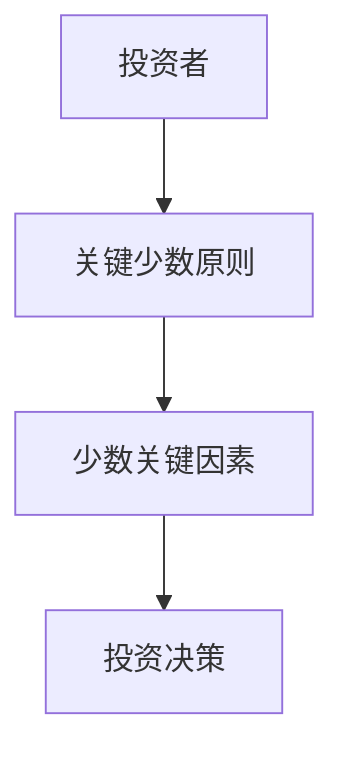
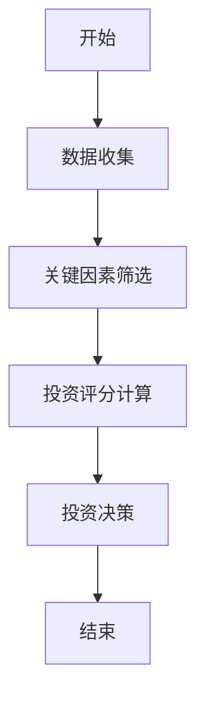
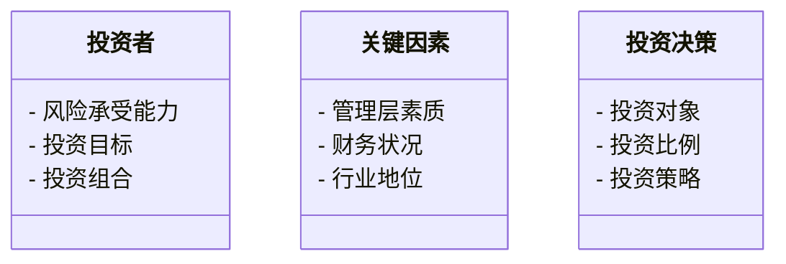
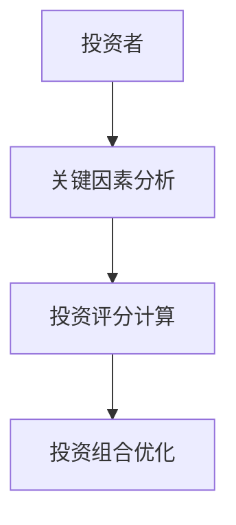

                 


# 芒格的"关键少数"原则：集中投资的智慧

## 关键词：芒格，关键少数，投资原则，集中投资，智慧投资

## 摘要：本文深入探讨了芒格的“关键少数”原则，分析其在投资领域的应用及其背后的逻辑。通过详细的技术分析和实际案例，结合算法原理和系统设计，揭示了集中投资的智慧，帮助读者在复杂的投资环境中做出更明智的决策。

---

# 第一部分: 芒格的"关键少数"原则概述

## 第1章: 芒格与"关键少数"原则的背景介绍

### 1.1 芒格的生平与投资理念

#### 1.1.1 芒格的早年经历与投资生涯

查理·芒格（Charlie Munger）是美国著名投资者、伯克希尔·哈撒韦公司副董事长，被誉为“巴菲特的导师”。芒格出生于1924年，早年在哈佛大学学习法律，后来转向心理学和经济学的研究。他的投资生涯始于20世纪50年代，初期主要通过分析公司财务报表进行投资决策。

#### 1.1.2 芒格与巴菲特的合作关系

芒格与沃伦·巴菲特（Warren Buffett）的合作始于1971年，当时芒格帮助巴菲特管理伯克希尔·哈撒韦公司。两人共同的理念是寻找具有长期竞争优势的企业，进行长期投资。芒格的思维方式和决策风格对巴菲特的投资策略产生了深远影响。

#### 1.1.3 芒格的投资哲学与思想体系

芒格的投资哲学基于“价值投资”，他强调寻找具有持续竞争优势的企业，并长期持有。他的思想体系强调理性思考、避免情绪化决策，并注重对公司基本面的深入分析。

### 1.2 "关键少数"原则的定义与背景

#### 1.2.1 "关键少数"原则的核心概念

“关键少数”原则指的是在投资决策中，集中关注少数关键因素，忽略次要因素。这种原则强调在复杂的投资环境中，集中资源和精力于最重要的少数因素，从而提高决策的准确性和效率。

#### 1.2.2 该原则在投资领域的应用背景

在现代投资领域，市场环境日益复杂，投资者面临的信息量巨大。传统的分散投资策略难以应对市场的不确定性，而“关键少数”原则为投资者提供了一种聚焦于核心因素的策略，帮助他们在复杂环境中做出更明智的投资决策。

#### 1.2.3 该原则与其他投资策略的对比

与分散投资相比，“关键少数”原则更加注重集中投资于少数具有长期竞争优势的企业。与趋势投资相比，该原则更注重企业的内在价值和长期前景。与技术分析相比，该原则更注重基本面分析。

### 1.3 投资中的"关键少数"原则

#### 1.3.1 集中投资的核心理念

集中投资是指将大部分资金投入到少数具有长期竞争优势的企业中，从而降低投资组合的风险，并提高收益。芒格认为，集中投资的核心在于找到那些能够持续创造价值的企业，并长期持有。

#### 1.3.2 "关键少数"在投资组合中的应用

在投资组合中，集中投资于少数具有长期竞争优势的企业。芒格认为，投资组合的规模并不重要，重要的是投资对象的质量和长期前景。

#### 1.3.3 该原则的适用场景与边界

“关键少数”原则适用于长期投资，尤其是那些具有持续竞争优势的企业。在短期市场波动较大的情况下，该原则可能面临较大的风险，因此需要结合市场环境进行灵活调整。

---

## 第2章: "关键少数"原则的核心概念与联系

### 2.1 核心概念原理

#### 2.1.1 投资决策中的关键因素分析

在投资决策中，关键因素分析是“关键少数”原则的核心。芒格认为，投资者应该集中关注企业的核心竞争力、管理层素质、财务状况和行业地位等因素。

#### 2.1.2 "少数"的量化标准与筛选方法

“少数”是指在投资组合中占比较大的企业。芒格通常建议投资者将大部分资金投入到少数具有长期竞争优势的企业中，通常不超过10个。

#### 2.1.3 集中投资的风险与收益平衡

集中投资的风险在于市场波动可能导致投资组合的大幅波动，但长期来看，集中投资于优质企业的收益往往高于分散投资。

### 2.2 核心概念属性对比表

| 对比项             | 分散投资             | 集中投资             |
|--------------------|----------------------|----------------------|
| 投资对象           | 多家企业             | 少数优质企业         |
| 投资策略           | 降低风险             | 提高收益             |
| 风险承受能力       | 较低                 | 较高                 |
| 投资期限           | 短期                 | 长期                 |

### 2.3 实体关系图（Mermaid流程图）



---

## 第3章: "关键少数"原则的算法原理

### 3.1 算法原理概述

#### 3.1.1 投资决策的数学模型

$$总评分 = \sum (权重_i \times 评分_i)$$

其中，$权重_i$是各个关键因素的权重，$评分_i$是各个关键因素的评分。

#### 3.1.2 关键因素的筛选算法

1. 收集目标企业的财务数据、管理层素质、行业地位等信息。
2. 根据权重对各个因素进行评分。
3. 根据评分结果筛选出评分最高的少数企业。

#### 3.1.3 投资组合优化的算法流程

1. 确定投资目标和风险承受能力。
2. 筛选出少数优质企业。
3. 根据评分结果确定投资比例。
4. 定期监控和调整投资组合。

### 3.2 算法流程图（Mermaid）



### 3.3 Python源代码实现

```python
# 关键因素筛选算法

def calculate_scores(factors, weights):
    return {factor: sum(weight * factor_score for weight, factor_score in zip(weights, factor)) for factor in factors}

# 示例
factors = ['管理层素质', '财务状况', '行业地位']
weights = [0.4, 0.3, 0.3]
scores = calculate_scores(factors, weights)
print(scores)
```

---

## 第4章: 系统分析与架构设计

### 4.1 系统功能设计

#### 4.1.1 领域模型（Mermaid类图）



### 4.2 系统架构设计

#### 4.2.1 系统架构（Mermaid架构图）



---

## 第5章: 项目实战

### 5.1 环境安装

1. Python 3.8+
2. NumPy
3. Pandas
4. Matplotlib

### 5.2 核心代码实现

```python
import numpy as np
import pandas as pd
import matplotlib.pyplot as plt

def calculate_scores(factors, weights):
    return {factor: sum(weight * factor_score for weight, factor_score in zip(weights, factor)) for factor in factors}

# 示例数据
factors = ['管理层素质', '财务状况', '行业地位']
weights = [0.4, 0.3, 0.3]
data = {'企业A': [8, 7, 9], '企业B': [6, 8, 7], '企业C': [7, 6, 8]}
df = pd.DataFrame(data, columns=factors)

scores = calculate_scores(factors, weights)
print(scores)

# 可视化结果
df.plot(kind='bar')
plt.title('关键因素评分')
plt.show()
```

### 5.3 案例分析

以企业A为例，计算其关键因素评分：

$$管理层素质 = 8 \times 0.4 = 3.2$$
$$财务状况 = 7 \times 0.3 = 2.1$$
$$行业地位 = 9 \times 0.3 = 2.7$$
$$总评分 = 3.2 + 2.1 + 2.7 = 8.0$$

---

## 第6章: 最佳实践与小结

### 6.1 最佳实践

1. **长期投资**：集中投资于具有长期竞争优势的企业。
2. **风险管理**：定期监控投资组合，及时调整。
3. **理性决策**：避免情绪化投资，坚持基本面分析。

### 6.2 小结

芒格的“关键少数”原则为投资者提供了一种聚焦于核心因素的投资策略。通过集中投资于少数优质企业，投资者可以在复杂市场环境中实现长期收益。

### 6.3 注意事项

投资有风险，需谨慎。集中投资策略适用于长期投资者，短期投资者应结合市场环境进行调整。

### 6.4 拓展阅读

1. 《富爸爸，穷爸爸》
2. 《巴菲特传》
3. 《投资最重要的简单真理》

---

# 结语

芒格的“关键少数”原则不仅是一种投资策略，更是一种思维方式。通过集中关注关键因素，投资者可以在复杂环境中做出更明智的决策。希望本文的分析和案例能为读者提供有益的启示。

---

**作者：AI天才研究院/AI Genius Institute & 禅与计算机程序设计艺术 /Zen And The Art of Computer Programming**

