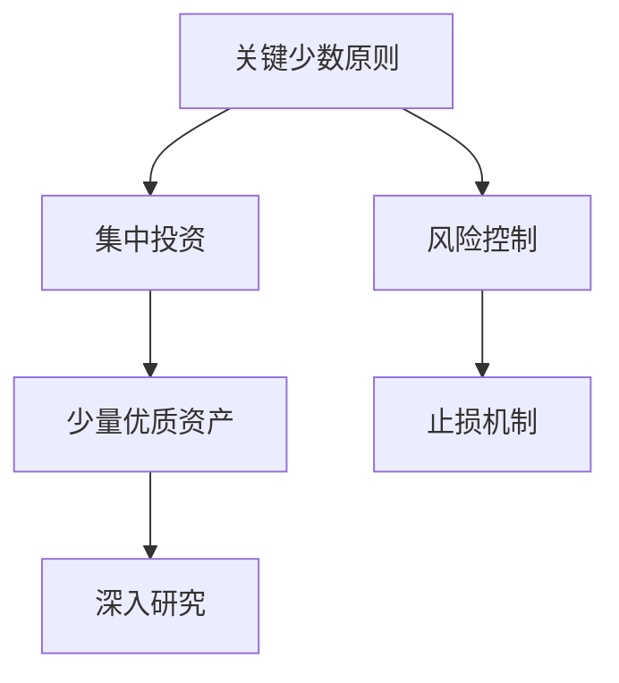
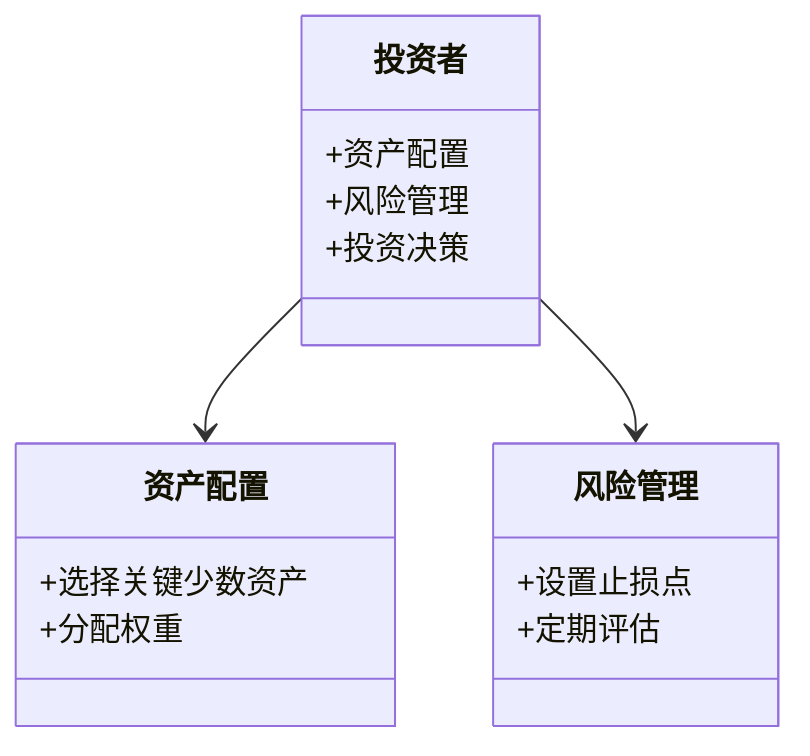
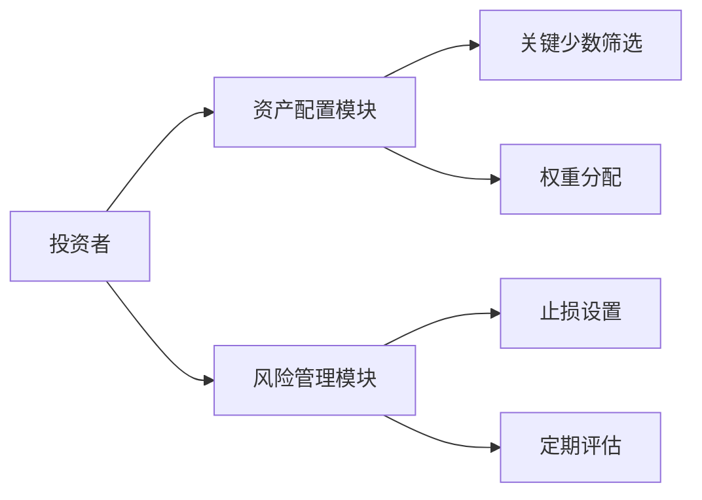

                 


# 芒格的"关键少数"原则：集中投资的智慧与风险

> 关键词：芒格投资理念，关键少数，集中投资，风险管理，投资策略，系统架构

> 摘要：本文深入探讨芒格的“关键少数”原则，分析其在投资中的智慧与潜在风险。结合技术语言，从背景介绍、核心概念、算法原理到系统架构和项目实战，全面解析该原则的应用及其在现代投资中的意义。

---

# 第一部分：芒格的“关键少数”原则概述

## 第1章：芒格的“关键少数”原则简介

### 1.1 芒格投资理念的核心

#### 1.1.1 芒格的“关键少数”原则定义
芒格的“关键少数”原则是基于其投资哲学的核心理念：通过集中投资于少数高质量的标的，避免分散投资以降低风险并提高收益。这种策略强调对少数优质资产的深入研究和长期持有。

#### 1.1.2 该原则与传统投资策略的区别
与传统分散投资不同，“关键少数”原则强调选择少量优质资产，而非广泛分散投资。这种策略要求投资者具备较高的选股能力，并能够承受较高的短期波动风险。

#### 1.1.3 芒格投资理念的哲学基础
芒格的投资理念深受价值投资和行为心理学的影响，他主张通过深入分析企业的基本面，选择具有长期竞争优势和良好治理结构的企业进行投资。

### 1.2 “关键少数”原则在投资中的应用背景

#### 1.2.1 当前投资环境的复杂性
当前市场环境复杂多变，投资者面临的信息过载和决策疲劳使得传统的分散投资策略难以应对市场波动。

#### 1.2.2 投资者面临的挑战与误区
许多投资者在选择投资标的时过于分散，导致无法集中资源深入研究和跟踪，反而增加了风险和降低了收益。

#### 1.2.3 集中投资的智慧与风险
集中投资能够减少交易成本和时间成本，但同时也意味着较高的风险集中。投资者需要在集中与分散之间找到平衡点。

---

## 第2章：“关键少数”原则的核心概念

### 2.1 “关键少数”原则的核心要素

#### 2.1.1 投资标的筛选标准
- 企业具有强大的竞争优势
- 良好的财务状况和治理结构
- 长期增长潜力

#### 2.1.2 集中投资的逻辑
- 降低交易成本和时间成本
- 提高对投资标的的理解深度
- 减少决策疲劳

#### 2.1.3 风险控制的关键点
- 设置止损点
- 定期评估投资组合
- 风险分散与集中之间的平衡

### 2.2 “关键少数”原则与其他投资策略的对比

#### 2.2.1 分散投资 vs 集中投资
| **策略**      | **优点**                                                                 | **缺点**                                                                 |
|----------------|--------------------------------------------------------------------------|--------------------------------------------------------------------------|
| 分散投资       | 降低风险，避免单一资产的重大损失                                             | 需要管理大量资产，增加交易成本和时间成本                                  |
| 集中投资       | 提高收益潜力，减少交易成本                                                     | 风险集中，单一资产的重大损失可能导致较大回撤                              |

---

### 2.3 芒格“关键少数”原则的属性对比



---

## 第3章：“关键少数”原则的数学模型与算法

### 3.1 投资组合的数学模型

#### 3.1.1 投资组合的期望收益计算
$$ E(R_p) = \sum_{i=1}^n w_i E(R_i) $$
其中，$w_i$ 是资产 $i$ 的权重，$E(R_i)$ 是资产 $i$ 的期望收益。

#### 3.1.2 投资组合的风险评估
$$ \sigma_p^2 = \sum_{i=1}^n \sum_{j=1}^n w_i w_j \sigma_{ij} $$
其中，$\sigma_{ij}$ 是资产 $i$ 和资产 $j$ 的协方差。

#### 3.1.3 投资组合的夏普比率
$$ \text{夏普比率} = \frac{E(R_p) - R_f}{\sigma_p} $$
其中，$R_f$ 是无风险利率，$\sigma_p$ 是投资组合的波动率。

---

### 3.2 投资组合的优化算法

#### 3.2.1 简单的均值-方差优化
```python
import numpy as np

# 假设资产收益和协方差矩阵
mu = np.array([0.1, 0.15, 0.12])
cov = np.array([[0.05, 0.02, 0.01],
                [0.02, 0.10, 0.03],
                [0.01, 0.03, 0.08]])

# 计算最优权重
n = len(mu)
inv_cov = np.linalg.inv(cov)
weights = inv_cov @ np.ones(n) / (np.ones(n) @ inv_cov @ np.ones(n))
```

#### 3.2.2 稳定优化的实现
```python
from scipy.optimize import minimize

def portfolio_variance(weights, cov):
    return weights.T @ cov @ weights

# 约束条件：权重之和为1
cons = ({'type': 'eq', 'fun': lambda w: sum(w) - 1})

# 优化目标是最小化方差
result = minimize(portfolio_variance, np.ones(len(cov)) / len(cov), 
                 constraints=cons, method='SLSQP')
```

---

### 3.3 投资组合的收益-风险曲线

```python
import matplotlib.pyplot as plt

# 生成不同权重下的收益和风险
returns = []
risks = []
for w in possible_weights:
    r = w @ mu
    s = np.sqrt(w.T @ cov @ w)
    returns.append(r)
    risks.append(s)

# 绘制收益-风险曲线
plt.plot(risks, returns, 'bo')
plt.xlabel('Risk')
plt.ylabel('Return')
plt.title('Efficient Frontier')
plt.show()
```

---

## 第4章：“关键少数”原则的系统架构

### 4.1 投资决策系统的功能设计



### 4.2 系统架构设计



---

## 第5章：项目实战——基于“关键少数”原则的投资系统

### 5.1 环境配置与数据收集

```python
import pandas as pd
import numpy as np

# 数据收集（示例）
data = pd.read_csv('stock_data.csv')
data.head()
```

### 5.2 核心实现

```python
# 筛选关键少数资产
def select_key_assets(data, threshold=0.8):
    # 假设筛选高收益资产
    return data[data['return'] > threshold]

# 计算投资组合
def compute_portfolio(assets, weights):
    return assets * weights
```

### 5.3 结果分析

```python
# 分析投资组合的夏普比率
returns = compute_portfolio(assets, weights)
risk_free_rate = 0.02
sharpe_ratio = (returns.mean() - risk_free_rate) / returns.std()
print(f"夏普比率: {sharpe_ratio}")
```

---

## 第6章：总结与扩展阅读

### 6.1 关键点回顾

- 集中投资的优势与风险
- 关键少数筛选的重要性
- 系统化投资决策的价值

### 6.2 最佳实践 tips

- 定期评估和调整投资组合
- 保持对市场的敏感性和灵活性
- 结合技术分析和基本面分析

### 6.3 注意事项

- 避免过度集中投资
- 选择具有长期竞争优势的企业
- 设置合理的止损点

### 6.4 拓展阅读

- 巴菲特的《投资之道》
- 《投资的智慧：芒格的投资策略》
- 技术分析相关的书籍和论文

---

# 作者：AI天才研究院 & 禅与计算机程序设计艺术

---

通过以上结构，我们可以看到芒格的“关键少数”原则在投资中的智慧与风险。结合技术语言和系统架构，我们能够更深入地理解和应用这一原则。

