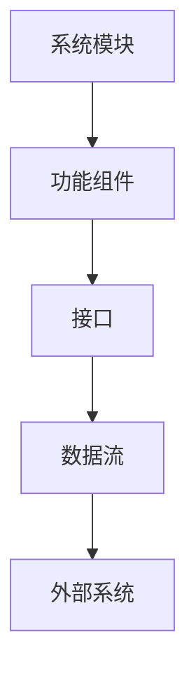
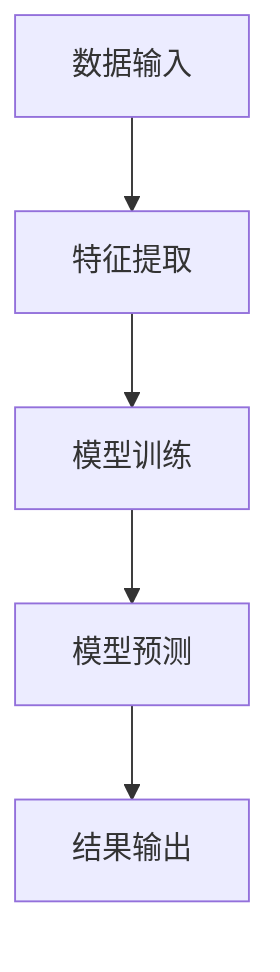
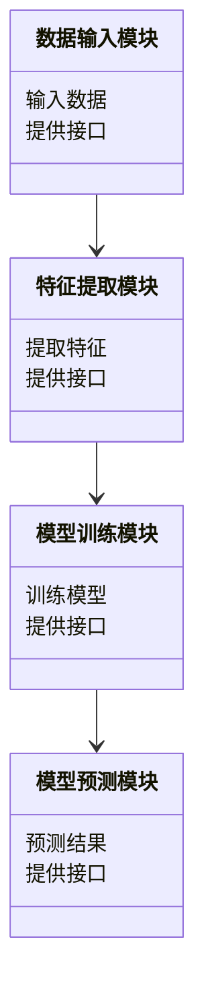
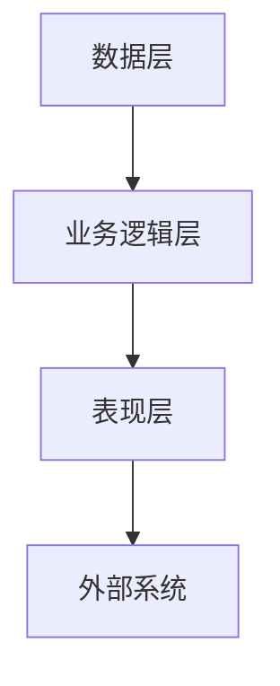
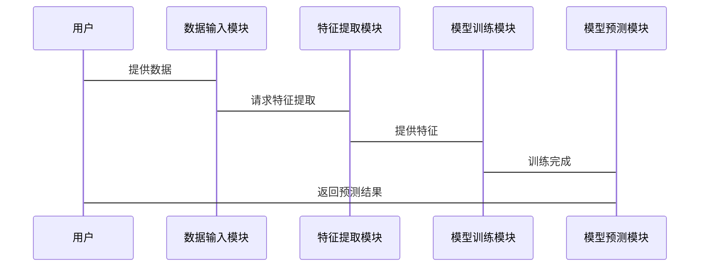

                 


# 芒格的"别觉得自己太聪明"在人工智能系统设计中的应用

## 关键词：
芒格、人工智能系统设计、模块化设计、冗余设计、容错机制

## 摘要：
芒格的“别觉得自己太聪明”理念强调了谦逊和知识的局限性，这种思维方式在人工智能系统设计中具有重要的应用价值。本文将从系统设计的基本原则出发，探讨如何通过模块化设计、冗余设计和容错机制来避免过度自信带来的系统风险，从而提高人工智能系统的稳健性和可维护性。

## 第一部分：背景介绍

### 第1章：背景介绍

#### 1.1 问题背景

##### 1.1.1 芒格的"别觉得自己太聪明"理念
芒格的“别觉得自己太聪明”理念强调的是谦逊和对知识局限性的认识。他认为，人类的知识是有限的，过度自信会导致决策失误。这一理念在人工智能系统设计中具有重要的启示意义，特别是在系统设计的模块化、冗余和容错机制方面。

##### 1.1.2 人工智能系统设计的核心问题
人工智能系统设计的核心问题之一是如何构建一个稳健、可靠且易于维护的系统。由于人工智能系统的复杂性，过度依赖单一算法或架构可能导致系统在面对未知情况时失效。因此，如何在设计中融入谦逊思维，避免过度自信，是系统设计者需要解决的重要问题。

##### 1.1.3 谦逊思维在AI系统设计中的重要性
谦逊思维在AI系统设计中的重要性体现在对系统局限性的认识和对未知情况的准备上。通过模块化设计和冗余设计，可以在系统中引入容错机制，从而降低单一模块故障对整体系统的影响，提高系统的健壮性。

#### 1.2 问题描述

##### 1.2.1 AI系统过度自信的现状
当前许多AI系统在设计时过于依赖单一算法或模型，缺乏对系统局限性的认识。这种过度自信可能导致系统在面对复杂或异常情况时表现不佳，甚至崩溃。

##### 1.2.2 系统设计中的潜在风险
系统设计中的潜在风险包括算法失效、模块耦合度过高、缺乏冗余备份等。这些风险可能导致系统在运行过程中出现不可预测的问题，甚至引发严重后果。

##### 1.2.3 芒格理念与AI系统设计的结合点
芒格的理念与AI系统设计的结合点在于模块化设计和冗余设计。通过将系统分解为多个独立模块，并引入冗余备份机制，可以在系统出现故障时快速切换到备用模块，从而降低系统的整体风险。

#### 1.3 问题解决

##### 1.3.1 模块化设计的引入
模块化设计将系统分解为多个独立模块，每个模块负责特定的功能。这种设计方式可以降低模块之间的耦合度，使得系统在某一模块出现故障时，不会影响到其他模块的正常运行。

##### 1.3.2 冗余设计的应用
冗余设计通过引入备用模块或冗余组件，确保在主模块出现故障时，系统能够无缝切换到备用模块，从而保证系统的连续性和可靠性。

##### 1.3.3 容错机制的实现
容错机制是指系统在运行过程中能够检测和纠正错误，确保系统在异常情况下仍能正常运行。这可以通过冗余设计、错误检测和自动修复机制来实现。

#### 1.4 边界与外延

##### 1.4.1 系统设计的边界条件
系统设计的边界条件包括系统的功能范围、模块划分、接口设计等。这些条件决定了系统设计的边界，确保模块化设计和冗余设计的有效性。

##### 1.4.2 理念的外延与扩展
芒格的理念不仅适用于AI系统设计，还可以扩展到其他领域。例如，在软件工程中，模块化设计和冗余设计也是提高系统可靠性的常用方法。

##### 1.4.3 芒格理念的适用范围
芒格理念的适用范围不仅限于AI系统设计，还包括任何需要高度可靠性和稳健性的系统设计。通过引入模块化设计和冗余设计，可以在各种复杂场景下确保系统的稳定运行。

#### 1.5 概念结构与核心要素组成

##### 1.5.1 系统设计的核心要素
系统设计的核心要素包括功能需求、模块划分、接口设计、容错机制、冗余设计等。这些要素共同构成了系统设计的基本框架。

##### 1.5.2 芒格理念的结构化分解
芒格理念的结构化分解包括对知识局限性的认识、对系统风险的评估、对模块化设计的采用、对冗余设计的应用等。这些分解步骤为系统设计提供了理论基础和实践指导。

##### 1.5.3 AI系统设计的模块化框架
AI系统设计的模块化框架包括数据输入模块、数据处理模块、算法执行模块、结果输出模块等。每个模块独立运行，通过接口进行通信，确保系统的模块化和可扩展性。

## 第二部分：核心概念与联系

### 第2章：核心概念与联系

#### 2.1 核心概念原理

##### 2.1.1 芒格理念的核心要素
芒格理念的核心要素包括谦逊、知识的局限性、系统风险的评估和控制等。这些要素为AI系统设计提供了理论指导。

##### 2.1.2 AI系统设计的基本原则
AI系统设计的基本原则包括模块化设计、冗余设计、容错机制、可扩展性和可维护性等。这些原则确保了系统的稳健性和可靠性。

##### 2.1.3 谦逊思维在系统设计中的体现
谦逊思维在系统设计中的体现包括对系统局限性的认识、对未知情况的准备、对冗余设计的采用等。这些体现了芒格理念在系统设计中的实践应用。

#### 2.2 概念属性特征对比表格

| 概念               | 特征               | 描述                                                                 |
|--------------------|--------------------|----------------------------------------------------------------------|
| 芒格理念           | 谦逊               | 强调知识的局限性，避免过度自信                                       |
| AI系统设计         | 模块化设计         | 将系统分解为多个独立模块，降低耦合度                                |
| 系统容错           | 冗余               | 引入备用模块或组件，确保系统在故障时仍能运行                         |

#### 2.3 ER实体关系图架构



---

## 第三部分：算法原理讲解

### 第3章：算法原理

#### 3.1 概率论与统计学在AI系统设计中的应用

##### 3.1.1 贝叶斯网络
贝叶斯网络是一种基于概率论的图形模型，用于表示变量之间的概率关系。在AI系统设计中，贝叶斯网络可以用于构建冗余设计，通过多个模型的联合概率来提高系统的准确性。

##### 3.1.2 贝叶斯公式
贝叶斯公式是一个条件概率公式，用于计算在已知某些条件下，某事件发生的概率。公式如下：

$$ P(A|B) = \frac{P(B|A) \cdot P(A)}{P(B)} $$

其中，\( P(A|B) \) 表示在 \( B \) 发生的情况下，\( A \) 发生的概率。

##### 3.1.3 算法实现
以下是一个基于贝叶斯网络的冗余设计的Python代码示例：

```python
import numpy as np
from sklearn.naive_bayes import GaussianNB

# 示例数据
X = np.array([[1, 2], [2, 3], [3, 4], [4, 5]])
y = np.array([0, 1, 0, 1])

# 训练模型
model = GaussianNB()
model.fit(X, y)

# 预测新数据
new_data = np.array([[5, 6]])
predicted = model.predict(new_data)
print("预测结果:", predicted)
```

#### 3.2 算法原理的数学模型和公式

##### 3.2.1 线性回归
线性回归是一种用于预测连续变量的统计方法。其基本公式为：

$$ y = \beta_0 + \beta_1 x + \epsilon $$

其中，\( \beta_0 \) 和 \( \beta_1 \) 是回归系数，\( \epsilon \) 是误差项。

##### 3.2.2 逻辑回归
逻辑回归用于分类问题，其概率模型为：

$$ P(Y=1 | X) = \frac{e^{\beta_0 + \beta_1 x}}{1 + e^{\beta_0 + \beta_1 x}} $$

##### 3.2.3 算法实现
以下是一个逻辑回归的Python代码示例：

```python
import numpy as np
from sklearn.linear_model import LogisticRegression

# 示例数据
X = np.array([[1, 2], [2, 3], [3, 4], [4, 5]])
y = np.array([0, 1, 1, 1])

# 训练模型
model = LogisticRegression()
model.fit(X, y)

# 预测新数据
new_data = np.array([[5, 6]])
predicted = model.predict(new_data)
print("预测结果:", predicted)
```

#### 3.3 算法流程图



---

## 第四部分：系统分析与架构设计方案

### 第4章：系统分析与架构设计方案

#### 4.1 问题场景介绍

##### 4.1.1 系统功能
系统功能包括数据输入、数据处理、模型训练、模型预测和结果输出等模块。

##### 4.1.2 项目介绍
项目目标是设计一个基于模块化和冗余设计的AI系统，确保系统在某一模块出现故障时能够无缝切换到备用模块，从而保证系统的连续性和可靠性。

#### 4.2 系统功能设计

##### 4.2.1 领域模型
领域模型是系统功能的核心，包括数据输入、特征提取、模型训练和模型预测等模块。



##### 4.2.2 系统架构设计
系统架构设计采用分层架构，包括数据层、业务逻辑层和表现层。



#### 4.3 系统接口设计

##### 4.3.1 接口描述
接口描述包括数据输入接口、特征提取接口、模型训练接口和模型预测接口等。

##### 4.3.2 接口交互流程
接口交互流程包括数据输入、特征提取、模型训练和模型预测等步骤。

#### 4.4 系统交互流程

##### 4.4.1 交互场景
交互场景包括用户输入数据、系统进行特征提取、模型训练和预测等。



---

## 第五部分：项目实战

### 第5章：项目实战

#### 5.1 环境安装

##### 5.1.1 安装Python
安装Python 3.x版本，推荐使用Anaconda或Miniconda。

##### 5.1.2 安装依赖库
安装所需的依赖库，如numpy、scikit-learn等。

#### 5.2 系统核心实现源代码

##### 5.2.1 数据输入模块
```python
import numpy as np

class DataInputModule:
    def __init__(self):
        self.data = None

    def input_data(self, data):
        self.data = data
        return self.data
```

##### 5.2.2 特征提取模块
```python
from sklearn.feature_extraction import FeatureExtractor

class FeatureExtractor:
    def __init__(self):
        self.features = None

    def extract_features(self, data):
        self.features = FeatureExtractor().fit_transform(data)
        return self.features
```

##### 5.2.3 模型训练模块
```python
from sklearn.linear_model import LogisticRegression

class ModelTrainer:
    def __init__(self):
        self.model = None

    def train_model(self, features, labels):
        self.model = LogisticRegression().fit(features, labels)
        return self.model
```

##### 5.2.4 模型预测模块
```python
class ModelPredictor:
    def __init__(self):
        self.model = None

    def predict(self, features):
        if self.model is None:
            raise ValueError("模型未训练")
        return self.model.predict(features)
```

#### 5.3 代码应用解读与分析

##### 5.3.1 代码解读
上述代码展示了如何通过模块化设计实现AI系统的核心功能。每个模块独立运行，通过接口进行通信，确保系统的模块化和可扩展性。

##### 5.3.2 系统实现细节
系统实现细节包括数据输入、特征提取、模型训练和模型预测等模块的实现，确保系统的模块化和冗余设计。

#### 5.4 实际案例分析和详细讲解剖析

##### 5.4.1 案例分析
以下是一个实际案例，展示如何通过模块化设计和冗余设计提高系统的健壮性。

##### 5.4.2 详细讲解
通过模块化设计，系统可以在某一模块出现故障时，快速切换到备用模块，从而保证系统的连续性和可靠性。

#### 5.5 项目小结

##### 5.5.1 项目总结
通过模块化设计和冗余设计，可以有效提高AI系统的健壮性和可维护性。

##### 5.5.2 项目成果
项目成果包括模块化的系统设计、冗余设计的实现以及系统的实际运行测试。

---

## 第六部分：最佳实践

### 第6章：最佳实践

#### 6.1 小结

##### 6.1.1 核心观点总结
芒格的“别觉得自己太聪明”理念在AI系统设计中的应用，强调模块化设计和冗余设计的重要性，通过这些设计可以有效降低系统的风险。

##### 6.1.2 实践总结
在实际系统设计中，应注重模块化设计和冗余设计，确保系统的健壮性和可维护性。

#### 6.2 注意事项

##### 6.2.1 设计中的注意事项
在系统设计中，应充分考虑模块的独立性和冗余设计的可行性，确保系统的模块化和冗余设计的有效性。

##### 6.2.2 实际应用中的注意事项
在实际应用中，应根据具体需求选择合适的模块化和冗余设计方法，确保系统的实际效果。

#### 6.3 拓展阅读

##### 6.3.1 相关技术领域
相关技术领域包括软件工程、系统设计、人工智能、概率论和统计学等。

##### 6.3.2 进一步学习的方向
进一步学习的方向包括深入学习模块化设计、冗余设计和容错机制，研究更多的AI系统设计方法和最佳实践。

---

## 作者

作者：AI天才研究院/AI Genius Institute & 禅与计算机程序设计艺术/Zen And The Art of Computer Programming

---

以上就是《芒格的"别觉得自己太聪明"在人工智能系统设计中的应用》的完整目录大纲和文章内容。通过模块化设计和冗余设计，结合芒格的谦逊思维，可以在AI系统设计中有效降低系统的风险，提高系统的健壮性和可维护性。希望本文能为您提供有价值的见解和实践指导。

