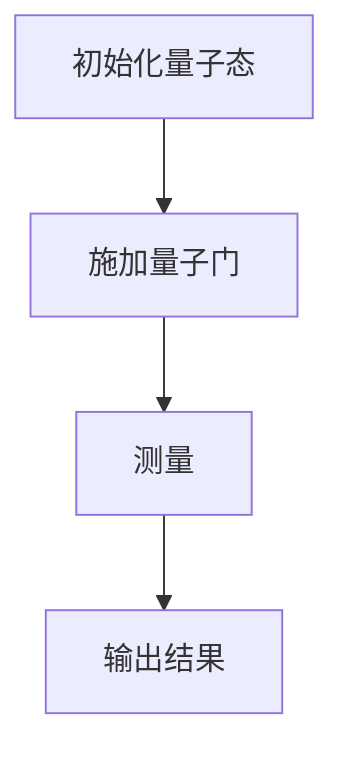
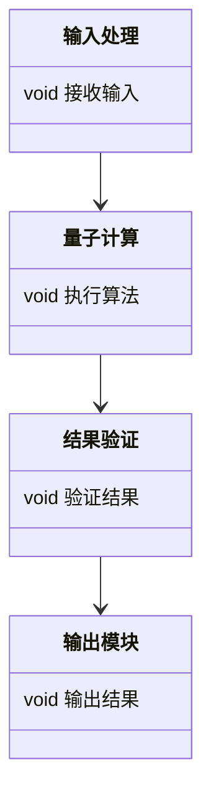
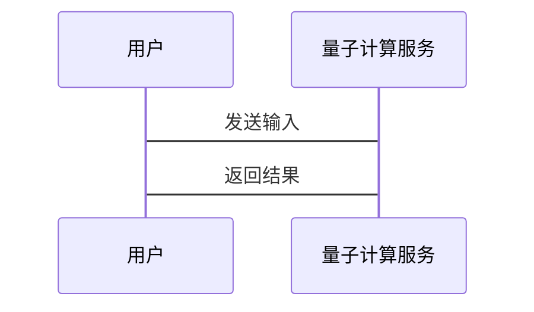

                 


# 芒格的"别觉得自己太聪明"在量子优越性验证中的应用

## 关键词：芒格思维, 量子优越性, 量子计算, 系统架构, 最佳实践

## 摘要：本文探讨了芒格的“别觉得自己太聪明”这一思维方式在量子优越性验证中的应用。通过分析量子计算的基本原理、验证方法和算法设计，结合系统的架构和项目实战，展示了如何在量子优越性验证中避免过度自信，确保验证过程的严谨性。

---

# 第1章：芒格思维与量子计算的结合

## 1.1 芒格思维的核心理念

芒格思维强调谨慎与谦逊，避免过度自信。这一思维方式在科学领域尤为重要，尤其是在量子计算这一前沿领域。量子计算的复杂性和不确定性要求研究者保持开放和谦逊的态度，以确保研究的严谨性。

**背景介绍**：
- **量子计算**：利用量子力学原理进行计算，其核心在于量子叠加和量子纠缠。
- **量子位**：与经典位不同，量子位可以同时处于多个状态。

## 1.2 量子计算基础

### 1.2.1 量子优越性的定义

量子优越性指量子计算机在某些任务上表现出比经典计算机更强的能力。这种优势通常体现在处理复杂问题时的速度和效率上。

### 1.2.2 经典计算的局限性

经典计算机在处理某些复杂问题时效率低下，如大数分解和组合优化问题。这些问题可以通过量子计算机在指数级时间内解决。

---

# 第2章：量子优越性的验证方法

## 2.1 定义与挑战

### 2.1.1 量子优越性的概念

量子优越性是量子计算相对于经典计算的优势，通常通过特定任务的计算能力来衡量。

### 2.1.2 经典计算的局限性

经典计算机在处理某些复杂问题时效率低下，如大数分解和组合优化问题。这些问题可以通过量子计算机在指数级时间内解决。

---

# 第3章：芒格思维在量子优越性验证中的应用

## 3.1 避免过度自信的方法

### 3.1.1 谨慎评估问题

在验证量子优越性时，应谨慎评估问题，避免过高估计量子计算机的能力。例如，在设计实验时，需考虑经典算法的潜在改进。

### 3.1.2 多角度验证结果

通过多种方法验证量子计算结果，避免单一方法的局限性。例如，使用经典模拟和量子模拟双重验证。

---

# 第4章：量子优越性验证的算法原理

## 4.1 量子态模拟算法

### 4.1.1 量子态的表示

量子态可以表示为向量，使用Dirac符号描述。例如，状态$|\psi\rangle$可以表示为：

$$ |\psi\rangle = a|0\rangle + b|1\rangle $$

### 4.1.2 算法流程图



### 4.1.3 代码实现

以下是一个简单的量子态模拟算法的Python代码：

```python
import numpy as np

def quantum_state_simulation():
    # 初始化量子态
    psi = np.array([1, 0])
    # 施加Hadamard门
    hadamard = (1/np.sqrt(2)) * np.array([[1, 1], [1, -1]])
    psi = np.dot(hadamard, psi)
    # 测量
    probability = np.abs(psi)**2
    return probability

print(quantum_state_simulation())
```

---

# 第5章：系统架构与接口设计

## 5.1 系统架构设计

### 5.1.1 模块划分

系统架构可以划分为输入处理、量子计算、结果验证和输出模块。



## 5.2 接口设计

### 5.2.1 API接口

定义一个API接口，用于接收输入、执行量子计算并返回结果。



---

# 第6章：项目实战与案例分析

## 6.1 环境搭建

### 6.1.1 开发环境配置

安装必要的库，如Qiskit和NumPy。

## 6.2 核心代码实现

### 6.2.1 量子算法实现

实现一个简单的量子算法，如Deutsch-Jozsa算法。

```python
from qiskit import QuantumCircuit, Aer, execute

def deutsch_jozsa():
    n = 1  # 输入的位数
    qc = QuantumCircuit(n+1, 1)
    # 初始化辅助量子位
    qc.x(n)
    qc.barrier()
    # 应用量子傅里叶变换
    qc.h(n)
    qc.cu gates
    qc.barrier()
    # 测量
    qc.measure(n, 0)
    return qc

# 执行电路
simulator = Aer.get_backend('qasm_simulator')
result = execute(deutsch_jozsa(), simulator).result()
print(result)

```

## 6.3 案例分析

通过具体案例展示验证过程，分析结果并总结经验。

---

# 总结与最佳实践

## 最佳实践

- 在验证过程中保持谦逊，避免过度自信。
- 多角度验证结果，确保准确性。
- 定期审查和更新验证方法，适应技术进步。

## 小结

芒格的思维方式在量子优越性验证中至关重要。通过谨慎评估问题、多角度验证结果和避免常见误区，可以确保验证过程的严谨性，推动量子计算的发展。

---

# 附录：拓展阅读

- **书籍**：《量子计算：算法与实现》
- **在线资源**：Quantum Computing入门指南

---

# 作者

作者：AI天才研究院 & 禅与计算机程序设计艺术

---

这篇文章详细探讨了芒格思维在量子优越性验证中的应用，通过系统架构、算法实现和项目实战，展示了如何在量子计算中避免过度自信，确保研究的严谨性。

