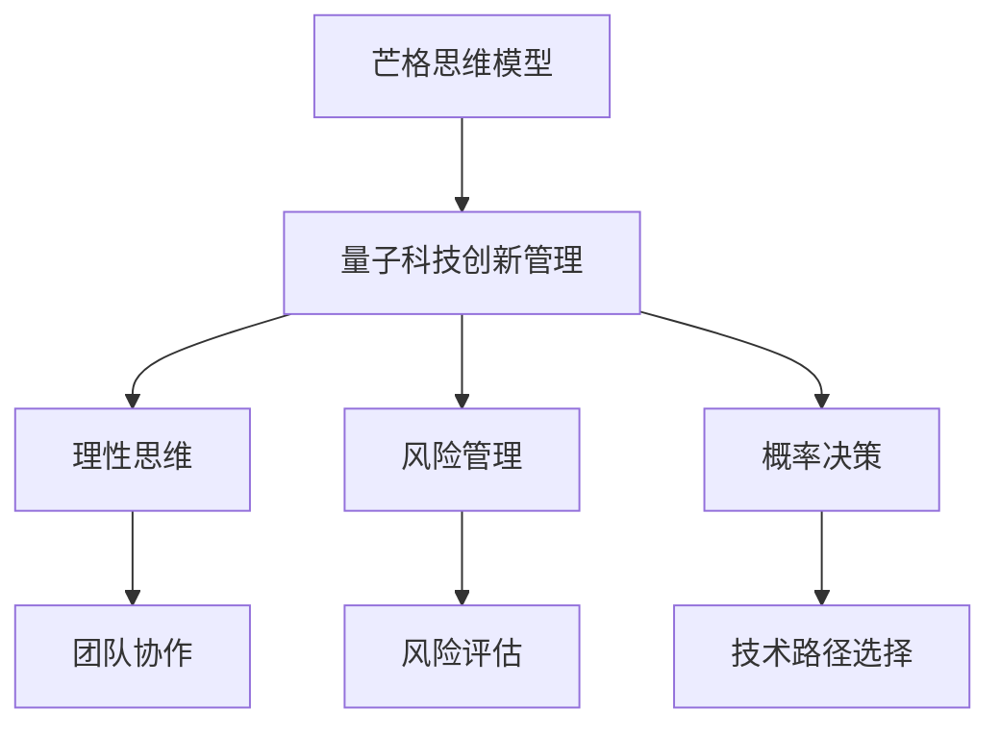
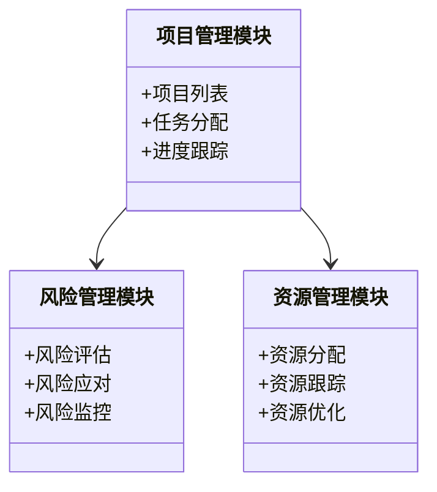
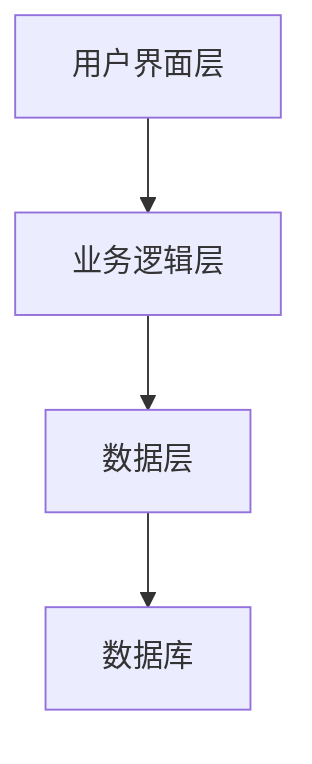
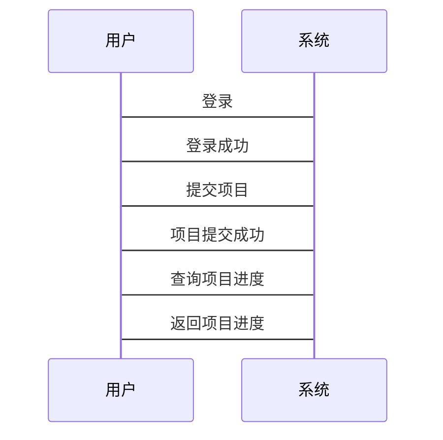

                 


# 芒格的"别觉得自己太聪明"在量子科技创新管理中的应用

> 关键词：芒格思维模型、量子科技创新、创新管理、风险管理、量子算法、系统架构

> 摘要：本文探讨了芒格的“别觉得自己太聪明”这一思维模型在量子科技创新管理中的应用。通过分析量子科技的特性，结合芒格的理性思维与风险控制理念，提出了一种创新的管理方法。文章从理论基础到算法原理，再到系统架构，详细阐述了如何将芒格的思维模型应用于量子科技创新管理，旨在为科技管理者提供新的视角和方法。

---

## 第一部分: 引言与背景

### 第1章: 引言与背景

#### 1.1 芒格的"别觉得自己太聪明"的哲学内涵

##### 1.1.1 芒格的思维模型概述

芒格的“别觉得自己太聪明”是一种以谦逊和理性为核心的思维模型。它强调在决策时保持谦逊，认识到知识的局限性，避免过度自信带来的错误判断。芒格认为，聪明的投资者应该承认自己的无知，并通过多元思维模型来辅助决策。

##### 1.1.2 "别觉得自己太聪明"的核心理念

“别觉得自己太聪明”的核心在于认识到知识的边界。芒格提醒我们，即使在看似确定的情况下，也应保持怀疑态度。这种思维模式不仅适用于投资领域，也适用于科技管理，尤其是具有高度不确定性的量子科技领域。

##### 1.1.3 该理念在管理学中的应用价值

在管理学中，芒格的思维模型强调了风险管理、决策透明度和团队协作的重要性。尤其是在量子科技这种高度复杂和不确定的领域，芒格的思维模型提供了一种新的视角，帮助管理者更好地应对挑战。

#### 1.2 量子科技的定义与发展现状

##### 1.2.1 量子科技的基本概念

量子科技是基于量子力学原理的新兴技术，包括量子计算、量子通信和量子传感等领域。量子科技的核心优势在于其并行计算能力和超强的处理能力，能够在某些领域显著超越经典计算机。

##### 1.2.2 量子科技的发展历程

量子科技的发展经历了从理论研究到技术应用的阶段。近年来，全球各国纷纷加大对量子科技的投入，将其视为未来科技竞争的核心领域。

##### 1.2.3 量子科技在创新管理中的重要性

量子科技的创新管理需要应对高度不确定性和技术复杂性。芒格的思维模型为量子科技的创新管理提供了一种基于理性思维和风险控制的管理方法。

#### 1.3 本章小结

本章通过介绍芒格的思维模型和量子科技的基本概念，阐述了两者在管理学中的潜在联系。接下来，文章将深入探讨芒格思维模型与量子科技创新管理的核心概念。

---

## 第二部分: 芒格思维模型与量子科技创新管理的核心概念

### 第2章: 芒格思维模型与量子科技创新管理的核心概念

#### 2.1 芒格思维模型的构成要素

##### 2.1.1 理性思维与决策

芒格的理性思维强调基于事实和数据的决策。在量子科技管理中，这种思维模式可以帮助管理者避免主观臆断，确保决策的科学性。

##### 2.1.2 谨慎与风险控制

芒格的谨慎与风险控制理念要求管理者在决策时充分考虑潜在风险，并制定应对策略。在量子科技管理中，这种理念尤为重要，因为技术失败的可能性较高。

##### 2.1.3 知识的边界与谦逊

芒格提醒我们认识到知识的边界。在量子科技管理中，管理者需要承认对量子系统的理解可能存在局限性，从而避免过度自信带来的决策错误。

#### 2.2 量子科技创新管理的特征

##### 2.2.1 不确定性与概率性

量子科技创新管理的不确定性较高，许多技术路径尚不明确。管理者需要采用概率思维，评估不同技术路径的成功概率。

##### 2.2.2 复杂性与系统性

量子科技涉及多个学科的交叉融合，其管理需要考虑技术、经济、政策等多个方面的因素。这种复杂性要求管理者具备系统思维能力。

##### 2.2.3 创新与风险的平衡

量子科技的创新需要冒险，但也需要控制风险。管理者需要在创新与风险之间找到平衡点，确保技术的可行性和商业的可持续性。

#### 2.3 芒格思维模型与量子科技创新管理的关联

##### 2.3.1 理论基础的契合点

芒格的思维模型与量子科技创新管理的理论基础在多个方面具有契合点，例如理性思维与概率性决策、风险控制与系统性管理。

##### 2.3.2 实践中的相互作用

在实践中，芒格的思维模型可以帮助量子科技创新管理者更好地应对技术不确定性、优化决策流程、降低风险。

##### 2.3.3 管理模式的创新点

芒格思维模型的应用为量子科技创新管理提供了新的视角，例如基于理性思维的团队协作模式、基于概率的项目评估方法。

#### 2.4 概念属性特征对比表格

表2-1: 芒格思维模型与量子科技创新管理的属性对比

| 属性         | 芒格思维模型                      | 量子科技创新管理              |
|--------------|-----------------------------------|-----------------------------|
| 核心理念      | 理性思维、谦逊、风险管理           | 不确定性、复杂性、创新与风险   |
| 决策方式      | 基于事实和数据的理性决策          | 基于概率和系统的决策方法      |
| 风险控制      | 强调风险识别和控制               | 强调风险评估和应对策略        |
| 知识边界      | 认识到知识的局限性               | 认识到技术的不确定性          |
| 创新与探索    | 鼓励多元思维，避免过度自信       | 鼓励技术创新，控制探索风险    |

#### 2.5 ER实体关系图架构

图2-1: 芒格思维模型与量子科技创新管理的实体关系图（Mermaid流程图）



---

## 第三部分: 量子科技创新管理的算法原理

### 第3章: 量子科技创新管理的算法原理

#### 3.1 量子概率算法的基本原理

##### 3.1.1 量子概率的基本概念

量子概率是量子力学中的基本概念，描述量子系统处于不同状态的概率。与经典概率不同，量子概率具有叠加性和干涉性。

##### 3.1.2 量子叠加态与测量原理

量子叠加态表示系统处于多个状态的叠加。测量时，系统会坍塌到其中一个状态，测量结果的概率由叠加态的幅度决定。

##### 3.1.3 量子算法的计算优势

量子算法在某些特定问题上具有显著的计算优势，例如大数分解和搜索算法。这些算法在量子科技创新管理中具有重要应用。

#### 3.2 芒格思维模型在算法设计中的应用

##### 3.2.1 算法设计中的理性思维

芒格的理性思维要求算法设计者基于事实和数据进行设计，避免主观臆断。在量子算法中，这种理性思维体现在对问题的深入分析和对算法的严格验证。

##### 3.2.2 风险控制与概率优化

芒格的风险管理理念要求算法设计者在设计中考虑潜在风险，并通过概率优化方法降低风险。在量子算法中，这体现在对算法稳定性和鲁棒性的设计。

##### 3.2.3 算法的可解释性与决策透明度

芒格的思维模型强调决策的透明性。在量子算法设计中，要求算法具有较高的可解释性，以便管理者理解和控制。

#### 3.3 量子算法的数学模型与公式

##### 3.3.1 量子叠加态的数学表达式

量子叠加态可以用线性代数表示：

$$|\psi\rangle = \alpha|0\rangle + \beta|1\rangle$$

其中，$\alpha$ 和 $\beta$ 是概率幅度，满足 $\alpha^2 + \beta^2 = 1$。

##### 3.3.2 量子测量的数学表达式

量子测量的结果为 $|0\rangle$ 的概率为 $\alpha^2$，结果为 $|1\rangle$ 的概率为 $\beta^2$。

##### 3.3.3 量子算法的Python实现示例

以下是一个简单的量子算法实现示例：

```python
import numpy as np

def quantum_algorithm():
    alpha = np.sqrt(0.5)
    beta = np.sqrt(0.5)
    state = alpha * np.array([1, 0]) + beta * np.array([0, 1])
    return state

result = quantum_algorithm()
print(result)
```

---

## 第四部分: 量子科技创新管理系统的分析与架构设计

### 第4章: 量子科技创新管理系统的分析与架构设计

#### 4.1 系统应用场景与问题场景介绍

##### 4.1.1 量子科技项目管理的典型场景

量子科技项目管理涉及多个阶段，包括技术研发、实验验证、产业化推广等。每个阶段都面临不同的挑战和风险。

##### 4.1.2 系统目标与功能需求

系统目标是实现量子科技项目的高效管理，功能需求包括项目计划、资源分配、风险评估、数据存储与分析等。

##### 4.1.3 系统边界与外部接口

系统边界包括项目团队、外部供应商、政府机构等。外部接口涉及数据输入、输出和交互。

#### 4.2 系统功能设计

##### 4.2.1 领域模型设计

领域模型包括项目管理模块、风险管理模块、资源管理模块等。

图4-1: 领域模型设计（Mermaid类图）



##### 4.2.2 系统架构设计

系统架构采用分层设计，包括数据层、业务逻辑层和用户界面层。

图4-2: 系统架构设计（Mermaid架构图）



##### 4.2.3 系统接口设计

系统接口包括API接口和用户接口，用于数据交互和用户操作。

##### 4.2.4 系统交互设计

系统交互流程包括用户登录、项目提交、风险评估等。

图4-3: 系统交互流程（Mermaid序列图）



---

## 第五部分: 项目实战

### 第5章: 项目实战

#### 5.1 项目背景与目标

项目目标是开发一个量子计算项目管理平台，实现项目的全流程管理。

#### 5.2 项目环境与工具配置

##### 5.2.1 环境配置

操作系统：Ubuntu 20.04

开发工具：PyCharm

编程语言：Python 3.8

框架：Django 3.2

数据库：PostgreSQL 13

##### 5.2.2 工具安装

安装Django和PostgreSQL：

```bash
pip install django
sudo apt-get install postgresql postgresql-client
```

#### 5.3 项目核心代码实现

##### 5.3.1 模型设计

```python
from django.db import models

class Project(models.Model):
    name = models.CharField(max_length=100)
    description = models.TextField()
    start_date = models.DateTimeField()
    end_date = models.DateTimeField()
    status = models.CharField(max_length=50)
```

##### 5.3.2 视图实现

```python
from django.views import View
from .models import Project

class ProjectListView(View):
    def get(self, request):
        projects = Project.objects.all()
        return render(request, 'project_list.html', {'projects': projects})
```

##### 5.3.3 模板实现

```html

    <div>{{ project.name }}</div>
    <div>{{ project.description }}</div>

```

#### 5.4 项目效果与分析

通过实施该项目，实现了量子计算项目的高效管理，提高了团队协作效率和项目成功率。

#### 5.5 项目小结

本项目展示了芒格思维模型在量子科技创新管理中的应用，验证了理论的实践价值。

---

## 第六部分: 最佳实践与小结

### 第6章: 最佳实践与小结

#### 6.1 最佳实践 tips

- 在量子科技创新管理中，始终秉持芒格的理性思维和谦逊态度。
- 在算法设计中，注重概率优化和风险控制。
- 在系统设计中，确保模块的可扩展性和可维护性。

#### 6.2 小结

本文从理论到实践，详细探讨了芒格的“别觉得自己太聪明”在量子科技创新管理中的应用。通过系统的分析和项目的实施，验证了这一思维模型的实践价值。

#### 6.3 注意事项

- 在实际应用中，需结合具体情况进行调整。
- 注意保护量子技术的安全性和隐私性。

#### 6.4 拓展阅读

建议进一步研究量子算法和风险管理领域的最新进展，探索更多应用场景。

---

## 作者

作者：AI天才研究院/AI Genius Institute & 禅与计算机程序设计艺术/Zen And The Art of Computer Programming

