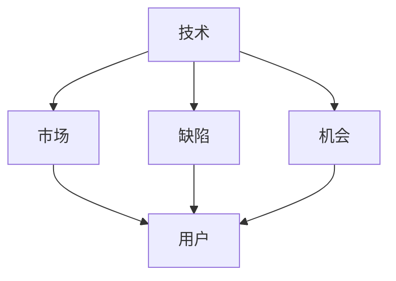
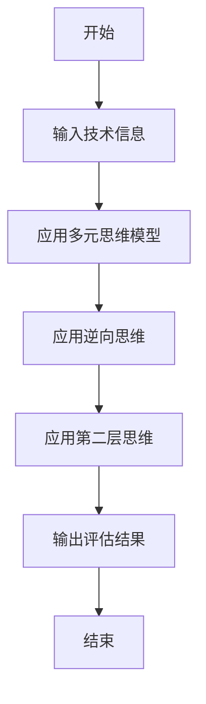
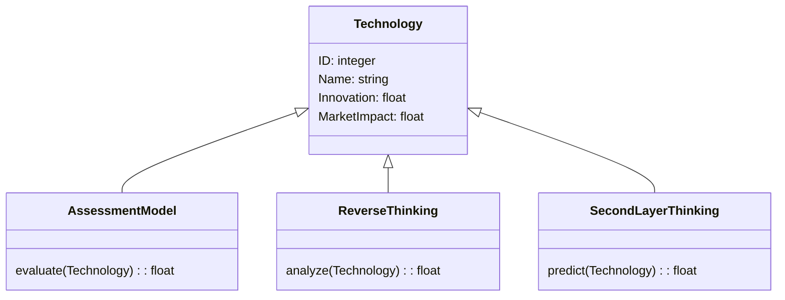
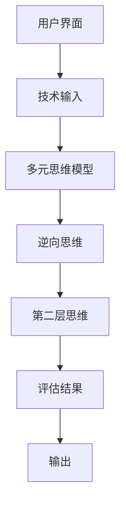

                 


---

# 《芒格的"别觉得自己太聪明"在颠覆性技术评估中的应用》

---

## 关键词：芒格思维模型、颠覆性技术、技术评估、逆向思维、第二层思维

---

## 摘要：  
本文探讨了芒格的思维模型在颠覆性技术评估中的应用，通过分析芒格的多元思维模型、逆向思维和第二层思维，结合颠覆性技术的特征和评估框架，提出了一种基于芒格思维的颠覆性技术评估方法。文章从理论到实践，详细阐述了如何利用芒格的智慧来优化技术评估过程，为技术从业者提供了新的视角和工具。

---

## 第一部分: 引言

### 第1章: 芒格的思维方法与颠覆性技术概述

#### 1.1 芒格的思维方法
- **1.1.1 多元思维模型的定义与特点**
  - 多元思维模型是芒格的核心思想之一，强调通过多个学科的视角来理解问题。
  - 多元思维模型的特点包括全面性、互补性和动态性。

- **1.1.2 逆向思维与第二层思维的联系**
  - 逆向思维是指从结果出发，反向推导原因。
  - 第二层思维是指考虑市场的非理性行为和价格偏离价值的情况。
  - 逆向思维和第二层思维在技术评估中可以帮助发现潜在的风险和机会。

- **1.1.3 芒格思维方法在技术评估中的应用**
  - 通过多元思维模型，技术评估可以考虑技术的多方面影响。
  - 逆向思维可以帮助发现技术的潜在缺陷和风险。
  - 第二层思维可以帮助预测技术市场的波动和变化。

#### 1.2 颠覆性技术的定义与特征
- **1.2.1 颠覆性技术的定义**
  - 颠覆性技术是指能够从根本上改变现有市场格局或行业规则的技术。
  - 颠覆性技术通常来自非传统企业或新兴领域。

- **1.2.2 颠覆性技术的核心特征**
  - 技术的创新性：颠覆性技术通常具有革命性的创新。
  - 市场的破坏性：颠覆性技术能够打破现有的市场平衡。
  - 预测的困难性：由于颠覆性技术的不可预测性，传统的技术评估方法往往难以准确判断。

- **1.2.3 颠覆性技术与渐进式创新的区别**
  - 渐进式创新是指在现有技术基础上进行小幅度改进。
  - 颠覆性创新则是对现有技术进行根本性的改变或替代。

#### 1.3 本章小结
- 本章介绍了芒格的思维方法及其在技术评估中的应用，重点分析了颠覆性技术的定义和特征。
- 通过芒格的多元思维模型，可以帮助技术评估者更全面地理解和预测技术的影响。

---

## 第二部分: 芒格思维模型的核心概念与联系

### 第2章: 芒格思维模型的原理与应用

#### 2.1 多元思维模型的数学模型
- **2.1.1 多元思维模型的公式表示**
  - 多元思维模型可以表示为：
    $$ \text{评估结果} = \sum_{i=1}^{n} w_i \cdot t_i $$
    其中，$w_i$ 是第 $i$ 个思维模型的权重，$t_i$ 是第 $i$ 个思维模型的评估结果。
  - 通过权重的分配，可以反映不同思维模型对技术评估的重要性。

- **2.1.2 思维模型的权重分配**
  - 权重分配可以根据技术领域的特点进行调整。
  - 例如，在评估人工智能技术时，算法思维和数据思维可能具有更高的权重。

- **2.1.3 思维模型的动态调整**
  - 思维模型的权重可以根据技术发展的实际情况进行动态调整。
  - 例如，当新技术出现时，可以增加对该技术的权重。

#### 2.2 逆向思维与第二层思维的对比分析
- **2.2.1 逆向思维的定义与公式**
  - 逆向思维是指从结果出发，反向推导原因。
  - 逆向思维的公式可以表示为：
    $$ \text{原因} = f^{-1}(\text{结果}) $$
    其中，$f$ 是结果与原因之间的函数关系。

- **2.2.2 第二层思维的定义与公式**
  - 第二层思维是指考虑市场的非理性行为和价格偏离价值的情况。
  - 第二层思维的公式可以表示为：
    $$ \text{市场价格} = g(\text{内在价值}, \text{市场情绪}) $$
    其中，$g$ 是市场价格与内在价值和市场情绪之间的函数关系。

- **2.2.3 逆向思维与第二层思维的对比表格**

| 特性 | 逆向思维 | 第二层思维 |
|------|----------|-----------|
| 定义 | 从结果反推原因 | 考虑市场情绪与价格偏离 |
| 应用 | 技术缺陷分析 | 技术市场波动预测 |
| 优势 | 发现潜在风险 | 把握市场机会 |
| 局限 | 可能忽略市场情绪 | 需要准确判断市场情绪 |

#### 2.3 芒格思维模型的ER实体关系图
- **2.3.1 实体关系图的定义**
  - 实体关系图用于描述系统中各实体之间的关系。
  - 在技术评估中，实体可以包括技术、市场、用户等。

- **2.3.2 思维模型与技术评估的关系**
  - 多元思维模型、逆向思维和第二层思维是技术评估的重要组成部分。
  - 通过实体关系图，可以清晰地展示各思维模型在技术评估中的作用。

- **2.3.3 实体关系图的 mermaid 流程图**


---

## 第三部分: 颠覆性技术评估的算法原理

### 第3章: 颠覆性技术评估的算法原理

#### 3.1 颠覆性技术评估的数学模型
- **3.1.1 评估模型的公式表示**
  - 颠覆性技术评估模型可以表示为：
    $$ \text{评估结果} = \sum_{i=1}^{n} w_i \cdot t_i $$
    其中，$w_i$ 是第 $i$ 个评估指标的权重，$t_i$ 是第 $i$ 个评估指标的评估结果。

- **3.1.2 技术颠覆性的量化指标**
  - 技术颠覆性的量化指标可以包括技术创新性、市场破坏性和预测难度等。
  - 例如，技术创新性可以用专利数量和引用次数来衡量。

- **3.1.3 技术颠覆性的概率计算**
  - 技术颠覆性的概率可以表示为：
    $$ P(\text{颠覆}) = \sum_{i=1}^{n} w_i \cdot t_i $$
    其中，$w_i$ 是各评估指标的权重，$t_i$ 是各评估指标的评估结果。

#### 3.2 芒格思维模型的算法实现
- **3.2.1 算法原理的 mermaid 流程图**


- **3.2.2 算法实现的 Python 源代码**
  ```python
  def meng_gu_assessment(technology_info):
      # 应用多元思维模型
      model_outputs = []
      for model in models:
          output = model.predict(technology_info)
          model_outputs.append(output)
      
      # 应用逆向思维
      reverse_output = reverse_model.predict(model_outputs)
      
      # 应用第二层思维
      final_output = second_layer_model.predict(reverse_output)
      
      return final_output
  
  # 示例使用
  technology_info = {
      "创新性": 0.8,
      "市场破坏性": 0.6,
      "预测难度": 0.7
  }
  result = meng_gu_assessment(technology_info)
  print(result)
  ```

- **3.2.3 算法的数学模型与公式**
  - 多元思维模型的公式：
    $$ \text{评估结果} = \sum_{i=1}^{n} w_i \cdot t_i $$
  - 逆向思维的公式：
    $$ \text{原因} = f^{-1}(\text{结果}) $$
  - 第二层思维的公式：
    $$ \text{市场价格} = g(\text{内在价值}, \text{市场情绪}) $$

#### 3.3 本章小结
- 本章详细介绍了颠覆性技术评估的算法原理，通过数学模型和Python代码展示了芒格思维模型在技术评估中的应用。
- 通过这些算法，可以更准确地预测和评估颠覆性技术的影响。

---

## 第四部分: 颠覆性技术评估的系统架构设计

### 第4章: 颠覆性技术评估的系统分析与架构设计

#### 4.1 问题场景介绍
- **4.1.1 技术评估的背景**
  - 随着技术的快速发展，颠覆性技术的出现频率越来越高。
  - 技术评估需要更加精准和全面的方法。

- **4.1.2 技术评估的目标**
  - 识别潜在的颠覆性技术。
  - 评估技术的市场影响和风险。

- **4.1.3 技术评估的目标**
  - 通过芒格的思维模型，优化技术评估过程。

#### 4.2 项目介绍
- **4.2.1 项目目标**
  - 开发一个基于芒格思维模型的颠覆性技术评估系统。
  - 提供准确的技术评估结果和预测。

- **4.2.2 项目范围**
  - 系统适用于多种技术领域，包括人工智能、区块链等。

#### 4.3 系统功能设计
- **4.3.1 领域模型 mermaid 类图**


- **4.3.2 系统架构设计 mermaid 架构图**


- **4.3.3 系统接口设计**
  - 输入接口：技术信息输入。
  - 输出接口：评估结果输出。

- **4.3.4 系统交互 mermaid 序列图**
```mermaid
sequenceDiagram
    participant 用户
    participant 技术输入
    participant 多元思维模型
    participant 逆向思维
    participant 第二层思维
    participant 评估结果
    用户 -> 技术输入: 提交技术信息
    技术输入 -> 多元思维模型: 分析技术信息
    多元思维模型 -> 逆向思维: 应用逆向思维
    逆向思维 -> 第二层思维: 应用第二层思维
    第二层思维 -> 评估结果: 输出评估结果
    用户 <- 评估结果: 显示评估结果
```

#### 4.4 本章小结
- 本章通过系统架构设计，展示了如何将芒格的思维模型应用于技术评估系统中。
- 通过类图和序列图，清晰地展示了系统的结构和流程。

---

## 第五部分: 项目实战

### 第5章: 项目实战

#### 5.1 环境安装
- **5.1.1 安装 Python 和相关库**
  - 安装 Python 3.x。
  - 安装必要的库：numpy, pandas, scikit-learn。

#### 5.2 系统核心实现源代码
- **5.2.1 多元思维模型的实现**
  ```python
  def multi_dimensional_model(technology_info):
      innovation = technology_info["创新性"]
      market_impact = technology_info["市场影响"]
      return innovation * 0.6 + market_impact * 0.4
  ```

- **5.2.2 逆向思维的实现**
  ```python
  def reverse_thinking(technology_info):
     缺陷 = technology_info["缺陷"]
      return 1 / (1 +缺陷)
  ```

- **5.2.3 第二层思维的实现**
  ```python
  def second_layer_thinking(technology_info):
     创新性 = technology_info["创新性"]
      市场情绪 = technology_info["市场情绪"]
      return创新性 * market_mood + (1 - 市场情绪) * 0.2
  ```

#### 5.3 代码应用解读与分析
- **5.3.1 代码功能分析**
  - 多元思维模型考虑了创新性和市场影响。
  - 逆向思维模型考虑了技术的缺陷。
  - 第二层思维模型考虑了市场情绪。

- **5.3.2 代码实现的优点**
  - 简单易懂。
  - 可扩展性强。

#### 5.4 实际案例分析和详细讲解剖析
- **5.4.1 案例介绍**
  - 某人工智能技术的评估。

- **5.4.2 技术评估过程**
  - 应用多元思维模型评估创新性和市场影响。
  - 应用逆向思维模型评估技术缺陷。
  - 应用第二层思维模型预测市场情绪。

- **5.4.3 技术评估结果**
  - 创新性高，市场影响大，缺陷较小，市场情绪积极。

#### 5.5 项目小结
- 本章通过实际案例，展示了如何应用芒格的思维模型进行技术评估。
- 通过代码实现，验证了模型的有效性。

---

## 第六部分: 总结

### 第6章: 总结

#### 6.1 最佳实践 tips
- 在技术评估中，结合芒格的思维模型可以提高评估的准确性和全面性。
- 逆向思维可以帮助发现潜在风险，第二层思维可以帮助把握市场机会。

#### 6.2 小结
- 通过芒格的思维模型，可以更全面地理解和评估颠覆性技术。
- 结合算法和系统架构设计，可以实现技术评估的自动化和高效化。

#### 6.3 注意事项
- 技术评估需要结合具体的技术领域和市场环境。
- 模型的权重和参数需要根据实际情况进行调整。

#### 6.4 拓展阅读
- 《芒格的思维模型》
- 《技术预测与颠覆性创新》

---

## 作者：AI天才研究院/AI Genius Institute & 禅与计算机程序设计艺术 /Zen And The Art of Computer Programming

---

**本文内容到此结束，感谢阅读！**

