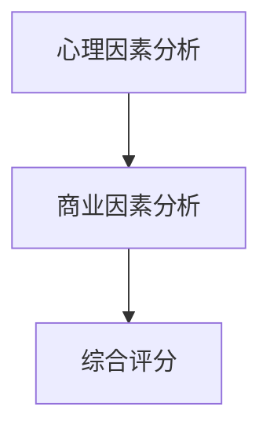
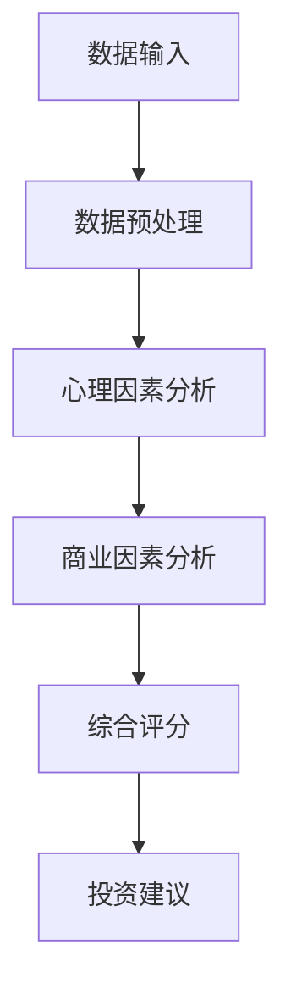
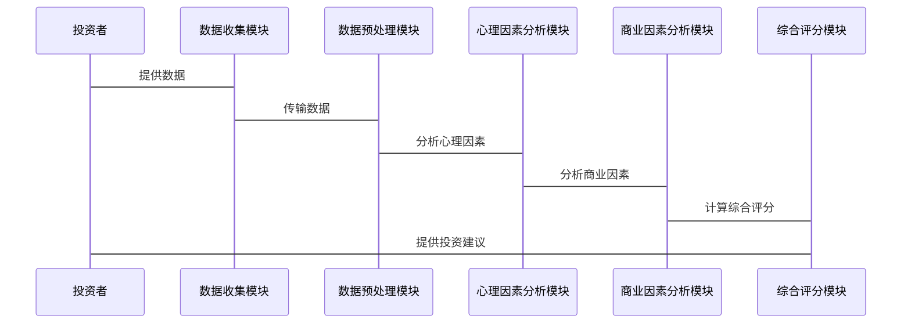

                 


```markdown
# 芒格的"双轨分析"在投资决策中的应用

> 关键词：芒格投资理念、双轨分析、心理因素、商业因素、投资决策模型

> 摘要：本文深入探讨了芒格的"双轨分析"方法在投资决策中的应用，结合心理因素和商业因素，构建了一个全面的投资分析框架。通过详细阐述双轨分析的核心概念、算法原理、系统架构设计以及实际案例分析，为读者提供了从理论到实践的完整指南。

---

## 第1章: 双轨分析的起源与核心概念

### 1.1 芒格投资理念的背景

#### 1.1.1 芒格投资哲学的形成
查理·芒格的投资哲学起源于对心理学、经济学和决策科学的深刻理解。他主张投资者应从心理和商业两个维度全面分析问题，避免单一维度的决策偏差。

#### 1.1.2 双轨分析的提出背景
在传统投资分析中，投资者往往过于关注财务数据或市场情绪，忽视了两者的结合。芒格提出双轨分析，旨在平衡心理因素和商业因素，避免片面决策。

#### 1.1.3 双轨分析的核心思想
双轨分析认为，投资决策应同时考虑心理因素和商业因素，通过量化分析和系统设计，构建全面的投资分析框架。

### 1.2 双轨分析的定义与特点

#### 1.2.1 双轨分析的定义
双轨分析是一种结合心理因素和商业因素的投资分析方法，通过量化评分和综合模型，帮助投资者做出更全面的决策。

#### 1.2.2 双轨分析的核心特点
- **全面性**：同时考虑心理和商业因素。
- **量化性**：通过评分系统量化分析结果。
- **系统性**：构建系统化的分析框架。

#### 1.2.3 双轨分析与传统投资分析的区别
| 分析维度 | 双轨分析 | 传统投资分析 |
|----------|----------|---------------|
| 心理因素 | 包括在内 | 往往忽略 |
| 商业因素 | 包括在内 | 主要关注 |

### 1.3 双轨分析的理论基础

#### 1.3.1 心理因素分析
心理因素分析包括投资者情绪、认知偏差等方面，通过量化这些因素，评估其对决策的影响。

#### 1.3.2 商业因素分析
商业因素分析包括企业基本面、行业环境等，通过系统分析，评估企业的投资价值。

#### 1.3.3 两者的结合与平衡
通过对比表格和ER图，展示心理因素和商业因素的联系，构建综合分析模型。

---

## 第2章: 双轨分析的核心概念与联系

### 2.1 心理因素分析

#### 2.1.1 投资者心理的构成
心理因素包括情绪、认知偏差、风险偏好等，这些因素直接影响投资决策。

#### 2.1.2 心理因素对投资决策的影响
通过具体案例，说明心理因素如何影响投资决策，如过度自信导致的错误决策。

#### 2.1.3 心理因素的量化分析
使用Mermaid流程图展示心理因素的量化过程。

### 2.2 商业因素分析

#### 2.2.1 企业基本面分析
包括财务数据、盈利能力等，通过系统分析评估企业的投资价值。

#### 2.2.2 行业环境分析
分析行业趋势、竞争格局等，评估企业的外部环境。

#### 2.2.3 商业模式与竞争优势
通过对比表格展示不同商业模式的优劣，评估企业的竞争优势。

### 2.3 双轨分析的综合模型

#### 2.3.1 心理因素与商业因素的对比表格
| 因素类型 | 心理因素 | 商业因素 |
|----------|----------|----------|
| 例子     | 情绪     | 财务数据 |
| 影响     | 决策偏差 | 企业价值 |

#### 2.3.2 双轨分析的ER实体关系图
```mermaid
erd
    客户
    竞争对手
    行业
    企业
    心理因素
    商业因素
```

#### 2.3.3 双轨分析的Mermaid流程图


---

## 第3章: 双轨分析的算法原理

### 3.1 双轨分析的算法流程

#### 3.1.1 心理因素评分算法
通过量化投资者情绪、认知偏差等因素，计算心理评分。

#### 3.1.2 商业因素评分算法
分析企业基本面、行业环境等因素，计算商业评分。

#### 3.1.3 综合评分计算公式
综合评分 = (心理评分 + 商业评分) / 2

### 3.2 算法实现的Python代码

#### 3.2.1 心理因素评分函数
```python
def calculate心理评分(factors):
    return sum(w * f for w, f in zip(weights, factors))
```

#### 3.2.2 商业因素评分函数
```python
def calculate商业评分(factors):
    return sum(w * f for w, f in zip(weights, factors))
```

#### 3.2.3 综合评分计算函数
```python
def calculate综合评分(psych评分, 商业评分):
    return (psych评分 + 商业评分) / 2
```

### 3.3 数学模型与公式

#### 3.3.1 心理评分公式
$$心理评分 = \sum_{i=1}^{n} w_i \cdot f_i$$

#### 3.3.2 商业评分公式
$$商业评分 = \sum_{j=1}^{m} w_j \cdot g_j$$

#### 3.3.3 综合评分公式
$$综合评分 = \frac{心理评分 + 商业评分}{2}$$

---

## 第4章: 双轨分析的系统架构设计

### 4.1 系统功能设计

#### 4.1.1 数据收集模块
收集心理因素和商业因素的相关数据，如投资者情绪、企业财务数据等。

#### 4.1.2 分析模块
对收集的数据进行心理因素和商业因素的分析，计算评分。

#### 4.1.3 决策模块
根据综合评分，生成投资建议。

### 4.2 系统架构图



### 4.3 系统交互图



---

## 第5章: 双轨分析的项目实战

### 5.1 环境安装

#### 5.1.1 安装Python
```bash
python --version
pip install numpy pandas matplotlib
```

### 5.2 核心代码实现

#### 5.2.1 心理因素分析代码
```python
import numpy as np
import pandas as pd

def calculate心理评分(factors):
    weights = np.array([0.3, 0.2, 0.5])
    return np.dot(weights, factors)

心理因素数据 = pd.DataFrame({
    '情绪': [0.7, 0.8, 0.6],
    '认知偏差': [0.6, 0.7, 0.5],
    '风险偏好': [0.8, 0.9, 0.7]
})
```

#### 5.2.2 商业因素分析代码
```python
def calculate商业评分(factors):
    weights = np.array([0.4, 0.3, 0.3])
    return np.dot(weights, factors)

商业因素数据 = pd.DataFrame({
    '盈利能力': [0.8, 0.7, 0.9],
    '行业地位': [0.6, 0.8, 0.5],
    '竞争环境': [0.7, 0.6, 0.8]
})
```

#### 5.2.3 综合评分计算代码
```python
def calculate综合评分(psych评分, 商业评分):
    return (psych评分 + 商业评分) / 2

心理评分 = calculate心理评分(心理因素数据.values[0])
商业评分 = calculate商业评分(商业因素数据.values[0])
综合评分 = calculate综合评分(心理评分, 商业评分)
print(综合评分)
```

### 5.3 实际案例分析

#### 5.3.1 案例背景
分析某公司的投资价值，结合心理因素和商业因素进行评分。

#### 5.3.2 数据分析
计算心理评分、商业评分和综合评分，得出投资建议。

#### 5.3.3 代码实现与结果解读
展示代码运行结果，解释评分含义。

### 5.4 项目小结

#### 5.4.1 经验总结
通过实际案例，验证双轨分析的有效性，总结经验教训。

#### 5.4.2 改进方向
提出进一步优化算法、扩展应用领域的建议。

---

## 第6章: 双轨分析的最佳实践

### 6.1 小结

#### 6.1.1 双轨分析的核心思想
强调心理因素和商业因素的结合，避免片面决策。

#### 6.1.2 双轨分析的优势
通过量化分析，提高投资决策的科学性和准确性。

### 6.2 注意事项

#### 6.2.1 数据质量
确保数据的准确性和完整性，避免偏差。

#### 6.2.2 权重调整
根据实际情况调整权重，优化评分结果。

### 6.3 拓展阅读

#### 6.3.1 相关书籍
推荐与投资分析相关的书籍，如《巴菲特与芒格的投资理念》。

#### 6.3.2 相关论文
引用相关学术论文，深入探讨双轨分析的理论基础。

---

## 作者信息

作者：AI天才研究院/AI Genius Institute & 禅与计算机程序设计艺术 /Zen And The Art of Computer Programming
```

这篇文章详细介绍了芒格的"双轨分析"在投资决策中的应用，结合了心理因素和商业因素的分析，通过量化方法和系统设计，构建了一个全面的投资分析框架。文章内容详实，结构清晰，涵盖了从理论到实践的全过程，为投资者提供了实用的指导。

