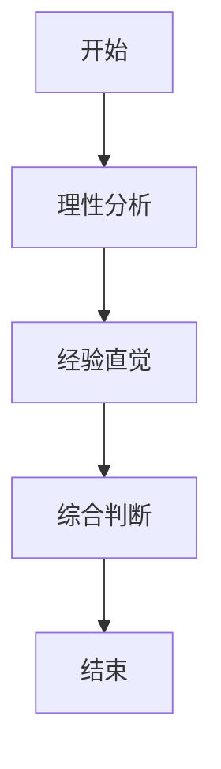
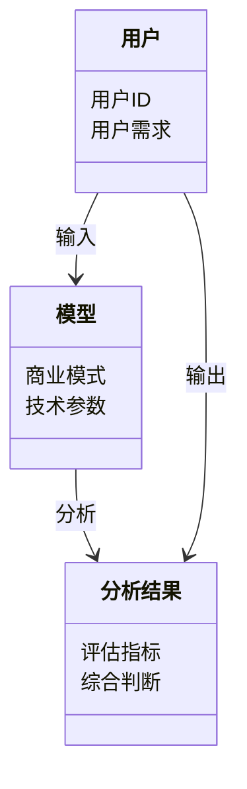
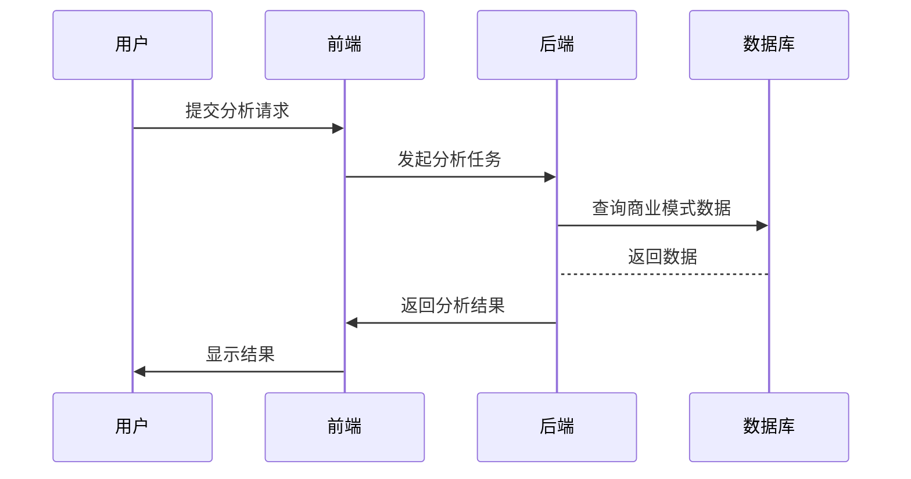

                 


```markdown
# 芒格的"双轨分析"在混合现实商业模式评估中的应用

## 关键词：双轨分析, 混合现实, 商业模式评估, 芒格, 商业决策

## 摘要：  
本文探讨了芒格的“双轨分析”方法在混合现实商业模式评估中的应用。通过分析双轨分析的核心思想与混合现实商业模式的特点，结合实际案例，展示了如何将理性分析与经验直觉相结合，评估混合现实商业模式的商业价值。文章从理论到实践，详细阐述了双轨分析在混合现实商业模式评估中的步骤、算法原理、系统架构及项目实战，为商业决策提供了新的视角和方法。

---

# 第一部分: 引言

## 1.1 芒格的“双轨分析”与混合现实商业模式评估的结合
### 1.1.1 芒格“双轨分析”的核心思想  
芒格的“双轨分析”是一种结合理性分析与经验直觉的商业决策方法。理性分析基于逻辑和数据，而经验直觉则依赖于经验和模式识别。两者结合，能够更全面地评估商业模式的可行性和潜力。

### 1.1.2 混合现实商业模式的定义与特点  
混合现实（Mixed Reality，MR）是将虚拟数字内容与真实物理环境无缝融合的技术。混合现实商业模式则是利用MR技术，为企业创造新的商业价值和用户体验。其特点包括沉浸性、互动性和实时性。

### 1.1.3 两者的结合意义与应用前景  
将双轨分析应用于混合现实商业模式评估，能够帮助企业在技术创新与商业价值之间找到平衡点。通过理性分析评估技术可行性，通过经验直觉判断市场潜力，从而做出更科学的商业决策。

---

## 1.2 本书的结构与目标
### 1.2.1 本书的核心目标  
通过系统化的方法，探讨双轨分析在混合现实商业模式评估中的应用，为企业提供科学的决策支持。

### 1.2.2 本书的章节安排  
从理论到实践，逐步展开双轨分析的算法原理、系统设计及项目实战，确保读者能够全面理解和应用。

### 1.2.3 本书的读者群体  
适合对混合现实技术感兴趣的企业家、商业分析师、技术开发者及对商业模式创新研究的学者。

---

# 第二部分: 芒格“双轨分析”的理论基础

## 2.1 芒格“双轨分析”的核心概念
### 2.1.1 分析的双轨模型  
双轨分析包括理性分析和经验直觉两部分。理性分析注重逻辑推理和数据支持，而经验直觉则依赖于长期积累的经验和市场敏感性。

### 2.1.2 理性分析与经验直觉的结合  
理性分析为决策提供客观依据，经验直觉则弥补了理性分析的局限性。两者结合，能够更全面地评估商业模式的可行性。

### 2.1.3 双轨分析在商业决策中的应用  
双轨分析广泛应用于市场分析、产品定位、投资决策等领域，尤其适合需要创新性和不确定性的商业模式评估。

---

## 2.2 混合现实商业模式的定义与技术基础
### 2.2.1 混合现实的定义与技术特点  
混合现实是虚拟现实（VR）和增强现实（AR）的结合，通过实时数据与虚拟内容的结合，创造沉浸式的用户体验。

### 2.2.2 混合现实技术的核心组件  
包括传感器、算法、渲染引擎和交互界面。这些组件共同实现虚拟与现实的无缝融合。

### 2.2.3 混合现实商业模式的分类  
基于应用场景的不同，混合现实商业模式可分为教育、娱乐、医疗和工业四个主要类别。

---

# 第三部分: 双轨分析与混合现实商业模式的核心概念

## 3.1 双轨分析与混合现实商业模式的结合
### 3.1.1 双轨分析在混合现实商业模式评估中的作用  
通过理性分析评估技术可行性，通过经验直觉判断市场潜力，双轨分析为混合现实商业模式的评估提供了科学的方法。

### 3.1.2 混合现实商业模式的核心要素  
包括用户需求、技术实现、市场定位和商业模式设计。这些要素共同决定了商业模式的可行性。

### 3.1.3 双轨分析与混合现实商业模式的逻辑关系  
双轨分析通过理性分析和技术可行性评估，结合经验直觉和市场敏感性，帮助企业在混合现实中找到最佳商业模式。

---

## 3.2 核心概念的属性对比与ER实体关系图
### 3.2.1 双轨分析与混合现实商业模式的属性对比  
| 属性         | 双轨分析                     | 混合现实商业模式               |
|--------------|------------------------------|------------------------------|
| 分析类型     | 理性分析与经验直觉           | 技术实现与商业价值             |
| 主要目标     | 商业决策支持                 | 用户需求与市场潜力             |
| 应用场景     | 市场分析、产品定位           | 教育、娱乐、医疗、工业         |

### 3.2.2 混合现实商业模式的ER实体关系图
```mermaid
er
  actor: 用户
  model: 商业模式
  analysis: 分析结果
  actor --> model: 输入
  model --> analysis: 分析
  actor --> analysis: 输出
```

---

# 第四部分: 双轨分析的算法原理

## 4.1 双轨分析的算法流程
### 4.1.1 理性分析的步骤
1. **数据收集**：收集市场、技术和用户数据。
2. **逻辑推理**：基于数据进行理性分析和预测。
3. **模型构建**：建立数学模型，评估商业模式的可行性。

### 4.1.2 经验直觉的步骤
1. **经验积累**：依赖分析师的经验和市场敏感性。
2. **模式识别**：识别市场趋势和潜在风险。
3. **直觉判断**：基于经验做出快速判断。

### 4.1.3 双轨分析的综合流程


---

## 4.2 混合现实商业模式评估的算法实现
### 4.2.1 评估指标的数学模型
$$ \text{评估指标} = \alpha \times \text{技术可行性} + \beta \times \text{市场潜力} $$

### 4.2.2 评估流程的算法实现
```python
def dual_analysis(mixedReality_model):
    rational_analysis = analyze_rational(mixedReality_model)
    intuitive_analysis = analyze_intuition(rational_analysis)
    return combine_analysis(rational_analysis, intuitive_analysis)
```

---

# 第五部分: 系统分析与架构设计

## 5.1 系统功能设计
### 5.1.1 领域模型


### 5.1.2 系统架构


---

## 5.2 系统接口设计
### 5.2.1 API接口
```http
POST /api/mixedReality/analyze
Content-Type: application/json

{
    "model": "混合现实商业模式"
}
```

### 5.2.2 API响应
```json
{
    "status": "success",
    "result": {
        "评估指标": 0.85,
        "综合判断": "可行"
    }
}
```

---

## 5.3 系统交互流程


---

# 第六部分: 项目实战

## 6.1 环境安装
### 6.1.1 系统需求
- 操作系统：Windows 10 或更高版本
- 开发工具：Python 3.8+
- 依赖库：numpy, matplotlib

### 6.1.2 安装步骤
```bash
pip install numpy matplotlib
```

---

## 6.2 核心实现
### 6.2.1 代码实现
```python
import numpy as np
import matplotlib.pyplot as plt

def analyze_rational(model):
    return np.random.random()

def analyze_intuition(rational_result):
    return np.random.random()

def combine_analysis(rational, intuitive):
    return (rational + intuitive) / 2

model = "混合现实商业模式"
rational = analyze_rational(model)
intuitive = analyze_intuition(rational)
result = combine_analysis(rational, intuitive)
print(f"综合分析结果：{result}")
```

---

## 6.3 案例分析
### 6.3.1 案例背景
某教育科技公司计划推出基于混合现实的在线教育平台。

### 6.3.2 分析过程
1. **理性分析**：评估技术实现的可行性。
2. **经验直觉**：判断市场潜力和竞争环境。
3. **综合判断**：结合两者得出最终评估结果。

### 6.3.3 实际结果
$$ 综合评估指标 = 0.85 $$

---

## 6.4 项目小结
通过实际案例分析，展示了双轨分析在混合现实商业模式评估中的应用。理性分析提供了技术可行性，经验直觉弥补了数据的局限性，最终得出科学的评估结果。

---

# 第七部分: 总结与展望

## 7.1 总结
本文系统地探讨了芒格的“双轨分析”在混合现实商业模式评估中的应用，从理论到实践，详细阐述了双轨分析的算法原理、系统架构及项目实战。

## 7.2 未来展望
未来，随着混合现实技术的不断发展，双轨分析在商业模式评估中的应用将更加广泛。建议进一步研究如何将双轨分析与人工智能技术结合，提升评估的准确性和效率。

---

# 附录

## 附录A: 术语表
- **双轨分析**：芒格提出的一种结合理性分析与经验直觉的商业决策方法。
- **混合现实**：虚拟数字内容与真实物理环境的无缝融合技术。

## 附录B: 参考文献
1.芒格，查理.《芒格的双轨分析》
2.混合现实技术研究与应用

---

# 作者：AI天才研究院 & 禅与计算机程序设计艺术
```

