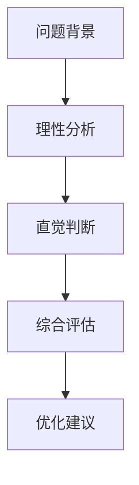
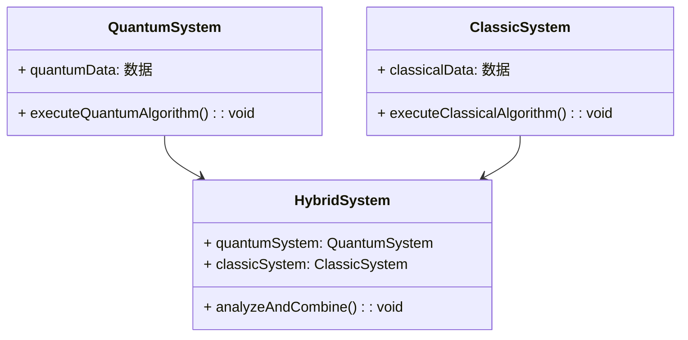
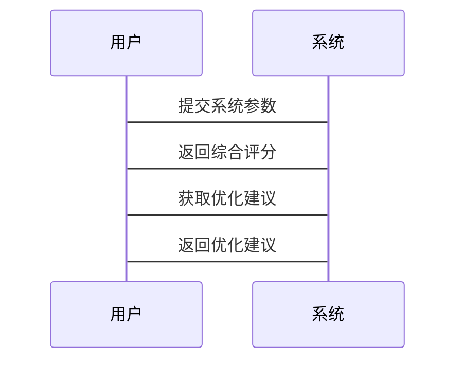

                 


# 芒格的"双轨分析"在量子-经典混合系统评估中的应用

---

## 关键词：
- 芒格的双轨分析法
- 量子-经典混合系统
- 系统评估
- 数学模型
- 算法实现

---

## 摘要：
芒格的“双轨分析”是一种结合理性分析与直觉判断的独特方法，其在量子-经典混合系统评估中展现出独特的优势。本文通过详细解析双轨分析法的核心原理、量子-经典混合系统的特性，以及二者结合的具体应用场景，构建了一个完整的分析框架。我们通过数学模型、算法实现和系统设计，展示了双轨分析法在复杂系统评估中的实际价值，并通过案例分析验证了其有效性。文章最后总结了该方法的优缺点及未来发展方向。

---

# 目录

---

## 第1章: 引言

### 1.1 背景介绍
- 芒格的双轨分析法的起源与核心理念
- 量子-经典混合系统的基本概念与应用领域
- 双轨分析法在系统评估中的潜在价值

### 1.2 问题描述
- 量子-经典混合系统评估的主要挑战
- 双轨分析法如何应对这些挑战
- 本文的研究目标与意义

---

## 第2章: 芒格的双轨分析法

### 2.1 双轨分析法的核心概念
- 理性分析与直觉判断的结合
- 分析框架的构建与逻辑流程
- 双轨分析法的数学模型与公式推导

### 2.2 双轨分析法与传统分析方法的对比
- 对比分析表格：双轨分析法 vs. 传统方法
- 优劣势分析：双轨分析法的独特性

### 2.3 双轨分析法的逻辑流程图


---

## 第3章: 量子-经典混合系统的系统分析

### 3.1 系统分析的基本步骤
- 问题识别：系统中的关键问题点
- 数据收集：量子与经典计算的数据特点
- 模型构建：系统的数学表达与假设条件

### 3.2 系统架构设计
- 系统功能模块划分
- 模块间的交互关系
- 系统架构的类图表示


---

## 第4章: 双轨分析法的数学模型与算法实现

### 4.1 数学模型的构建
- 双轨分析法的数学公式
  $$
  \text{综合评分} = \alpha \times \text{理性分析结果} + (1-\alpha) \times \text{直觉判断结果}
  $$
  其中 $\alpha$ 是权重系数，取值范围为 $[0,1]$。

### 4.2 算法实现的详细步骤
1. 输入系统参数与数据
2. 理性分析模块：计算系统的性能指标
3. 直觉判断模块：评估系统的潜在风险
4. 综合评估模块：计算最终评分
5. 输出结果与优化建议

### 4.3 算法实现的Python代码示例
```python
def dual轨分析(系统参数):
    理性分析结果 = 理性分析模块(系统参数)
    直觉判断结果 = 直觉判断模块(系统参数)
    综合评分 = α * 理性分析结果 + (1 - α) * 直觉判断结果
    return 综合评分
```

---

## 第5章: 系统接口与交互设计

### 5.1 系统接口的设计
- 接口定义：输入与输出的详细说明
- 接口实现：模块化设计与调用流程
- 接口测试：测试用例的设计与执行

### 5.2 系统交互设计
- 用户与系统之间的交互流程
- 交互界面的设计原则
- 交互逻辑的序列图表示


---

## 第6章: 项目实战与案例分析

### 6.1 项目实战
- 环境搭建：量子计算库与经典计算库的安装
- 核心代码实现：双轨分析法的算法实现
- 代码测试与优化：测试结果的分析与优化建议

### 6.2 案例分析
- 案例背景：量子-经典混合系统的实际应用场景
- 数据输入：系统的具体参数与数据
- 分析过程：双轨分析法的详细步骤
- 分析结果：综合评分与优化建议
- 结果验证：测试结果与实际应用的对比

---

## 第7章: 总结与展望

### 7.1 核心观点总结
- 双轨分析法在量子-经典混合系统评估中的独特优势
- 本文的主要贡献与不足

### 7.2 未来研究方向
- 双轨分析法的进一步优化与改进
- 在更多实际场景中的应用与推广
- 多轨分析法的探索与研究

### 7.3 注意事项与最佳实践
- 双轨分析法的适用场景与限制
- 系统评估中的关键参数选择
- 优化建议的实施与监控

---

## 参考文献
- 文献1：芒格的双轨分析法相关研究
- 文献2：量子-经典混合系统的最新研究成果
- 文献3：系统评估与优化的经典方法

---

## 作者：
AI天才研究院/AI Genius Institute  
禅与计算机程序设计艺术 / Zen And The Art of Computer Programming

